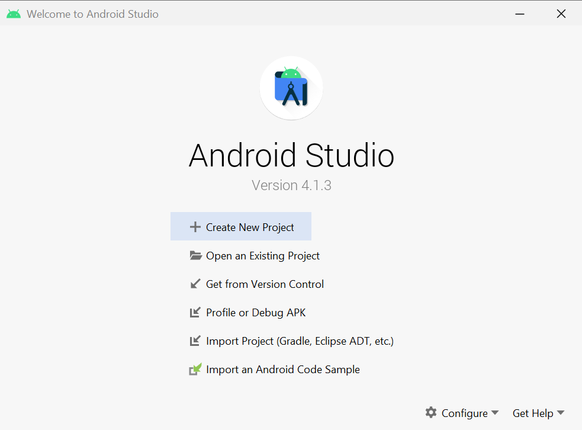

# AVD 的安装和配置

来自 Google 的 Android 模拟器 —— Android Virtual Device 便派上了用场。AVD 是 Android Studio 的一个组件，是用于开发者测试应用的全功能 Android 虚拟机。正因为如此，它有着最新的 Android 版本、同宿主系统之间的数据交换也比较简单。

## 硬件条件

AVD 的流畅运行需要:

1. 支持虚拟化的 x64 位 CPU
2. 8 GB 以上的内存
3. 20 GB 以上的空余磁盘空间
4. 还需要确认 CPU 的虚拟化功能已经在 BIOS 设置中打开。

## 下载安装

- 下载zip包 ([Download Android Studio and SDK tools  |  Android Developers](https://developer.android.com/studio#downloads))
- 解压运行 bin\studio64.exe
- 一通默认next后, 会见到android studio的启动界面. 
- 右下角的configure中选择avd manager. 
- 其中默认有一个虚拟机, 运行即可.

## 快捷启动

- 建立一个cmd批处理文件: `emulator -avd 模拟器名称` 
- emulator的地址是: `C:\Users\users\AppData\Local\Android\Sdk\emulator\`
- 以后双击此文件就直接打开该虚拟机.

## 虚拟机操作设置

在虚拟机套壳旁边有一个操作条, 鼠标悬浮上面会显示相应操作的快捷键. 

- 点击最后的三点菜单可以弹出更详细的设置.
- 在右侧的setting中, 关闭mouse wheel (因为模拟的不好)
- 其中还有录制功能, 输出webm格式.

## 操作

- 鼠标点击(左键, 右键, 中建) = 手指点击
- ctrl+鼠标点击 = 双指拉伸/合拢操作

## 和宿主交换信息

宿主就是指运行虚拟机的pc.

- 拖动apk到虚拟机直接安装这个apk.
- 拖动其他文件到虚拟机存入downloads, 理解为下载.
- 文字剪贴板可以自由交换 (settings: enable sharing clipboard)
- 将文件拷贝到宿主有些麻烦:
  - 打开虚拟机的ubs debugging模式
  - 在android studio的开发界面中选择`View / Tool Windows / Device File Explorer`
  - 注意用户文件在`/storage/emulated/0`中, 而不能选sdcard. 后者只是一个链接, 实际拷贝文件的时候, 后者无法建立目录.
  - 下载的文件默认在`\documents\AndroidStudio\DeviceExplorer`中的相应目录中
- 看到了虚拟机内有Virtual SD Card, 提示可以与宿主交换. 但是从搜索的信息看, 这个似乎是为了不同虚拟设备公用一个sd card使用的. [详情](https://developer.android.com/studio/run/managing-avds): Memory and Storage: SD Card 部分.

## 注意

- 一些特殊的安装包可能做了防虚拟机处理, 无法安装, 比如微信.

## reset 虚拟机

当遇到一些问题的时候, 需要重新reset虚拟机, 那么有两个方法:

1. android studio > avd manager > 选择虚拟设备 > 操作菜单中"wipe data", 之后启动虚拟设备即可
2. 找到虚拟设备中`userdata-qemu.img`的位置. 将这个文件删除, 然后启动虚拟设备:`flutter emulators --launch [emulator-id]`
   - 这个文件通常在: `Android/.android/avd`中
   - 或者在avd manager选择框中, 点击设备右侧的下拉三角, 其中的show on disk直接打开文件夹位置.

## 参考

- [无需手机就能体验的 Android 系统：AVD 上手指南](https://www.inoreader.com/article/3a9c6e7b3915e288-android-avd)
- [创建和管理虚拟设备  |  Android 开发者  |  Android Developers](https://developer.android.com/studio/run/managing-avds?hl=zh-cn)
- [Run apps on the Android Emulator  |  Android Developers](https://developer.android.com/studio/run/emulator)
- [Using Android Device File Explorer](https://o7planning.org/12579/android-device-file-explorer)
- 延伸阅读: [Start the emulator from the command line  |  Android Developers](https://developer.android.com/studio/run/emulator-commandline#startup-options)

