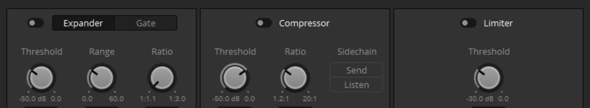
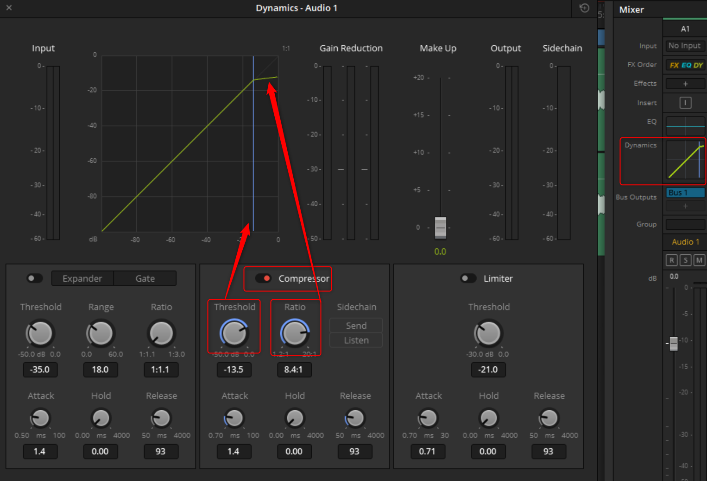

# Davinci Fairlight 相关

>来自下面视频的学习总结
>
>https://www.youtube.com/watch?v=H9_t4jV72HQ
>https://www.youtube.com/watch?v=fQ3pPhk7azI

# 习惯

## 简洁

保持界面简洁: 只打开需要的功能面板, 在操作完成后关闭不需要的功能面板. 
甚至不需要的track也可以在index面板>tracks中隐藏.
缩小不操作的track, 将当前操作的track放大
隐藏面板在右上角的几个按钮中, 视频界面可以单独弹出, 脱离meters.

## 标记

尽可能的标记
命名: track, media, metadata, 这样便于管理使用.
颜色: track, clip, 都可以通过右键完成.

## 备份timeline

在media pool中可以duplicate timeline(d)做备份
通过timeline上方的dropmenu可以切换不同的timeline(在edit page中是在timeine viewer上)

# timeline视图功能按钮

其中有显示视频模式, 这样可以在剪辑的时候同时剪辑视频
有scroller模式, 会显示波形上的帧视图, 便于精准定位. 还可以显示2条对应的波形.
还有playhead居中模式, 避免timeline在播放的时候不断跳换(这个只能在菜单中调整)
view > show fixed playhead
这种模式在cut page是默认, 但edit里面没有. 如果想根据波形来边播边剪辑, 这里是个选择.

# 特殊的 操作按钮

参考: https://www.youtube.com/watch?v=EK08phcBYs8

select mode: 选取, 移动, 边缘调整
range selection mode: + 直接部分调整
edit selection mode: 将clip分为上下两个部分, 上部分点击可以直接加入in point

由于fairlight支持边播边剪辑, 并且加上fixed playhead, 
本来以为可以解锁另外一个剪辑方法, 但是似乎太忙乱, 也很粗糙.[try again without fixed playhead]

## 特有的裁剪

裁切除了通常的cut/brazer之外, 还有range selection tool选择后轻上/下拉动选取区
这样可以边选取边裁切, 形象的理解就是io裁切.

# markers

index面板 > markers 中可以显示所有的marker
调整适合自己的栏目,以及他们的位置
快捷键m
在timeline上也能看到marker标记, 和edit page中一样.

# 录制

声音录制最好使用mono单声道
为不同的人建立不同的track, 便于集中处理.
一般是将所有的对话全部录制完毕, 最后进行切割和码放.
一般会先后录制几个相同对话的版本供以后选择.
录音会强制使用layer模式, 这样我们可以重叠录制, 之后在用layer去筛选.
录制的时候可以自建题词板, 就是在edit page中建立一个滚动字幕的clip, 在fairlight中看视频预览即可.

步骤: 

新建一个mono track, 命名
menu: fairlight > patch input/output 我理解是个配置器
source: audio inputs, 选择声音轨道
destination: track input, 选择录制到的轨道
单击patch后等于将source和destination链接完成.
关闭patch窗口.单击track前面的r(armed启用), 这时在meter中会显示音波震动.
之后可以单击录制按钮进行录制. 
如果是使用音箱, 为了避免共鸣, 先关掉外放(喇叭按钮)

# 音量调整

alt + click 增加一个关键点进行clip上的音量微调.
关键帧经常使用调整局部音量. 
在inspector中也可以调整, clip/track
在track header中也有调整选项, track

对话在-10到-15之间, 黄区. 低于这个听不清.
具体的声音需要分人和场景远近.
长停线是均值

调整音量的步骤是从细节到整体, 如果局部不balancing, 整体调整也无济于事.

## normalization

针对同样的素材, 可以通过设置最大音量的方式, 批量的压缩音量大小.

但他不是批量修改音量的最好方式. 比如对于混音后的素材, 就要小心.

对于多个clips的批量调整, 建议使用独立调整.

# 时间线视图和定位

时间线上的游标按钮可以横向/纵向分别调整
鼠标缩放: alt+wheel横向, shift+wheel纵向
鼠标游移:wheel
键盘缩放: 横向 +, - (自定义)
键盘游移: left/right, alt+left/right
键盘游移: jkl, jk/kl同时按是慢放, 多按jl倍速播放. 慢速播放还可以使用left/right, 但有顿挫
重复播放 alt-x

# 移动clip

shift+drag, 垂直移动, 不左右偏移.
在一个track上选择多个clip, 剪切/复制键后, 选择另外一个track就可以预览垂直移动的位置. ctrl+v确定.
更快的方法是选择多个clip, 使用快捷键: shift+up/down(自定义)(打开audio layer editing, 以免clip会被吃掉).
键盘左右移动(自定义)ctrl+left/right, 快速: ctrl+alt+left/right
更换clip的位置, shift+right/left(自定义)

# audio layers

fairlight中有个不同的概念是layers:
每个track中可以叠放多个clip, 
打开timeline>layered audio editing后, clip上下移动不会吃掉原先的clip, 而是进入层级模式.
这种层级模式还有个好处就是可以在移动的时候透明预览前后clip的波形位置, 对齐音频的替换操作常用.

打开view>show audio track layers可以按照层叠查看. 
播放的时候会听到最上层的layer

如果不按照layer查看, 鼠标点击选择的时候只选择最上层layer, 
所以要想在这个模式下完整的选择所有layers, 需要鼠标框选才行.

# meter, timeline, mixer

其实这些都对应音轨, 但是执行不同的任务:

timeline tracks 主要在于剪裁定位

meter在于多轨平衡监测, 更多的是个监视仪

mixer是在音轨上混合各种效果

# effects

sound effect可以分别应用在track(最多6)和clip(无限)上.
在增加了很多effects后, 可以使用右键菜单中的cache audio effect, 来生成预览效果. 
cache的clip上会出现一个小硬盘标志, 这样预览声音的时候会减少运算.

effect可以用在clip上, 也可以用在整个track上. 

很多effects实际是一些basic调音工具的组合. eq, compresser

## eq

常用来定位一些杂音的频率, 通过一边监听, 一边swipe相应的频率点来找到.

> https://youtu.be/fQ3pPhk7azI?t=1944

## dynamics

是限定一个音量的调整范围, 比如语音是-10到-15这个区间. 让所有的调整在这个范围内进行.

常用的是compressor, 并配合make up调节音量.

gate是低阈值, limiter是高阈值, expander是将低域的音量拉高, 而comprssor是相反.

## 一些调音的基本步骤

> https://www.youtube.com/watch?v=uUXG8XkhyEk
>
> 未完成

- compressor, 这个是对超出阈值的音量进行压缩的模块. 需要调整的部分如下图.

> https://www.youtube.com/watch?v=35nKRinKPXk
>
> 另一个学术性强的视频