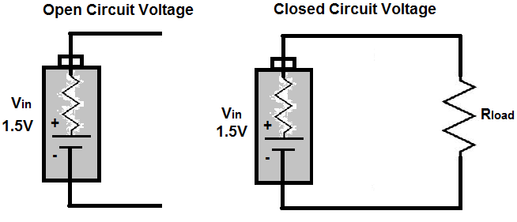

# Toyota Prius HV电池维修

> I live in north Louisiana. I recently had a similar problem with my Prius and it was the main battery!!!!!!!!!! Dealer wanted $4000.00 to replace the battery. NO GOODWILL HERE!!!!!! I started reading up on re-conditioned batteries and what they did to re-condition them. I am pretty "handy" so I pulled the main battery (about an hour and a half), checked each cell. I found I had 3 bad cells. Ordered 3 off of eBay. After I put the battery back together I had to cycle each cell (discharge and charge each cell 3 times) and this took a long time. After I put the battery all back together I put it back in the car and haven't had any more problems with the car other than the A/C. But all the lights have gone off on the dash and the car is running great.

上面简单的文字, 却涵盖了对于老旧电池的修复的所有经历和要点.

## Toyota的电池

[Toyota Prius 的电池就是这么个东西](https://en.wikipedia.org/wiki/Toyota_Prius#Batteries), [比较不同的的样式](https://en.wikipedia.org/wiki/Comparison_of_Toyota_hybrids). 

每片电池叫module, 两个一组为block. 站在车尾, block的编号从右往左(日本人的习惯?). 最好不同的Toyota车型找资料确定一下. 

关于电池的[详情这里](https://en.wikipedia.org/wiki/Hybrid_Synergy_Drive#High_voltage_battery), 06年的电池属性[这里有一些介绍](https://www.eaa-phev.org/wiki/Toyota_Prius_Battery_Specs), 更多的使用[google 搜索](https://www.google.com/search?q=Toyota%20Prius%20Battery%20Specs).

## 如何检测出问题电池?

有两个方法:

### 1. Torque Pro 检测

个人觉得最简单的方法测试电池的问题, 就是使用Torque Pro. 除了可以得到Faulty code之外, 还可以实时监测车内电池blocks的电压情况, 用以发现问题所在.

- 使用Torque直接测量不同的block电压, [如这个视频所呈现](https://youtu.be/3XPhQmSbca4?t=280).
- [OBD2 如何链接Torque](https://www.youtube.com/watch?v=scCe2yZJRd8)
- 如何[设置Torque Pro显示hv电池的block电压](https://youtu.be/GYrslzbrwz8?t=19)

### 2. Load 检测

就是加载使用量来检测电池. 仔细想下, 其实上面的torque检测法也属于load的方式.

需要将电池组卸下来. 测试的时候不是只测open circle的电压, 而是加一个电阻(通常使用一个大灯的灯泡就好), 然后测量掉电时间. 找出那个掉电比较快的module.

- [Prius Individual Module Testing with Voltmeter for Dummies - OCV vs CCV - YouTube](https://www.youtube.com/watch?v=ejMPDOu04Rg&t=77s)
- [Prius High Voltage Battery Repair | Gen lll 3](https://youtu.be/Y0ODDPFQL7A?t=802)
- [How To Identify Toyota Hybrid Battery Block](https://youtu.be/2YYsTWLTyY0?t=76)

而且测试的时候起始端的电压减少并不能看出真正的电池问题, 根据[这里的介绍](https://youtu.be/jDieFj8ubuA?t=207), 关键是7.5v-6.5v这个段位的掉电时间对比, 我实践的结果也印证了这一点, 据此找到了一个只能坚持一半时间的问题电池.

## 如何修复损坏的电池?

两个思路, 一个是将损坏的module换掉. 另一个是使用balance charge的方法将他恢复成健康的电池. 不过, 即便看上去换掉module是最简单的方法, 但是新的module, 仍然需要使用balance charge的方法检测是否合格, 并将其蓄电. 所以balance charge是修复电池的必备技能.

### 电池平衡 balance

这是串接电池组的一个问题, 不平衡的电池电量在组中会影响电池的寿命. 在 [这个视频中](https://www.youtube.com/watch?v=0KSFitqvap0) 解释的很清楚. 还有更[学术的解释](https://www.youtube.com/watch?v=E5vqalOYOXw). 

- 过低/过高的电量都会让电池受损. 
- 不平衡的电量在电池组中会很容易集体挂掉.
- 相比过高电量会引发很多警报, 过低电量的却相对安全(虽然同样也会让电池受损)

[这里就展示了](https://youtu.be/h60j6DmqsDc?t=376)平衡电池如何让电池组恢复以往的状态.

不平衡用法, [这里所提及](https://youtu.be/iN4ok93hhWY?t=21)(top/bottom balance), 但是由于我无法调整Toyota的充电策略, 这个只能作为了解. 

- 如果不平衡的电池组, 那么就用程序重新设置高电压和低电压边界. 
- 降低最高电压, 和升高最低电压. 让整体在中间的部分浮动.

### 使用充电器

balance电池, 就必须使用到充电器. 且为了增加效率, 充电器有一些特殊的要求.

- discharge power: 20w, 5.0A 为了放电快速.
- charge power: 100w, 10A 为了充电快速
- nixx battery cycles, 专为ni电池保养设计.
- end voltage control, 为了自动循环.
- 
- 

目前英国市场上没有类似的充电器, 奇怪.

这样的充电器大致分为家用和商用, 下面详细介绍家用操作. 商用部分只做列出.

#### 家用版本

得到充电器后, 先[要校准](https://youtu.be/0RPrhFP_phY?t=59). 我的实践中, 充电器和电表显示的差距很大.

接着可以采用两种方法进行充电. 

1. 每个module单独充电, 这个容易操作, 但是时间长.
2. [这里](https://priuschat.com/threads/charging-prius-cells-with-imax-b6-charger.150086/
   )提及可以使用串接充电, 不过要看充电器的说明书看支持多少module并联. 而具体的并联方法就是将所有的正极排在一起, 用电线链接起来, 负极同样操作, 最后对整体进行充电, 具体看[这里的视频教程](https://youtu.be/iLqleZ0yaY0?t=562). 还有一个[不清楚的视频](https://youtu.be/Y0ODDPFQL7A?t=948), 也似乎是并联充电.

   > The specs of your B6 say it can charge series strings of up to 15 NiMH cells, 

#### 家用版本的设置

关于充电器的设置, 参考这个视频[说的比较清楚](https://youtu.be/iLqleZ0yaY0?t=48), 还有[这个](https://youtu.be/h60j6DmqsDc?t=301). 如果是[触摸面板参考这里](https://youtu.be/Dzzg4fJ7b9o?t=365). 不同的充电器可能不同, 但是大致是这些设置: 

- 选择NiMH电池(Toyota Prius gen2的电池类型)
- 选择cycle(就是charge+discharge循环)
- capacity 电量: 6.5Ah / 6500mAh
- charge current (充电电流): 6.5A
- Discharge current (放电电流): 越大越快 5.0A
- discharge end voltage 放电结束电压: 6.0V
- cycle mode: charge > discharge
- no. of cycle: 3
- delay timer: (这个防止电池过烫) 10min

知识点:

- Ah, 安培小时, **是衡量蓄电设备容量的单位**. 1安培小时的电荷量是1安培的电流通电1小时的电荷量. 

- 充电器怎么判断电池是否充满的? 了解这个就知道为什么充电器不需要设置charge end voltage了.

  > 一般充电器都是恒电流充电  
  >
  > 镍氢电池通常是采用-ΔV，也就是电压曲线的负斜率来判断是否充满，当 -ΔV超过某个设定值后，即认为电池已充满。  
  >
  > 锂电池可以直接根据电池电压来判断，当电压超过设定的截止电压（一般是4.2V）时，认为电池已充满；高级一点的充电器采用电压、电流联合判断。电压接近截止电压时切换为恒电压充电，当电流小于某个设定值即认为电池已充满。

#### 高级版本

- 一体化的充电balance解决方案([the prolong system](https://www.youtube.com/watch?v=DiZCAe5N5ak&t=707s)), 快速, 简单. 但是设备价格很贵.
- [另外的一个方案](https://www.youtube.com/watch?v=6WPIIic4wH0&t=178s), 显得更加复杂一些. 
- 而在业界还有专业的[平衡电池的设备](https://www.youtube.com/watch?v=RI-fiwKG7hs). 
- 一个老哥也有[自制的专业设备](https://www.youtube.com/watch?v=BNzGoH2wVUE), 但是小白如我, 是不能企及的.

#### 使用Grid Charger

根据[这位提供的方法](https://www.youtube.com/watch?v=V9dUnq8NxUs), 他直接使用一个大功率灯泡将电池的电全部耗尽, 然后使用grid charger充满, 如此往复3回. 但Ni电池的特性深冲和深放都会极大损害寿命, 所以我并不觉得完全放空电池电量是个好方法. 但这个方法看上去简单, 据说是个维护电池的方法, 愿意尝试的可以据此[链接Grid Charger到电池组中](https://www.youtube.com/watch?v=K3owrNShSvA).

### 电池维护技巧

- 这老哥的总体操作是错的, 但是其中[将边上的电池放到中间部分是可以参考的](https://youtu.be/PWlSLDKgHhY?t=533). 据他说是边上的电池组散热好一些, 而中间的会经常被高温炙烤, 容易老化. 所以在维护电池的时候将中间的和边上的电池调换, 会延长整体电池组的寿命. 

  可我却遇到了的却是28-25之间容易损坏的情形(2个电池组的经验.)

- [Prius Hybrid Assistant App Review - YouTube](https://www.youtube.com/watch?v=q6bOv_Zue-Y&t=931s) 这里介绍了一个hv电池的维护软件. 

- [My Prius HV Battery Rebuild Experience/Guide : prius](https://www.reddit.com/r/prius/comments/8snwrg/my_prius_hv_battery_rebuild_experienceguide/) 长篇大论

## 延伸阅读

- Toyota系列(部分车型), 如何进入维护模式. 这个模式可以让发动机一直运转, [via](https://www.youtube.com/watch?v=WEYaIfvglLY). 但这个模式并不能一直给hv充电, 其充电规则还是遵循电池的需要. 
- [jehugarcia - YouTube](https://www.youtube.com/c/jehugarcia/videos) 关于电车的很多知识, 他讲述的Prius hv电池balance很易懂形象.

