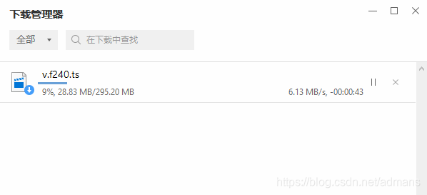

#  blob视频下载汇总

对于下面的这种视频链接, 该如何下载呢?

```html
<video id="av-player0_html5_api" class="emav-tech js-evernote-checked" preload="meta" tabindex="-1" src="blob:http://******/8587a0ef-ef44-4dba-8f76-e134b9624772" data-evernote-id="1968"></video>
```

其实这不是特殊的视频传输协议，只是一种 `HTML5 Video Blob`格式。


## 手机模式查连接

浏览器模拟手机模式查看


## NetWork中查询.m3u8

在`NetWork`这一栏，对请求进行通过关键词`.m3u8`进行过滤获得相应的下载链接.


## ffmpeg下载m3u8, 简单

>  ffmpeg -i 链接 目标文件.mp4

如:

```
ffmpeg -i https://video.twimg.com/ext_tw_video/1143530317296406529/pu/pl/720x720/69ZLvxR5w_0y7mVj.m3u8 demo.mp4
```


## 专项工具下载m3u8

M3u8 Downloader最近老是出bug可以用M3U8X代替. ref:[How to download m3u8 and ts video movie streams.](https://gist.github.com/primaryobjects/7423d7982656a31e72542f60d30f9d30)


## 利用插件获得.m3u8文件并直接下载

Adobe HDS / HLS Video Saver, 已经收费了.


## 浏览器下载功能+猜

1, 点击播放视频

2. 鼠标移到视频播放窗口，浏览器自带的工具会提示“下载”“弹出窗口”工具栏

3、复制第一个链接的地址

```
https://*/v.f240.ts?start=0&end=334451&type=mpegts
```

我们会看start和end两个参数，分别表示当前ts文件的视频开始和结束位置。因为是第一个，所以start=0

4、将视频拖动到最后，像上一步一样，复制最后一个下载链接地址

这一步有可能会有问题，后边说明。

```
https://*/v.f240.ts?start=2267468&end=312421407&type=mpegts
```

这一次我们记下end的数值，end=312421407

5、修改第一个下载链接的end参数为end=312421407，我们即可得到完整视频的开始和结束位置。

```
https://*/v.f240.ts?start=0&end=312421407&type=mpegts
```

6、将修改后的链接复制到浏览器地址栏，或者新建下载任务，就可以下载完整视频。

搞定。



7、下载完后就可以直接播放了，现在大多数播放器都支持ts视频的播放。（也可以直接把文件格式改为.mp4）

说明：第4步我们拿到的end有可能不是最后一个视频的参数，所以有个暴力的方法，那就是把end参数改成一个尽可能大的数字就ok了。