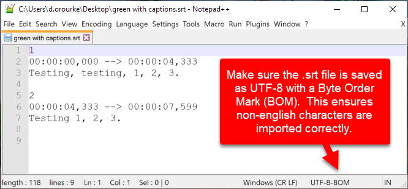
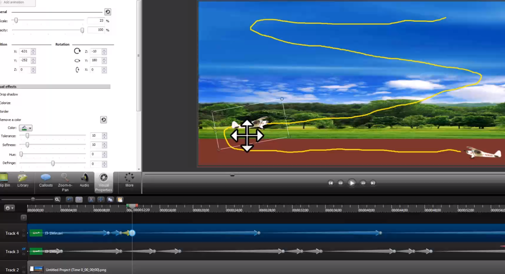

# camtasia相关

## 如何自定义库元素

>  Re-use Custom Animations With Placeholders - Camtasia Advanced Series - YouTube
> https://www.youtube.com/watch?v=v0Q246egSrs

 

- 将动画结合成组, 将可更改的部分替换成placeholder

- 选个好名字重命名这个组

- 将这个组放入library

- 使用的时候, 拖动这个library元素到新的project中

- 将文件拖动到placeholder中, 一般选择replace with clip speed即可.
- placeholder可以当作是一种很好的打包动画效果之后使用的工具
- 我理解behaviors就是一些打包好的动画效果

## 导入中文字幕的注意事项

转换成utf-8 signature的格式

## 动画的一些要义

> https://www.youtube.com/watch?v=0O3WSJv60vI

%20for%20Camtasia%202020%20-%20YouTube_1%2741.627%27%27.jpg)

- 动画的本质

- 动画箭头可以拷贝粘贴

%20for%20Camtasia%202020%20-%20YouTube_3%2743.001%27%27.jpg)

- 动画缓和选项, 多选exponential in/out

> https://www.screencast.com/t/OkfMnCozKr
>
> 更多: https://www.screencast.com/users/cookbookplusman/folders/Camtasia%20Tutorials

- 全帧动画的制作
- 动画路径: 其实是画个参考, 然后手动加入关键帧
- 先插入动画箭头, 然后开始调整物体的属性
- 在动画上插入动画不是重叠, 而是替换 (4:42)

## 遮罩

老方法:

> https://www.youtube.com/watch?v=CM6kOuq_ltU

- 制作透明的绿色背景的png图案, 放在上层track遮住下层track中的元素.
- 使用: add effects > visual effects > remove a colour

在2020版本后有了内置的mask功能, 仅限于track:

> https://youtu.be/AoXuBTq1Q8g?t=80

- 使用内置的shapes, 或者背景透明的png应该也可以.

- 右键track的眼睛图标, 选择alpha.
- 之后将上下两个track中的clip结合成组.
- 之后恢复上层track的matte mode为none

但我觉得**更好的步骤**应该是先结组, 然后打开组调整matte mode.

## track matte mode

> https://www.youtube.com/watch?v=0TDd9K4Mg2g

这里详细解释了几种track层叠的效果, 熟悉photoshop layer blend mode应该都能理解.
