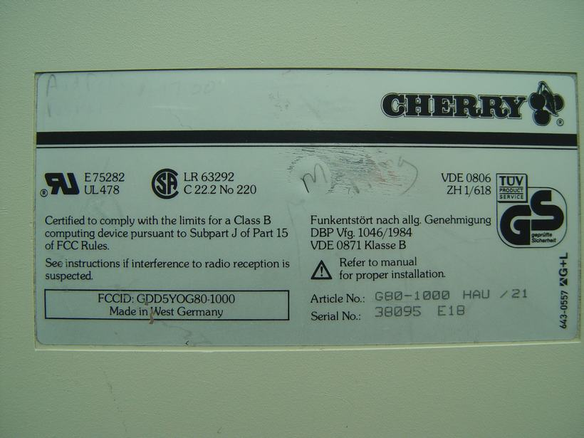
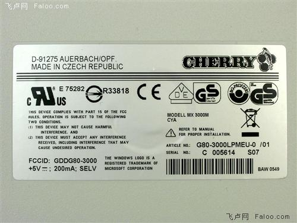
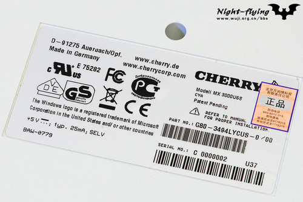
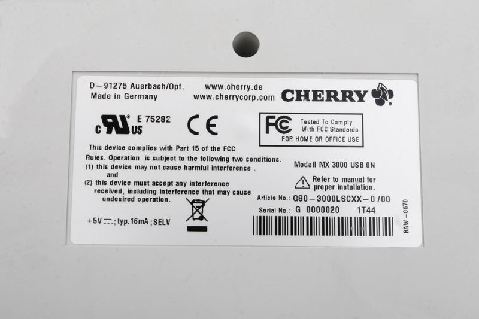

**cherry****键盘型号含义详解**

**最新的****5****位字母后缀定义**

G80-3494LYCUS-0

L：表示激光刻字的键帽，H表示是二色的

Y：表示红轴，U表示黑轴的，W表示青轴 ，V代表白轴 ，X代表茶轴

C：意思是combo，具体意思就是这个键盘是usb的，并且可以用附赠的usb转ps/2转接头直接转成ps/2接口，如果键盘是usb口的，这位写的还是m的话，就表示不能转ps/2。有个别键盘这位是N，表示键盘是无冲的，目前就看到1865这么标了，其实这把3494红轴也是无冲的，只是还是写的C，并没有去突出无冲写N，看来官方不是太在意N这个参数了

US：表示标准美国布局，EU表示欧洲布局，DE表示德国布局，JA表示日本布局，XX表示白色无刻，XY表示黑色无刻，还有些小众的FR法国GB UK英国，从来没见过，一句带过就好

型号介绍完了，最后说下序列号的意思

G 0000020 1T44

如果有第一个字母，G的话表示德国造的，C的话表示捷克造的，太老的键盘没这个标识。

后面那串数字含义不得而知了，可能只是个序列号而已了

最后那个1T44表示制造时间，T表示年份是2007年，每个字母的代表年份如下

A 1988

B 1989

C 1990

D 1991

E 1992

F 1993

G 1994

H 1995

I 1996

J 1997

K 1998

L 1999

M 2000

N 2001

O 2002

P 2003

Q 2004

R 2005

S 2006

T 2007

U 2008

V 2009

W 2010

X 2011

Y 2012

Z 2013

其实就是从1988年往下排就是了，26个字母要用完了，不知道用完了咋办

T后面的44表示是那年弟44周生产的

T前面那个1表示是第44周第一天生产的，老一些的产品字母前没数字，也就是日期精确到周，但是不精确到天了，只有很新的产品才会指出具体哪天。

 

 

 

 

cherry官方也不整理个型号编码规则，还老改规则，看着晕晕乎乎的，网上的到处也都是含义详解，不过都片片断断的，不合适了，写点总结好了，省的过几天自己都忘了

先说老cherry三位字母后缀键盘的定义，先贴一张图看看好了

一般来说看右下角那俩就好了

article NO：G80-1000 HAU /21

Serial NO：38095 E18

主型号就是G80-1000，G80表示是机械MX轴的，G81表示是机械薄膜MY轴的，G83是薄膜的，应该是面向民用的桌面产品，G84是机械的ML轴，G85好像是面向玩家的外形比较好看的薄膜，G86也是薄膜的，这个系列好像是面向pos之类的收银或者工业领域，一般都带编程功能，样子也比G83奇怪的多。 不过这个系列也有一些面向桌面的产品，可能是准备取代G83？

后面那个数字1000就是一个大系列了。说下这个系列，基本每个数字都有：

0xxx系列很少见，我这就只有那个G80-0528，貌似0系列都是给别人oem的，还没看见cherry自己标的0xxx系列，现在见到的都是无冲的。

1xxx系列应该算是cherry最早自己品牌的mx轴键盘了，应该是表示cherry正式进军pc键盘的开山之作了，这个系列也是无冲的，应该都算cherry早期不惜工本了。而且cherry原厂最YY的带灯键帽在这个系列上也比常见，有不少带灯的型号

其实1xxx还有18xx系列这种紧凑布局的，因为1xxx系列好像都灭绝了，只有1800系列到现在还在活跃，所以单拿出来说一下，键盘本意是给服务器或者高端大型仪器等空间有限的地方使用，不过在这个桌子面积普遍不大的年代，倒是很多人很喜欢在桌面上用这种紧凑布局的键盘了。键盘本身定位不是太高，所以大部分不是无冲突，除了一些和1000那个侏罗纪同一个年代的1838之类的是无冲的，后来的18xx一般不是无冲的，不过有点面向游戏意思的1865是无冲的，可惜是usb接口，最多只能6个键，不过还是比普通键盘说的最多几键不冲突要好，这个是任意6键不冲突，很尴尬，这个键盘不能用转接头转ps2，所以无冲有点鸡肋了。因为18xx的布局在紧凑布局里算是最标准的一种了，所以还出现一些其他的变种，比如说给compaq oem的11800，布局稍微变了一下，加了个轨迹球，还有11900这种把轨迹球改成触摸板的版本。这些也都不是无冲的了。

2xxx系列现在看见的有2000和2100，都有点工业键盘的味道，2000彻头彻尾的工业键盘，做工彪悍，2100就稍微向民用靠齐了，不过还是有比较浓重面向的行业用户的味道。这个系列是硬件编程的，可以通过键盘上的编程键，自己对自己编程，和后来的编程键盘要通过pc软件来编程还是不太一样，，虽说没有pc上有软件那样设置操作起来比较直观，不过毕竟不要安装软件，个人还是更喜欢这种方式一些。这种高端定位，自然也是无冲的说。还有一些其他奇怪的型号应该，但是都没见过，不好说了，总的来说是面向工业的强大的定制键盘应该，带灯键帽也是比较常见的说

3xxx系列，最典型就是现在桌面最普及的型号G80-3000了，面向民用，这个没啥好多说了，3000确实是G80系列里最低端的货色了，可惜用的还是最多的。3xxx系列根据我的理解是cherry面向桌面的系列，也就是品质和功能都最差的一个系列了，清一色的按键冲突，不带编程功能。做工也不如其他系列，加上近年来3000做工的不断缩水，这个系列愈发的低端了，除了最新的红轴，出了一个叫G80-3494的型号，为了体现红轴只有cherry有别于oem厂家的贵族血统，cherry终于破天荒的把3494做成无冲的，也算彰显一下红轴的高贵了。不过有人可能会发现类似G80-3181 3190 3193 3309之类的型号，前三个是可编程带触摸板的型号，定位很像8系列了，给收银等行业用的，功能上挺像8系列的，不过编程方法上却很像2xxx系列，键盘是硬件编程，不需要pc端安装软件，自己对自己就可以进行编程。不过这几个键盘貌似销售时间不是很长，可能cherry也发现把这种有编程无冲突的键盘放在3系列不太合适，于是就把这些编程的键盘后来都统一挪去8系列了，3309则应该是1xxx系列的1309的缩水板，1309是布局奇怪的终端键盘了，停产以后应该就缩水成新的3309了，1309是无冲的，3309应该就不是了。

3系列还有个单独的小家伙，就是3700这个数字小键盘了，应该就是面向银行金融之类行业的小键盘了，不是无冲的，早期有一个带灯帽，现在被取消了，有一定编程能力，也是硬件编程，现在的3700虽然带灯帽没了，不过编程能力方面倒是得到了不少加强，算是3xxx里比较特立独行的一个小家伙了，所以单独说一说。

mx轴的貌似没见过4系列，G84的ML轴键盘倒是都4开头，好像见过的也就4100这个标准笔记本布局型号，还有4400这个带估计球版本。薄膜的有个4700，就是3700的低端版应该就是了

5xxx，貌似就只有一个cherry的至尊老大，G80-5000，定位应该是民用桌面的高端货了，无冲，茶轴，人体工学。可惜侵权了，没卖个几年就停产了，所以在松鼠里炒得比较厉害了，一般每次拍卖价格都在5000到10000rmb之间了，嗷嗷贵，不过其实炒俗了，也没太大意思了，纯有点为了收藏而收藏了，炒得太厉害，没啥神秘感，给人的收藏欲望也就大打折扣了。

6系列貌似MX的也没见过，都是薄膜的，应该是用来代替G83-3000系列的，没太关注

7好像也没看到mx轴的型号，不过老型号里没准有几个，不是太确定，好像也见过，具体型号不记得了，不过看外形就是18xx系列的带刷卡器版本而已，没什么意思

8系列是面向pos类的键盘了，一般来说都是无冲的，可编程，带刷卡器，能接扫描枪之类，有的还有触摸板，算是cherry键盘里面功能方面最强大的了，典型型号有G80-8000 8113 8200等。不过据说新出的usb版本也开始缩水了，可能不带无冲了。

9系列貌似是给别人oem用的系列了，风格和布局都比较奇怪了，可以看看我那个G80-9035，很奇怪了就，至今就见过这个，可能专门oem用的系列，没见过其他的，不多说了

以上基本是废话，就是凭印象写的，应该有蛮多不准确的，随便看看就好，下面还是言归正传吧，数字后面那三个字母比较有意义，这里是HAU，分别来说说

第一位：H表示键帽是二色的，L表示键帽是激光PBT的，老键盘暂时没见过黑色pom材料的，后期才出现的材料应该。

第二位：A表示是接口是大口的AT接口，P的话表示接口是PS/2接口，一般来说这位代表接口，因为早期都是黑轴，所以没啥好表示轴的信息，即使G80-1838HPU这样罕见的茶轴货色，也只不过用P来表示是PS/2接口，早期键盘应该大多数都是黑轴的，所以只有用青和白轴的时候体现以下轴的信息，如果是F表示是青轴，Q表示是白轴。不过后来又发现，写Q的也有黑轴的，还有很大一部分写E的，是表示白轴

第三位，U表示是us配列的，D表示是德文配列的，那个时候cherry还没怎么出各种国家配列的键盘，所以其他配列暂时不知道代码，不过最初西德制造的一个俄文键盘G80-3000HAV值得一提，这个V应该是表示俄文配列，其实就是标准配列，只不过字母键上额外应有红色的俄文而已。

先把型号含义说了，序列号最后再说好了，再来看中期的5位字母后缀键盘

型号是G80-3000LPMEU-0，G80-3000这个不用解释了，说说后缀的意义

L：表示激光刻字的键帽，H表示是二色的

P：表示黑轴（或者茶轴），S表示青轴 ，Q代表白轴 ，K代表茶轴，如果键盘是AT大口的话这位就是A，强调下接口信息，不提轴的信息了

M：表示有win键，没有win键的用A表示

EU：表示欧版的，其实欧版和美版一样的，只是数字五上多了个欧元符号，不影响使用，不是恶心的德版，竖的回车小shift那种。US表示标准美国布局，也就是大家最喜欢的布局，DE表示德版布局，JA表示日本布局，超短回车，很恶心。XX表示白色无刻，XY表示黑色无刻

最后那个-0，貌似-0表示键盘是白色的，-2表示键盘是黑色的。随便总结的，不知道确实是不是这个意思了

再看看最新的5位字母后缀定义

G80-3494LYCUS-0

L：表示激光刻字的键帽，H表示是二色的

Y：表示红轴，U表示黑轴的，W表示青轴 ，V代表白轴 ，X代表茶轴

C：意思是combo，具体意思就是这个键盘是usb的，并且可以用附赠的usb转ps/2转接头直接转成ps/2接口，如果键盘是usb口的，这位写的还是m的话，就表示不能转ps/2。有个别键盘这位是N，表示键盘是无冲的，目前就看到1865这么标了，其实这把3494红轴也是无冲的，只是还是写的C，并没有去突出无冲写N，看来官方不是太在意N这个参数了

US：表示标准美国布局，EU表示欧洲布局，DE表示德国布局，JA表示日本布局，XX表示白色无刻，XY表示黑色无刻，还有些小众的FR法国GB UK英国，从来没见过，一句带过就好

型号介绍完了，最后说下序列号的意思

G 0000020 1T44

如果有第一个字母，G的话表示德国造的，C的话表示捷克造的，太老的键盘没这个标识。

后面那串数字含义不得而知了，可能只是个序列号而已了

最后那个1T44表示制造时间，T表示年份是2007年，每个字母的代表年份如下

A 1988

B 1989

C 1990

D 1991

E 1992

F 1993

G 1994

H 1995

I  1996

J 1997

K 1998

L 1999

M 2000

N 2001

O 2002

P 2003

Q 2004

R 2005

S 2006

T 2007

U 2008

V 2009

W 2010

X 2011

Y 2012

Z 2013

其实就是从1988年往下排就是了，26个字母要用完了，不知道用完了咋办

T后面的44表示是那年弟44周生产的

T前面那个1表示是第44周第一天生产的，老一些的产品字母前没数字，也就是日期精确到周，但是不精确到天了，只有很新的产品才会指出具体哪天。

补充一下，还有一些类似G80-8113 LRBUS G80-8200 LPBUS之类的行业键盘，有读卡器，可接扫描枪，可编程等功能，因为各种配置都是选配，所以第二三位后缀为了表示这些配置，会很乱，也没有太大的规律可循，纯属厂家自定义，总结出来点规律也没太大意义，所以就不作归纳了

最后还说一句，cherry官方有的键盘贴标就挺乱的，所以估计也是官方不出编码规则的原因，实在是变化太多，他们自己也说不清楚了。所以看到键盘规则和上文对不上的也不要太奇怪，总有个把对不上的，没准是cherry自己啥时候拍脑袋改得规则，或者贴错标了啥的。大的编码规则基本就是上文那些了，仅供参考好了。

好像基本交代清楚了，以后还有遗漏再补吧，欢迎指出错误和补遗。其实也还有些隐含参数啥的，出于某某些原因，就不细说了

 

铭牌说明：
 
 
 
 
 
 1.型号 Article No代表型号
   以G80-3000为例说明：
   G80-3000 XXXXX
   键帽技术
   L代表雷射刻字 
   H代表二色成型 
   轴类
   P代表黑轴(或者茶) 
   Q代表白轴 
   S代表青轴 
   K代表茶轴
   WIN键
   M代表是否有WIN键，有WIN键就是M，没有就是A
 
   配列
   US代表国家KB配列标准，US就是美国标准键位配列，也就是我们经常使用的KB配列
   EU欧盟键位配列，和US一致，就是数字5键上多个欧元符号
   JP日本键位配列，小空格是它的代表标志
   GB&UK英国键位配列
   DE德国键位配列
   FR法国键位配列 
   例如:
   Cherry G80-3000 LQMEU 
   Cherry G80-3000 LPMEU 
   Cherry G80-3000 LSMEU 
   Cherry G80-3484 HKCUS 
   Cherry G80-5000 HPMUS
   大家自己就可以看出上面各是什么型号咯，^_^。。。。。。
   2.产地
   看图：有西德产的(早期) 有德国产的 有捷克产的。
   3.Serial No代表编号 后面的数字代表该键盘的数字编号。
   4.出厂日期
   在编号后面。比如S12 S代表公元2006年 12代表12周 为2006年12周产 前一个字母R代表2005年 
   T代表2007年 以次类推！
   5.FCCID
   代表键盘厂商的认证 GDD是CHERRY SMK是笙春

 

 

机械键盘的特性使它拥有寿命长，手感始终如一的优点，注意保养可以显著 
 
 增加键盘的寿命，方法如下： 
 
 1．不用键盘的时候记得用布或袋子盖好，既防水又防灰，其中灰尘对机械开关有重要影响，从使用键盘的反馈来看，按键失灵都是由于开关内积压灰尘引起的，希望您能妥善爱护自己的键盘，做好防灰工作； 
 
 2．使用键盘的时候尽量避免液体的溅入，水会导致机械键盘的线路短路，轻则引起按键失灵，重则烧坏电路板和重要芯片，引起无法挽回的严重后果； 
 
 3．键盘尽量在固定的电脑主机上使用，因为电脑主板键盘接口的电压，在插入键盘的一瞬间是不稳定的，有可能因为电压或者静电原因击穿键盘“CPU”，正确的做法是开机前就把键盘接入电脑，并在接入前用金属导电物将接口附近的静电放掉； 
 
 4．每次使用键盘前尽量能够清洁双手，并把指甲修剪平整，这样可以使键盘长久保持整洁并延长键冒的寿命，丝网油印的字容易掉色，注意整洁可以大大延长印字附着时间； 
 
 5．没有专业的器材尽量不要强行拔开键冒，受力不均的拔键方式对机械轴是致命的伤害，应严重影响手感，如果非要一探究竟，可以购买相关的配件（即使有专业器材，也强烈建议避免反复拔开键冒）；

 

 

 

 

 

 

我们常见的微软、罗技、IBM、DELL、Compaq、联想等知名厂商，自己并不生产键盘，而是由全球四大键盘OEM制造商代工的
 
 下边就谈下四大代工厂OEM的键盘
 
 **1****、台湾群光chicony**
 型号标识（也就是键盘底部的SN号、下同）KB-XXXX和KU-XXXX（USB接口），后面是数字。比如微软多媒体键盘的型号为KB－0168、IBM的KB－8923、KU－8923，还有有罗技标准键盘、强手键盘、部分微软灵巧键盘、精巧键盘。
 
 **2****、旭丽silitek**
 旭丽公司于1978年在台北市北投区成立,是光宝集团(Lite-On Group)旗下所属的关系企业，为全球前十大计算机及通讯厂商提供完整的OEM﹑ODM专业设计及配套加工服务。
 SN标准是SK-xxxx，接触最多的就是DELL全系列和联想全系列。如SK－8125、SK-8135、联想LXH SK-9251等
 
 **3****、美蓓亚NMB**
 这是一家日本企业，SN标准是RT-xxxxxx（RT是right touch的意思）。如COMPAQ的RT6656、RT101，DELL的RT7D30、微软网络多媒体键盘RT9443、部分精巧键盘、罗技G11、G15键盘等
 
 **4****、台湾英群BTC**  
 常见的键盘有BTC 5207、BTC 9019URF、摩西电通部分键盘

 

 

 

 

 

 

 

 