# 如何选择机械键盘

## 最终选择概述

- 无冲
- 键帽选择pbt, 二色成型/热升华
- 轴选择红轴或者无声红轴, 线性linear
- cherry和凯华都可以.
- 我选择108键, 至少是104键带fn的.
- 可选: 有编程功能, 软硬皆可
- usb接口集成, 避免插拔.

## 注意事项

1. 不用时用防尘盖盖好，一般机械键盘购买时会自带，平常使用注意防尘，不好清理。
2. 不防水！做好防水，一杯水进去可能你就要换键盘了。如果不慎进水了，首先立即拔线，然后风干。

## 一些键盘的基础知识

### 无冲

按键无冲突。同时按下多个键均能被电脑识别，或者按下几个键后，再按一个键仍能被电脑识别。需要注意，6键无冲和任意6键无冲，不一样！

### PCB

印制电路板，机械键盘中有一块大致与键盘差不多的PCB安置轴体。

### ABS、POM、PBT

> 入门级建议PBT键帽，高端点的就随便了。

键帽材质，[基础知识](https://zhuanlan.zhihu.com/p/124297887) 里写过。键帽这块的工艺，在价格上能差出好几百。

> 抗打油性：
> POM > PBT > ABS
> 手感：
> ABS、PBT > POM

- ABS

工程塑料，最常用的材质，因为工艺较为成熟，成本较低，大多数键帽都采用ABS。手感比较亲肤，摸起来更舒服。

缺点：键帽用久了，易打油（表面被打磨得十分光亮，手感差）

- PBT（常见）

为解决ABS键帽的打油的问题，出现了PBT键帽，成本比ABS材质高很多，材质硬度比ABS高很多，耐磨度也比ABS强很多，基本不会打油。

工艺上来说：二色成型=热升华>镭雕>喷油镭雕>丝印>覆膜

- POM（少见）

成本更高，比较少见。

### 键盘轴

对于新手来说，首先要选轴，选出一种符合自己手感的轴。

游戏为主：

> 红轴、茶轴、银轴

办公为主：

> 静音红轴、红轴、茶轴、银轴 （青轴，还是放在家里用吧）

黑轴，直上直下，无段落感，快速触发，手指压力较大（费劲），长时间打字很累。

---

#### 红轴

直上直下，无段落感，有人说是「轻压力」版的黑轴。适合打字，游戏也可（射击，竞速类）。

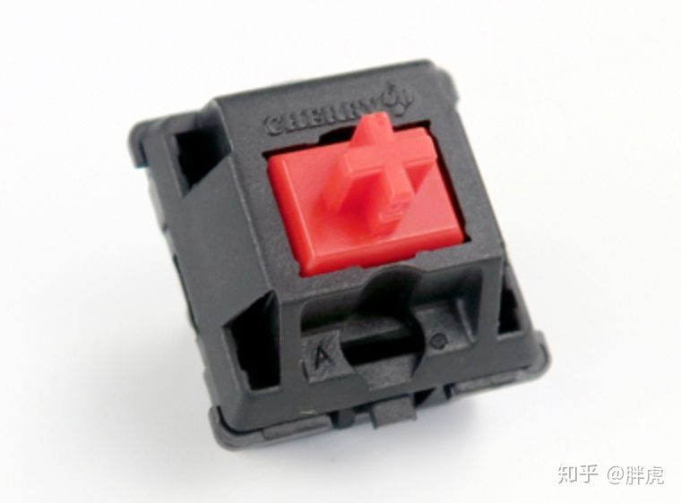

详细的红轴参数 via [pcgamer][pcgamer]

Behavior: Linear
Feel: Light
Actuation Force: 45g
Actuation Point: 2mm
Total Travel Distance: 4mm
Sound Level: Quiet
Rated Lifespan: 50 million keystrokes per key

Recommended for: Gamers looking for fast action with minimal resistance. There isn’t a tactile bump in the middle to overcome. But for this exact reason, the Cherry MX Red may not be ideal for typists as it lacks that tactile feedback.

对比[凯华的网站][kailh], 的产品:

- BOX防水防尘轴: 防水防尘，触发快，寿命达8000万次
- **Choc矮轴**: 超薄外形，可用于笔记本电脑，寿命达7000万次
- **KT传统轴**(拷贝mx): 经典机械轴体，24K黄金触点技术，寿命达7000万次
- **KS极速轴**(拷贝mx speed): 行程短，触发更快，24K黄金触点，寿命达7000万次
- **KH半高轴**: 采用市场通用的十字型键帽柄，手感出色，触发行程更短，灵敏度更高
- KO全彩中心轴: 轴体采用圆孔键帽柄和中心贴片式RGB发光效果，亮度更加均匀，效果更加绚丽
- 太阳轴: 中心发光，键帽与MX兼容，寿命达5000万次

找到相似或者更好的产品如下: 

KS极速轴中的: CPG151101D212, 线性, 40±10gf, 1.1±0.3mm, 3.5±0.3mm, 70,000,000Cycles

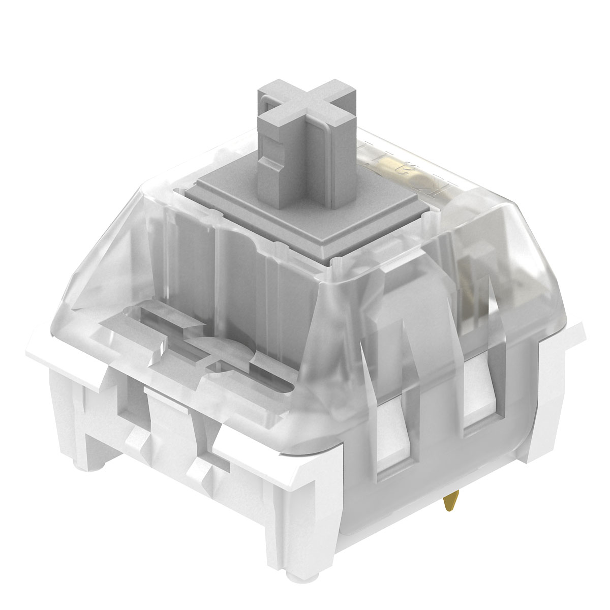

BOX防水防尘轴中的: CPG1511F01S37	线性	35±10gf	1.8±0.4mm	3.6±0.4mm	80,000,000Cycles	BOX静音轴

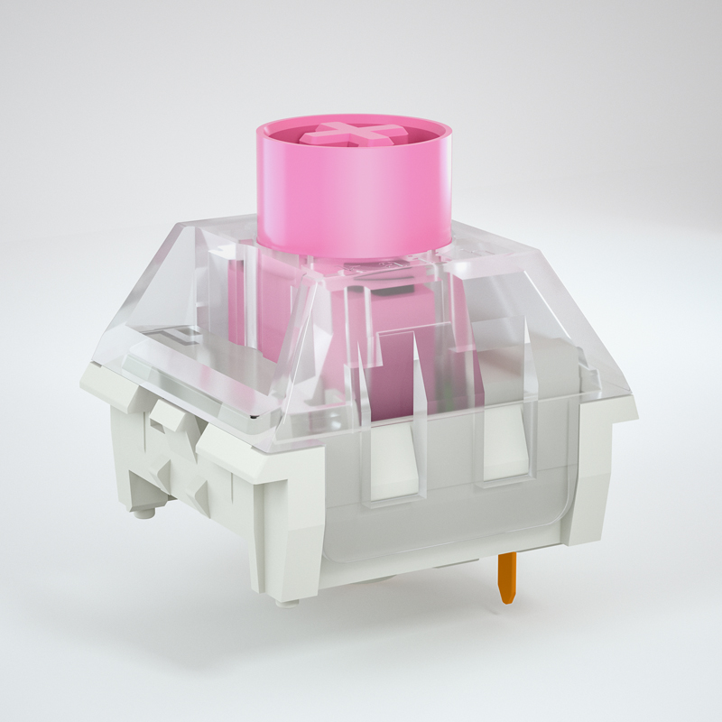

Choc矮轴中的两个: 

- CPG135301D01	线性	50±10gf	1.3±0.3mm	3.2±0.25mm	50,000,000Cycles	3D CAD	CHOC矮轴 V2 
  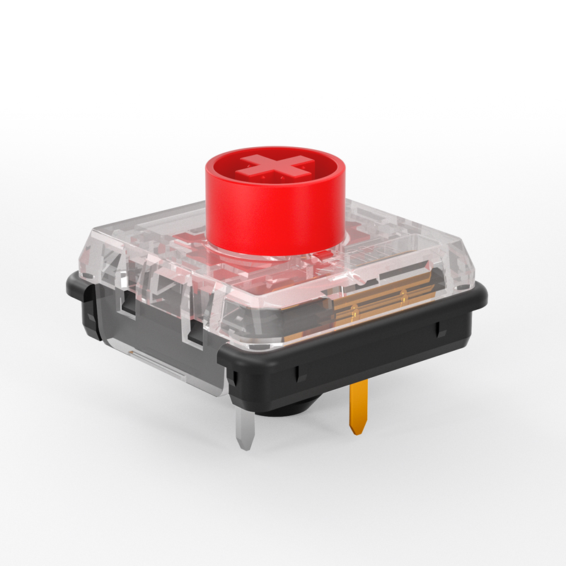
- CPG135001D01	CPG135001D01	线性	50±10gf	1.5±0.5mm	3.0±0.5mm	50,000,000Cycles
  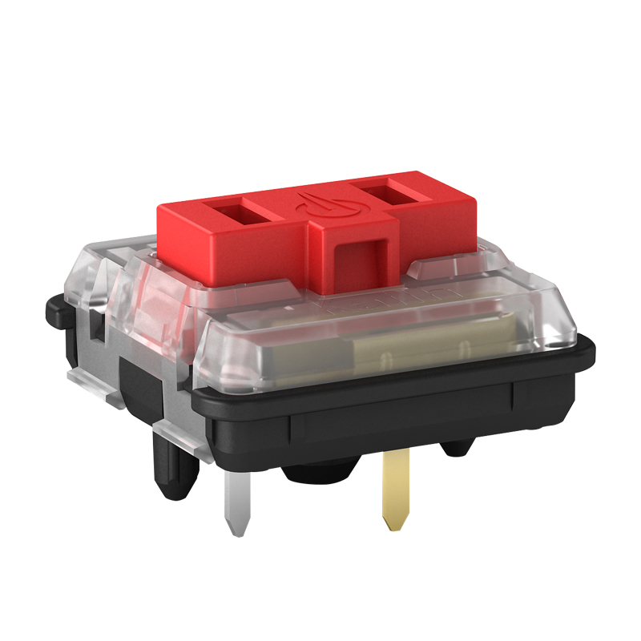

KH半高轴中的: CPG128001S01	CPG128001S01	线性	45±15gf	1.5±0.5mm	3.5±0.5mm	50,000,000Cycles
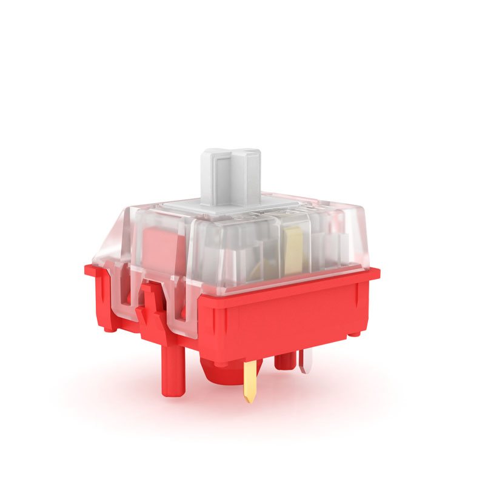

[kailh]: http://www.kailh.com/product/Ms/	"凯华官网中文"

---

茶轴，办公游戏都适用，轻微段落感，比黑轴压力轻，触发稍慢。总体来说，比较中庸，也可以说全能。

青轴，适合打字，不适合游戏。段落感、Click声音、机械感都是所有轴里最强的（非常有节奏感，打起字来噼里啪啦），有些人听起来很爽，就是最「吵」的那种轴。

### 轴的深入说明

根据一个[深度的说明][pcgamer], 按键有3个基本类别, 结合凯华键盘的产品线, 将他们对应起来就是: 

1. **Linear**. 线性 The keystroke is consistent and smooth.
2. **Tactile**. 段落 A bump in the middle of travel, usually around the actuation point.
3. **Clicky**. 有声段落 A bump in the middle of travel accompanied by a sharp “click” sound.

而且冲目前市场看, 并不是一定需要Cherry轴. 凯华轴也不错.

[pcgamer]: https://www.pcgamer.com/uk/best-mechanical-switches-for-gaming/	"The complete guide to mechanical keyboard switches for gaming"

### 键盘布局

- 104键，标准键盘

主流常见的键盘，共104键。

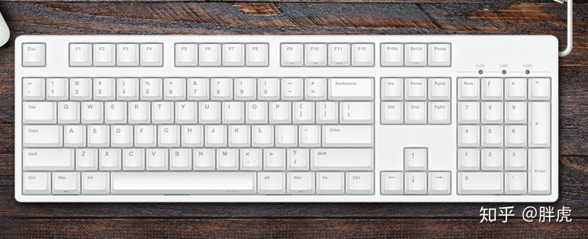

- 87键，无小键盘

主流常见的不带小数字键盘的，共87键，

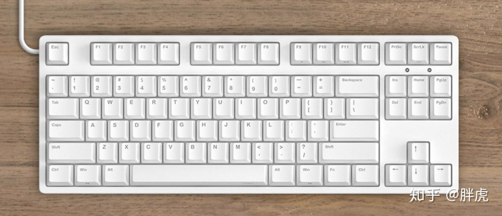87键

- 108键，多四个功能键

  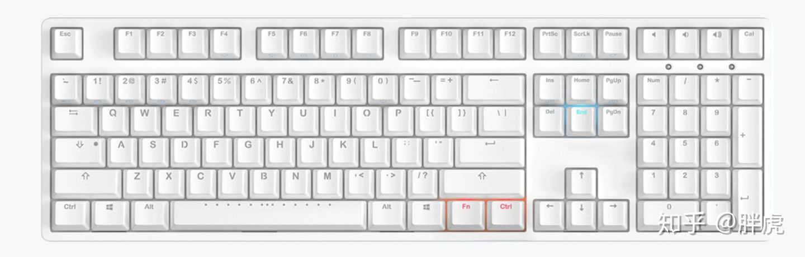

  

- 61键，60%键位

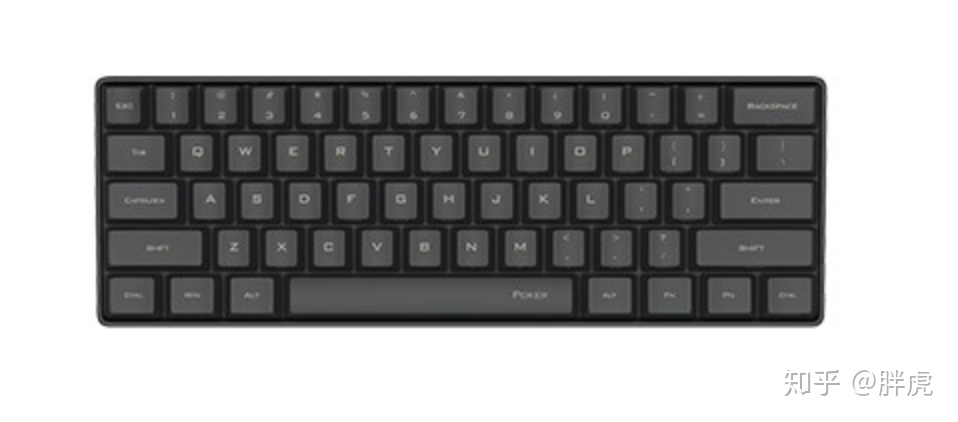

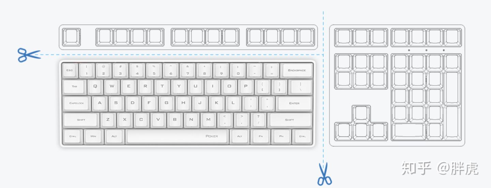61键是60%键的示意图

### 编程能力

如果有软/硬编程是最好的.

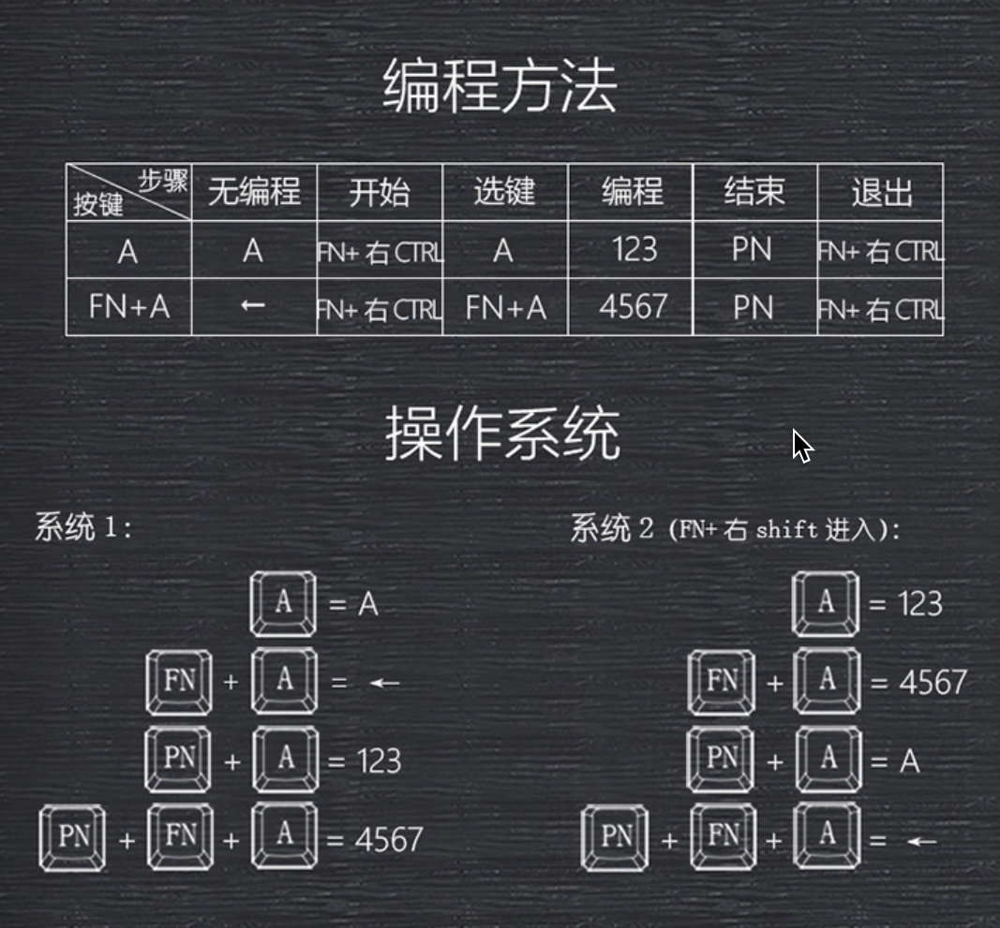

### 一些状态键

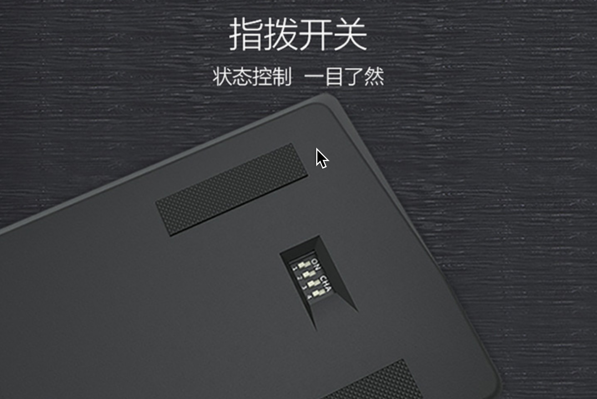

### usb线接口

最好是集成的, 插拔的容易坏.