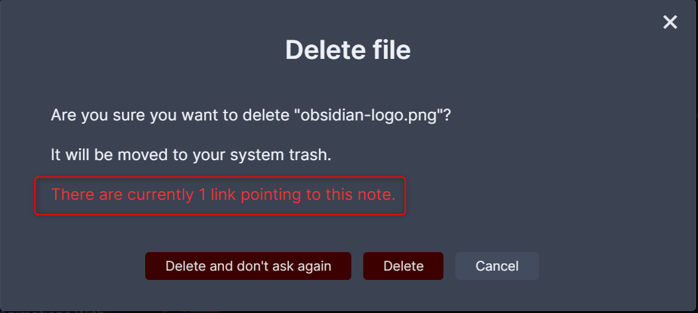
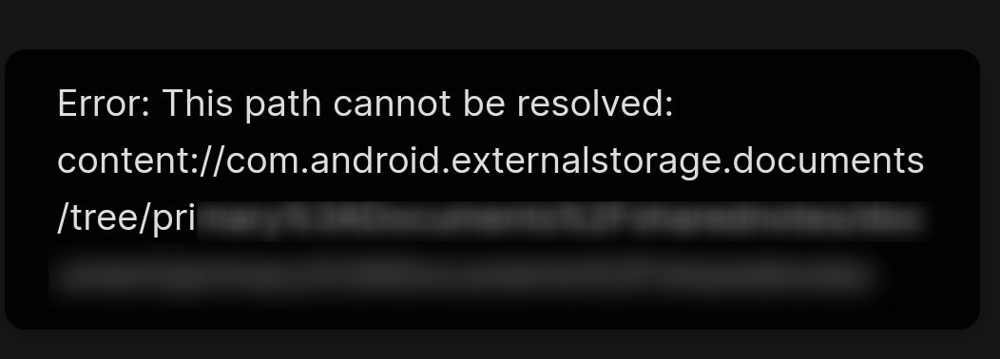

# 原则

- markdown编辑 
- 知识的整理
- 不做任何定制化
- 在这里格式并不是重要的, 重要的是想法和持续的记录.

# 概念

**wiki**

我理解obsidian就是markdown wiki. 
过去的wikidpad就类似这个, 后来的tiddlywiki也是类似这样的功能. 但他们都是基于html的, 而obsidian是基于markdown的, 录入方便了很多.

**vault**

它的vault可以理解为项目, 类似于sublime的project, 不同的项目会有不同的设定.
vault可以nest嵌套, 不过为了整洁就不这么做了.

[Zettelkasten](https://www.playpcesor.com/2020/06/obsidian.html):

> 而在 Obsidian中，则是透过「 Zettelkasten卡片盒笔记法」的原则，先建立每一则「原子笔记」，例如一个任务、一个知识片段，然后透过连结功能，建立起一个网路状的知识系统。

这并不是obsidian的功能, 而是记录笔记的习惯. 将笔记原子化. 

- 专有名词
- 知识主题
- 独立任务
- 每一位客户

# 安装


[下载](https://github.com/obsidianmd/obsidian-releases/releases)最新版本

安装位置 `C:\Users\帳戶\AppData\Local\Obsidian\Obsidian.exe`

Windows 設定資料夾則是 `C:\Users\帳戶\AppData\Roaming\obsidian`

# 帮助

Obsidian Roadmap | [Trello](https://trello.com/b/Psqfqp7I/obsidian-roadmap) 这里了解当下obsidian正在推进的功能.

社区 [Obsidian Forum](https://forum.obsidian.md/)

更新内容 [Latest Announcements topics - Obsidian Forum](https://forum.obsidian.md/c/announcements/13)

官方的教学: [Obsidian Help](https://help.obsidian.md/Index)

Bryan Jenks - [YouTube](https://www.youtube.com/c/BryanJenksTech/videos) 一个 insider的视频教学

一个发烧友, 很爱定制 [obsidian | 簡睿隨筆 | 學習過程的紀錄與備忘](http://jdev.tw/blog/tag/obsidian)


# 常用操作

`#tag` 和 `[[Internal links]]`

ctrl+click preview 可以split方式打开窗口.

## 有用的快捷方式
ctrl+p 快捷命令搜寻
ctrl+o, 打开历史文档
ctrl+, 设置面板
~~ctrl+e~~, ctrl+/ 预览切换
alt+arrow 在浏览中遍历, 释放了 ~~ctrl+alt+arrows~~
简单格式记住: ctrl+b ctrl+i ctrl+8即可
链接ctrl+k

## 图片

直接拖拽进来即可, 
别忘记设置默认地址: setting > file > attachment folder path
为了兼容性, 也设置: `Settings → Files & Links → disable Use [[Wikilinks]] option` 和 `Settings → Files & Links → set New link format to Relative path to file`

手动输入的时候还是可以使用obsidian的方式: `![[]]` 这样的好处是有自动完成, 而且回车确定后会自动转换成通用markdown格式.


删除图片的时候会检查链接情况, 并给出提示: 



有alt竖块选择的模式, 只是操作还有些生分.

# 设置

打开outline (toc), 可以看到heading的层级结构, 便于管理长文档.

在设定中设置默认attachment的folder, 或者在文件导航中直接右键一个folder定义.
之后把本地的图片copy/paste图片到文件中的时候, 将自动拷贝到这个目录. #question 这里可以自动引用本地的内容吗?

# 链接

建立wiki链接: 

> 这是obsidian的特色. 其实就是增加了wiki链接, 而且可以在链接变化的时候自动更新全局.
> 每个文档都有反向链接(backlink)的数据.

方便的地方是obsidian可以自动完成

- [[obsidian]]
- [[obsidian#文档链接]] 这意味着文件名和heading都要起好名字.
- [[obsidian|这里学习obsidian的笔记]] 使用自定义的别名
- ctrl+click, ctrl+alt+click

为了兼容性可以使用markdown链接, 但是会失去一些obsidian独有的链接方式. 所以目前最好使用 `[[标题]]`

## 自动建立链接

建立笔记时，笔记标题就是「关键字」。当其他笔记中的内文提到［自律］这个关键字，那么在「自律」笔记右方面板的［ Unlinked mention ］，就会自动列出这些笔记，并且列出这些笔记中所有提到［自律］的片段内容。

如果想在笔记间建立链接, 就可以在unlinked mention中点击相应的link, 这样笔记之间就会建立明确的双向链接. [via][https://www.playpcesor.com/2020/06/obsidian.html ]

[自动建立索引页](http://jdev.tw/blog/6479/obsidian-generating-index-note-rapidly): 搜索 > 拷贝索引结果.

footnotes:

```
content[^link]

[^link]: reference
```

注意要留一个空行, 这样markdown才能解析.
另外, reference部分会出现在页面的最末尾, 并且自动编号.

## 标签

标签相当于另外一层的管理, 可以管理一些思考和话题. 

# 整合

**Transclusion**, 这个很类似于tiddlywiki, 可以将其他文字的部分动态的整合到文档中. 

整合某个文档中的某个heading的部分:  `![[都市传说#明白]]`

使用别名整合 `!\[\[020 Investigate | Conduct Research\]\]`

整合搜索结果:


似乎不如[讨论](https://forum.obsidian.md/t/transclusion-embedding-for-searches/3348/39)中的一些建议好. 

# 功能

Task list: 在开头使用`- []`

# 摘取

[[Chrome extensions#clip]]


# 图片

在设定中设置默认attachment的folder, 或者在文件导航中直接右键一个folder定义.
之后把本地的图片copy/paste图片到文件中的时候, 将自动拷贝到这个目录.

ctrl+click进入图片进行改名, 改名后会自动update所有引用.


![[testing.png]]


网络图片可以直接拖拽,


# 分享

[Obsidian Sync](https://publish.obsidian.md/help/Licenses+%26+add-on+services/Obsidian+Sync) - Obsidian Help - Obsidian Publish, 让本地的vault和远端的vault进行同步. 可惜: Obsidian Sync™ is a **paid** service.

# 问题

- 它的图片格式是使用wiki+plugin, 为了简化显示, 但是造成了通用性的不便. 似乎正在解决, 开发新的plugin去转换. [Use standard MD links for images - Feature requests - Obsidian Forum](https://forum.obsidian.md/t/use-standard-md-links-for-images/260)
- 无法关联开启markdown文件. 受累于他的的vault管理.
- 打开预览的时候无法自动预览文档的当前位置, 也没有快捷方式滚动, 这里比较浪费时间.
- 是不是没有menubar?

# 手机端



遇到这个问题给程序访问权限, 他需要file来执行.


