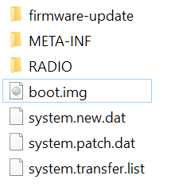

[Software Upgrade - OnePlus (United Kingdom)](https://www.oneplus.com/uk/support/softwareupgrade/details?code=PM1574156097213)

[How to Install Oxygen OS on anydevice using Fastboot method - YouTube](https://www.youtube.com/watch?v=NsY6epCVyZ8)

- fastboot
- unzip rom
- flash-all.bat

但是新版的rom都没有这个bat了. 而且格式也不同, 所以需要另找其他的方法.

- unzip rom.zip

按理说应该有个Payload.bin, 这样就可以使用Payload unpacker 解开, 使用这里的方法用fastboot[逐个刷入](https://forum.xda-developers.com/oneplus-7t/how-to/rom-stock-fastboot-roms-oneplus-7t-t3979213).

```
fastboot flash aop aop.img
fastboot flash bluetooth bluetooth.img
fastboot flash boot boot.img
fastboot flash dsp dsp.img
fastboot flash dtbo dtbo.img
fastboot flash LOGO LOGO.img
fastboot flash modem modem.img
fastboot flash oem_stanvbk oem_stanvbk.img
fastboot flash qupfw qupfw.img
fastboot flash storsec storsec.img
fastboot flash multiimgoem multiimgoem.img
fastboot flash uefisecapp uefisecapp.img
fastboot flash recovery recovery.img
fastboot --disable-verity flash vbmeta vbmeta.img
fastboot --disable-verity flash vbmeta_system vbmeta_system.img
fastboot flash opproduct opproduct.img
fastboot reboot fastboot
fastboot flash system system.img
fastboot flash vendor vendor.img
fastboot flash product product.img
fastboot reboot
```

但是oneplus 3 的rom确不是这个格式.



尝试使用冒险的办法. 

- 尝试升级twrp到[最新版本](https://dl.twrp.me/oneplus3/)
- 然后直接刷最新版的rom.
- 居然刷成功了.
- 只是忘记了清除data, 她就自己动重启了.
- 待我回到twrp尝试删除data的时候, 它开始询问我密码.
- 这说明我已经无法在twrp中load data区.

只好尝试让系统带着data启动, 恐怕需要很长时间.

- 幸运的是, 在启动系统的时候它也无法载入, 但是给了一个选项, factory reset.
- 这时系统似乎重置回原生系统. recovery区也变成原生的了.
- 在reset完成后, oneplus的logo旋转了很久, 有些让人担心.
- 但最终大约5分钟左右, 还是进入系统了.

lock fastbook

- reboot to fastboot
- `fastboot devices`
- `fastboot oem lock`

但是这个命令无法锁住fastboot.

只好参考了[这个视频](https://youtu.be/dmEsQdzsMfQ)中的部分:

- 确定目前是官方的recovery, 只有这样才能很好的读取官方的rom
- 在recovery中选择adb install
- `adb devices`
- `adb sideload rom.zip`
- 会有漫长的传输.

似乎安装完成, 但是我的fastboot仍然没有锁上.

-  仔细看我的sideload似乎并没有完成, 提示 `(~94%)    adb: failed to read command: No error`


再次找解决方案, 找到了一个帖子和我的症状一模一样.  [Not Able to LOCK OEM. - OnePlus Community](https://forums.oneplus.com/threads/not-able-to-lock-oem.1020173/)

- Best thing to do is run the **MSM Download tool **and it'll flash it back to full stock for you. [[UNBRICK] Unbrick Tutorial For The OnePlus 3… | OnePlus 3T](https://forum.xda-developers.com/oneplus-3t/how-to/unbrick-unbrick-tutorial-oneplus-3t-t3515306)
- Eventually I flashed **OOS 5.0.8** and relocked bootloader and it worked!!!! Previously I was trying to relock using OOS 9.0.4 and it refused to work at all.
- For any OOS 9, **just select NO instead of YES**. That'll get you locked.

原来是要选择No?! 真是神操作.


