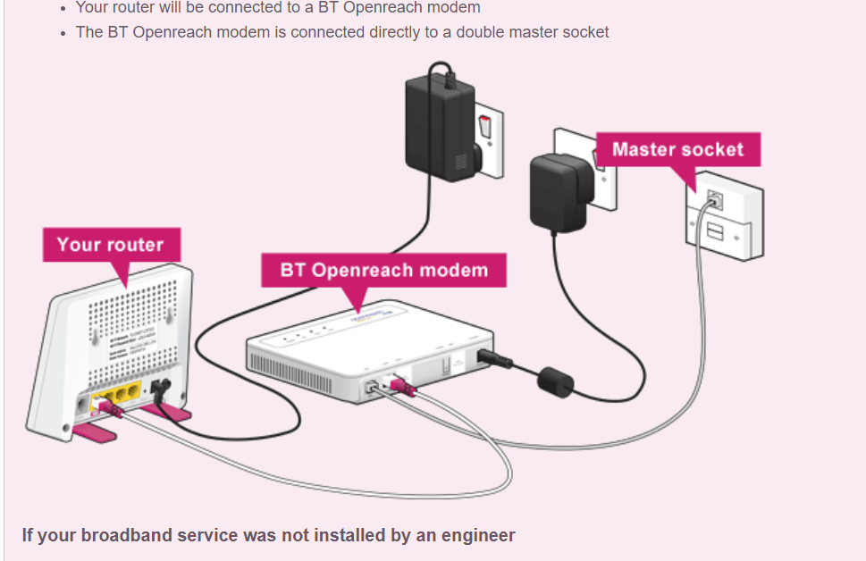

首先到账户中看:

https://www.plus.net/member-centre/broadband

我的模式

提交问题:

https://www.plus.net/apps/kbdfaults/question

一步一步完成后即可. 

然后在这里可以查看自己提交的问题以及对方的回复. 将他放到bookmark中.

https://portal.plus.net/wizard/?p=search

稍后他们email要提供网速测试

https://speedtest.btwholesale.com