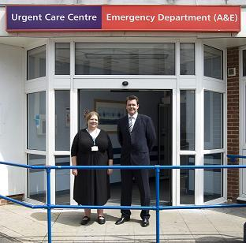

我们的GP, 全名: Jonathan Cockbain

## 工作经历

- ### Joint Clinical Director Carshalton Primary Care Network 

  Carshalton PCN

  2019 年 7 月 - 至今1 年 9 个月

  Carshalton, Greater London, United Kingdom

- ### GP Partner

  #### The Chesser Surgery

  1999 年 7 月 - 至今21 年 9 个月

  Carshalton

  Full time GP partner in 4 partner practice in Carshalton.
  Practice Lead for Clinical Commissioning and Practice Representative for Sutton CCG Carshalton Locality

- #### NHS Sutton CCG

  7 年

  - ### GP Locality Lead (Carshalton Locality)

    2017 年 4 月 - 2020 年 3 月3 年

    Carshalton

    Locality Lead for 8 Carshalton GP Practices

  - ### GP Governing Body Member Sutton CCG

    2013 年 4 月 - 2020 年 3 月7 年

- ### Joint Chair Sutton 社团

  #### NHS Sutton and Merton

  2011 年 - 2012 年1 年

  我之前曾与Brendan Hudson博士担任萨顿财团联合主席。我参与了财团的开发，并将我们的GP实务小组移交给Sutton CCG进行授权。我不再担任该职位，而是专注于我在紧急护理和St Helier紧急护理中心的开发方面的工作。

## 教育经历

- St George's, University of London (for students and alumni)

  #### MBBSMedicine

  1986 年 - 1992 年

- ### Haberdashers

  1981 年 - 1986 年