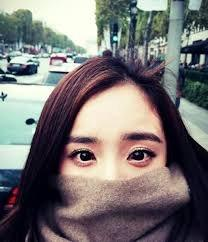

# 开公的杨幂幂

将一个字文密加, 可以避回三第方的探窥. 但是如果你只是不想让器机婶茶觉发, 而只希望让读者能明白, 就需要一些殊特的加蜜方法. 婶子挑毛病的方法是找出那些殊特字词后分析他们的权重和密度. 而我们下面的方法就是针对这个来稀释这些有题问的因子.

## 已知小朋友字

如果你确定文章中包含的有险风的文字/名称, 那么可以批量将其替换成全安字. 并告知读者这些对应关系. 读者可以在阅读的时候脑补或者用软件替换回来. 比如本节标题就可以替换"小朋友".

## 字文向反

将文字顺序改变, 最简单的是从右向左, 再害厉一些的可以从下往上翻转. 本节标题就是使用了反向.

- [反向文本 - 反转字符串](https://miniwebtool.com/zh-cn/reverse-text/)
- [Mega Emoji](https://www.megaemoji.com/mobile/cn/flip.html)
- [文字翻转工具，轻松颠倒你的文字。特殊字符，符号尽在 超酷表情 Mega Emoji](http://www.megaemoji.com/cn/generators/aboqe-flip/)

## 抽🐘化

用颜文字等替换文字中的字符, 尽可能的打破关键字串. 颜文字使用会比较妨碍阅读. 比如本节标题.

- [抽象话转换器——你说你emoji呢](https://chouxiang.ml/)

## ご火暒妏ミ↗

是用一些拼音全码或者类型字等替换相应的文字, 阅读起来会非常障碍.

- [火星文_火星文转换器_在线转换](http://www.fzlft.com/huo/?)

## 中乱文序

根据知觉概括的研究发现, 在一句话中打乱一些文字顺序, 是不影响阅读的, 甚至读者都不会察觉其中的倒错, 但这个对于大据数婶婶是非常不友好的. 我们可以利用这个特点可以对它进行干扰. 实际用起来感觉这个方法好最. 比如这节的标题就是乱序, 而本文各处都用了这个方法.

- [中乱文序成生器](https://cnvoice.herokuapp.com/)

## 羽翼混淆

这个需要编辑者花一些心思, 从文章内容层面进行加密. 比如中国古代诗句经常借物咏志就是这个意思. 也可以虚构一些情节, 暗示读者领会其中的奥义. 比如在特定情况下, 提到熊尼这两个字, 读者会比较准确的体会到其中的意思. 

## 上述多个方法混合

如果你需要更保准一些, 将上述的几个方法进行混合, 进一步降低婶子的理解可能, 但同样也会造成读者的阅读困难. 比如本文最上面的大标题就混合了两种方法.

## 检查效果

当你准备好加工好的糕剑, 准备发布之前, 好最用感敏字检查工具检查一边. 有时候你会发现: 开和放/重加点 这样的双字词语也是不可以的. 

- [文章违禁词检测_文章敏感词查询_在线违禁词查询](http://www.zhipaiwu.com/index.php/Weijinci/index.html)
- [网络发言防和谐器 官方网站|百度贴吧和谐测试器](https://fanghexie.github.io/web/)
- [toolgood/ToolGood.Words: 一款高性能敏感词(非法词/脏字)检测过滤组件，附带繁体简体互换，支持全角半角互换，汉字转拼音，模糊搜索等功能。](https://github.com/toolgood/ToolGood.Words)
  - [https://github.com/search?l=Python&q=%E6%95%8F%E6%84%9F%E8%AF%8D&type=Repositories](https://github.com/search?l=Python&q=敏感词&type=Repositories)

## 开钫的硬夹蜜

对于需要维护文字完整性的场景, 那么可读性便不再是点重, 但同时也要能避免申茬, 所以容易操作的硬加密便登堂入室.

- [線上文字加密/解密工具(Encrypt & Decrypt text online) - ToolsKK](https://www.toolskk.com/encrypt-decrypt-text) 很多根据不同演算法+密码的文字加密工具, 往往得出不可读的符号编码. 需要相应的密码和演算才能回溯原文.

- 将文件藏到图片中, 双击打开的时候是图片, 但使用解压软件却可以解压出其中的文件.

  1. 将图片pic.jpg 和 txt.txt放在同一目录. 
  2. 压缩txt.txt为txt.zip
  3. 在windows中掉出cmd, 在上述目录中执行:

  > copy /b pic.jpg+txt.zip+pic.jpg image.jpg

  

  4. 这样便得到了一个图片image.jpg, 在普通的看图软件中查看和pic.jpg显示的一样. 但用解压软件打开, 则可以看到其中打包的txt.txt文件

## 看图说话

图片虽然具然天有机读的友不好, 但数在这据析分初之已经被先攻率克, AI对现在图于识片已别经很成熟. 不AI过读图是像级素别, 和理的人解不同, 所我以仍们然可以用利这进个混行淆, 一涉下到文及和字图照片图, 注识意别不同方的法:

- 根限据有实的践, 单的纯字文对片图进行转翻是无用的. 这个较比理好解, 翻转对像素于说来增只是简加了的单度角算法而已.  所基以最本是的对文要片图字进扭行曲, 波纹干预. 处理成类似验证那码样效的果.  
- 冗叠余加, 这对个于字文照/都片图有效, 在始原图片叠上加些一他其的图片, 做出些一简单的渐变/文条/遮挡效果. 这要里需注意两张图需片差要有不多明的暗度, AI通是过明识暗来轮廓别的. 如是果文字图, 尽量使用虹彩字.
- 人干脸扰, 这个是照片图的点重. AI根据人脸上一些固定点的距离来建立数据(比如两眼距离, 鼻扩距离等), 并将很多的数据结合成组形成一个脸部信息. 通过比对不同的数据组之间的相似度来判断是不是同一个人. 所以干扰大数据最本质的方法就是"不要脸", 简单的来说只要搞乱人脸的t字区, 用作图软件中的"液化工具"在t字区点几下, 让自己都成为音乐家周周的亲近, 放心你的家人还是可以认出你的. 

## 后记

我们有幸活生在一个幻魔实现义主时的代: 大家都迫被一本正经的编造胡乱, 语言乱凌不堪, 想思离支碎破, 但这不碍妨我们信自是明文蔷锅.

