# 内容创作者大盘点

转自 利器大师频道 - 知乎 2021年3月
https://www.zhihu.com/people/damage135

## 1. 做影视短视频剪辑创作需要的素材源

- 第一，作为一名做内容创作者，需要时刻关注着这个领域的动态，但还没有此类媒体站点可以了解、交流、学习，那我就来开个头吧。
- 第二，整理创作者需要的资源。我收集了各种各样的创作者需要的网站、内容素材、创作工具、创作资源等等，这些东西越积累越多，但我一直没有时间、精力去整理，我想借助做这个整理一下我的资源。
- 第三，开放共享。现在，越来越多的创作平台门槛之低，也让越来越多的人加入进来成为了创作者——人人都能成为创作者。大家相互学习，共同成长，也不会感到孤单。
- 如果你发现了关于创作者需要的好工具、好内容、好资源等，也欢迎你向我们推荐共同整理创作。

素材源：包括字体素材、表情素材、图片素材、音频音效配乐素材、视频素材、模板素材等，会持续更新增加新的内容加入补充。

### 素材源

- [emojihomepage.com](http://emojihomepage.com/)：emoji表情符号。
- [videvo.net](https://www.videvo.net/)：免费可商用视频素材网站。
- [Freepik](https://www.freepik.com/)：国外优秀矢量素材psd素材网站。
- [Pexels](https://www.pexels.com/zh-cn/)：免费商用图片。
- [Instant Logo Search](http://instantlogosearch.com/)：各大品牌LOGO源文件下载。
- [字制区](https://www.fontqu.com/download.html)：免费商用字体下载。
- [mazwai.com](https://mazwai.com/)：大量免费的视频素材。
- [爱给网](https://www.aigei.com/)：数字娱乐素材下载网站，提供免费的音效配乐。
- [小森平](https://taira-komori.jpn.org/freesoundcn.html)：日本的一家免费音效下载网站。
- [VJ师网](https://www.vjshi.com/)：正版视频素材、AE模板的交易及下载网站。
- [喜马拉雅配乐库](https://studio.ximalaya.com/music-web/index/)：涵盖配乐库和音乐库，种类丰富，支持试听和下载。
- [摄影网视频库](https://699pic.com/media/)：提供海量的视频、音效、配乐素材、ae模板、影视音效、背景视频、情绪场景配乐、广告配乐等正版多媒体素材。
- [VFine Music](https://www.vfinemusic.com/)：全球版权音乐素材，提供全场景全渠道商用音乐授权服务。满足广告音乐、宣传片音乐、短视频音乐、影视音乐、线下公播、音乐定制、热门音乐授权等正版音乐需求。
- [Videezy](https://www.videezy.com/)：免费4K视频素材、After Effects模板的网站。
- [brusheezy](https://www.brusheezy.com/)：海量的免费Photoshop笔刷素材和PSD的网站。
- [themezy](https://www.themezy.com/)：免费网站主题模板、电子邮件模板素材的网站。
- [freesound.org](https://freesound.org/)：是一个开放的声音数据库，提供丰富的音频片段资源，提供免费下载使用。
- [EmojiWiz](https://emojiwiz.com/zh/)： Emoji表情文字对照表。
- [淘声网](https://www.tosound.com/)：是免费声音素材聚合平台，包括游戏音效、影视配乐、实地录音、节奏音源、音乐样本等，海量音频素材一键获取，免费个人/商业使用许可授权。
- [站长素材](https://sc.chinaz.com/)：是一家综合设计类素材网站，提供高清图片素材、PSD素材、PPT模板、网页模板、脚本素材、简历模板、QQ表情、矢量素材、3D素材、酷站欣赏、Flash动画等设计素材，可免费下载使用。
- [图虫创意](https://stock.tuchong.com/)：是一个正版图片及视频素材平台，4.6亿高清资源，涵盖图片、视频及其他优质创意素材，提供矢量素材、背景图片、平面设计素材、psd素材、视频素材、设计素材、PPT模板、插画绘画、网站设计素材、网页图标。
- [Bensound](http://bensound.com/)：免版税音乐素材网站。
- [音效网](http://www.yinxiao.com/index.asp)：提供海量免费音效素材下载。
- [The Stocks 2](http://thestocks.im/)：免费素材整合网站，包括免费字体、免费图片、免费图形、免费视频等。
- [easyicon](https://www.easyicon.net/)：是一个图标素材网站，提供包括ICON(SVG/PNG/ICO/ICNS)类型的图标搜索下载。
- [新片场素材](https://resource.xinpianchang.com/video/list/pond5)：一站式正版视觉素材平台，内容包含商业图片、艺术插画、矢量、视频、音乐素材等。
- [巨量创意服务市场](https://cc.oceanengine.com/service/?HOME_QUERY=true)：是巨量引擎旗下的为巨量引擎客户提供全品类创意物料生产服务平台，与各类创意服务商一起提供优质的素材和服务，包括最热最火的抖音达人视频素材，热歌精选，免费字体，一键采买编辑投放。
- [傲视网](http://www.aoao365.com/)：是一家专业的视频素材平台，有AE模板素材、视频素材、演出背景视频、影视素材等内容，每周更新高清视频素材2000余个。
- [ArtGrid.io](https://artgrid.io/)：高质量的影视素材版权网站。
- [92素材网](http://www.92sucai.com/)：提供大量AE模板、视频素材、节日视频素材、婚礼婚庆视频素材、片头片尾视频素材、会声会影模板、电子相册等下载。
- [AE模板库](https://www.aepku.com/)：原创中文制作可商用版权的AE工程素材资源、AE模板下载。
- [视频DIY](http://www.spdiy.net/index.html)：提供AE模板、视频素材、视频模板、影视特效素材和视频制作软件下载。
- [Video Hive](https://videohive.net/)：是国外的一家提供影视素材和视频特效资源的站点，目前收录了超过50万的视频特效和各种素材，所有的资源都是由来自世界各地的视频专业认识上传，每周都会有官方团队整理最佳特效短片。如After Effects模板、After Effects插件、视频编辑教材等。
- [素材鱼](http://www.scyu.com/)：视频素材模板下载网站，提供会声会影模板、ae模板、edius模板、高清视频素材下载。
- [shareAE](http://www.shareae.cn/)：是由AE爱好者ZhangLiang建立的一个AE模板以及CG资源站，集AE模板、AE教程以及众多CG素材、音乐等其他内容于一体。
- [西橘网](http://www.cgdown.com/html/7/)：发布实拍素材视频素材、片头模板。
- [素材公社](https://www.tooopen.com/)：是中国专业的广告设计素材、VI设计素材、电商模板素材网和高清图片下载网站，提供海量的招聘海报模板素材、VI设计素材、名片设计素材、LOGO素材、网页设计模板等PS素材和高清图片下载。
- [壹圆音乐](https://www.1yuanmusic.com/)：是一家商用版权音乐购买平台，涵盖各类BGM音效音频素材、轻音乐纯音乐、广告游戏影视配乐等数万首罐头音乐。
- [Gfycat](https://gfycat.com/)：是一个动态图片平台。

## 2. 做影视短视频剪辑创作写作需要的工具箱

- 第一，作为一名做内容创作者，需要时刻关注着这个领域的动态，但还没有此类媒体站点可以了解、交流、学习，那我就来开个头吧。
- 第二，整理创作者需要的资源。我收集了各种各样的创作者需要的网站、内容素材、创作工具、创作资源等等，这些东西越积累越多，但我一直没有时间、精力去整理，我想借助做这个整理一下我的资源。
- 第三，开放共享。现在，越来越多的创作平台门槛之低，也让越来越多的人加入进来成为了创作者——人人都能成为创作者。大家相互学习，共同成长，也不会感到孤单。
- 如果你发现了关于创作者需要的好工具、好内容、好资源等，也欢迎你向我们推荐共同整理创作。

创作者工具箱：包括写作工具、剪辑工具、配音工具、变声工具、提词器、录屏工具、字幕工具、下载工具等等，会持续更新增加新的内容加入补充。

### 工具箱

- [getkap.co](https://getkap.co/)：开源屏幕录像工具。
- [万兴喵影](https://miao.wondershare.cn/)：万兴旗下的视频编辑工具（[喵影入门指南](https://www.shencut.com/help/video-guide.html)——视频教程）。
- [喜马拉雅云剪辑](https://www.ximalaya.com/audioedit/home/23644)：是喜马拉雅自己推出的在线音频剪辑软件，基本上常用的音频剪辑功能它都有，多条音轨、降噪、美化、剪切过渡、淡入淡出等等，同时它本身也自带了很多配乐，剪辑的时候也可以使用这些配乐来使用。
- [HandBrake](https://handbrake.fr/)：开源免费视频压缩/万能格式转换工具。
- [tovid.io](https://tovid.io/)：在线将mp3音频和图像生成为视频，然后可以直接下载或发布到YouTube上。
- [飞书妙记](https://meetings.feishu.cn/minutes)：一款语音转文字的效率神器，以智能提取和定位关键信息，还能一键生成会议纪要，音频内容实时转写，文本支持信息搜索、关键词快速定位、中英日翻译。适合视频访谈类内容的工具。
- [突字幕](https://link.zhihu.com/?target=https%3A//2zimu.com/)：上传视频，几分钟内得到字幕，可导出SRT字幕文件。
- [Get写作](https://link.zhihu.com/?target=https%3A//getgetai.com/)：一站式智能写作服务平台。
- [vocaloid.com：](https://link.zhihu.com/?target=https%3A//www.vocaloid.com/en/)由日本雅马哈公司开发的电子音乐制作及语音合成软件，创作者只要在软件中输入音调和歌词，无需真人演唱，就可以合成出人类声音的歌声。在此基础上则诞生了虚拟偶像的文化——我们所熟悉的初音未来、镜音双子、巡音流歌等等，都是基于Vocaloid技术所打造的，只是采集的人声音源不同，并赋予了她们不同的角色形象与设定。
- [来画](https://link.zhihu.com/?target=https%3A//www.laihua.com/)：像做PPT一样做视频，MG动画视频制作工具。
- [微博云剪](https://link.zhihu.com/?target=https%3A//jian.weibo.com/)：集合短视频生产、版权素材交易、内容分发及数据分析管理的在线平台。
- [copy.ai](https://link.zhihu.com/?target=https%3A//www.copy.ai/)：广告文案撰写工具（英文）
- [Avid](https://link.zhihu.com/?target=https%3A//www.avid.com/)：为媒体创作者提供技术和工具支持，涵盖各类媒体解决方案与工具。
- [讯飞快读](https://link.zhihu.com/?target=https%3A//www.ffkuaidu.com/)：媲美真人效果的长篇文字朗读工具。
- [YouTubeDLD](https://link.zhihu.com/?target=https%3A//www.youtubedld.com/)：YouTube下载器，通过在“youtube”之后的网址中添加“dld”来下载YouTube视频，然后按 Enter键并选择一种格式。
- [getvideobot.com](https://link.zhihu.com/?target=https%3A//getvideobot.com/)：Twitter在线视频下载器。
- [RedditSave](https://link.zhihu.com/?target=https%3A//redditsave.com/)：Reddit在线视频下载器。
- [Avataaars](https://link.zhihu.com/?target=https%3A//getavataaars.com/%3FaccessoriesType%3DBlank%26avatarStyle%3DCircle%26clotheType%3DGraphicShirt%26facialHairColor%3DPlatinum%26facialHairType%3DBlank%26hairColor%3DBrownDark%26skinColor%3DPale%26topType%3DShortHairShortRound)：是一个免费的在线头像生成器，任何人都可以轻松创建自己美丽的个人头像。
- [formito.com/tools/favicon](https://link.zhihu.com/?target=https%3A//formito.com/tools/favicon)：在几秒钟内设计一个基于字母的图标，一个基于表情符号的图标。
- [formito.com/tools/logo](https://link.zhihu.com/?target=https%3A//formito.com/tools/logo)：免费徽标生成器，使用简单的在线徽标制作工具，免费为您的企业或产品设计徽标。
- [datav.aliyun.com/tools/atlas](https://link.zhihu.com/?target=http%3A//datav.aliyun.com/tools/atlas/%23%26lat%3D18.979025953255267%26lng%3D148.7109375%26zoom%3D3)：中国地图生成器。
- [Effect Creator](https://link.zhihu.com/?target=https%3A//effect.douyin.com/download%3Fchannel_id%3Dsite%26enter_from%3Dtop_button)：抖音特效制作工具。
- [emoji-maker.flat-icons.com](https://link.zhihu.com/?target=https%3A//emoji-maker.flat-icons.com/)：表情符号制作工具。
- [易撰](https://link.zhihu.com/?target=https%3A//www.yizhuan5.com/work.html%231-4%3Fbd%3D6)：集文章编辑、爆文数据、视频下载、原创检测为一体的运营工具。
- [视频号助手](https://link.zhihu.com/?target=https%3A//channels.weixin.qq.com/login)：微信官方的电脑端视频号管理后台。
- [稿定抠图](https://link.zhihu.com/?target=https%3A//koutu.gaoding.com/)：抠图去背景工具。
- [头条指数](https://link.zhihu.com/?target=https%3A//index.toutiao.com/)：是巨量引擎云图推出的一种数据产品，根据今日头条海量激活用户的海量行为数据及文章数据，通过数据挖掘和数据分析，捕捉即时热点，预测可能的热点，为个人或企业提供热点事件的数据分析，并导致个人或企业所需的数据，可视化图表，报告等。
- [喜马拉雅配图音频工具](https://link.zhihu.com/?target=https%3A//www.ximalaya.com/reform-upload/page/upload)：支持上传音频+PPT/配图+字幕，制作富音频（视频）。
- [听见字幕](https://link.zhihu.com/?target=https%3A//zimu.iflyrec.com/index.html)：是讯飞旗下的AI视频字幕制作软件，上传音视频格式仅支持：mp4、mkv、flv、mov、wmv、mxf、avi、ts、mp3、wav、s48、amr、wma、m4a、aac、pcm。视频一键加字幕，字幕时间码匹配。
- [BIGVU电子提词器专业版](https://link.zhihu.com/?target=https%3A//apps.apple.com/cn/app/bigvu/id1124958568%23%3Fplatform%3Diphone)：在录制视频的同时滚动式阅读文本，更改提词器上的文本滚动速度，锁定自动曝光，录制视频的同时对音频进行监控，可以将您的绿色背景替换成任何图片。
- [亲拍App](https://link.zhihu.com/?target=https%3A//apps.apple.com/cn/app/id1536390176)：一款面向淘宝达人、卖家的短视频剪辑工具。
- [网易见外](https://link.zhihu.com/?target=http%3A//sight.youdao.com/)：网易人工智能旗下AI视频翻译产品，支持一键生成双语字幕、音频转写翻译、字幕文件翻译。
- [Synthesia](https://link.zhihu.com/?target=https%3A//www.synthesia.io/)：AI视频合成平台（选择人物模板，输入脚本，就能生成一个真人出境的视频）。
- [犸良](https://link.zhihu.com/?target=https%3A//design.alipay.com/emotion)：作为一站式动效制作平台，通过海量的动效素材以及可视化编辑能力，帮助零基础的用户轻松完成动效制作。
- [配音娃](https://link.zhihu.com/?target=http%3A//www.peiyinwa.com/)：是一款免费在线制作配音的网站，提供在线文字转语音、真人配音、广告宣传片配音、语音合成。
- [Bandicut](https://link.zhihu.com/?target=https%3A//www.bandicam.cn/bandicut-video-cutter/)（班迪剪辑）：视频无损分割与拼接工具。
- [万彩动画大师](https://link.zhihu.com/?target=http%3A//www.animiz.cn/)：是一款MG动画视频制作软件，1000+精美模板，内置大量人物角色及海量素材，操作简单易上手。适用于制作企业宣传动画、视频作品、动画广告、营销动画、多媒体课件、微课等。
- [绘声绘影](https://link.zhihu.com/?target=https%3A//www.videostudiopro.com/tw/products/videostudio/ultimate/%3Fredirlang%3Dtw)：是加拿大Corel公司制作的一款功能强大的视频编辑软件，绘声绘影具有图像抓取和编修功能，可以抓取，转换MV、DV、V8、TV和实时记录抓取画面文件，并提供有超过100多种的编制功能与效果，可导出多种常见的视频格式，甚至可以直接制作成DVD和VCD光盘。
- [iMovie](https://link.zhihu.com/?target=https%3A//www.apple.com.cn/imovie/)：是苹果推出的入门级视频剪辑工具，可以剪辑、加入标题和音乐。并能加入诸如淡入、淡出和幻灯等效果。
- [可立拍](https://link.zhihu.com/?target=https%3A//www.apple.com.cn/clips/)（clips）：是苹果推出的一款免费APP，让你可以利用文字、特效和图像等多种方式来制作好玩的视频。通过拟我表情、动画表情、动画字幕和贴纸等花样百出的小妙招，创作趣味十足的视频。自带的众多音轨中挑选，配乐还会智能调整时长来匹配视频。
- [绘影字幕](https://link.zhihu.com/?target=https%3A//www.huiyingzimu.com/)：可以为视频自动添加字幕，字幕时间轴智能匹配，支持中、英、日、韩、阿拉伯等14种语言的视频内容识别，支持14种语言互译+维、蒙、藏翻译中英、中日、中维等组合的双语字幕。支持上传字幕文本+音频文件智能匹配字幕时间轴。
- [绘影字幕-直播加字幕](https://link.zhihu.com/?target=https%3A//www.huiyingzimu.com/live)：实时语音识别，将直播中的说话内容转换成字幕，搭配OBS等直播软件使用，在直播过程中实时显示字幕。
- [蜜蜂剪辑](https://link.zhihu.com/?target=https%3A//beecut.cn/)：简单易用的视频剪辑软件，有热门的特效素材，内置音乐&音效素材库，打开软件即可试听选用无版权音乐，直接添加BGM，还能为视频提取音频，调整音量和加上淡入淡出效果。支持一键给视频去水印，语音转字幕，自动配音，支持快速剪切、合并、裁剪、旋转视频。
- [风云音频处理大师](https://link.zhihu.com/?target=http%3A//www.fengyunsoft.cn/audioconvert.html)：支持常用格式互转，FLA转MP3、M4A转MP3、WAV转MP3、OGG转MP3、WMA转MP3等，兼具音频剪切、音频合并、音频提取等音频处理的功能。
- [EV录屏](https://link.zhihu.com/?target=https%3A//www.ieway.cn/evcapture.html)：集视频录制与直播功能于一身的桌面录屏软件，也支持安卓版，在选择全屏/区域录制桌面时，还可以叠加摄像头，可单独录制系统音或麦克风音，也可以同时录制；课程PPT、教师摄像头、教学大纲三个场景同步进行，还可以自由编辑背景图；图片、文字、摄像头随意组合；开启直播，一键推送到各大直播平台。
- [EV加密](https://link.zhihu.com/?target=https%3A//www.ieway.cn/videoenc.html)/[EV加密2](https://link.zhihu.com/?target=https%3A//www.ieway.cn/videoenc2.html)：防翻录、防破解，多种视频格式加密，采用256位AES变形加密算法，一机一码，有效防止视频的非法破解与传播，支持PC、MAC、Android、iOS。EV加密2可以一键加密整套课程，云端同步上传加密视频，集中管控授权账号，无需下载即可观看，文件云端存储、在线一键导入、全平台解密播放。通过加密客户端或后台，快速维护，课程信息与管理用户账号。
- [Loom](https://link.zhihu.com/?target=https%3A//www.loom.com/)：是一款能帮助你快速录制视频的Chrome浏览器插件，也支持桌面应用、IOS应用。点击启动插件时，立即开始捕捉你的屏幕图像进行视频录制，在录制完成后，所录制的视频会自动复制到剪贴板上，可以任意将该视频分享出去，支持云储存。
- [优芽互动电影](https://link.zhihu.com/?target=https%3A//www.yoya.com/)：是免费的在线动画制作工具，内置丰富的人物形象、场景素材等，智能匹配流畅语音，融合动画、图像文本、游戏试题等功能模块，只需简单编辑即可制作个性化创意动画短片。
- [Goldwave](https://link.zhihu.com/?target=http%3A//www.goldwave.com/goldwave.php)：是一款非常出色的音频编辑工具，集声音编辑，播放，录制，和转换。支持几乎所有的音频格式，不管是常见的WAV、MP3，还是罕见的MAT, DWD, SMP, VOX, SDS等，Goldwave都能轻松搞定。并且使用Goldwave能够从任意音频和视频中提取想要的音频文件。
- [VideoMeld](https://link.zhihu.com/?target=http%3A//videomeld.com/)：是一款功能强大的音频编辑工具，也是目前为止同类产品中最出色的一款编辑器，它不仅提供了50个视频特效、转场和合成功能，可以帮助制作人员快速有效的对视频进行各项的编辑操作，还支持背景音乐，字母的添加及各种特效的处理，总之，VideoMeld可以在最短的时间内创建出令人难以置信的音频效果。
- [135图片编辑器](https://link.zhihu.com/?target=https%3A//www.135editor.com/image_editor.html)：适合制作相关内容封面、配图。
- [标贝悦读](https://link.zhihu.com/?target=https%3A//yuedu.data-baker.com/)：在线文字转语音软件。
- [InVideo](https://link.zhihu.com/?target=https%3A//invideo.io/)：是美国的一个AI驱动的视频编辑平台，需求者在几分钟内就能完成一个视频的制作，视频编辑器可以快速制作视频，需求者可以根据自己的要求，设置字体、动画以及颜色等，同时，该编辑器拥有自己的媒体和音乐库，需求者也可以从中进行选择，来完善自己制作的视频。
- [抖音工具箱](https://link.zhihu.com/?target=https%3A//tool.duanyuer.com/goods)：可以进行抖音视频风险查询、抖音帐号权重查询、带货达人搜索的工具。
- [蚁小二](https://link.zhihu.com/?target=https%3A//www.yixiaoer.cn/)：自媒体多账号同步分发工具，支持30+家自媒体平台文章、视频一键分发，多平台账号管理、多人员团队管理、平台数据统计分析，支持40+家自媒体账号管理，可同时添加500+个账号。
- [剪映Mac版](https://link.zhihu.com/?target=https%3A//lv.ulikecam.com/)：全能易用的视频编辑工具，能帮助用户智能识别语音和歌曲，⾃动⽣成字幕⽚段，对⻬说话时间点，还能批量调整字幕样式。它还有文本转换语音、智能音乐踩点等功能。
- [VN Video Editor](https://link.zhihu.com/?target=https%3A//www.vlognow.me/)：是一款专业而简单的视频剪辑应用，为用户提供了丰富的素材和海量的热门音乐支持视频编辑、拼图、去除水印等功能，操作简单，处理一些短视频完全没问题，支持中文语言。
- [PickFrom](https://link.zhihu.com/?target=https%3A//zh.pickfrom.net/)：是一个一站式视频剪辑平台, 提供一应俱全的功能、简单好用的在线视频剪辑工具，支持在线视频拼接、视频调色、视频静音、MP4转换MP3、倒放视频、视频合并、剪切视频、翻转视频、视频画面适配、视频尺寸裁剪、视频镜像、在线视频制作、定格动画制作、视频快慢放、GIF转MP4、在线视频压缩、视频背景虚化特效等功能。
- [KOLpower自动剪辑神器](https://link.zhihu.com/?target=https%3A//kolpower.cc/video-editor)：是由知名的特效与创作型 YouTuber「六指渊」与其团队所打造并推出的免费线上服务，透过 KOLpower 当中的「自动剪辑神器」能够帮助所有人一键上传影片并自动选取空白间隔，快速完成非常耗时的初剪过程。
- [tubebuddy.com](https://link.zhihu.com/?target=https%3A//www.tubebuddy.com/pricing)：YouTube视频分析工具，支持标签拓展功能，用来查询关键字，拓展关键字的重要方法；也可以挖掘竞争对手使用的关键字。告诉你发布视频的最佳时间，会以报表的形式呈现出你的视频在什么时候发布，能够获得更多点击与转化。
- [vidiq.com](https://link.zhihu.com/?target=https%3A//vidiq.com/plans/)：YouTube视频分析工具，它可以帮助YouTube创作者和品牌获得更多观看次数并节省时间，其客户包括Red Bull、Buzzfeed、PBS、TMZ等YouTube创作者。可以访问历史数据，以便及时查看热门视频，进行关键词研究以获取最佳关键词，跟踪竞争对手。
- [SongRender](https://link.zhihu.com/?target=https%3A//songrender.com/)：是一个音乐可视化工具，可以让你轻松地创建视频。只需上传你的歌曲，定制你的波形导出即可。
- [微软爱写作](https://link.zhihu.com/?target=http%3A//aimwriting.mtutor.engkoo.com/%23more)：支持直接编辑、图片上传、文档录入，多种写作方式，内容纠错、词语替换，从句统计、篇章结构，详细的评分报告。
- [Story Creator](https://link.zhihu.com/?target=https%3A//storycreatorapp.com/)：简单的网页在线视频编辑工具，上传文件之后，可以在浏览器窗口剪辑视频文件。有许多创新功能和模版特效，支持自动识别语音加字幕。
- [微信编辑器i排版](https://link.zhihu.com/?target=http%3A//ipaiban.com/bianji)：是一款排版效率高、界面简洁、样式原创设计的微信排版工具，支持全文编辑，实时预览、一键样式、一键添加签名的微信图文编辑器。
- [5CE内容神器](https://link.zhihu.com/?target=https%3A//www.5ce.com/)：基于5118营销大数据，从用户需求到内容制作全流程，及时发现热点、搜索素材、选题分析，提供从全网热点搜素、全网素材搜索、图片搜索，编辑器样式和智能原创。
- [图夫设计](https://link.zhihu.com/?target=https%3A//www.tufu.cn/)：是一个快速设计图片的图片设计平台，可以用来制作视频封面图、公众号封面图。
- [美寄词云](https://link.zhihu.com/?target=https%3A//www.moage.cn/wordart)：是一款在线文字云、词云生成器。
- [防翻车](https://link.zhihu.com/?target=https%3A//fangfanche.com/)：可自动识别出文本中出现的涉政、色情、广告、辱骂、灌水等内容，帮助客户降低业务违规风险，净化网络环境，提升用户体验。
- [佐糖](https://link.zhihu.com/?target=https%3A//pickmv.cn/)：专为企业视频内容创作需求打造，有海量设计专业的模板，一键制作产品宣传视频、淘宝视频、广告视频以及各类企业营销视频。
- [新媒体管家](https://link.zhihu.com/?target=https%3A//canvas.xmt.cn/)：可在线制作公众号文章封面图的快捷工具。
- [牛片智能字幕](https://link.zhihu.com/?target=https%3A//www.6pian.cn/zimu.html)：为影视创作者免费提供字幕在线制作服务，可选择视频或音频，AI生成器自动生成srt字幕文件，自动添加时间轴，还能一键翻译成中英文双语字幕，主要应用于课程教育视频的字幕批量生成、纪录片采访视频的字幕合成，有效提升添加字幕效率。
- [影音转霸](https://link.zhihu.com/?target=http%3A//cn.ionlysoft.com/index.html)：是一款批量视频剪辑、视频加水印、视频加字幕必备工具。
- [牛片免费配音生成器](https://link.zhihu.com/?target=https%3A//www.6pian.cn/peiyin.html)：为影视公司和工作室免费提供文字转录音服务，可选择配音模板,多用于专题片配音、广告片配音和宣传片的配音生成。
- [XAudioPro](https://link.zhihu.com/?target=https%3A//www.xaudiopro.com/cn/)：是一款在线音频实时剪辑转码工具，能快捷完成音频的常规剪辑操作及在线实时转码，音频去噪，在线提取背景音乐等功能。
- [Reaper](https://link.zhihu.com/?target=https%3A//www.reaper.fm/index.php)：是一款非常专业的音频处理软件，该软件功能强劲，中文版具备灵活且友好易用的界面，对音频爱好者和专业人士同样适合。支持目前市面上所有流行的DX、VST音频插件和软音源，软件内置高品质的音频效果器，能够轻松帮助用户进行多音轨录制和音频编辑。
- [互动创意](https://link.zhihu.com/?target=https%3A//cc.oceanengine.com/playable/)：是巨量创意旗下的互动广告创作工具，可以打造商品从屏幕“走出来”的3D体验，加强广告互动提升广告点击，可以制作一个能“玩起来的”H5页面，吸引用户在页面内获取福利、试玩游戏、甚至体验产品，在同等出价的情况下大幅提升广告跑量能力。
- [汇佳互联](https://link.zhihu.com/?target=http%3A//www.qvevideo.com/)：是一家工具类应用服务开发商，旗下产品有包括QVE屏幕录制、 QVE视频压缩,、QVE音频剪辑、QVE视频剪辑等工具。
- [抖音视频AI解析](https://link.zhihu.com/?target=https%3A//xd.newrank.cn/monitor/videoAnalysis/videoSearch)：是[新抖](https://link.zhihu.com/?target=https%3A//mp.weixin.qq.com/s/DNS5JYAKna9293OWEBwhJA)为用户提供的一项视频内容分析服务工具。通过解析视频的语音及画面，提取出脚本内容、视频帧内容以及识别出场景、人脸、图像、物体、LOGO等，最终输出视频解析[报告](https://link.zhihu.com/?target=https%3A//edit.newrank.cn/detail.html%3Fuuid%3DB434A0A391FDE389FE6376ECB63BA391)，并支持脚本及视频帧内容导出功能，方便用户快速分析目标视频，还有微信[视频号解析](https://link.zhihu.com/?target=https%3A//xs.newrank.cn/data/tool/script/analysis)工具。
- [创视网](https://link.zhihu.com/?target=https%3A//www.chuangshi36.com/)：是一个在线视频制作工具，可以用海量视频相册模板，涵盖手机视频、宣传片、企业宣传片、电子相册、视频制作，通过大量视频模板在线制作视频。
- [Vegas](https://link.zhihu.com/?target=https%3A//www.vegascreativesoftware.com/us/vegas-pro/%3Futm_source%3Dsonycreativesoftware%26utm_medium%3Dreferral%26utm_campaign%3Dredirect%26lang%3Dus%26prdt%3Dvegaspro%26cnt%3Dtrials)：是一款专业的影像视频剪辑软件，具备强大的后期处理功能，可以对视频素材进行剪辑合成、添加特效、调整颜色、编辑字幕等操作，还包括强大的音频处理工具，可以为视频素材添加音效、录制声音、处理噪声，以及环绕立体声。
- [秒速](https://link.zhihu.com/?target=https%3A//www.miaosu8.com/miaosu/index)：自媒体创作者服务中心，平台提供多账号管理，多平台发布、实时互动、热点创意、创作辅助、数据透视接入平台包括头条号、抖音号、微信公众号、微博号、快手号、百家号等。
- [爱拍](https://link.zhihu.com/?target=http%3A//www.aipai.com/)：是一款简单强大的视频剪辑功能，可一键添加字幕、音乐、好莱坞片头及滤镜效果等，超清录制屏幕内容：软件操作、游戏实况、网络教学、课件制作、在线视频等，特色工具箱有格式转换、视频合并、视频剪切、视频加水印等常用功能。
- [Berrycast](https://link.zhihu.com/?target=https%3A//www.berrycast.com/)：是一款易于使用的屏幕录制分享工具，只需要录屏、上传、分享即可。支持麦克风、摄像头、区域/全屏。
- [Lalal.ai](https://link.zhihu.com/?target=https%3A//www.lalal.ai/)：AI技术驱动的音频分离工具。可以快速将音频中的人声、背景音乐（伴奏）进行分离，操作十分简单，分离速度较快，不会损失或破坏音乐音质。
- [YouCam](https://link.zhihu.com/?target=https%3A//cn.cyberlink.com/products/youcam/features_zh_CN.html)：直播优化神器，提供实时柔肤与美妆功能，让你一键拥有好气色，还能在你的直播视频中添加自定义的文字与图像，还能加入频道 Logo、广告宣传与赞助信息。可以为硬件摄像头画面添加虚拟场景、边框、虚拟挂件、虚拟形象等视频特效，套用内建超过 200 种精彩特效、动画表情、 滤镜、炫粒与变形特效，让直播播主内容更有趣味性和性格（尤其推荐娱乐主播使用）。
- [WeCam视频演播室](https://link.zhihu.com/?target=https%3A//www.e2esoft.cn/wecam/)：是新一代的虚拟视频及直播软件，它拥有所见即所得的视频场景编辑器，可以添加、合成多种类型的媒体资源，包括视频文件、图像文件、电脑摄像头以及多种流媒体，还可进行屏幕捕获，甚至支持手机投屏，另外还提供数十种酷炫视频特效以及可扩展的视频滤镜，同时还可以添加丰富多彩的文字。另外，摄像头可以用在安卓模拟器中，使用虚拟摄像头进行抖音/快手无人直播。
- [搜狗听写](https://link.zhihu.com/?target=https%3A//rec.sogou.com/)：录音进行中实时转写音频内容，外部音频导入存储、转写、编辑一站式转写服务。
- [快影](https://link.zhihu.com/?target=https%3A//www.kuaishou.com/kuaiying)：是快手指定的视频编辑工具，支持倒放、变速和转场等功能，用于创作游戏、美食和段子等视频，自动识别加字幕。
- [微剪](https://link.zhihu.com/?target=https%3A//weijian.video/)：一款轻量级短视频快速创作工具，拥有云端视频合成、语音TTS播报、文章智能摘要、关键词自动提取等独创能力，同时配备有海量视频素材、免费的背景音乐以及各种风格的视频样式模板。也有海量素材，且电脑PC端、手机端可同时使用。通过微剪，人们可以把图文、音频迅速生成一个视频产品。
- [vMix](https://link.zhihu.com/?target=https%3A//www.vmix.com/)：是一款功能强大的画面切换，虚拟抠像/实时字幕/即时回放/的软件，支持主流直播推流，支持4k视频录制，可以选择使用不同的质量和编解码器；虚拟输出，能够为制作人创建多视图等等，更适用于演播室多通道摄像机切换及虚拟演播场景、网络直播等。中文资源站有[vmix.com.cn](https://link.zhihu.com/?target=https%3A//www.vmix.com.cn/)、[vmixzy.com](https://link.zhihu.com/?target=https%3A//www.vmixzy.com/)。
- [福昕录屏大师](https://link.zhihu.com/?target=https%3A//www.foxitsoftware.cn/rec)：是一款可帮你录制电脑桌面的一切操作活动并对其进行编辑，最终输出高清视频的软件，软件可以帮助用户轻松地录制教学、游戏、聊天等各类视频，提供了全屏、区域选择、围绕鼠标等多种录屏模式及录音、多级画质、音画完美同步录制。
- [Natron](https://link.zhihu.com/?target=https%3A//natrongithub.github.io/)：是一款开源的数字视频合成软件，可以帮助用户对视频进行合成处理，拥有强大的开源合成器，制造出电影级别的精悍视觉效果，具有强大的2D和Planar器，可帮助减少旋转摄像的时间。功能与 Adobe After Effects 或者 Nuke 类似，支持跨平台。
- [希沃剪辑师](https://link.zhihu.com/?target=https%3A//www.seewo.com/index.php/Product/soft/cat_id/130/nid/298)：专为老师制作微课而设计的视频剪辑工具，能支持快捷录屏、剪辑、一键转场等简单、易用的微课制作功能，即使是没有微课制作基础的老师，也可以通过简单的学习而快速掌握。
- [Online Voice Recorder](https://link.zhihu.com/?target=https%3A//online-voice-recorder.com/cn/)：是一款简单方便的音频、视频处理在线工具，功能丰富，可以直接在浏览器中使用。
- [Icecream Video Editor](https://link.zhihu.com/?target=https%3A//icecreamapps.com/Video-editor/)：是一款功能十分强大的视频剪辑软件，内置强大的功能，软件直接用鼠标即可完成视频的编辑，操作十分简单，上手容易，无需专业知识。只需要使用鼠标点击和拖拉就可以完成视频编辑操作。可以添加的各种素材，视频、音频、图片文件，也能够调整视频的亮度、饱和度、色相、播放速度等，操作起来简单便捷，可以满足大家的日常所需。
- [FreeAudio](https://link.zhihu.com/?target=http%3A//audio.yoofreex.top/%23/home)：人声提取工具，从音乐中提取出伴奏与人声。
- [分轨](https://link.zhihu.com/?target=https%3A//www.ifengui.com/)：上传音频文件，即刻分离人声和伴奏。
- [AudioDirector](https://link.zhihu.com/?target=https%3A//cn.cyberlink.com/products/audiodirector/features_zh_CN.html)：专业音频编辑软件，提供各种专业工具与效果，适用于多轨编辑、音效混合与音频修复，为专业影音创作者必备的音频编辑软件。
- [ColorDirector](https://link.zhihu.com/?target=https%3A//cn.cyberlink.com/products/colordirector/features_zh_CN.html)：专业的视频调色工具，为视频提供电影等级的专业色彩调校，可以与威力导演剪辑流程完美契合，快速校正、平衡、提升与风格化视频色调，增添不同视觉层次，为剪辑高手必备的视频调色工具。
- [splice.com](https://splice.com/)：是一个数字音乐创作工具。
- [音效精灵](http://www.yxiao.vip/)：是一款适用于，网络主播/MJ配音/电台专用辅助音效软件。内置有主播专用，游戏音效，乐器音效，拟物音效，歌曲片段，抖音精选音效，气氛音效，人物音效，生活音效，笑声系列，动感LOOP,恐怖音效，DJ音效，自然环境，铃声音效等50个音效分类专辑，内含上万个单独MP3音效文件。 同时你还可以添加本地音效，云端音效进行个性化名称和快捷键的设置。
- [松鼠变声器](http://www.ssbsq.com/index.html)：是一款非常有趣的，电脑端实时变声软件。内置各种VST插件效果器，可以DIY组合和调试出各种搞怪的声音如少女音，萝莉音，电音，电话音，青年音，机器人等等。
- [一键电音官网](http://www.wz.kx778.com/)：为你推荐最新一键电音软件（外置伴侣）,兼容目前已知外置声卡/内置声卡/集成声卡。
- [神狐录音机](http://www.qiken.cn/qkkj/rjal_344.html)：是一款高音质无损录音工具，适用于Windows操作系统。软件能够实时录制电脑音频信号，如录制电脑播放器的声音和麦克风输入源声音等，可兼容MP3和WAV两种文件格式。内置强大的文件压缩引擎，使其录制好体积更小，且不会因为压缩而导致的声音信息的丢失的问题。另外你还可以自定义设置快捷键，一键后台静默操作录制。电脑录音软件就选神狐录音机，它可以轻松满足你的一切的录音需求。
- [神狐水印克星](http://www.qiken.cn/qkkj/rjal_347.html)：是一款优秀的去水印解析工具，可轻松去除短视频官方LOGO水印。 内置5条VIP解析线路，长期稳定有效。目前可用于以下这些平台,抖音、火山、皮皮虾、最右、美拍、今日头条、秒拍、小咖秀、晃咖、微视、UC视频、全民小视频、百度(好看)视频、全民K歌、唱吧、哔哩哔哩、趣多拍、波波视频、网易云音乐、迅雷、开眼、陌陌、56网、刷宝、映客、剪映、VUE、小影等平台。
- [m3u8视频在线提取工具](http://blog.luckly-mjw.cn/tool-show/m3u8-downloader/index.html)：可以在线提取m3u8格式的分段视频下载整合。
- [Spline](https://spline.design/)：是一种设计工具，可让您轻松创建和发布超三维3D设计。
- [Vectar](https://www.vectary.com/)：是一种设计工具，可让您在与他人在线协作的同时创建3D设计。您还可以从头开始创建3D设计元素，或基于免费的素材库进行编辑。
- [Photopea](https://www.photopea.com/)（[介绍](https://baijiahao.baidu.com/s?id=1679805352051715488&wfr=spider&for=pc)）：一款在线Photoshop工具，高级图像编辑器。
- [稿定PS](https://ps.gaoding.com/#/)：一款在线Photoshop工具。
- [迅捷PS](http://ps.xunjiepdf.com/ps/)：一款在线Photoshop工具。
- [quotescover.com](https://quotescover.com/)：专门为设计报价图像而设计的图像编辑器。
- [shuffle.dev](https://shuffle.dev/)：开发人员的在线编辑器，更快地建立专业的响应页面。
- [PhotoRoom](https://photoroom.com/)：自动删除背景并创建专业图像。

## 3. 内容创作者平台系列

- 第一，作为一名做内容创作者，需要时刻关注着这个领域的动态，但还没有此类媒体站点可以了解、交流、学习，那我就来开个头吧。
- 第二，整理创作者需要的资源。我收集了各种各样的创作者需要的网站、内容素材、创作工具、创作资源等等，这些东西越积累越多，但我一直没有时间、精力去整理，我想借助做这个整理一下我的资源。
- 第三，开放共享。现在，越来越多的创作平台门槛之低，也让越来越多的人加入进来成为了创作者——人人都能成为创作者。大家相互学习，共同成长，也不会感到孤单。
- 如果你发现了关于创作者需要的好工具、好内容、好资源等，也欢迎你向我们推荐共同整理创作。

创作者平台：自媒体平台、短视频平台、漫画创作平台、小说创作平台、播客创作平台、音乐创作平台、直播平台、网站平台系统等等各式各样的内容创作平台，会持续更新增加新的内容加入补充。

### 创作者平台

- [Typlog](https://typlog.com/)：是一个博客与播客托管平台，是个人建站和播客创作的新选择，既可以创建个人网站、发表图文，还能托管播客节目，而且整体呈现轻量、简洁的设计，对建站新人非常友好。
- [秒拍号](http://creator.miaopai.com/)：秒拍创作者平台是一下科技旗下的媒体/自媒体平台，为短视频创作者提供 内容发布、变现和数据管理服务
- [阿里创作平台](https://man.taobao.com/)：淘宝的自媒体平台，平台设立了微淘号·达人、微淘号·商家和品牌号。达人号适合以生产原创内容的个人、自媒体、知名媒体、导购网站、热门应用等为主体，提供角色认证、能力评估、内容生产引导、招投稿流通、私域自运营、数据分析等全面的创作服务，以及与品牌、商家的内容交易服务。
- [同花顺创作平台](http://t.10jqka.com.cn/newcircle/creation/adviserEnterGuide/#4thPage)：同花顺旗下的创作平台，适合财经从业者从事内容生产创作，包括图文、视频、短文、直播live、音频、问答等多种形式。扶持计划包括知识付费、IP孵化、开屏广告、直播、周榜、月榜榜单多重激励。
- [书旗创作平台](https://yc.aliwx.com.cn/)：阿里巴巴旗下数字阅读创作平台。
- [优酷号创作平台](https://mp.youku.com/v2/login)：优酷旗下的视频内容创作平台，为创作者提供百亿流量扶持、多元化变现方式、提供海量选品池。
- [点评创作平台](http://www.dianping.com/headline/author/index/)：美团大众点评旗下的O2O内容创作平台，适合线下商家创作内容营销获客。
- [网易音乐人](https://music.163.com/st/musician)：原创音乐人的内容平台。能够发布和管理作品，并可拥有音乐人身份标识、查看音乐数据、推广作品等权益。音乐人参加的收入项目包括会员包、数字专辑、赞赏、广告分成、作品点播分成、云豆， 这些收入项目都是为音乐人创作提供收益支持的增值服务，但并不等同于音乐人作品的版权费用。
- [himalaya.com/creator](https://www.himalaya.com/creator)：喜马拉雅海外版。
- [躺平设计家](https://www.shejijia.com/topic/jiataobao?spm=a214ky.13184207.0.0.70505366Luhz0k)：是阿里巴巴电商生态官方家装家居设计平台，支持3D设计工具快速出图，设计师可以入驻投稿关联商品模型，导购变现带货，也可以接商业订单合作。
- [acx.com](https://www.acx.com/)：亚马逊旗下的有声读物平台，叙述者（有声播音员）制作完成有声读物可以赚取版税收益。
- [易车号](https://link.zhihu.com/?target=http%3A//hao.yiche.com/)、[车家号](https://link.zhihu.com/?target=https%3A//chejiahao.autohome.com.cn/)、[懂车号](https://link.zhihu.com/?target=https%3A//mp.dcdapp.com/entrance/%3Fredirect_url%3DJTJG)：汽车自媒体创作平台。
- [Roblox](https://link.zhihu.com/?target=https%3A//corp.roblox.com/zh-hans/)：成立于2004年，是一家提供在线游戏和游戏创作的平台。游戏内容许多是由儿童和青少年所创作，在平台上创造并发布游戏内容，吸引玩家体验和购买，从而获得相应的收入分成。腾讯已与Roblox建立战略合作关系，中文站是[罗布乐思](https://link.zhihu.com/?target=https%3A//roblox.cn/)。
- [好看锁屏创作者平台](https://link.zhihu.com/?target=https%3A//mmp.levect.com/login)：手机锁屏杂志供稿平台，平台实现一键接入，多品牌分发，数据、结算全面打通。“联运计划”助力优质创作者，获得大流量、高分成、高知名度等扶持。
- [番茄小说旗下原创文学平台](https://link.zhihu.com/?target=https%3A//writer.muyewx.com/)：番茄小说致力于挖掘和培育优秀的原创网络文学作家，签约作品将在今日头条、番茄小说等上分发给用户。
- [芒果TV创作中心](https://link.zhihu.com/?target=https%3A//mp.mgtv.com/)：支持视频和专栏；支持创作者自行创作、管理、发布专栏内容，优质内容将被选推至首页获得巨大流量。专栏是以图文为主，视频为辅的开放型文章内容，支持创作者自行编辑文章内容及排版。将陆续上线丰富分成方式保证创作者收益。
- [猪八戒网内容创作平台](https://link.zhihu.com/?target=https%3A//writer.zbj.com/)：专注于猪八戒网企业服务的内容创作平台，为行业用户提供干货知识及导购指南。
- [界面号](https://link.zhihu.com/?target=https%3A//www.jiemian.com/account/main/2.html)：是界面新闻升级其JMedia品牌后诞生的新媒体平台、涵盖财经号、城市号、媒体号。
- [东方号平台](https://link.zhihu.com/?target=http%3A//mp.tt.cn/)：东方头条旗下的自媒体平台。支持各个行业的优质内容创作者（个人、媒体、机构、企业）免费申请入驻。
- [腾讯动漫创作者中心](https://link.zhihu.com/?target=https%3A//actencent.qq.com/account.html%23/login)：腾讯动漫旗下的创作者平台，已有500人以上签约作者，6000部以上签约作品，平台会给予动漫创作合作伙伴更多的收入分成、专业的数据参考和反盗版支持。
- [快传号](https://link.zhihu.com/?target=https%3A//kuaichuan.360kuai.com/)：360公司旗下的自媒体创作平台，为原创作者提供在360各产品端精准推荐给自己的受众。
- [英雄联盟内容创作平台](https://link.zhihu.com/?target=https%3A//kol.qq.com/)：可以参加“千万同盟”计划，通过在创作平台投稿内容获得的流量来获得内容创作激励资金。同时有机会成为英雄联盟官方认证作者，获得更多线上线下合作与官方推荐机会。
- [快手创作者服务平台](https://link.zhihu.com/?target=https%3A//cp.kuaishou.com/profile)：为创作者/机构提供强大的运营管理、数据分析、内容生产等辅助工具、依托平台丰富的资源提供热点趋势，更好的服务每个创作者。
- [微信听书创作平台](https://link.zhihu.com/?target=https%3A//at.qq.com/)：微信听书旗下的创作平台，支持有声小说、书籍和各类音频节目，创作者入驻可以创作发布有声节目。
- [平安好医生·资讯开放平台](https://link.zhihu.com/?target=http%3A//jk.cn/login%3FappId%3D9221901%26returnUrl%3Dhttps%3A%2F%2Fwww.jk.cn%2Ftoutiao%2F)：面向企业，机构，医院，个人，健康自媒体开放平台。
- [什么值得买社区创作达人](https://link.zhihu.com/?target=https%3A//post.smzdm.com/daren/)：创作者入驻平台，可以发布分享真实的日常消费生活内容，包括：衣、食、住、行、用、学、娱等领域。可以看到海量的商品晒单评测、高质量的[购物攻略及经验分享](https://link.zhihu.com/?target=https%3A//post.smzdm.com/p/and2o79v/)，为消费决策提供帮助。
- [阅文作家专区](https://write.qq.com/portal)：是阅文集团致力于原创作家孵化、培育、创作、挖掘的网络文学平台，作家可以通过作家学院在线课程的学习，使用作家专区及作家助手移动端APP发布与管理小说、查看数据、与读者互动。
- [变色龙PPT](https://www.ppt20.com/zhuanqian/)：是国内原创PPT模板交易平台，PPT设计师可以入驻平台上传创作的PPT模板出售获利。
- [AcFun创作中心](https://member.acfun.cn/)：支持视频、文章投稿，延伸[AcFun UP主创作指南](https://www.acfun.cn/a/ac19187382)。
- [360娱乐对外编辑平台](http://wb.yule.360.com/auth/index)：360娱乐平台，方便大学生媒体等投稿。
- [京东金融内容社区创作者平台](http://creator.jr.jd.com/#/login)：京东金融旗下的内容创作者平台。
- [网易号](http://mp.163.com/login.html)：是网易新闻旗下的内容分发、原创保护、现金补贴、品牌助推于一体的内容平台。
- [新浪看点平台](http://mp.sina.com.cn/#/type)：是新浪网为自媒体提供的原创内容生产平台。原创内容将在新浪新闻客户端、新浪微博、手机新浪网和新浪网等多个平台分发。帮助自媒体人提升自身价值、打造个人IP，实现商业变现、收益增值。
- [大风号](https://mp.ifeng.com/login)：凤凰网旗下自媒体创作平台，多重激励，包括风铃计划、金风计划、资金扶持、榜单激励，一键发布多平台分发。
- [中金在线财经号](http://mp.cnfol.com/)：中金在线旗下财经自媒体写作平台，集入驻、发布和分发于一体，拥有图文资讯、视频、在线图文直播等丰富内容，支持付费阅读、流量扶持等。
- [咪咕阅读作家社区](https://www.cmread.com/wenxuenew/?defaults=0)：是中国移动旗下数字阅读平台，小说作者可以入驻平台写书获得收益。
- [海报号](http://mp.dzwww.com/)：海报新闻旗下的内容创作平台。
- [搜狐视频自媒体平台](https://tv.sohu.com/s/my/user/media/index.html)：为优质视频播主提供资金扶持和各类资源支持，并将优质视频播主内容播放所产生的广告收入高额分享给视频播主。

## 4. 创作者服务汇总

- 第一，作为一名做内容创作者，需要时刻关注着这个领域的动态，但还没有此类媒体站点可以了解、交流、学习，那我就来开个头吧。
- 第二，整理创作者需要的资源。我收集了各种各样的创作者需要的网站、内容素材、创作工具、创作资源等等，这些东西越积累越多，但我一直没有时间、精力去整理，我想借助做这个整理一下我的资源。
- 第三，开放共享。现在，越来越多的创作平台门槛之低，也让越来越多的人加入进来成为了创作者——人人都能成为创作者。大家相互学习，共同成长，也不会感到孤单。
- 如果你发现了关于创作者需要的好工具、好内容、好资源等，也欢迎你向我们推荐共同整理创作。

创作者服务：包括商业任务合作、营销服务、广告服务、内容付费、加速器、版权服务、工具系统等等周边配套服务，会持续更新增加新的内容加入补充。

### 创作者服务

- [爱发电](https://afdian.net/)：连接创作者与粉丝的网上综合服务平台，无论你在创作什么，都可以在这里发起自己的创作方案，获得持续的资金支持。
- [摩点](https://www.modian.com/)：专注于文化创意领域的众筹社区。致力于帮助创作者募集资金，找到支持者，让新鲜有趣的好创意成为现实。
- [Patreon](https://www.patreon.com/)：成立于2013年，由Jack Conte和Sam Yam创立，是一个会员制的平台，这个平台让这些创作者们能直接通过用户，即“赞助者”们，获得资金支持。类别涵盖视频/电影，漫画，播客，喜剧，手工DIY，音乐，插画，游戏，科学，舞蹈戏剧，写作，动画，摄影，教育等，旨在为内容创作者们谋求更稳定的内容变现方式。
- [Fantia](http://fantia.jp/)：是一个日本的创作者支持平台，可以让活跃在各个领域的创作者，如插图画家，漫画家，角色扮演者，游戏制作人，VTuber等，为创作活动获取必要的资金。
- [鲸版权](https://www.whaleip.com/)：产品主要为文化内容企业与创作者提供从内容资产确权、管理、监控、保护、交易一整套版权管理SaaS及服务。
- [新榜加速器](https://link.zhihu.com/?target=https%3A//accelerator.newrank.cn/)：新榜旗下新媒体投资机构致力于为真正优质的早期内容项目提供资本和资源支持，经过3-6个月的孵化加速，让其成为所在领域的领军者。
- [creatormarketplace.tiktok.com](https://link.zhihu.com/?target=https%3A//creatormarketplace.tiktok.com/)：TikTok达人营销服务市场，广告主和达人在TikTok上合作的官方平台。
- [巨量星图平台](https://link.zhihu.com/?target=https%3A//star.toutiao.com/)：头条系内容创作者商单合作变现平台，支持头条号、抖音号、火山号、西瓜号、悟空问答作者入驻。
- [阿里V任务平台](https://link.zhihu.com/?target=https%3A//v.taobao.com/)：阿里巴巴集团推出的内容营销服务平台。为品牌和商家提供全域内容营销服务，提供从内容生产、分发到品牌数据资产经营的一体化服务平台。内容创作达人淘宝达人可以入驻平台，通过提供内容服务，获得商家和品牌支付的服务酬劳（即任务酬劳）。
- [领库](https://link.zhihu.com/?target=http%3A//www.kolstore.com/)：社交自媒体广告平台。
- [小鹅通](https://link.zhihu.com/?target=https%3A//www.xiaoe-tech.com/)：为自媒体知识创业者、企业培训、提供基于SaaS的知识店铺，支持图文、音频、视频录播、超级会员、社群运营工具、训练营等众多功能。
- [冲呀](https://link.zhihu.com/?target=https%3A//www.chongya.com/)：是一个基于内容付费订阅的创作支持平台，连接创作者和核心粉丝，为创作者提高收入。
- [喜马拉雅有声制作平台](https://link.zhihu.com/?target=http%3A//a.ximalaya.com/)：喜马拉雅FM旗下的有声制作平台，主播一般为专业出身、或是具备专业能力的业余从业主播。申请入驻请使用专业设备录制音频。专业设备一般包括电脑、录音麦克风（电容麦、动圈麦等）、专业声卡、录音软件、监听耳机等。同时要求主播等级≥LV5。参与海选或指定录制任务，录制完作品后，能获取录制佣金、作品分成或广告收益。
- [漫城cms](http://www.mccms.cn/) ：一款漫画+小说cms产品。
- [百度大脑智能创作平台](https://ai.baidu.com/creation/main/index)：提供包括图文和视频内容在内的多模态自动创作能力。用户可以通过接入数据、配置专属写作模板，快速实现批量和自动生成文章的能力。同时支持文章聚合写作、智能春联、智能写诗等多种创作能力。提供热点发现、事件脉络、热词分析、文本纠错、用词润色、文本审核、文章分类、文章标签等技术。提供直观、易用的创作控制台，同时提供API和SDK的使用方式。
- [即合平台](https://market.oceanengine.com/v/home)：巨量引擎旗下的视频广告撮合服务平台，已入驻数千位视频创作者，服务过70多个行业、2万个广告主，促成3万单生意，是面向广告主和广告创作者的短视频广告一站式服务平台。
- [牛片网](https://www.6pian.cn/)：是一家老牌的短视频交易服务平台，提供的服务涵盖：短视频拍摄、企业宣传片制作、视频制作、mg动画、后期制作等，价格从几千到几万之间的都有，有入门级、专业级和大师级的，需求不同，价格不同。视频内容创作者可以入驻接单制作视频获得收益。
- [拍片网](https://www.apaipian.com/)：一站式商业视频内容制作服务平台。提供企业宣传片、TVC广告、病毒视频、电商视频、MG动画、微电影、视频名片、路演视频等视频制作服务，支持视频创作者入驻接单。
- [易犬智能版权中台](https://eqain.com/)：面向影视综、院线、自媒体、短视频、在线教育、音乐、文学、知识付费、漫画、体育、电商、动漫及IP衍生品等内容平台方，及版权组织/机构、律所等第三方版权服务机构，提供全方位版权维权中台。
- [Podfund](http://podfund.com/)：是Podcast创作者投资机构，为Podcast工作室和高潜力创作者提供25,000美元至150,000美元的资金，以换取收益分成。

## 5. 自媒体短视频播客内容创作需要用到的知识、资源集

- 第一，作为一名做内容创作者，需要时刻关注着这个领域的动态，但还没有此类媒体站点可以了解、交流、学习，那我就来开个头吧。
- 第二，整理创作者需要的资源。我收集了各种各样的创作者需要的网站、内容素材、创作工具、创作资源等等，这些东西越积累越多，但我一直没有时间、精力去整理，我想借助做这个整理一下我的资源。
- 第三，开放共享。现在，越来越多的创作平台门槛之低，也让越来越多的人加入进来成为了创作者——人人都能成为创作者。大家相互学习，共同成长，也不会感到孤单。
- 如果你发现了关于创作者需要的好工具、好内容、好资源等，也欢迎你向我们推荐共同整理创作。

**创作者知识+资源合集**：这里会介绍内容创作者需要学习、可能用到的知识与资源，帮助大家更好、更快的成长，会持续更新增加新的内容加入补充。

### 创作者知识系列

- [Vlog相机选购指南](https://weibo.com/7298042010/J0Hhvvtuq)
- 知乎[《创作者手册》](https://www.zhihu.com/knowledge-plan/manual)如何创作内容：了解平台与受众、找到适合自己的内容形态与选题、内容创作小技巧、内容传播小技巧、持续创造与收益。
- [悟空问答青云计划获奖者创作技巧干货攻略大公开](https://www.toutiao.com/a6776131511386112516/)
- [案例：用段子说车，两周涨粉410万，抖音汽车类账号怎么做爆款？](https://mp.weixin.qq.com/s/H03FN61XN_08E0gUW1GsLA)
- [头条文章推荐量太低？大神用了1个爆款法则，推荐量冲破1139万](https://www.toutiao.com/a6709381670526517774/)
- [普通人怎么做主播？](https://mp.weixin.qq.com/s/h6XA4bVIdMRNhyDjM9RgSQ)
- [怎么搭建视频号团队？大号们准备投入多少成本？](https://mp.weixin.qq.com/s/eKRhOKCf-IWyN5n929uVDA)
- [内容平台如何帮助创作者实现变现？](http://www.woshipm.com/operate/3730259.html)
- [全职做播客，能养活自己吗？](https://mp.weixin.qq.com/s/QEmexzE8MCFJNWKriqZzLA)
- [一文读懂：微信视频号的机会在哪？](https://www.huxiu.com/article/395779.html)
- [如何构筑原创内容IP？这里有5点建议和4个误区](https://mp.weixin.qq.com/s/hUoFWTuKHPf_t0zEVoeSMw)
- [零基础做视频号，如何6个月涨粉30万？](https://mp.weixin.qq.com/s/tvFODvyTuEcGu3Qo-mi3qA)
- [做抖音运营，一定要避开的3类数据陷阱](https://www.niaogebiji.com/article-19205-1.html)
- [病毒式视频 9 种创作套路](https://www.digitaling.com/articles/376873.html)
- [13000字，谈谈我对视频号的思考](https://mp.weixin.qq.com/s/2JQurnUrssRgPLYVWISOrA)
- [2020抖音创作者生态报告](https://mp.weixin.qq.com/s/yk7HfLLJ0Aj99YEDC89dPg)
- [情感视频号怎么做爆款？](https://mp.weixin.qq.com/s/-3Gkjc8PqckWspm8ojw4mA)
- [何同学：如何在B站学习做视频](https://www.bilibili.com/video/av29437173)
- [6000字干货，带你了解淘宝直播的前世今生](https://mp.weixin.qq.com/s/Gk_P9LNjgkmXHmk9Z4jU_A)
- [如何应对数字盗版及其是否值得](https://thedesignest.net/fight-digital-piracy/)（英文）
- [如何获得更多播客采访对象？](https://twitter.com/AndrewWarner/status/1336401889450049539)（英文）
- [5个月涨粉162万，他如何用一个动画素材无限讲“骚话”？](https://link.zhihu.com/?target=https%3A//mp.weixin.qq.com/s/LFQwnxtt8WAPVeqnRDXjIA)
- [如何优雅地把知识变成财富：谈内容创业的变现模式](https://link.zhihu.com/?target=https%3A//jarodise.com/content-marketing-101-compound-interest-online-education-ramit-sethi-wechat/)
- [2020年如何优雅地从零开始内容创业](https://link.zhihu.com/?target=https%3A//jarodise.com/ultimate-guide-for-content-startup-in-2020/)
- 哈佛商业评论：[创作者经济需要中产阶级](https://link.zhihu.com/?target=https%3A//hbr.org/2020/12/the-creator-economy-needs-a-middle-class)（英文-观点）
- [YouTube视频拍摄素材技巧分享](https://link.zhihu.com/?target=https%3A//www.cifnews.com/article/85193)

### 创作者资源系列

- 《[从零开始做播客](https://link.zhihu.com/?target=https%3A//www.ifanr.com/search%3Fquery%3D%E4%BB%8E%E9%9B%B6%E5%BC%80%E5%A7%8B%E5%81%9A%E6%92%AD%E5%AE%A2)：[1](https://link.zhihu.com/?target=https%3A//www.ifanr.com/797587)、[2](https://link.zhihu.com/?target=https%3A//www.ifanr.com/798322)、[3](https://link.zhihu.com/?target=https%3A//www.ifanr.com/798979)、[4](https://link.zhihu.com/?target=https%3A//www.ifanr.com/799785)、[5](https://link.zhihu.com/?target=https%3A//www.ifanr.com/799793)》 来自ONES Piece翻译计划。
- [YouTube创作者学院](https://link.zhihu.com/?target=http%3A//creatoracademy.youtube.com/)：可以了解YouTube视频平台的课程。
- [知乎创作者学院](https://www.zhihu.com/xen/market/ecom-page/1276939280917594112)：涵盖知乎平台运营类、内容创作类、社区规范类公共课。
- [西瓜大学](https://link.zhihu.com/?target=https%3A//daxue.ixigua.com/)：西瓜视频为广大创作者提供免费中视频培训的综合型学习平台，致力于为平台的创作者提供全方面的课程，丰富多样的授课方式，创作者可以通过参与视频课程、直播课程以及线下课堂全面提升视频创作能力。
- [哔哩哔哩创作学院](https://link.zhihu.com/?target=https%3A//member.bilibili.com/academy/home)：哔哩哔哩官方公开课。
- [抖音运营课程](https://link.zhihu.com/?target=https%3A//www.bilibili.com/video/av68246418/)（从入门到精通）
- [抖音道具制作学院](https://link.zhihu.com/?target=https%3A//effect.douyin.com/learn/tool/cases)
- [抖音拍摄技巧之23个抖音视频制作教学](https://link.zhihu.com/?target=https%3A//www.bilibili.com/video/av39400962/)
- [Premiere Pro CC 全套入门教程](https://link.zhihu.com/?target=https%3A//www.bilibili.com/video/av37550078)
- 字节跳动联合人社部教培中心合作推出了一些[新媒体相关课程](https://link.zhihu.com/?target=https%3A//xjn.ethrss.cn/all/2004327)，值得初学者学习。还与人社部教培中心推出“[新媒体人才培养计划](https://link.zhihu.com/?target=https%3A//www.toutiao.com/a6881914383379890692/)”，完成课程和通过考试可以获得人社部的职业技能培训证书。
- [邮件通讯制作指南](https://link.zhihu.com/?target=https%3A//newsletterguide.org/)+[新闻类内容会员体系指南](https://link.zhihu.com/?target=https%3A//membershipguide.org/handbook)（英文）
- 巨量大学是字节跳动巨量引擎旗下的营销知识交流与服务平台，官方出品了许多免费课程资源可以帮助新手内容创作者学习，譬如：《[剪映实用操作手册](https://link.zhihu.com/?target=https%3A//school.oceanengine.com/premium/course/6855548623413837838%3Ftab%3Ddir)》《[如何提升短视频内容的生产能力](https://link.zhihu.com/?target=https%3A//school.oceanengine.com/premium/course/6893439090197266445%3Ftab%3Ddir)》《[带你从0到1搭建短视频团队](https://link.zhihu.com/?target=https%3A//school.oceanengine.com/premium/course/6820672512989331470%3Ftab%3Ddir)》《[短视频拍摄剪辑实操课](https://link.zhihu.com/?target=https%3A//school.oceanengine.com/premium/course/6844016208027582478%3Ftab%3Ddir)》《[28天出师，零基础学会直播带货](https://link.zhihu.com/?target=https%3A//school.oceanengine.com/premium/course/6832166295631298574%3Ftab%3Ddir)》等课程资源。
- [喜马拉雅直播课程培训全辅导](https://link.zhihu.com/?target=https%3A//m.ximalaya.com/marketing/activity2/7415)：主播开播教程操作详解。
- [腾讯视频创作者学院](https://link.zhihu.com/?target=https%3A//v.qq.com/s/videoplus/2399539479)：创作者培训课程资源。
- [斗鱼直播学院](https://link.zhihu.com/?target=https%3A//www.douyu.com/topic/liveCollegePc)：主播开播攻略直播教程大全。
- [Adobe Audition CC全面教程，AU调音教程](https://link.zhihu.com/?target=https%3A//www.bilibili.com/video/av22215110)
- [Final Cut Pro X 教程：全系列视频拍摄、剪辑与后期制作教程](https://link.zhihu.com/?target=https%3A//www.bilibili.com/video/BV14x411U7eL%3Ffrom%3Dsearch%26seid%3D14147633587371934747)
- [人声处理教程：让视频声音更好听](https://link.zhihu.com/?target=https%3A//www.bilibili.com/video/av4708802)
- [Apple GarageBand（库乐队）数码音乐创作软件教程系列](https://link.zhihu.com/?target=https%3A//www.bilibili.com/video/BV1NW411F7Zq)
- [网络文学写作秘籍](https://zhuanlan.zhihu.com/p/28509373)
- [零基础免费自学插画](https://link.zhihu.com/?target=https%3A//www.bilibili.com/video/BV1FK411W7e2)
- [After Effects CC 2019全套入门教程](https://link.zhihu.com/?target=https%3A//www.bilibili.com/video/av38138449) by徐某大侠
- [Vlog新手创作入门必备教程](https://zhuanlan.zhihu.com/p/268090814)
- [酷狗直播学院](https://link.zhihu.com/?target=https%3A//fxkgschool.kugou.com/)：酷狗直播学院学习平台。
- [头条公开课](https://link.zhihu.com/?target=https%3A//www.toutiao.com/c/user/1059568844807133/%23mid%3D1631781108774916)：是头条号平台推出的、帮助作者提升头条号运营水平的系列课程。平台特邀官方业务负责人和资深讲师以视频课程的形式传授头条号运营方法论，课程从“流量、内容、涨粉、变现”等4个核心诉求出发，力图帮助作者全面熟悉平台、有效掌握运营技巧，从而实现进阶。
- 《[播客制作入门](https://link.zhihu.com/?target=https%3A//space.bilibili.com/812275/channel/detail%3Fcid%3D159714)》面向播客爱好者 & 希望制作播客的播客听众，整个系列视频内容涵盖了前期准备、设备选型、节目录制、节目剪辑、节目发布等整个播客制作的流程，共计 8 个视频。

### 创作者激励扶持计划

- [荔枝FM回声计划](https://link.zhihu.com/?target=https%3A//vodactivity.lizhifm.com/static/anchor-plan/index.html)：“回声计划”的现金和流量资源不仅面向音频创作者，也向文字、短视频等其他领域的创作者开放。无论你是播客、图文创作者、音频爱好者、MCN等，只要你愿意入驻荔枝，只要你热衷内容创作，即可参与回声计划。
- [腾讯新闻繁星计划](https://link.zhihu.com/?target=https%3A//om.qq.com/main/feature/crowdDetail%3Fid%3D3323)：繁星计划是腾讯新闻、腾讯体育面向生产资讯类、新知类和娱乐类内容的高潜和新锐创作者的激励计划，该计划将给予内容创作者全链路扶持，每月最高激励130个帐号，每个激励2000元。
- [什么值得买创作者招募计划](https://link.zhihu.com/?target=https%3A//post.smzdm.com/p/av7z84xn/)：是什么值得买的创作者计划，有新人专属奖励、专属认证通道、站内流量推广、全网多平台分发曝光扶持、专业技能培养、商业机会。
- [快手创作者激励计划](https://link.zhihu.com/?target=https%3A//www.kuaishou.com/help/feedback/2784)：即原“快手广告共享计划”，由快接单推出，是针对快手主播的变现功能。这个计划无需您专门拍摄视频，只需要确认参与后，广告就会在您个人作品播放页的某些位置中进行展示，而您会根据广告效果获得相应收益，参与创作者激励计划不会对作品的播放及上热门等权益造成任何影响。
- [派代创作者招募与激励计划](https://link.zhihu.com/?target=http%3A//bbs.paidai.com/topic/1922658)：派代网推出作者招募与激励计划，帮助作者获得更多文章曝光机会，参与派代网优秀作者、轮席主编评选，其他作者尊享服务。
- [优酷号创作者激励计划](https://link.zhihu.com/?target=https%3A//mp.youku.com/v2/login)：优酷为优质创作者打造了创作激励计划，旨在鼓励优秀创作者与平台携手，持续生产精品化原创内容，包括流量分成&粉丝激励，各类专项激励奖金+品类定期活动，平台与作者签订半年框合作协议保底政策，商业化变现能力。
- [站长头条创作者激励计划](https://link.zhihu.com/?target=https%3A//www.seoxiehui.cn/article-232263-1.html)：站长头条推出激励计划，为创作者提供首页推荐、作者推荐页等流量扶持。
- [头条行业人士招募计划](https://link.zhihu.com/?target=https%3A//weitoutiao.zjurl.cn/rogue/topic_share/%3Fconcern_id%3D1685144041144375%26prevent_activate%3D1)：今日头条面向全网招募各行各业的从业人士，只要有从业经验，且愿意在头条发表观点，仅限作者发布微头条、图文、问答及视频体裁的内容，就能获得加V认证、赠送流量包、现金奖励。
- [iFonts创作者激励计划](https://link.zhihu.com/?target=https%3A//51ifonts.com/inspire)：是iFonts为激励创作者生产优质字体，帮助优质字体更好传播而推出的奖励计划。创作者加入激励计划，成为字体内容创作者，每款字体都能获得更多的曝光与流量，获得丰厚的收益与奖金。
- [鸟哥笔记春羽计划](https://link.zhihu.com/?target=https%3A//www.niaogebiji.com/pc/creator/chunyu)：是鸟哥笔记发起的原创作者扶植项目，旨在鼓励更多互联网人通过写作来分享自己的工作经验教训、项目活动复盘、行业热点观察等内容，在帮助和启发其他从业者的过程中积累个人影响力、形成个人品牌，成为受到行业认可的高手专家，获得更多的职场机会和选择自由。
- [学浪计划](https://link.zhihu.com/?target=https%3A//www.toutiao.com/a6832258540954976781/)：西瓜视频、今日头条、抖音三端联合推出「[学浪计划](https://link.zhihu.com/?target=https%3A//wj.toutiao.com/q/20396/cdG4754f/1e61/%23/)」，为教育创作者提供百亿流量，内容要求教育全领域教程教学、经验分享等。
- [西瓜音乐灯塔计划](https://link.zhihu.com/?target=https%3A//www.toutiao.com/a6885240365666796044/)：是由西瓜音乐发起的全民线上短视频征文造星计划，该活动意在挖掘有音乐才华的“能力者”。鼓励所有喜欢演唱、擅长演奏、有音乐创作才华的作者，瓜分20万元现金池。
- 西瓜视频【[宠粉行动](https://link.zhihu.com/?target=https%3A//doc.toutiao.com/detail/326/351/0)】流量扶持计划：西瓜视频将开展 「宠粉行动」创作人流量扶持计划， 提供亿级流量扶持。流量扶持是在视频已有的推荐量基础上进行扶持的，内容质量、观众对内容主题的喜好程度、观众对你的视频评论过低等因素均可能造成影响。
- [微博创作者引力计划](https://weibo.com/5189707911/JaxZEBYD6)：是面向微博视频创作者的一种全新变现模式通过创作者发布视频的播放量、观看时长、互动量等，综合评定给予创作者播放页广告位相应的分成收益，助力视频创作者实现流量变现。已开通视频号，上个周期投稿视频播放量≥5000，就可以申请加入。
- [海贝计划](https://hb.dzwww.com/p/7264107.html)：海报新闻客户端正式推出用户激励计划——“海贝计划”，该计划以“海报号”创作、“海码头”互动、拍客群体、报料系统等为阵地，对海报新闻客户端用户创作的优质内容、优质创作主体进行评选、奖励，旨在持续激励用户创作，吸引更多优质创作者与海报新闻同行。分为“报料者激励”和“月度传播奖”两部分，每个部分都为创作者提供了丰厚的激励内容。
- [微博创作者广告共享计划](https://kefu.weibo.com/faqdetail?id=20760)：是针对内容创作者的一种新的变现手段，是内容创作者在社交赋能变现（广告、电商、内容付费）之外的补充性的收入来源，使创作者有机会通过持续贡献优质内容，提升帐号影响力及商业变现能力。广告共享计划收益目前分为【博文广告分成】和【视频引力计划】两部分。加入广告共享计划满足分成条件即可获得博文广告分成，视频引力计划需单独申请。
- [抖音音乐人亿元补贴](https://musician.douyin.com/subsidies)：入驻成为抖音音乐人可以获得如下权益：1、独有音乐人身份标识，在全平台展示；2、自由发布和管理自己的音乐人主页和音乐作品；3、在抖音音乐人平台查看歌曲创建量、播放量等详细数据；4、作品有机会进入抖音歌曲榜进行推荐，成为下一首全民热歌；5、音乐作品分成权益，“亿元补贴”已面向所有抖音音乐人开放。
- [酷狗音乐人星曜计划](https://musician.kugou.com/)：酷狗为音乐人推出的扶持计划。
- [腾讯新闻创作者TOP计划](https://new.qq.com/rain/a/20201111A0AHS400)：TOP计划是面向腾讯新闻头部内容创作者的激励计划，该计划采用主动邀约的方式，通过独家、首发或联合出品等形式对创作者和其内容进行深度运营。
- [知乎图文动起来计划](https://zhuanlan.zhihu.com/p/334370936)：加入「图文动起来计划」、[海盐计划](https://www.zhihu.com/campaign/sea-salt)创作视频有视频收益可以拿，可以将图文内容一键转为视频内容进行曝光、获得播放分成收益。
- [知乎致知计划](https://www.zhihu.com/campaign/knowledge/digital?zh_hide_nav_bar=true)：知乎为激励创作者生产优质内容，帮助优质内容更好传播而推出的专项奖励计划。加入致知计划，每篇优质内容都能获得更多曝光与流量，更有机会获得 320,000 元奖励金。

## 6. 做短视频、直播、网课培训等需要用到的硬件设备

- 第一，作为一名做内容创作者，需要时刻关注着这个领域的动态，但还没有此类媒体站点可以了解、交流、学习，那我就来开个头吧。
- 第二，整理创作者需要的资源。我收集了各种各样的创作者需要的网站、内容素材、创作工具、创作资源等等，这些东西越积累越多，但我一直没有时间、精力去整理，我想借助做这个整理一下我的资源。
- 第三，开放共享。现在，越来越多的创作平台门槛之低，也让越来越多的人加入进来成为了创作者——人人都能成为创作者。大家相互学习，共同成长，也不会感到孤单。
- 如果你发现了关于创作者需要的好工具、好内容、好资源等，也欢迎你向我们推荐共同整理创作。

创作者硬件设备篇：提词器、麦克风、拍摄设备、稳定器、支架、幕布背景布、录音设备、声卡等等创作者需要的各式硬件装备，会持续更新增加新的内容加入补充。

- 罗技StreamCam：搭载 USB-C 的全高清摄像头，适用于实时直播和内容创作。搭配[罗技Capture](https://www.logitech.com.cn/zh-cn/product/capture?crid=1701)使用，可以让罗技 StreamCam更加强大。Capture可以充分发挥 StreamCam的功能，以自动执行曝光、取景、稳定和更多功能。兼容 Windows® 和 Mac。

[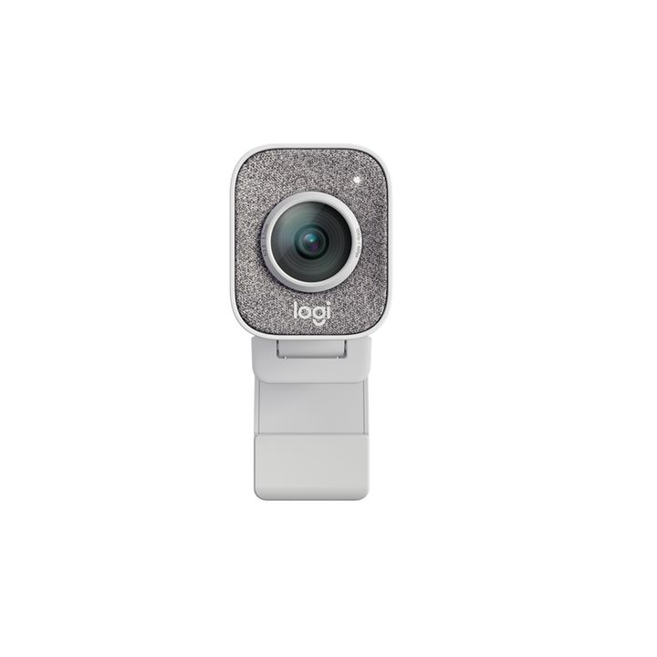罗技（logitech）STREAMCAM全高清1080p流媒体游戏直播京东¥ 1879.00去购买](https://union-click.jd.com/jdc?e=jdext-1360624979885776896-0&p=AyIGZRhcFQYVAlceUhEyFQBVGlkQABQOXR9rUV1KWQorAlBHU0VeBUVNR0ZbSkAOClBMW0scXBUDEAJXHVIdBg1eEEcGJVB2ewkZBBBbd1kjcjMLckIEB0dcVFQeC2UbUhUAGgZUG1wWMhIGVBtfEAERAVQraxUHIkY7GFsUARMAZRprFQUSAVUdUhYEFwJTGmsVChY3g7XPwIqt3uW%2Bjb%2Bsx4rlztK%2B1qyBZStrFjJJUgFSHgkCEABUHFgQChQPXBJfEwQVDl0cRxQyEgZUG14dBRQFU3VaewIaBFMaXRYCEAFlG2sWMkxpVEhYHABAUlB1AUlLFQARRgJ7BxAGURNcHQciBVQaWRc%3D)

- 罗技BRIO C1000E 4K超高清网络摄像头：支持 HDR 和 Windows Hello 的 4K 网络摄像头。

[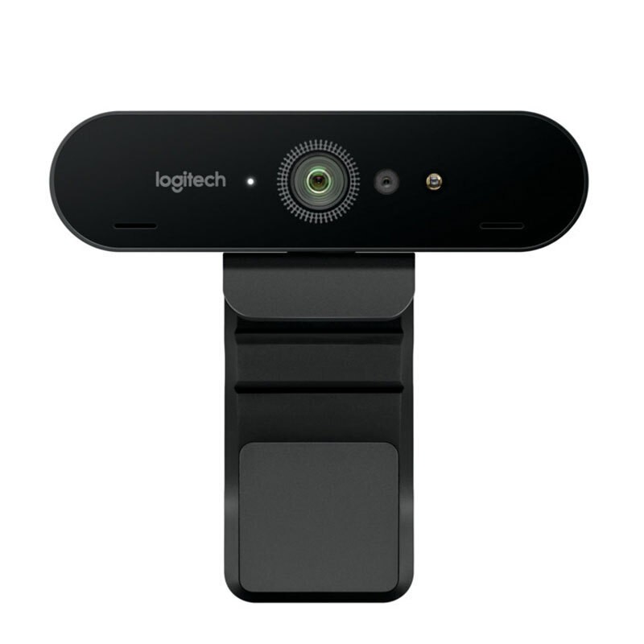罗技（Logitech）BRIO C1000E 摄像头 4K超高清广角台京东¥ 2060.00去购买](https://union-click.jd.com/jdc?e=jdext-1360625296442531840-0&p=AyIGZRprFQMTBlQSWB0LGwdVKx9KWkxYZUIeUENQDEsFA1BWThgOTkRHXE4ZVRpaFAMbBF0SUhUCDV4QRwYlfkJ%2FHh0QFgF3RR1jKWd%2FFwEISRhVRB4LZRtSFQAaBlQbXBYyEgZUG18QAREBVCtrFQciTDsaaxQyEgBVHVsTCxACXRNbFDISD1ErjbuWx4%2Fqwuuw1LipgJbrwIu50%2BudayUyETcOTg9cRw4HVxxaEgEWBF0cXhABFgVVEl4UHhM3VRpaFQcaAFMZXXsDfAddGF0UBBEHVx1rFTIRNwt1C0cCEQQGTl97WE5OUhINUEV8AlYSXxcHEwVlGVoUABA%3D)

- AM133：是一款造型轻巧時尚的单一指向性麦克风，专门为主播、实況主、UP主及戶外影片创作者设计。

[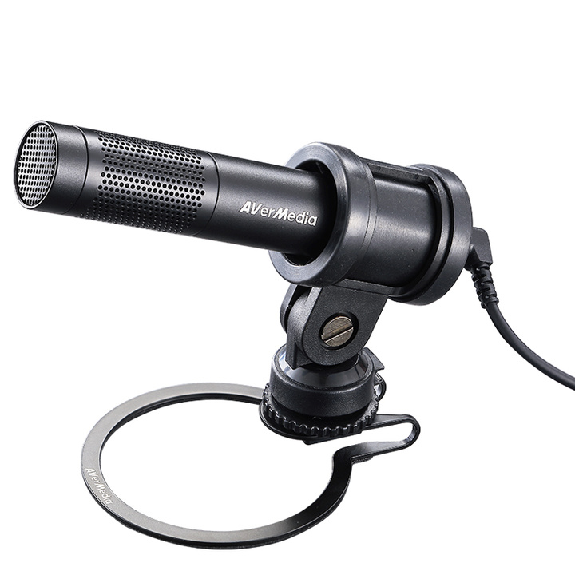圆刚AM133便携式3.5mm麦克风手机相机Vlog短视频录制网淘宝¥ 459.00去购买](https://s.click.taobao.com/t?e=m%3D2%26s%3DLPk4G3DjtwRw4vFB6t2Z2ueEDrYVVa64yK8Cckff7TVRAdhuF14FMQHbCmbKrMMLRitN3%2FurF3y6WQDNkRkFOKaogNuwipnN3jkgRGTHscFpkqRe1dYdPaZ8VqYl6tVnoifWEIAZNAjnNARN3vN5E4we6%2FtGg2%2FRSyiL934V8t70MrbhEk%2B62T7nDy5s30TcfWsUjZoD5RBt2Zao0r7PMV4EJthFTyLypiI9rz15ownXglu0rNVhFilBkGZt8NicGUj%2BCcngQcP4wKpdXtAG4XrIuRAKMApmnAZ0I9a%2Ft7k%3D&unid=1CvG6phs7q80&union_lens=lensId:TAPI@1617178391@212c3a3d_0820_1788757f2cf_db9c@01)

- 百视悦提词器：手机、平板、单反相机通用题词器，拍摄视频“怕忘稿”可以使用提词器。

[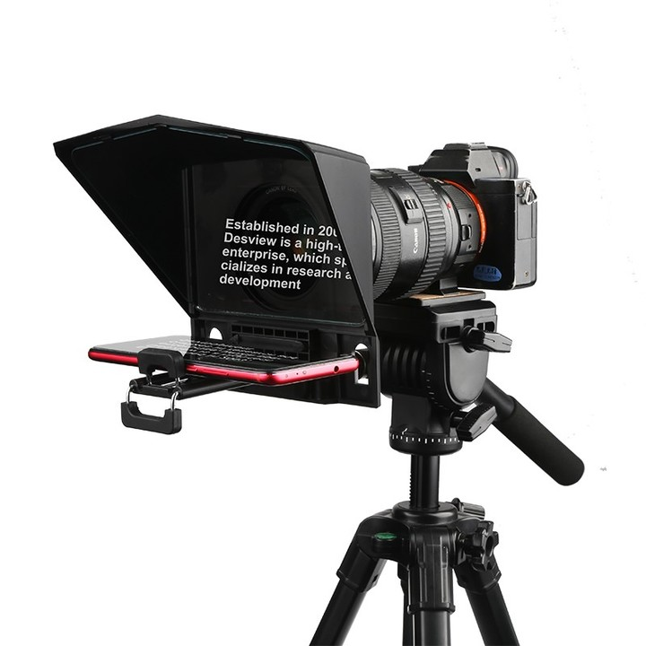提词器百视悦T2手机平板IPAD单反相机摄像T1/T2题词器淘宝¥ 627.90去购买](https://s.click.taobao.com/t?e=m%3D2%26s%3DjKqjfO%2FKzuNw4vFB6t2Z2ueEDrYVVa64XoO8tOebS%2BdRAdhuF14FMfHr1LeGETNw5x%2BIUlGKNpW6WQDNkRkFOKaogNuwipnN3jkgRGTHscFpkqRe1dYdPaZ8VqYl6tVnQUVd95%2FkoY8t%2BiME47%2B4Ms0Q9fK1X0AuhLjO8JFSuq7uEedSgWdmO8O%2Bb2yeor7YTc7jC1Dcr3Rcfm37xb4PJSlvD%2F0YVZNxUX%2FRU6YOh3KWmM0jBMJcU4WpHaMDo2yNjpo8Yx%2FhMkBk1kb2msZ8wFyR3VFow5XzA538Bz0Jzl4hhQs2DjqgEA%3D%3D&unid=1CvGhLU6gW40&union_lens=lensId:TAPI@1617178545@2107139c_082d_178875a4bf3_d4c6@01)

- 贝阳加厚绿幕抠像背景布：拍摄短视频需要用到绿幕抠像的可以买一块背景布使用。

[贝阳加厚绿幕抠像布背景布拍摄影绿布背景架直播幕布拍京东¥ 49.00去购买](https://union-click.jd.com/jdc?e=jdext-1360626769909972992-0&p=AyIGZRhcFQoQD1YaWhEyEgZUGFkSBxEOVh1YEAEiQwpDBUoyS0IQWhkeHAxcDUQNQlZNGA5OREdcThkNXg9JHUtCCUZVV1hWC1UaWhYAFQJWElgTARcEQltXYXtiYiJCMEt1e38GbAJuQGVuLUMsTHoVcSdzPHVmcg81UzBmdmF0EXsET2tlTlVHL2x2dWQxTgRjYHZXNhowQnV7bwVvKH5BZlg9QzNKZmFwNxsjYl8bTDZ%2FL3F2W1IJbARDZGVkIkxrb1ZJAi5OBXBhSUcRYxhqGBBzVhgzUw4eN1USWxcKEwZVHFglAhMGVR9eFgEUBmUrWxAyU2lVGl8RBxIPVitaJQIVB1MbXRwEEwdWHF4lAhoDZc31gdeauIyr%2FsOovNLYq46cqca50ytrJQEiXABPElAeEgVSGlwWBRQAXRNaHQoUBF0TWAkDIgdUGlsQChUBVx01FGwSD1YdWhMBEgVTK1sWMhE3C3VaRgFBVVJIUntYTk5STBBTV3wCVxpSHQAXDmUZWhQAEA%3D%3D)

- 希沃教培系列：拍摄短视频、网课教学、直播、培训的时候，你都能用上这个东西进行解说。

[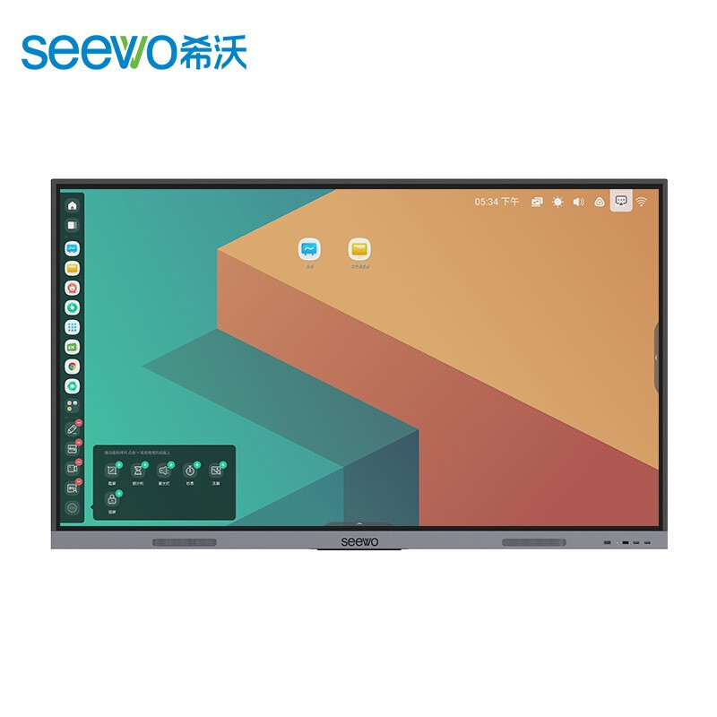希沃（seewo）MA06FEA 65英寸智能多媒体会议教学电子京东¥ 7999.00去购买](https://union-click.jd.com/jdc?e=jdext-1360627780061995008-0&p=AyIGZRprFQMTBlQTWxADEgJVKx9KWkxYZUIeUENQDEsFA1BWThgOTkRHXE4ZVRpaFAMaB1AaWxACDV4QRwYlf28GM3wgFHByUk9DL2EGUXdREghIYh4LZRtSFQAaBlQbXBYyEgZUG18QAREBVCtrFQciUTsbWhQDEQRSG1oVMhM3VRxbEwIUDl0eWBQAGjdVE18l1LyTgJPkzLK30f%2B1jpiyx47%2Bz%2BWTMiI3VisAQFZbQkkbWRIDFQRTHVIUAxUHXRNfFAMbG1QrWxQDEgJdHF0XBHwGOxtTFgQTAVYbWRMyEjdWKwV7A0EHBUgMQQN8XQlSXEgGUg87HlgcBBUGXBNrFwMTBVc%3D)

- Logitech Spotlight：无线演讲翻页笔，演讲神器，罗技Spotlight演示器。

[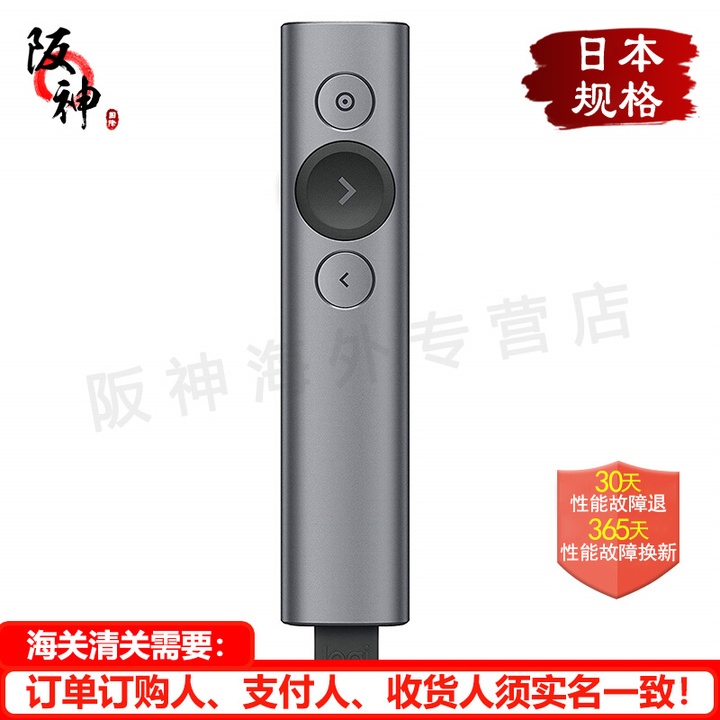Logitech罗技翻页笔 spotlight无线演示器演讲笔多媒体京东¥ 819.00去购买](https://union-click.jd.com/jdc?e=jdext-1360627901482864640-0&p=AyIGZRhaFwQSB1YaWBMyEAZVH1sSAxEHUBxrUV1KWQorAlBHU0VeBUVOWk1RAk8ECllHGAdFBwtaV1MJBAJQXk8JF0EfGQATB1EbXBQBEgJSDBsZdk13N284dlxmbi15L2Z9RWcNeCJscUAAIVMjfHthdBdsMnJyZWQTHTtsW2JzHGNcYlp2YTV%2FOx11YG8NbyhuXmV%2BMUgvZnVFYB18JHV2YkUCTTBecVtkF2wEZnFmTjEdLF1pYGQcb1J1e2ZXIkEkVXV7XiZ7AWUHclgHfTt2cVV%2FLEk9YXFbQiJiK3x1WmdBGS4lUGJHV38ICxhyWTdjDF4HdXU3EgB3Yh4LZRtSFQAaBlQbXBYyEgZUG18QAREBVCtrFQciRjscWhcLFAFlGmsVBRIBVR1SHQQSBlYbaxUKFjeDtc%2FAiq3e5b6Nv6zHiuXO0r7WrIFlK2sWMklSAVIeCQIQAFQcWBMKEwdQElgcBRcAUBpHFDISBlQbXh0FFAVTdVp7AhoEUxpdFgIQAWUbWCUBIlk7GggWUUAABhI1T15bAAhZWE1sFwVUE1MQBBI3VxpaFwA%3D)

- 捷波朗Jabra Evolve耳机：我惊讶于昂贵的耳机在通信方面却做得不好，Jabra Evolve耳机真的很适合通信沟通时使用。

[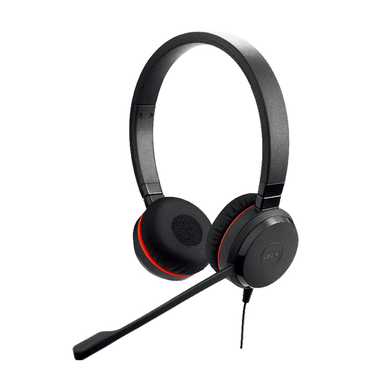捷波朗(Jabra)在线教育学生版双耳话务耳机头戴式耳机京东¥ 599.00去购买](https://union-click.jd.com/jdc?e=jdext-1360628002938916864-0&p=AyIGZRtdFgIaD1wTUx0yFwNRGFsTAiJDCkMFSjJLQhBaGR4cDFwNRA1CVk0YDk5ER1xOGQ1eD0kdS0IJRlVXWFYLUB9fFgIUB0JbV2JrdmEiQjhUdmZwIW8sZQpwfipiOE9xVnAsez5iS3VYI2k%2FcWJhZ11sOX1nZgYARC9saWtkHXgbYl1iZCFoJEp0dnAITiJUQnRPVX0vSH1MfyxJP2JLEkUhRA1zdmBnQRkuJQdofyhQGUVJclUnfDlPcXVSUWUQbmIeC2UbUhUAGgZUG1wWMhIGVBtfEAERAVQraxUHIlE7G1oUAxMBVx1eFzITN1UcWxMCFA5dE18WARA3VRNfJdS8k4CT5Myyt9H%2FtY6YsseO%2Fs%2FlkzIiN1YrAEBWW0JJG1kSAxUEXBpaFgoQDl0bXBwFFxtUK1sUAxICXRxdFwR8BjsbUxYEEwFWG1kTMhIEZRhrS2wTVFVICRQEFmkPRxISXkJHAHVeFgsaB1YfXiUAEwZXGQ%3D%3D)

- 舒尔Shure SM7b：是一款可选择频率响应的心形话筒，可在近距离录音室和人声应用中表现饱满柔和的音质，同时屏蔽电磁噪音。无论是广播、播客还是录音，声音都需要细心处理。这是一款录音棚级人声话筒，播客录音、记者采访、电台主播、电视台等使用的麦克风，声音清晰浑厚饱满，专业录音使用——[评测视频](https://www.bilibili.com/video/av244045636/)。

[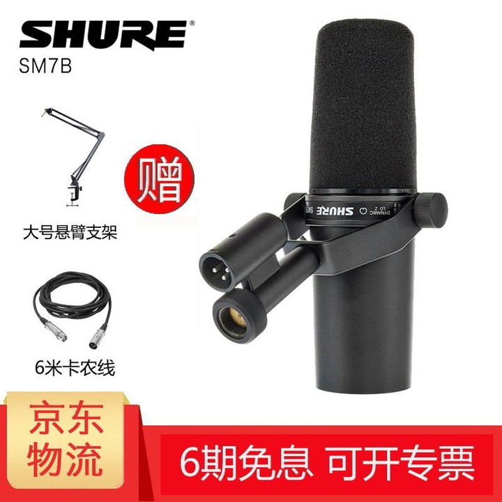SHURE 舒尔/ SM7B 录音棚级人声话筒 演说广播电台配音京东¥ 2499.00去购买](https://union-click.jd.com/jdc?e=jdext-1360628099881713664-0&p=AyIGZRhaHQsTB1ccWBAyEAZXH1ISABoGXB1rUV1KWQorAlBHU0VeBUVNR0ZbSkAOClBMW0sZWhcGGwBXE1ocBA1eEEcGJXIVeC1kH20Gd0QjHhgPS29ZHH0BXEQeC2UbUhUAGgZUG1wWMhIGVBtfEAERAVQraxUHIkY7HVoSAhQBZRprFQUSAVUdUxQCGwVUH2sVChY3g7XPwIqt3uW%2Bjb%2Bsx4rlztK%2B1qyBZStrFjJJUgFSHgkCEABUHFgcAxoPXBJbEwIQAFIeRxQyEgZUG14dBRQFU3VaewIaBFMaXRYCEAFlG2sWMkxpVEhYRlUWDlN1AUlLFVsXQQx7BxAGXRpYHQIiBVQaWRc%3D)

- 舒尔隔音耳机：能够带来清晰无暇的沉浸式音频体验，强大音效、多设备灵活连接、长达 8 小时的无线收听和定制设计，兼容Android、iOS 和蓝牙®设备。提供不同的频率响应特性，可拆卸式线缆，配备可变形线材套件和多种配件。

[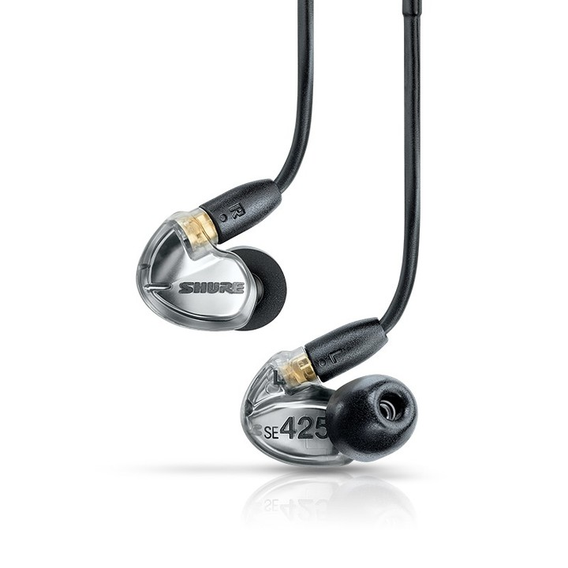舒尔 Shure SE425 双单元动铁 入耳式线控通话 高解析京东¥ 2168.00去购买](https://union-click.jd.com/jdc?e=jdext-1360628455848116224-0&p=AyIGZRprFQMTBlQSXxIEFwFQKx9KWkxYZUIeUENQDEsFA1BWThgOTkRHXE4ZVRpaFAMbA1IdXhMHDV4QRwYleVRsNlNaQWJ3YSNQLE9%2FFVQiaFxORB4LZRtSFQAaBlQbXBYyEgZUG18QAREBVCtrFQciUTsbWhQDEwZUH1IdMhM3VRxbEwIUD1UaWRUFEzdVE18l1LyTgJPkzLK30f%2B1jpiyx47%2Bz%2BWTMiI3VisAQFZbQkkbWRIDFQRcHl8RCxcOVRtcFgEXG1QrWxQDEgJdHF0XBHwGOxtTFgQTAVYbWRMyEjdWKwV7A0EHBRwJQQN8XQlSXEteEkM7HlgcBxAAURlrFwMTBVc%3D)

- Beyerdynamic（拜亚动力）DT 770 PRO录音室耳机：封闭式耳罩式耳机，可在演播室和平板电脑和智能手机等移动设备上提供专业声音，即使在旅途中使用iPhone和Android设备，也可以获得纯净的高分辨率录音室声音。

[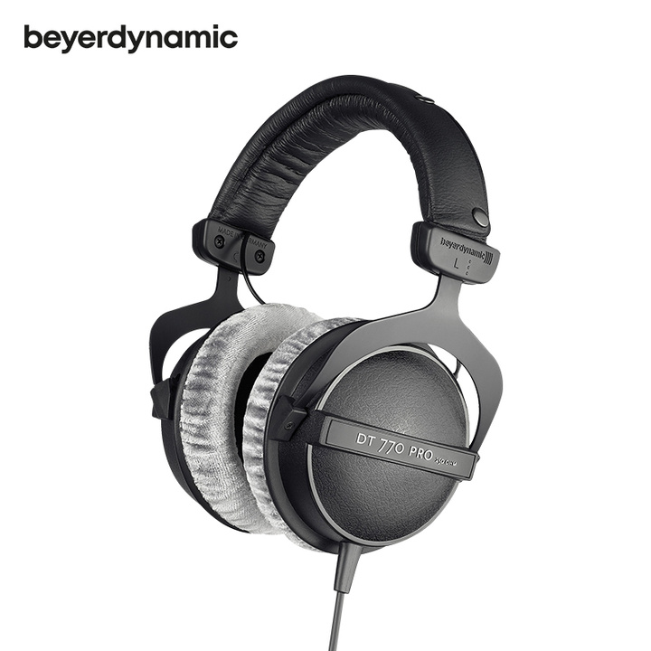拜亚动力/拜雅 (beyerdynamic) DT770 PRO 头戴式专业京东¥ 1199.00去购买](https://union-click.jd.com/jdc?e=jdext-1360628749206147072-0&p=AyIGZRprFwQbBlwaUyVGTV8LRGtMR1dGFxBFC1pXUwkEAEAdQFkJBVkTCxMOVBNETEdOWmVFKU5%2FZGBdZTgUXhBUUx4Md0dXfVVdVxkyEg5VGVMUAxIAVitbFAMSA1AYWBMDIjdVHmtDbBIGVBpaFAIUD1QrWiUCFQdTG10dAhQFVBNfJQIaA2XN9YHXmriMq%2F7DqLzS2KuOnKnGudMrayUBIlwATxJQHhIFUhpcFgsUAl0YWhICFwFUHVgJAyIHVBpbEAoVAVcdNRRsEg9WHVoTARIFUytbJQEiWTsaCBZVGg4CHDVPXlsAFR5aS2wXBFwSWRMLFDdXGloXAA%3D%3D)

- [Focusrite Scarlett Solo](https://link.zhihu.com/?target=https%3A//global.focusrite.com/en/usb-audio-interface/scarlett/scarlett-solo)：是Focusrite（福克斯特）推出的一款性价比极高的便携专业声卡，让你轻松录制录音室的专业音频，可用于专业编曲、录音、播音、播客、K歌、视频、直播等。可直接与拜亚动力DT770耳机配合使用。

[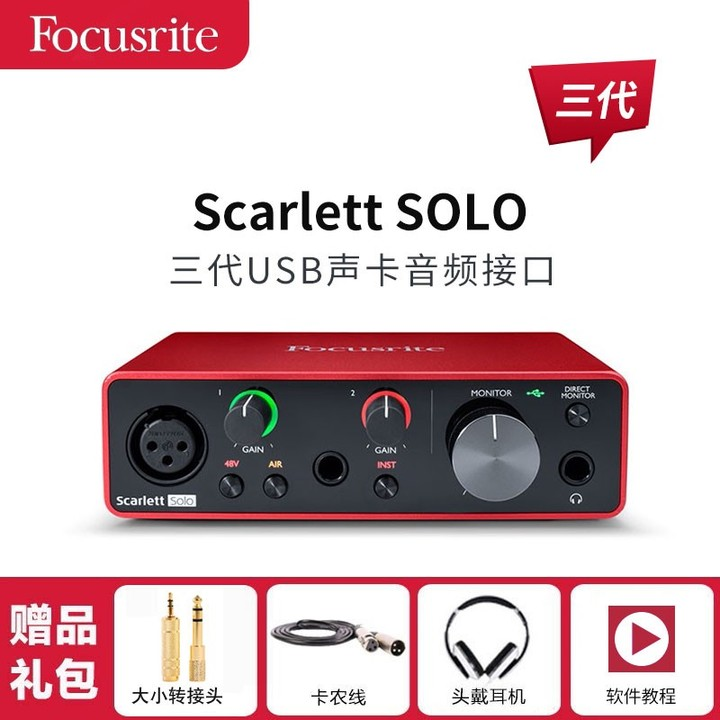Focusrite/福克斯特 Scarlett solo/2i2/4i4三代USB录京东¥ 970.00去购买](https://union-click.jd.com/jdc?e=jdext-1360629600557703168-0&p=AyIGZRtaFgAWBVETWRcyFwVVE1gSCxAGVhNrUV1KWQorAlBHU0VeBUVNR0ZbSkAOClBMW0seWRUKEQBcGVoWCg1eEEcGJXVkBjwYLUtmcVAvZQFNVGAEKX8nZnIeC2UbUhUAGgZUG1wWMhIGVBtfEAERAVQraxUHIkY7GFgWARc3VCtbEgIUB1MTWRMFEw9dK1sdBiLR%2B4%2BOnb3Lt%2FDN8bvXn7eAkvDBvJQ3ZStYJVlHUxxeRxUAFQZSGFMSAxMDUR1dFAASAFwHWiUCEwZVHlMSBBABOxo1FQoRAVQdWBUAFDdVK1glXHwGBhhSF1BHAjtBB1wFVlEJUDUQABIGVhhYHTIQBlQZWQ%3D%3D)

鑫威森LED影视聚光灯：外拍影视聚光灯演播室主播影室灯，可调光调焦摄像摄影灯光。

[鑫威森LED150W影视聚光灯调光摄像摄影灯光双色温补光京东¥ 1228.00去购买](https://union-click.jd.com/jdc?e=jdext-1360630415208837120-0&p=AyIGZRtZEAoRAlEaUhIyEg5XHVMRARsEURtrUV1KWQorAlBHU0VeBUVOWk1RAk8ECllHGAdFBwtaV1MJBAJQXk8JF0EfGQIbBVMTXxYLEQNVDBsZdmtRNW8SXEFmBQN4L3ZhRWQKbD12A1QONnIsY3VxUgpvMnFgZl4hEjtsWHZ%2BNngfdmtAZCx4IFViEH8NbyhqXGVYA3kvZmFFYB18JHV2YkUCTTBecRN7XXhZQ2ZxXgceLXxXYHMcbBlie2l1NXgvAQFlc1dBCGJmYUQjeSN1YmZSC2MiR2RrdBxcLXxme343e08XdyJBHkghTloVcDZLOX5FbQ9LbS9DB2dnWRdrFQsSBV0aWhUFETdVGloVBhcEVh1aJTISAmVaNRMBFQ9THGsUMhIAVR1bEwoWAVQZXRYyEg9RK427lseP6sLrsNS4qYCW68CLudPrnWslMhE3Dk4PXEcOB1ccWhIAEwJVH1gUCxsFUxtYFB4TN1UaWhUHGgBTGV17A3wHXRhdFAQRB1cdaxUBIgRlRTUUURFUAU5cRWxIWxwcE0laGmlQGVsVCxcOUCtZFAMQBQ%3D%3D)

- 倍晨投屏神器：是一款直播大屏幕外接竖屏显示器，有多种大屏尺寸可供选择，它支持有线、无线投屏，可以通过WiFi连接显示屏，并且可以通过触控来操作大屏幕。可以横屏、竖屏安装调试，高清分辨率达1920*1080，多种常用接口可以扩展更多能力，譬如，网络接口、HDMI、USB、VGA等，反应灵敏，亮度高。有了这个利器，远距离也可以互动直播。

[倍晨投屏神器 无线投屏器抖音快手网红主播手机直播神京东¥ 2602.00去购买](https://union-click.jd.com/jdc?e=jdext-1360631205201760256-0&p=AyIGZRhaEgERAVAYUhAyEgZUGFwUBhEEUx5eFQIiQwpDBUoyS0IQWhkeHAxfEE8HCllHGAdFBwsCEwZWHFoRAREBUB5bFR1LQglGa2VyEnwmWA1mZ1VlN0EpbgoIZilQU3UOHjdVElsXChMGVRxYJQITBlUfXhYBFAZlK1sQMlNpVRpZFAUXDl0rWiUCFQdTG10dBBYOUh1TJQIaA2XN9YHXmriMq%2F7DqLzS2KuOnKnGudMrayUBIlwATxJQHhIFUhpcFwIRBlEYWhUEFQZWH1wJAyIHVBpbEAoVAVcdNRRsEg9WHVoTARIFUytbJQEiWTsaCBYCFFJcGDVPXlsBVkQfFmwXBVUZWxMGFDdXGloXAA%3D%3D)

- 魅声T8-2：可添加辅助音效，专为娱乐直播而设计的话筒。

[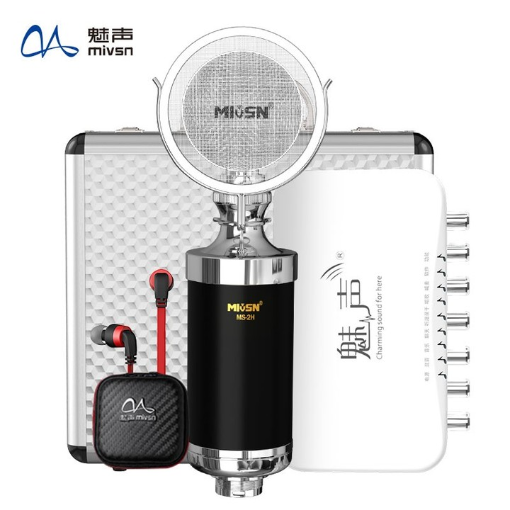魅声 T8-2 手机电脑通用外置声卡套装 K歌快手主播唱歌京东¥ 668.00去购买](https://union-click.jd.com/jdc?e=jdext-1360631478276169729-0&p=AyIGZRheHAUXAFccXxIyEgZUGlsRBREEXRNcJUZNXwtEa0xHV0YXEEULWldTCQQAQB1AWQkFWxQDEwdRHFgWChoASkIeSV8iWlEFABdjU3k1awNJehZEU05FHXsSZ1kXaxULEgVdGloVBRE3VRpaFQYXBFYdWiUyEgJlWTXNnqbTx5qPiqvFoN3C7Y7bs5OCvf3Mu5PT3r1rFDISAFUdWxMKGwRXHV8cMhIPUSuNu5bHj%2BrC67DUuKmAluvAi7nT651rJTIRNw5OD1xHDgdXHFoSABICUxJYEwUSAF0dWB0eEzdVGloVBxoAUxldewN8B10YXRQEEQdXHWsVMhE3C3VaRgJBAVwbXXtYTk5THlgWXHwCVhNYFgAWDmUZWhQAEA%3D%3D)

- 华固补光灯：支持30种直播美颜灯。

[手机直播支架补光灯主播美颜嫩肤室内专用小型环形灯光淘宝¥ 16.80去购买](https://uland.taobao.com/ccoupon/edetail?e=lH%2BHD1hjSDsGQASttHIRqdLiNiWGKINTqtc8dhQmBAYrzOJW93rm7TtTd5PEM5ChRuGTCaAYsN%2FkwZVu8LNtNpxC6t6Iu9lM%2BcdisQ1nnpQfB0ZlvXPxquCUYe0dYg%2FywDPW6%2B5bXkqYwmByB6zANv%2BwjH3DCmJrlDnB8bP%2B743QfaLs3ShAKNO6UBgFVvsmJnpj%2BmQe1PlBLQWW799tKi%2BQFCU%2FXXZwAJtV5SE2TVrEqmc7Y%2BgV9O%2FKxAjjcJm4HwfXw2csjHEgFCjLkMsi0Q%3D%3D&traceId=212bbc2016171798903517574ec205&unid=1CvHT6UrSJq0&union_lens=lensId:TAPI@1617179890@2107e49b_085f_178876ed2fb_10fd@01)

- e之音V8手机声卡套装：娱乐直播主播都在使用的声卡，支持多项均衡独立调节功能，可以一键让音乐变成伴奏，消除主唱原音。声卡才知道自己声音多好听。

[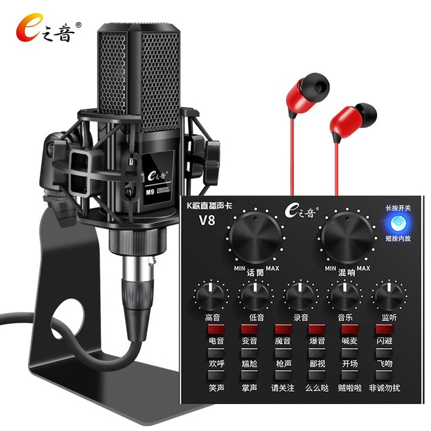e之音 V8 手机声卡套装 抖音吃鸡快手直播K歌电脑外置京东¥ 158.00去购买](https://union-click.jd.com/jdc?e=jdext-1360632296270417920-0&p=AyIGZRtSFAsbAlYYWBQyEgZUGF8UBBEFVhtbFwIiQwpDBUoyS0IQWhkeHAxfEE8HCllHGAdFBwsCEwZWH1oTARAEVRtZFR1LQglGa0kBTXgHSF4WYXpxK1M8V15CbyZkK2UOHjdVElsXChMGVRxYJQITBlUfXhYBFAZlK1sQMlNpVRpaFAcRAFArWiUCFQdTG1IUAxIOXBtSJQIaA2XN9YHXmriMq%2F7DqLzS2KuOnKnGudMrayUBIlwATxJQHhIFUhpcFwERD1IYXRQHEgFdGFoJAyIHVBpbEAoVAVcdNRRsEg9WHVoTARIFUytbJQEiWTsaCBVSRQJcTDVPXlsBXBIBFGwXBF0eWhcKFzdXGloXAA%3D%3D)

- 雷柏C260：是很多主播都在用的摄像头，支持高清1080P自动对焦，可以根据光线自动调节，光线不足也能清晰自然。

[雷柏C260/C280外置高清摄像头720P/1080P免驱带麦克风淘宝¥ 129.00去购买](https://s.click.taobao.com/t?e=m%3D2%26s%3DIpm62nMJ%2FKVw4vFB6t2Z2ueEDrYVVa64yK8Cckff7TVRAdhuF14FMcOYkFCDddQqJ1gyddu7kN%2B6WQDNkRkFOKaogNuwipnN3jkgRGTHscFpkqRe1dYdPaZ8VqYl6tVnNHeGqmE84IW0%2FTezhkqpdQtkyqhBb5%2B4x8PUddoNe3DFevKOUtQf9%2FPM6G8HV5ll4JOed0Rxa6MUa9YK22WtakCT1gVbiewFjZndpieetyDuhOtPc8RUDWCY072fSIx0QkNtTkXPFtVQGNYb8l%2BVKwC%2FJeSfTd6eyInoxq%2BxiZ%2BiZ%2BQMlGz6FQ%3D%3D&unid=1CvI9lOblOE0&union_lens=lensId:TAPI@1617180110@2106c1d5_0835_17887722e16_cd6e@01)

- 3D立体背景布：像真实环境一样逼真。这里建议大家选择一个3D立体背景布，它可以帮助你“以假乱真”展示你的背景空间，以较低的成本，就能完成“高大上”的环境布局。这里的3D背景布有很多风格装饰布局，多种3D背景布可供你选择。

[新款男女抖音直播主播背景布3D立体卧室内装饰定制大尺淘宝¥ 31.50去购买](https://s.click.taobao.com/t?e=m%3D2%26s%3DOzp3TLrQYENw4vFB6t2Z2ueEDrYVVa64XoO8tOebS%2BdRAdhuF14FMWotHZHiJI%2Bt1aH1Hk3GeOi6WQDNkRkFOKaogNuwipnN3jkgRGTHscFpkqRe1dYdPaZ8VqYl6tVn0MiU2KHk%2B9koDxZu1ENhigtkyqhBb5%2B4x8PUddoNe3DFevKOUtQf9%2FPM6G8HV5ll4JOed0Rxa6PnBbRWsMKPnLhK8tfssEj9jZndpieetyDuhOtPc8RUDWCY072fSIx0QkNtTkXPFtVQGNYb8l%2BVKwC%2FJeSfTd6eyInoxq%2BxiZ%2BiZ%2BQMlGz6FQ%3D%3D&unid=1CvIcKVMrGo0&union_lens=lensId:TAPI@1617180156@2105d7f0_fe9d_1788772e226_3b01@01)