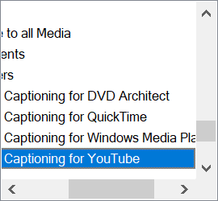

# PC端屏幕截取和录制

屏幕截取(screenshot)和屏幕录制(screen recording)原来是两个不同的领域, 但是现在彼此功能渗透. 但总的来说, 截图为主的工具渗透录制强一些, 而录制为主的工具没有很完备的截图功能.

## 屏幕截取

### FastStone Capture

截图功能完备, 录制功能够用. 编辑功能独特强大.

- 截图
  - 窗口滚动截图, 无需设定, 甚至可以截取同时有横纵滚动轴的窗口.
  - 图片标记(丰富)
- 屏幕录像: 
  - 录制时可拖动
  - 鼠标尾随
  - 简单视频编辑
    - 标记(残缺)
  - 格式是wmv, 还需要二次转换.
  - 内置一级放大. 很方便临时聚焦.
- 更多工具
  - 颜色拾取
  - 放大镜
  - 屏幕尺子

### picpick

特点编辑器.

- 截图
  - 滚动窗口截图
  - 图片编辑(丰富)
    - 标记可编辑性
  - 图片分享

### Snipaste

特点钉图.

- 图像截取
  - 钉图功能
  - 图像标记(缺步骤标号)
  - 文字转图
  - 喜欢截图时候的临时操作
- 取色

### ShareX

这个是全能型工具, 特点是设置众多, 自动化功能丰富.

- 截图
  - 滚动截图: 设置多, 默认设置不理想.
  - ocr (25种语言, 准确率一般) / 文本捕捉
  - 网页扑捉
- 录制gif
- 录屏
  - 不可拖动
- 文件管理功能.
- 注重分享
- 自动化
  - 截图后的动作
  - 上传后的动作
  - 任务设置
  - 
- 丰富的实用工具集
  - 拾色器
  - 图像合成
  - 二维码生成和解码
  - 尺子
  - 哈希值检查

### vivaldi自带

- 仅适合截取完整页面, 比滚动快速

### Sniptool

画布拼合是特点. 截图反而次要了.

- 截图: 适合拼合多个截图
  - 丰富的编辑功能
- 视频录制: 需要ffmpeg(未设置成功)

## 屏幕录制

### bandicam

- 鼠标跟随不能显示录制框, 容易录到不需要的东西. 还要二次编辑.
- 可以拖拽录制选框, 有录制框影子的bug
- 缩放不方便, 需要重新定义录制框. 
- 对于尺寸定义有些繁琐, 没有锁定比例的选项. 
- 其他都很方便, 适合临时录制. 
- 没有编辑功能

captura

- 开发者已经弃更
- 鼠标跟随有预览框, 这点有些残缺.
- 没有缩放.
- 图像标记有些残缺.

> 以上工具都没有特别完备的注释功能, 需要配合第三方的屏幕注释工具, 比如mouse track或者gink, 才能更好的展示操作细节.

camtacia

- 先录后编辑的逻辑, 在录制期间不用费心. 一切交给编辑.
- 在它自己的流程下比较完美.
- 不适合临时录制.

