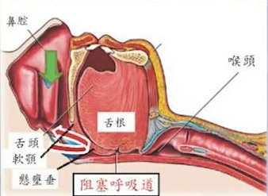
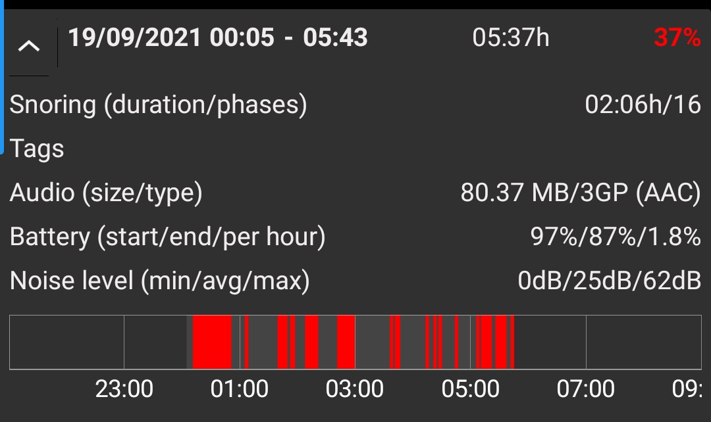
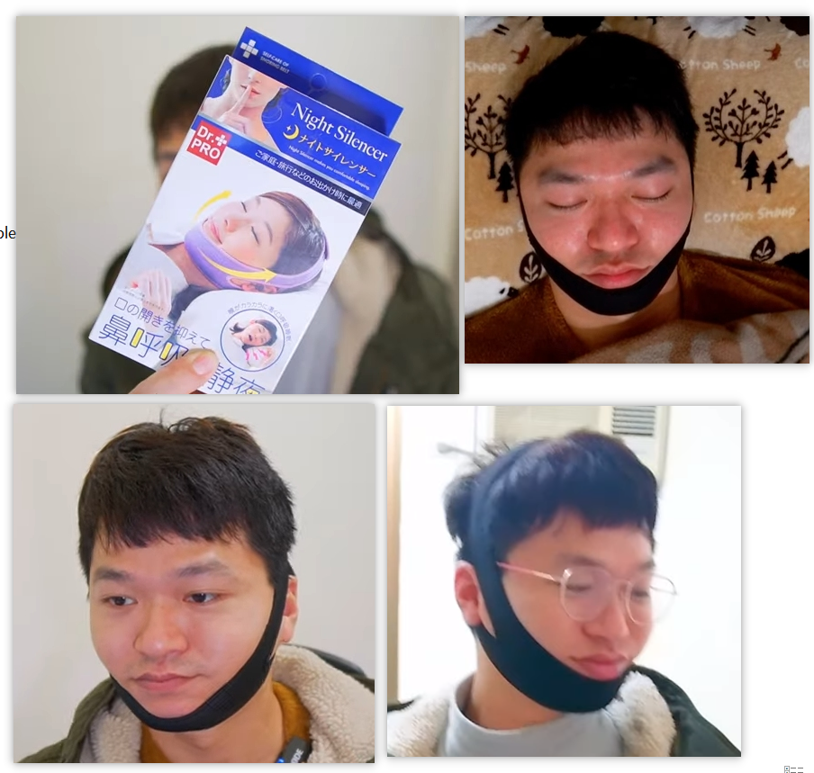

# 睡眠问题

总是很早醒来, 时长在4到6个小时. 1/3的机率醒来后感到疲乏. 

## 打鼾

打鼾可能影响睡眠的原因: 

下载了[snoreclock](https://play.google.com/store/apps/details?id=de.ralphsapps.snorecontrol&gl=US)监测了一下打鼾状态, 惨不忍睹:

寻找解决方法: 

> https://www.youtube.com/watch?v=DWyeOdG8zFs 这个被三立[转载](https://www.youtube.com/watch?v=ix0TDTZ5Q2s), 似乎有些可信性.

结论: 有效的只有绷带. 

