# 英国历史时间线整理

主要来源于百度百科、网络资料及《一读就懂的世界史——英国》，本人**并非**研究英国历史的专家，**欢迎大家指出我所整理的时间线中的错误，谢谢！**

------

**不列颠岛**（Great Britain）是一个位于欧洲西方外海的岛屿，主要分为四部分：英格兰、苏格兰、威尔士，以及周围一些小岛。

## 古不列颠人

约公元前13世纪（一说公元前3000年前），**伊比利亚人**从欧洲大陆来到大不列颠岛东南部定居。

约公元前700年以后，居住在欧洲西部的**凯尔特人**不断移入不列颠群岛，成为不列颠的主人，他们与被同化的伊比利亚人统称**古不列颠人**。凯尔特人中有一支称为不列吞人，不列颠这一名称可能来源于此。

## 罗马入侵

公元前55和前54年，凯撒两度率罗马军团入侵不列颠，均以和谈告终。

一个世纪后，公元43年，罗马皇帝克劳狄一世率军入侵不列颠。征服不列颠后变其为罗马帝国的领土。罗马人以位于泰晤士河口的**罗马伦敦**（Londinium）为聚集地，后成为英国首都**伦敦**。

公元60年，凯尔特女王布狄卡领导大起义，攻克伦敦，但很快被镇压。

为阻止北方凯尔特人南下，公元2世纪20年代罗马皇帝P.A.哈德良在位时期，罗马人在大不列颠岛北部修建了一条横贯东西、全长118公里的长城，史称**哈德良长城**。

公元407年，罗马驻军被迫全部撤离不列颠。

北方的苏格兰人越过哈德良长城。

## 民族

日耳曼民族的一支**盎格鲁-撒克逊人**侵入不列颠。**盎格鲁人**（Anglos）出自现在的丹麦地区，Angles是矛。撒克逊人最早居于波罗的海沿岸和石勒苏益格地区，后内迁至德国境内的尼德萨克森（Niedersachsen）一带，称为萨克森人。公元5世纪初，一部分萨克森人北上渡海，在高卢海岸和不列颠海岸登陆入侵，最终大部分定居在英格兰。史学界为了区分，把在英格兰定居的萨克森人，称为**撒克逊人**（Saxons），Saxons意为砍刀，与英格兰的盎格鲁人合称为盎格鲁-萨克逊人，据称他们为现在英国的主体，今日绝大多数英国人都是盎格鲁-萨克逊人的后代。

英吉利这个名字源自“盎格鲁人”（Angles），其原名“Engla-lond”意为“盎格鲁人之地”，后音译变成了England。

**凯尔特后羿**. 公元7世纪初，盎格鲁人和撒克逊人控制了今英国的大部分，而苏格兰人、威尔士人、爱尔兰人还主要是原住民，是对盎格鲁-萨克逊人的抵抗者，此后千余年，英格兰人与凯尔特人战争不断。

**朱特人**（Jutes），北欧的古代民族。公元5世纪中叶至6世纪上半叶，一部分与盎格鲁人、撒克逊人等陆续渡海移民大不列颠岛，在岛的东南部建立了**肯特王国**。在欧洲大陆上的朱特人与丹麦人等结合形成今丹麦人。

## 七国时代

到7世纪初，盎格鲁-萨克逊人和朱特人在英格兰建立了7个主要的王国：东部和东北部盎格鲁人的**麦西亚**（Mercia）、**诺森布利亚**（Northumbria）和**东盎格利亚**（East Anglia），南部撒克逊人的**威塞克斯**（西撒克逊，Wessex）、**埃塞克斯**（东撒克逊，Essex）和**萨塞克斯**（南撒克逊，Sussex），东南部朱特人的**肯特**（Kent）。这个时期被形容为**七国时代**（Heptarchy）。

[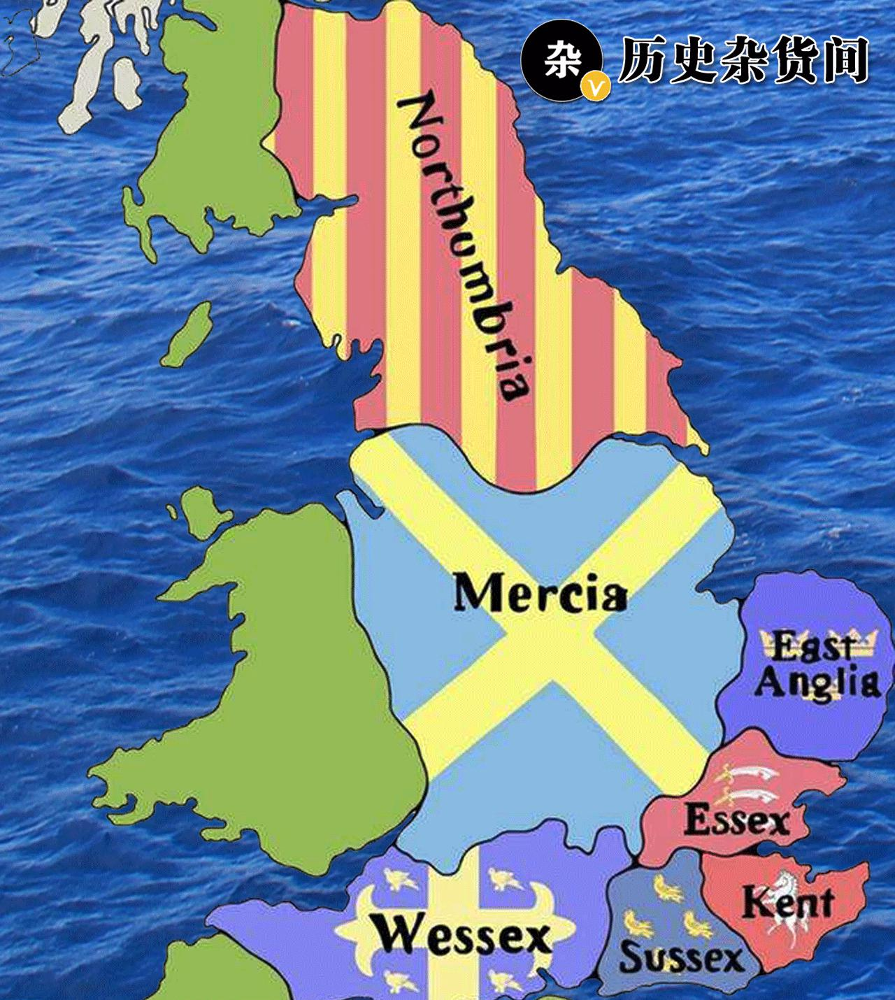](https://www.google.com/url?sa=i&url=https%3A%2F%2Fppfocus.com%2Fmy%2F0%2F06e41cf.html&psig=AOvVaw2L4-i3TaQI_bLrzAqJ_jsz&ust=1618142921986000&source=images&cd=vfe&ved=0CAIQjRxqFwoTCPDYsafS8-8CFQAAAAAdAAAAABAD)

公元829年，威塞克斯的**埃格伯特**征服了其他六国，基本统一了英格兰，自称“**盎格鲁-萨克逊之王**”。

## 信仰

古凯尔特人信仰原始宗教**德鲁伊教**（据说**巨石阵**就是他们留下的祭坛遗址）。

597年，罗马教皇格列高利一世（590～604在位）派修士奥古斯丁到英吉利传教。到7世纪下半叶，英吉利全境基本上都皈依了罗马基督教。

## 威塞克斯王朝

[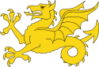](https://zh.wikipedia.org/wiki/File:Wessex_dragon.svg)

### 收复丹麦区

865年，丹麦维京人侵袭不列颠。

871年，22岁的阿尔弗雷德成为威塞克斯王国国王。

878年，阿尔弗雷德在爱丁顿战役中击败维京人。

879年，阿尔弗雷德和丹维京订立条约，将英吉利东北部的麦西亚、诺森布利亚和东盎格利亚划归丹麦管辖，称为“丹麦区”。

886年，阿尔弗雷德占领伦敦。

阿尔弗雷德**首称“英格兰国王”**，是英国历史上唯一被尊称为“大帝/大王”（the Great king）的统治者。

901年，阿尔弗雷德去世。

10世纪初，威塞克斯王朝的后继者逐渐收复丹麦区。

### 收复维京区

埃塞尔斯坦（Athelstan）韦塞克斯王朝第八位君主，阿尔弗雷德大帝之孙，924年至927年为盎格鲁-撒克逊国王，927年至939年为英格兰国王。于927年成功征服**约克王国的维京人**，统一了整个英格兰，也被**历史学家认为是事实上的第一位英格兰国王**。

但隔海相望的**诺曼底公国**成为了维京冒险者的保护伞。

### 北海帝国

埃塞尔雷德二世（Ethelred II，约976年－1016年4月23日）英格兰国王，威塞克斯王朝第14位君主。期间，英格兰孱弱，纳贡“丹麦金”。

1002年11月3日埃塞尔雷德二世大批屠杀丹麦移民，从而引起了丹麦人的再度侵犯。

1013年，丹麦国王思万一世（Sweyn I）被接纳为英格兰国王，埃塞尔雷德二世遂逃往**诺曼底**，此前，他已将忏悔者爱德华母子送往诺曼底。

1014年，思万一世暴毙于伦敦。埃塞尔雷德二世被找回。

1016年，埃塞尔雷德二世去世，其子埃德蒙二世被拥立为国王。

1016年，思万一世之子，**丹麦国王克努特**率军讨伐英格兰。

1016年，克努特迎娶埃塞尔雷德二世的遗孀、忏悔者爱德华之母、诺曼底公爵的妹妹**埃玛王后**。

1027年，克努特统一不列颠岛。

1028年，克努特打败挪威和瑞典，建立了包括英格兰、丹麦、挪威、苏格兰大部和瑞典南部的“北海大帝国”，史称“**克努特大帝**”，他是历史上唯一一个几乎统一了北海沿岸地区的帝王。

1035年，克努特大帝去世，北海大帝国分崩离析。

------

克努特大帝去世后其次子哈罗德一世（1035-1040）为英王。

哈罗德一世病故后克努特大帝长子哈德克努特（1040-1042）为英王，后病逝，丹麦时代结束，一直生活在法国的忏悔者爱德华继位，威塞克斯王朝复辟。

### 威塞克斯王朝(复辟)

**忏悔者爱德华**（约1001年－1066年1月5日），英国的盎格鲁-撒克逊王朝君主（1042年至1066年在位），因对基督教信仰有无比的虔诚，故被称作“忏悔者”或“圣爱德华”。

其父为英格兰威塞克斯王朝第14位君主埃塞尔雷德二世，其母为诺曼底公爵的妹妹埃玛王后。

1045年，英国人爱德华和哥德文伯爵的女儿埃迪莎结婚。当时哥德文家族拥有英格兰超过三分之二的土地。

在位期间，大臣哥德文伯爵叛乱。最终，双方达成和约，避免内战爆发。不久，哥德文伯爵逝世，其次子哈罗德二世入掌枢机。

1063年，**哈罗德二世征服威尔士**。

在位期间，苏格兰贵族麦克白（Macbeth）心怀不满，在其夫人的怂恿下，谋杀了国王邓肯（Duncan），篡夺了苏格兰王位。英王爱德华命令英格兰军队讨伐苏格兰叛军，最终平定叛乱，恢复了苏格兰王室正统。

（莎士比亚剧作《麦克白》原型）

英王爱德华死后无嗣，王后的兄弟哈罗德二世自立为王。

**哈罗德·葛温森**（古英语：Harold Godpinson，英语：Harold Godwinson，1022年－1066年10月14日），有时称为哈罗德二世，盎格鲁－撒克逊时期韦塞克斯王国的末代君主。

## 诺曼底王朝（House of Normandy，1066年—1154年）

[.svg.png)](https://zh.wikipedia.org/wiki/File:Arms_of_William_the_Conqueror_(1066-1087).svg)

简称**诺曼王朝**，是历史的重要转折点。

**威廉一世**（英语：William I，约1028年—1087年9月9日），诺曼王朝的首位英格兰国王（1066年12月25日—1087年9月9日在位）。称作**征服者威廉**（William the Conqueror）。

威廉，诺曼底公爵罗贝尔一世惟一的儿子，他的母亲莱乌是罗贝尔一世的女仆，因此是私生子。七岁时即位成为诺曼底公爵。英王爱德华的母亲是他父亲的姑姑，因而他拥有微弱的英王血统。

威廉称在1051年访英时，英王爱德华曾答应让威廉继承他的王位；同时声称当他1052年在伦敦访问哈罗德二世时，后者因==救命之恩==许诺给他王位。

1066年9月25日，哈罗德二世刚刚于英格兰东约克郡乡下斯坦福桥战役中击败由挪威国王哈拉尔三世指挥的维京军队，哈拉尔三世亦阵亡，此役标志着**维京人入侵英格兰的终结和维京时代的结束**。

1066年9月28日，威廉率军在英格兰的佩文西海湾（萨塞克斯）登陆。

1066年10月14日，**黑斯廷斯战役**（Battle of Hastings）打响，结果英格兰军队战败，哈罗德二世本人亦战死。黑斯廷斯战役也是历史上**最后一次**对英格兰的成功征服。

之后诺曼底公爵威廉进入伦敦。12月25日，威廉在威斯敏斯特教堂加冕为英格兰国王，**诺曼王朝**开始。盎格鲁-撒克逊人对英格兰的统治结束。

威廉一世于1086年颁布**《末日审判书》**，进行全国土地调查，**加强中央集权**，进行土地和军事改革。

威廉一世引入了**法语和法国的生活习惯**，此后的300年中英国的贵族语言是法语，因此现代英语中有很多由法语演变而来的词汇。

威廉一世开始修建**伦敦塔**。伦敦塔曾作为堡垒、军械库、国库、铸币厂、宫殿、天文台、避难所和监狱，特别关押上层阶级的囚犯，最后一次作为监狱使用是在第二次世界大战期间。1988年被列为世界文化遗产。

英国自阿尔弗雷德大帝以来的血统传承暂时中断，**英法关系也自此纠缠不清**——此前没有什么冲突。

诺曼底公爵摇身成为了英格兰国王，这使得（西欧中世纪的封建制度中）的诺曼底脱离了法兰西，成为了英格兰王国的一部分，为十四世纪百年战争的爆发埋下了伏笔。事实上，在之后的三四百年间，英国和法国进行了长时间的战争。

（本人感觉，简单粗略地说就是：法国封建制的诸侯国突然征服了英国了，然后英国说那个诸侯王的后代及其地盘就是我们的了，法国自然不同意。）

威廉一世迎娶佛兰德斯的玛蒂尔达为妻，玛蒂尔达是阿尔弗雷大帝的第七代直系后裔，于是英国自**阿尔弗雷德大帝以来的血统得以传承**。

1087年7月，威廉一世在与法王腓力一世因领土纠纷引发的战斗之中，于巴黎附近的要塞芒特意外堕马受伤。1087年9月，他在鲁昂的St. Gervais女修道院去世。

其三子为**威廉二世**（英语：William II，1056年至1060年之间-1100年8月2日），诺曼王朝的第二位英格兰国王（1087年9月9日-1100年8月2日在位）。1100年8月2日，威廉二世在狩猎时，一支箭正中肺部而亡。

其四子为**亨利一世**（英语：Henry I，1068年—1135年12月1日），诺曼王朝的第三位英格兰国王（1100年8月2日—1135年12月1日在位）。1100年在其兄威廉二世因狩猎事故神秘死亡后即位为国王。

1120年其继承人长子威廉·艾德林溺死。亨利一世遂指定其女玛蒂尔达公主为继承者。

玛蒂尔达公主与安茹伯爵戈德弗鲁瓦五世成婚，生亨利二世。戈德弗鲁瓦使用金雀花作为徽章，因此他的长子亨利在英格兰建立的王朝被称为金雀花王朝。

1135年亨利一世死后，马蒂尔达的表兄弟**布鲁瓦伯爵斯蒂芬要篡取英格兰王位**。此后英格兰陷入内战。

------

**斯蒂芬**（英语：Stephen，1096年—1154年10月25日），诺曼王朝的最后一位英格兰国王（1135年12月1日—1154年10月25日在位）。其母阿黛拉是威廉一世之女。

1138年，支持玛蒂尔达的苏格兰国王大卫一世战败于斯坦达德之战。王位实际落入斯蒂芬手中。

1153年，**玛蒂尔达之子安茹伯爵亨利**从法国率军登陆英格兰。最终达成协议，斯蒂芬继续担任国王，死后由亨利继承王位。

1154年10月25日斯蒂芬驾崩，亨利即位（称亨利二世），英国历史上统治时间最长的**金雀花王朝**开始。

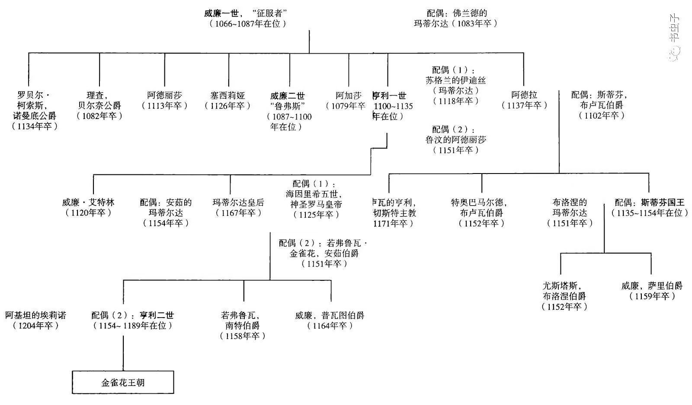

## 金雀花王朝（House of Plantagenet，1154—1485年）

在法国又名**安茹王朝（House of Anjou）**。英国历史上统治时间最长的王朝。

**亨利二世**（英语：Henry II，1133年3月5日—1189年7月6日）是金雀花王朝的首位英格兰国王（1154年10月25日—1189年7月6日在位）、诺曼底公爵（1150年—1189年7月6日在位）、安茹伯爵（1151年—1189年在位）及阿基坦公爵（1152年—1189年7月6日在位）。

“金雀花”，是亨利二世的父亲，安茹伯爵戈德弗鲁瓦五世的绰号，据说他喜欢在帽子上插金雀花做装饰。直到15世纪中期，约克公爵理查将“金雀花”冠为姓氏，此后“金雀花”被作为安茹的戈德弗鲁瓦家族的代名词。

亨利19岁娶了法王路易七世的前妻。亨利从母亲处继承了诺曼底，从父亲处继承了安茹，又得到了阿基坦作为嫁妆。这使他实际上成为法国最大的领主，拥有的领地比法王还广阔。

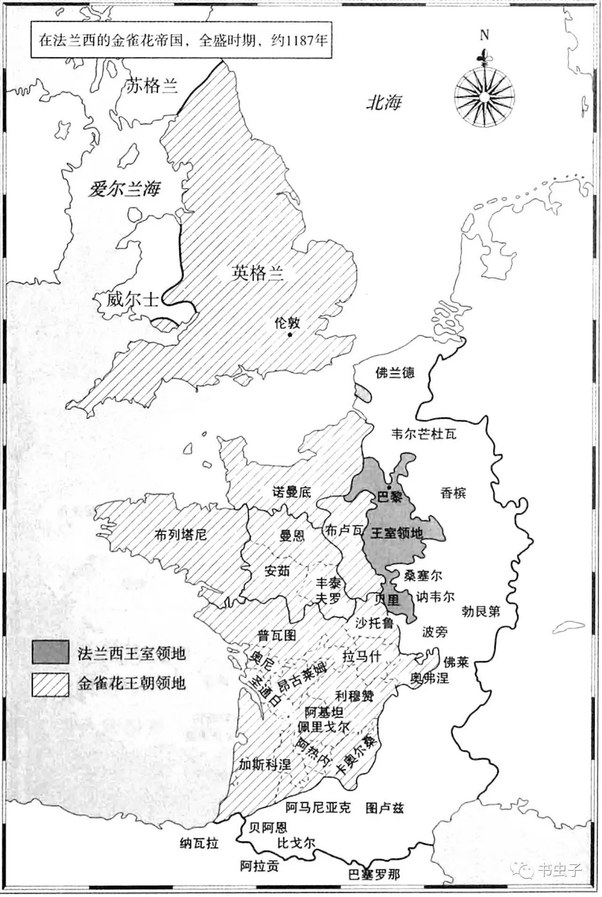

亨利二世即位后很快平定了英格兰国内反对势力，还恢复了对苏格兰和威尔士的统治权。

1164年，亨利二世开始进行司法改革。

1171年，亨利二世成为第一位登陆爱尔兰的英格兰国王。

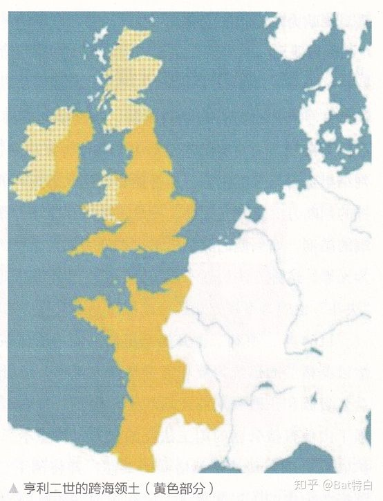

以下是今日的英国和法国。

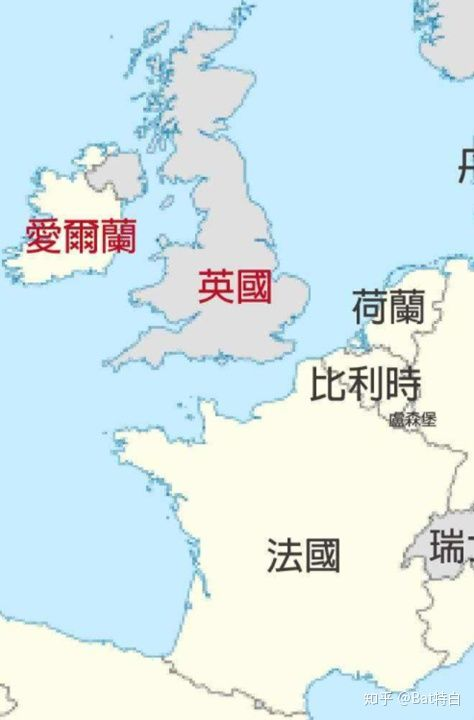

**理查一世**（英语：Richard I，1157年9月8日－1199年4月6日），亨利二世的第三子，金雀花王朝的第二位英格兰国王（1189年7月6日—1199年4月6日在位）。身为天主教教徒，于1190年加入第三次十字军东征，因骁勇善战而被称为“狮心王”。

曾因法王腓力二世唆使，理查与亨利二世于1188年11月决裂。

1189年7月3日，亨利二世与腓力二世谈判，并答应了腓力二世的所有条件。其中就包括确立理查为继承人。

1189年7月6日，亨利二世去世。

1189年9月13日，理查即位，号称理查一世。

1199年3月，理查在战斗中肩中弩箭。1199年4月6日，理查一世因坏疽病逝。

------

**约翰一世**（英语：John I，1166年12月24日—1216年10月19日），亨利二世幼子，理查一世之弟，金雀花王朝的第三位英格兰国王（1199年—1216年在位）。

约翰一世曾受法国国王腓力二世唆使，试图在理查一世被囚禁在神圣罗马帝国期间（1193-1194）密谋叛乱夺取王位，但被击败。

1194年3月，理查一世回到英国，约翰投降并得到赦免。

理查一世无继位子女。他最初以自己的侄子亚瑟为储，后又改以幼弟约翰为储并由他继承了王位。当时诺曼继承法支持约翰，而安茹继承法支持亚瑟。

1200年，约翰一世与法王腓力二世签订领地协议。

1202年，腓力二世撕毁协议进攻约翰一世的领地，并联合亚瑟讨伐约翰一世。

1202年，在米尔博战役中约翰一世俘获其兄之子亚瑟，并将亚瑟之姐埃莉诺软禁至死（1241年）。

1203年4月，被囚禁于鲁昂城堡亚瑟神秘失踪，传统上认为是被约翰一世杀害。

约翰一世在位期间，英格兰王国逐渐失去阿基坦、安茹、缅因、布列塔尼及诺曼底的领地。

1214年，约翰一世联合神圣罗马帝国皇帝向腓力二世进攻，但联军在布汶战役中被法军击败。

1215年6月15日，约翰一世在大封建领主、教士、骑士和城市市民的联合压力下被迫签署**《大宪章》**。由于其主要内容是保障封建贵族和教会的特权及骑士、市民的某些利益，限制王权，部分条例上无法达成一致，导致了第一次诸侯战争（1215—1217）的开启。

1216年10月18日，约翰一世在内战中病逝，九岁的亨利三世即位。新王即位后，后来的法王路易八世支持的这场战事终结。

------

**亨利三世**（英文：Henry III，1207年10月1日－1272年11月16日），约翰一世长子，金雀花王朝的第四位英格兰国王（1216年—1272年在位）。

1258年4月，以亨利三世的妹夫西蒙·德·蒙德福特男爵（孟福尔）的贵族们武装闯宫。

1258年6月，亨利三世被迫在牛津召开了史称“狂暴议会”的大会，被迫同意**《牛津条例》**。条例要求放弃专制王权，由15名大贵族组成委员会，实际掌握国家政权。委员会和另外选出来的12名贵族组成国会，每年开会3次，讨论重大国事。

1258年5月28日，亨利三世与法王路易九世在巴黎签订和约，放弃了在欧洲的大量领土。

1262年，亨利三世在罗马教皇支持下**宣布《牛津条例》无效**，罢免了贵族们提名的最高法官，并将蒙德福特驱逐出国。

1263年，蒙德福特重返英国，法王路易九世进行“调解”，但因单方面偏袒亨利三世，蒙德福特宣布不接受法王的调解，第二次诸侯战争（1263－1264年）爆发。

1264年5月，蒙特福特在刘易斯战役中击败亨利三世的军队，生擒亨利三世及其子爱德华王子，亨利三世被迫交权且以爱德华王子为人质。**蒙特福特**成为英格兰的实际统治者。

1265年1月20日，蒙特福特建立了一个九人委员会，并召开**“西蒙议会”**。议会参加者除了23名贵族代表、120名高级教士外，还有每郡的两位骑士代表和每个自由市的两位市民代表（但是没有国王）。这表明，贵族与市民阶层开始联合对付国王，市民阶层开始登上英国的政治舞台。

1265年，爱德华王子成功逃走。

1265年8月，爱德华王子独自率军与蒙特福特在伊夫舍姆战役交锋获胜，蒙特福特阵亡。亨利三世恢复了权力，他把实权交给了爱德华王子，命其监国。

1272年，亨利三世去世。

金雀花朝在历经约翰和亨利两朝混乱之后爱德华王子即位，是为**爱德华一世**。

------

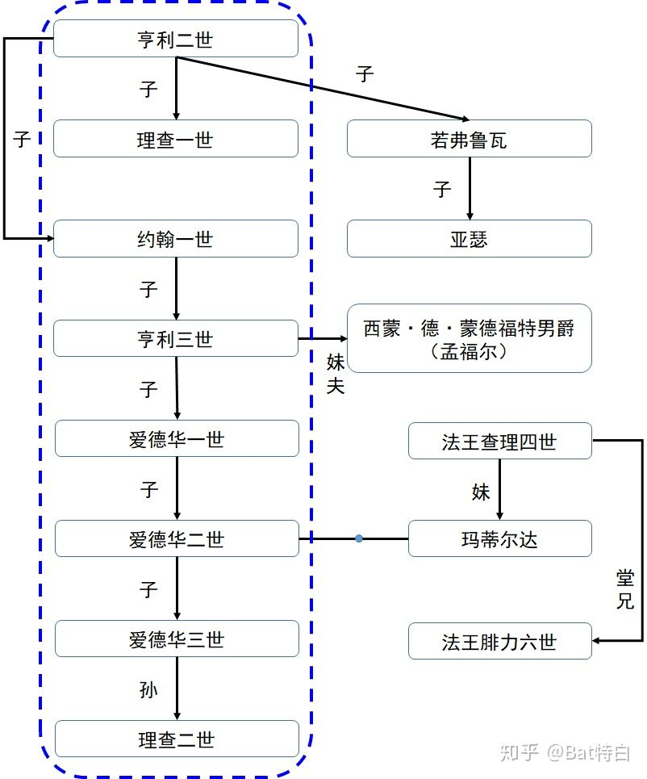

**爱德华一世**（英语：Edward I，1239年6月17日—1307年7月7日），亨利三世长子，金雀花王朝的第五位英格兰国王（1272年—1307年在位），被称作“苏格兰之锤”，金雀花王朝最重要的代表人物之一。他奉行的内外政策都十分积极，使英格兰成为当时欧洲的重要大国。

1268年，爱德华参加法王路易九世率领的第八次十字军东征而去法国。后滞留东方。

1272年亨利三世去世。

1274年，爱德华归国，于1274年8月加冕。

1277年，爱德华一世率军入侵威尔士。

1282年，爱德华一世征服威尔士北部和西部。

1284年，爱德华一世*发布*《罗德兰法令》（Statute of Rhuddlan）确立自己在该地区的统治。

1295年，爱德华一世为筹措军费而模仿“西蒙议会”召开“模范议会”（Model Parliament），总计人数达四百名以上。

1296年，爱德华一世出兵进攻苏格兰。

1301年2月7日，爱德华一世册封其子为威尔士亲王（后来继任为爱德华二世）。此一**将威尔士亲王头衔封给英国君主长子的传统，至今持续实行**。英王室直接统治这块地区，故称之威尔士公国（1284年—1536年）。该公国之外的威尔士东部和南部地区，仍然不受英王管辖。

1305年，爱德华一世捕获苏格兰叛军将领**威廉·华莱士**，并将其处决枭首示众。

（梅尔·吉布森执导，梅尔·吉布森、苏菲·玛索等主演的电影《勇敢的心》即是取材于此。）

1307年，爱德华一世在征讨苏格兰的途中，死于苏格兰边界布鲁夫（Burgh by Sands, Cumberland）。

1297年10月12日，爱德华一世**发布最后一次修订的《大宪章》**，“大宪章”制度得到了最终确定。

------

**爱德华二世**（英文：Edward II，1284年4月25日—1327年9月21日），爱德华一世第四子，金雀花王朝的第六位英格兰国王（1307年—1327年在位），英格兰国王，爱尔兰领主，阿基坦公爵。

1314年，爱德华二世率军进攻苏格兰，惨败。

1315年，苏格兰的罗伯特一世带兵进入英格兰境内，并派其弟爱德华·布鲁斯征服英格兰属地爱尔兰。

1316年，爱德华·布鲁斯宣布为爱尔兰国王。

1323年，爱德华二世**承认罗伯特一世为独立的苏格兰王国的国王**。

爱德华二世的王后为法兰西的伊莎贝拉，她是法王查理四世的妹妹。1325年伊莎贝拉回法国认识了其情人、被爱德华二世放逐的贵族罗杰·莫蒂默（Roger Mortimer）。1326年，伊莎贝拉与莫蒂默率领流亡贵族入侵英格兰。

1327年1月，国会废黜了爱德华二世。王后逼爱德华二世把王位传给他们的儿子爱德华三世，将众叛亲离的爱德华二世关进大牢。

------

**爱德华三世**（英文：Edward III，1312年11月13日—1377年6月21日），爱德华二世之子，金雀花王朝的第七位英格兰国王（1327年—1377年在位），14岁即位，他**开启了百年战争，对法国造成巨大的打击。**

爱德华三世之子冈特的约翰（John of Gaunt，1340—1399）为第一代兰开斯特公爵(Duke of Lancaster)。（兰开斯特家族）

爱德华三世之子兰利的埃德蒙（Edmund of Langley，1341—1402）为第一代约克公爵(Duke of York)。（约克家族）

1328年，法王查理四世去世，其侄子腓力六世继位。

1330年，爱德华三世亲政，下令处死罗杰·莫蒂默并没收其财产。

1333年，爱德华三世击退入侵英格兰的苏格兰国王罗伯特一世。1356年爱德华三世又曾进入苏格兰南部。

1336年，为报复法王腓力六世侵犯在佛兰德（欧洲著名的羊毛纺织业中心）的英国商人，爱德华三世下令禁止向法国出口羊毛。佛兰德的纺织工人希望与英国结盟。

1337年，爱德华三世因是法国卡佩王朝最后一代国王查理四世的外甥而正式自称为法国国王，而且此后直到1801年，每个英国国王也都自称是法国国王。

1337年，**英法百年战争**爆发。

1338年，法王腓力六世宣布没收爱德华三世在法国的一切领地。

1340年，英军在斯吕斯海战中打败法军，英国控制了英吉利海峡，夺得制海权，防止法军渡海入侵。

1346年，爱德华三世在克雷西会战中打败法军。

1347年，爱德华三世攻占法国海防要塞加来港，并准备进军巴黎加冕。

1347年，爱德华三世在内维尔十字之战打败苏格兰入侵，擒获亲法的苏格兰王大卫二世。

1348年，黑死病横扫整个欧洲，两国停战。

1348年，爱德华三世拒绝了竞选神圣罗马帝国皇帝的邀请。

1356年，爱德华三世长子黑太子爱德华率英军进攻法国。

其绰号的来由有二说：一为，因其常穿黑色铠甲，故被称为“黑太子”。二说为，因其对阿奎丹公国洗劫，又在阿奎丹放纵士兵横行不法，故法国人认为他心肠黑，故称之为“黑太子”。然而，不论何说，黑太子之名最早见于16世纪，在其在生之日，并没有这样的称呼。他在世时，通常以其出生地，称他为伍德斯塔克的爱德华(Edward of Woodstock）。

1356年9月19日，黑太子爱德华率军在普瓦捷会战中取得大胜，并俘获了法国国王约翰二世（腓力六世之子）及大批法国贵族。爱德华三世与法国贵族签订《加来条约》。

1359年，爱德华三世再次入侵法国，围攻兰斯，而后更推进到巴黎。

1360年，爱德华三世与法国摄政王太子查理（后为国王查理五世）签署了《布勒丁尼和约》。法王割地赔款。爱德华三世放弃索要法国王位。***英国\*基本取得英法战争第一阶段（1337─1360）胜利**。

1364年，法王约翰二世病逝于英国伦敦狱中。查理五世正式即位，拒绝承认《加来条约》。爱德华三世再次使用法国国王的称号。

1367年，双方介入西班牙内战。1367年4月3日，黑太子爱德华在纳胡拉之战中生擒法国元帅“布列塔尼之鹰”贝特朗·杜·盖克兰，查理五世将其赎回。最终爱德华三世支持的佩德罗一世被亲法的恩里克二世推翻。这也导致西班牙的卡斯蒂利亚成为法国的强力盟友，新的卡斯蒂亚舰队在数年后控制了英吉利海峡。

1369年，查理五世任命贝特朗·杜·盖克兰为法国骑士统帅，向英格兰开战，之后几乎收复全部失地。

1370年，黑太子指挥英军在法国利穆赞省（Limousin）首府利摩日（Limoges）展开大屠杀。

1370年，英国议会分裂为两派，一派奉黑太子为代表，成员主要是平民；一派以其弟冈特的约翰为代表，成员主要是各地贵族。

1374年，英格兰人手中只剩下五个港口，查理五世与英格兰缔结3年停战和约。

1376年6月8日，百年战争第一阶段中英军最著名的指挥官黑太子爱德华逝世。其次子为理查（后为理查二世）。

1377年，查理五世又向英格兰人发动进攻。

**理查二世**（英语：Richard II，1367年1月6日－1400年2月14日），爱德华三世之孙，黑太子之子，金雀花王朝的最后一位英格兰国王（1377年—1399年在位，1399年被废）。

理查二世十岁即位，但是实权被叔父兰开斯特公爵冈特的约翰把持。

1380年，法国已经收回了大部分失地，英军已退守沿海区域。

1380年，法王查理五世去世，查理六世上台。由于英法国王都处于弱龄，两国休战。

理查二世在位期间，英军对法作战连遭失败。

1396年，英法签订二十年停战协定，英法百年战争暂时告一段落，**第二阶段（1369-1380）以\*英国\*失败、法国复兴而告结束。**

1397年，理查二世驱逐了冈特的约翰的长子、自己的堂弟博林布鲁克的亨利。

1399年，理查二世在冈特的约翰去世后没收了兰开斯特家族的领地。

1399年，亨利在理查二世远征爱尔兰时举兵拘捕了国王，并让国会同意将理查废黜，由亨利即位，即亨利四世。由此，**兰开斯特王朝开始。**

1400年，亨利四世杀害了理查二世。

莎士比亚创作了戏剧《理查二世》，首版于1597年。

------

金雀花王朝的正式君王有八位，统治着1154年–1399年的英格兰。1399年理查二世逝世后的英格兰由该朝的两分支系——兰开斯特王朝和约克王朝先后统治，而这两家族因为王位争夺而爆发了15世纪后半叶的玫瑰战争。

### 兰开斯特王朝（House of Lancaster，**1399—1461年）**

**亨利四世**（英语：Henry IV，1367年4月3日—1413年3月20日），名亨利·博林布鲁克（Henry bolinbrook），爱德华三世之孙，兰开斯特王朝的首位英格兰国王（1399年—1413年在位）。

1395年亨利被理查二世驱逐并没收领地。

1399年，起兵征讨理查二世。之后亨利四世通过一系列含混不清的理由宣称自己为英格兰的国王。也为后来的玫瑰战争埋下麻烦。

（威廉·莎士比亚创作了戏剧《亨利四世》，分为上、下篇，首次出版于1598年。）

------

**亨利五世**（英语：Henry V，1386年9月16日/1387年8月9日—1422年8月31日），亨利四世之子，英格兰兰开斯特王朝第二位国王（1413年—1422年在位），妻子为法王查理六世之女。

他是继爱德华三世之后第二位对百年战争作出了巨大贡献的君主，打败并重创法国且成为了法国王位继承人，构建出了“英法帝国”的想法。1420年他几乎攻占了大半个法国。

1409年，他平定威尔士叛乱。

1415年8月，亨利五世趁法王查理六世（1380～1422在位）即位后法国统治阶级发生内讧之机，领兵在诺曼底登陆进攻法国。

1415年10月25日，亨利五世于阿金库尔战役（Battle of Agincourt）大败法军。

1415年10月，亨利五世与勃艮第公爵结盟，占领法国北部，法王查理六世无力抵抗。

1417年8月，亨利五世再次登陆诺曼底。

1419年元月，诺曼底首府鲁昂投降，亨利五世占领诺曼底。

1420年5月21日，亨利五世与查理六世签订《特鲁瓦条约》。英王亨利五世迎娶查理六世之女凯瑟琳公主，成为法国摄政王，有权承继查理六世死后的法国王位，英国统治著以巴黎为中心的法国北部，查理六世的太子则控制着法国南方。

1421年，博热之战爆发。法军与苏格兰援军联手，对英军取得胜利。他们杀死了亨利五世的弟弟、王位继承人克拉伦斯公爵。

1422年，英法的亨利五世和查理六世先后去世，由于亨利五世先去世因此他并没能成为法王。

亨利五世在九年时间内重新统一了英格兰贵族，占领了法兰西。在他当政期间出现了第一次英语标准化运动。

------

**亨利六世**（英语：Henry VI，1421年12月6日—1471年5月21日/22日），亨利五世之子，出生后九个月即位，英格兰兰开斯特王朝最后一位国王（1422年—1461年，1470年—1471年在位），后在玫瑰战争中被篡位的爱德华四世杀害。

1422年，英法的亨利五世和查理六世同年去世。根据亨利五世与查理六世签订的《特鲁瓦条约》，英国人几乎是单方面的宣布亨利六世由于外祖父是去世的法王查理六世而身兼英法两国国王，而法国人大多因查理六世患有精神病而不承认《特鲁瓦条约》有关两国王位继承的条款。

两方新王亨利六世和查理七世为争夺法国王位，再度交火。

1424年，英格兰-勃艮第联军在韦尔讷伊会战中击败法兰西-苏格兰联军，苏格兰援军全军覆没。

**百年战争第三阶段（1415—1424）结束，英格兰打败并重创法国。**

------

**圣女贞德**（法语：Jeanne d'Arc；英语：Joan of Arc，1412年1月6日－1431年5月30日），绰号“奥尔良的少女（法语：La Pucelle d'Orléans；英语：The Maid of Orléans；）”，法国民族英雄，天主教圣人。

1412年1月6日，贞德出生。后自称遇到神迹，告知她要赶走英格兰人，并带领王储至兰斯进行加冕典礼。

1428年10月，英军围攻通往法国南方的要塞奥尔良城。法国人民组成抗英游击队，袭击敌人。对法国来说争夺王位的战争已转变为民族解放战争。

1429年4月27日，法王太子查理授不识字的17岁农村女孩贞德“战争总指挥”衔。

1429年5月8日，贞德挥舞着绣有“耶稣玛利亚”的军旗率法军解被长达209天的奥尔良之围。此后，法国人民抗英运动继续高涨，英军节节败退。

1429年7月，法军收复兰斯，贞德陪同法王太子在兰斯加冕为查理七世（如题图所示）。之后贞德率法军继续往巴黎前进。

1430年5月23日，贞德为勃艮第公国所俘，不久后被交给英格兰。

1431年5月29日上午，贞德被以女巫的罪名，在鲁昂城的广场上被绑在火刑柱上烧死，她的骨灰被投到塞纳河中。

在贞德母亲和法国宗教裁判所首席法官请求下，1452年对她的死刑进行重新*调查*，1456年6月得到最终结论，描述贞德是一个为正义牺牲的圣女，并指出当初主导审判者是为了自身的现实利益而错误的将她定罪。

1920年，贞德被教会封为圣人，5月30日定为圣女贞德的纪念日。

莎士比亚在历史剧《亨利六世第一部》（*Henry VI, Part1*，1592年）中将贞德描绘为妖女。

------

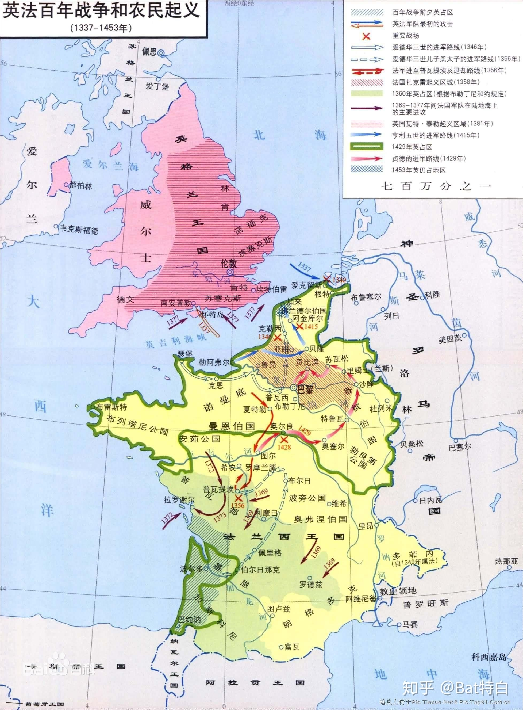图来自百度百科

------

1431年12月，亨利六世在巴黎加冕为法兰西国王。

1435年，勃艮第背弃英王，重新与法联合，法军转入大反攻。

1437年，法军光复首都巴黎。

1450年，法军解放诺曼底，并重创英军。

1453年10月19日波尔多英军投降，法国收复加来之外的全部领土。持续了116年的百年战争（1337—1453）以法军惨胜而结束。

（1558年，法军攻陷加来，英国失去在欧洲大陆最后一个城市，百年战争至此全部结束。）

战争胜利使法国完成民族统一，更为日后在欧洲大陆扩张打下基础。

英格兰几乎丧失所有的法国领地，但也使英格兰的本土意识和民族主义兴起，之后直至今日先前由诺曼底人带来的法国文化渐渐被边缘化，盎格鲁-撒克逊文化成为不列颠的主流。

------

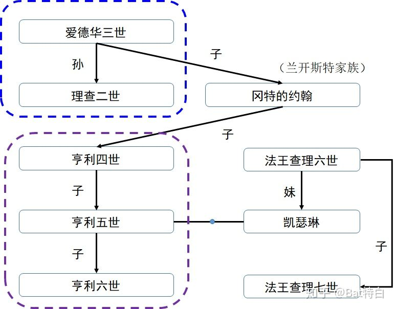

**玫瑰战争（又称蔷薇战争；英语：Wars of the Roses；1455年─1485年）**是英王爱德华三世（1327年-1377年在位）的两支后裔：兰开斯特家族和约克家族的支持者为了争夺英格兰王位而发生断续的内战。

在16世纪，莎士比亚在历史剧《亨利六世》中以两朵玫瑰被拔作为战争开始的标志，后才成为普遍用语。此名称源于两个家族所选的家徽，兰开斯特的红蔷薇和约克的白蔷薇。

当时兰开斯特家族的支持者主要在国家的北部和西部，而约克家族的支持者主要在南部和东部。玫瑰战争所导致了贵族大量伤亡，是贵族封建力量的削弱的主要原因之一，导致了都铎王朝控制下的强大的中央集权君主制的发展。

------

1453年，亨利六世患精神疾病（可能是来自外祖父的隔代遗传），约克家族的首领约克公爵理查·金雀花(Richard Plantagenet，Duke of York）任摄政王。

1455年5月22日，约克公爵理查与亨利六世的部队发生第一次圣奥尔本斯战役，这是内战的第一次公开冲突，兰开斯特家族战败，国王中箭被俘虏，**玫瑰战争**由此开始。

1459年，兰开斯特家族在路孚德桥战役（Batlle of Ludford Bridge）中凭借兵力优势使得约克军屈服。理查逃亡爱尔兰，理查长子人爱德华（后来的爱德华四世）与沃里克伯爵（爱德华的舅舅的儿子）逃亡加来。

1460年，加来的约克派军队卷土重来。

1460年7月10日，在北安普敦战役（Battle of Northampton）中，约克军队在兰开斯特家族的叛军的帮助下，俘虏了亨利六世国王并带往伦敦。随着军事上的胜利，基于兰开斯特家族的非法性，理查提出了对王位的要求。理查的王位要求理由是他的舅舅可能曾被理查二世立为继承人，他的舅舅无子，因此死后继承权归属其姐之子理查·金雀花。而且理查为莱昂内尔的子嗣，而莱昂内尔是冈特的约翰的兄长，理查的继承权应先于兰开斯特家族，

1460年10月，国会给出调解法案，认定理查为亨利六世的王位继任者，剥夺了亨利六世的儿子爱德华王子的继承权。

根据调解法案，理查的长子三月伯爵爱德华成为约克公爵和王位的继承人。安茹的玛格丽特王后和爱德华王子被逐出伦敦。

玛格丽特王后北上到苏格兰寻求帮助。

1460年12月，约克的军队在韦克菲尔德战役(Battle of Wakefield）中惨败，理查在战斗中被杀，其头颅被挂在约克的城门。

------

### 约克王朝（House of York，1461—1485年）

[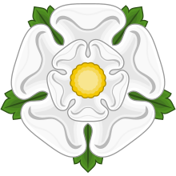](https://zh.wikipedia.org/wiki/File:White_Rose_Badge_of_York.svg)

**爱德华四世**（英语：Edward IV，1442年4月28日—1483年4月9日），英格兰约克王朝首位国王（1461—1470年，1471年—1483年在位）。是约克公爵理查·金雀花之子，爱德华三世第五子兰利的埃德蒙的曾孙。父亲在1460年战死后，他作为约克派首领在1461年即位。

1461年2月2日，爱德华率约克家族军队在赫里福德郡的莫蒂默十字路（Mortimer’s Cross）击败由彭布罗克伯爵欧文·都铎等率领的兰开斯特家族军队。欧文·都铎等许多被俘贵族被残酷处死。

1461年2月2日晨，出现“幻日”景象，天上现出三个太阳——一般是由于空气中的湿度太大，造成的阳光折射效果。爱德华向他的部下们宣布：这天上的三个太阳，就是上帝保佑约克家族的最好证明！因为三个太阳不仅仅基督教中的三位一体，更代表着约克家的三个继承人（目前约克公爵理查·金雀花仅存的男性子嗣三兄弟）：爱德华自己、他弟弟乔治和乔治的弟弟理查（后来的理查三世）。

1461年2月14日，安茹的玛格丽特在第二次圣奥尔本斯战役中一举击败了以善战著称的约克方强大盟友沃里克伯爵。王后赢得了兰开斯特家族最有决定性的胜利，约克家族部队逃离时留下了亨利六世。

沃里克设法与爱德华部队汇合，爱德华胜利进入伦敦城。

1461年2月14日，爱德华在威斯敏斯特即位，成为**约克王朝**的第一位国王（爱德华四世）。

亨利六世和玛格丽特撤到约克郡。

1461年3月29日，爱德华四世的军队与亨利六世的军队决战于陶顿村，超过两万人死于此战。最终爱德华四世在陶顿战役中击败玛格丽特部队，兰开斯特家族几乎遭受灭顶之灾，亨利六世和玛格丽特逃亡苏格兰。

1461年6月，爱德华四世在伦敦正式加冕。

1465年，亨利六世在兰开夏郡被俘，被囚于伦敦塔。

1469年7月11日，乔治娶表兄理查·内维尔，第十六代沃里克伯爵的长女伊莎贝拉·内维尔为妻。

1470年，沃里克伯爵与他的女婿、爱德华四世的弟弟乔治叛变，被打败后逃至法国，与流亡中的王后玛格丽特联盟。

1470年秋，沃里克侵入英格兰，并从伦敦塔内放出亨利六世。爱德华四世被迫逃亡。

1470年10月，亨利六世在伦敦的街上作为复位的国王游行，爱德华四世被宣布为叛国者。

1471年，勃艮第公爵（爱德华的妹妹的丈夫）支持爱德华四世，提供资金和军队发动对英格兰的入侵。乔治倒戈爱德华四世一方。爱德华四世在巴内特战役击败沃里克伯爵，沃里克伯爵阵亡。王后玛格丽特再次登陆，但在丢克斯伯里战役被打败，兰开斯特的王位继承人爱德华王子战死，玛格丽特被俘关在了伦敦塔。

1471年5月14日，亨利六世在伦敦塔内被谋杀，**兰开斯特王朝告终**，约克家族成功夺取王位。

莎士比亚创作了戏剧《亨利六世》，首次出版于1623年。

1471年5月，亨利·都铎被他叔叔贾斯珀·都铎（欧文·都铎之子、亨利六世的同母异父兄弟）保护着流亡法国。

一说1471年爱德华四世的复位为玫瑰战争的结束。

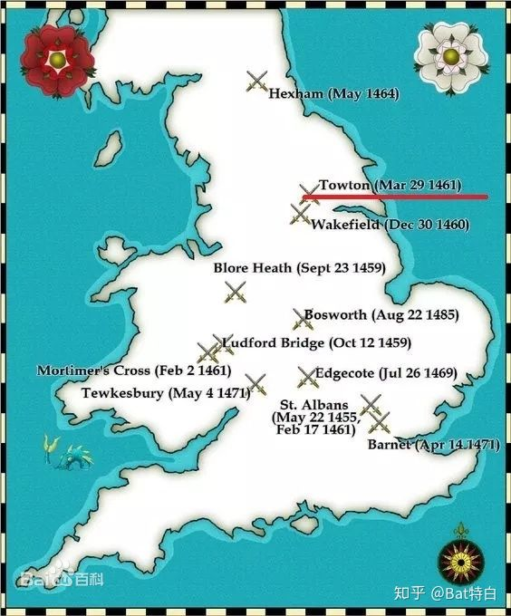图来自百度百科

1475年，爱德华四世打败法国，签下《皮基尼条约》。

1478年2月18日，乔治被控叛国罪后被“秘密处决”，传说他是在马姆齐甜酒瓮中被溺死。

1482年，爱德华四世联合苏格兰的奥尔巴尼公爵亚历山大推翻国王詹姆斯三世，虽然其后詹姆斯三世因爱德华四世与奥尔巴尼公爵亚历山大决裂而复位，但是苏格兰亦无力对抗英国。

1483年，爱德华四世病逝，遗命其弟格洛斯特公爵理查为护国公（lord protector），享有摄政权，扶助只有自己只有十二岁的儿子爱德华五世统治英国。

------

**爱德华五世**（英语：Edward V，1470年11月4日—约1483年），爱德华四世长子，英格兰约克王朝第二位国王（1483年在位），在他父亲死后即位为英国国王。

1483年6月，他们的叔父护国公格洛斯特公爵理查安排爱德华五世与他的弟弟约克公爵理查搬入伦敦塔皇家住所。不到一年，二人就神秘失踪。传说是被其叔理查杀害。

（英国女作家约瑟芬·铁伊关于此事曾写过一本著名的历史推理小说《**时间的女儿**》。）

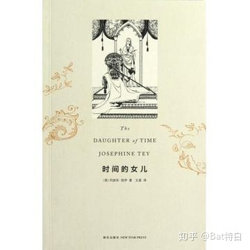

------

**理查三世**（英语：Richard III，1452年10月2日—1485年8月22日），爱德华四世之弟，英格兰约克王朝最后一位国王（1483年—1485年在位）。

1483年6月22日，理查的一名代表在圣保罗大教堂外宣读了一份声明，称爱德华四世与伊丽莎白‧伍德维尔的婚姻不合法，导致婚姻无效，他们的孩子便自动失去了王位继承权。宣言随即被议会通过，并订立了王权法案以正式宣布两个小王子失去继承权，英王头衔继位者属于理查。

1483年7月6日，理查三世在西敏寺加冕成为英格兰王。

1483年，里士满伯爵亨利‧都铎叛乱。

1485年，亨利‧都铎再次叛乱。

1485年8月22日，理查三世在和亨利·都铎的博斯沃思战役中，因部下威廉·斯坦利叛变而失利，战死沙场。统治了英格兰331年的**金雀花王朝灭亡**。

莎士比亚于1591年创作了戏剧《理查三世》。

------

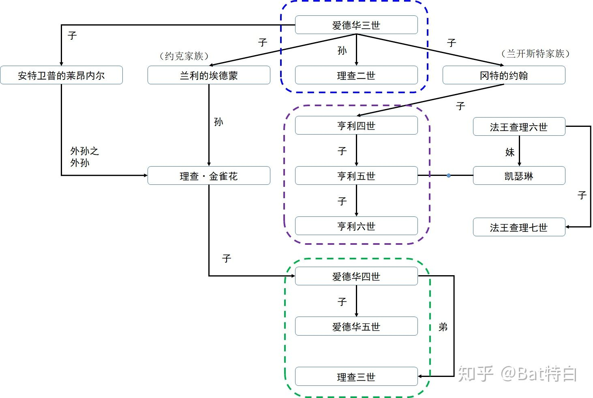

## 都铎王朝（Tudor dynasty，1485年—1603年）

[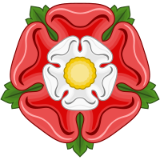](https://zh.wikipedia.org/wiki/File:Tudor_Rose.svg)

**亨利七世**（英语：Henry VII，1457年1月28日—1509年4月21日），本名亨利·都铎，是都铎王朝的首位英格兰国王（1485年8月22日—1509年4月21日在位）。

里士满伯爵亨利·都铎为里奇蒙第一伯爵埃德蒙·都铎之子在法国布列塔尼流亡长大。

而埃德蒙·都铎及贾斯珀·都铎是亨利五世遗孀凯瑟琳与第二任丈夫欧文·都铎之子，即亨利六世的同母异父兄弟。

亨利·都铎之母玛格利特·博福特（Margaret Beaufort）是约翰·博福特的孙女。而约翰·博福特是第一代兰开斯特公爵冈特的约翰和情妇凯瑟琳·斯温福德的私生子。

冈特的约翰和凯瑟琳在约翰·博福特25岁的时候正式结婚，他们的子女（博福特家族）都合法化，但合法化的条件是他们的后裔不能继承王位。

1485年，亨利·都铎宣布自己是兰开斯特王室的王位继承人。

1485年8月1日，亨利·都铎在法国国王查理八世的资助下，自法国出发。

1485年8月22日，亨利·都铎在博斯沃思战役（The Battle of Bosworth Field）中击败理查三世，理查三世战死。

1485年10月30日，亨利·都铎在伦敦的威斯敏斯特大教堂举行了加冕典礼，成为英国国王，是为亨利七世，开创了英国历史上的**都铎王朝**。

1486年1月18日，在伦敦的威斯敏斯特大教堂，亨利七世同约克王朝爱德华四世之女伊丽莎白举行了结婚典礼。亨利七世宣布约克和兰开斯特两大家族合并，平息了对其继位权的争论，亦**结束了长达三十年的蔷薇战争（玫瑰战争）**。并将兰开斯特的红玫瑰和约克的白玫瑰合并组成都铎王朝的王徽，红白“都铎玫瑰”（题图）。

1491年，约克家族的男性绝嗣。

1501年，亨利七世为长子亚瑟聘娶西班牙的公主阿拉贡的凯瑟琳。

1502年，亚瑟婚后四个月猝死。为继续保有与西班牙之间以联姻方式获得的友好关系，亨利七世说服凯瑟琳留下，并为凯瑟琳与次子亨利（后来的亨利八世）订婚。

1505年，亨利七世不想继续与西班牙联盟，于是次子亨利宣布自己并不同意与凯瑟琳的婚约，西班牙为此同英国进行外交斡旋，婚约才未解除。

1509年4月21日，亨利七世去世。

其女玛格丽特·都铎公主嫁给苏格兰国王詹姆斯四世，改善了与苏格兰的关系。

其女玛丽·都铎公主嫁给法王路易十二，路易十二死后改嫁查尔斯·布兰登公爵。

亨利七世进行了大量政治、司法军事、财政、经济、外交策略等方面的改革，在英国有贤王之称。

都铎王朝后，除查理一世外，所有的王后都不再是法国人，国王和所有官方文字记录全部使用英语。英国王室的法国血统不断稀释，除了查理二世和詹姆斯一世再也没有任何法国血统过半的英国国王。

------

**亨利八世**（英文：Henry Ⅷ，1491年6月28日—1547年1月28日），亨利七世与伊丽莎白王后的次子，都铎王朝第二位英格兰国王（1509年4月22日—1547年1月28日在位）及首位爱尔兰国王（1541年—1547年1月28日在位）。

1509年6月11日，亨利和其兄遗孀凯瑟琳正式举行结婚典礼。

1509年6月24日，亨利在伦敦的西敏寺举行加冕仪式，继承王位，是为亨利八世。

1511年11月，亨利八世正式同神圣罗马帝国结盟，向法国宣战。

1513年6月，亨利八世以保护教皇为名，联合西班牙对法国开战，这是百年战争结束六十年来，英国军队第一次踏足法国领土。

1513年秋季，亨利八世载誉而归。

1513年9月，在弗洛登战役中击败法国盟友苏格兰，斩杀其国王詹姆斯四世。

1516年2月18日，玛丽·都铎出生，她就是日后被称为“血腥玛丽”的玛丽一世，这是凯瑟琳王后惟一幸存的孩子。

1516年，托马斯·莫尔用拉丁语写成《乌托邦》。

约在1513年至1518年间，托马斯·莫尔用英文和拉丁文写了《国王理查三世本纪》，这是英国历史学的第一篇名著。其中描述了也是在文献上首次正式出现理查三世杀侄的说法。

1522年，刚刚即位的神圣罗马皇帝查理五世，以联姻之约使得亨利八世再度向法国开战。

1525年，亨利八世认定凯瑟琳不能为他生下男性继承人，并且和女侍官安妮·博林（又称安·波林）发生婚外情，亨利八世要求离婚，与罗马教皇开始产生矛盾。

亨利八世和其幼妹玛丽·都铎公主（不是他女儿）的关系于16世纪20年代末趋于紧张，因为玛丽·都铎公主与凯瑟琳相识多年，她反对亨利八世废除与凯瑟琳的婚事，而且她对安妮·博林深恶痛绝。

1525年2月，查理五世的军队在意大利北部的帕维亚战役中击败法军，俘虏法王弗朗索瓦一世。

1526年，查理五世单独同法国缔结和约，结束战争状态，断然拒绝了亨利八世继续战争的要求，并背弃了与亨利八世长女玛丽·都铎公主的婚约。

1533年，亨利八世因与安妮·博林秘密结婚而被罗马教皇驱逐出教。

1533年，亨利八世提拔改革派的教士托马斯·克兰麦（Thomas Cranmer）为坎特伯雷大主教，领导英国教会。

1533年，大主教克兰麦宣布亨利八世与凯瑟琳的婚姻无效，与安妮·博林的婚姻合法。

1533年6月1日，安妮·博林加冕为英格兰王后。凯瑟琳被褫夺王后的称号，并被幽禁在一个下等庄园里。玛丽·都铎也因此被贬为私生女，不被允许和母亲见面。

1533年9月，安妮·博林生下女儿伊丽莎白，也就是后来的“童贞女王”伊丽莎白一世。

1535年7月6日，托马斯·莫尔被亨利八世处死。1886年，托马斯·莫尔被罗马天主教会册封为圣人。

1536年5月19日，安妮·博林被亨利八世指控通奸而被斩首。亨利八世宣告自己和安妮·博林的婚姻无效。

------

1543年英法重新开战，亨利八世为了打击法国航运，颁发大批私掠许可证，英国海盗四面出击，奉旨打劫。

1544年，英法再次开战。法国集结200艘战舰搭载3万陆军入侵英国，亨利八世的海军在斯比海德一战中小挫法军，迫其无功而返。

------

亨利八世在位期间，推行宗教改革，使英国教会脱离罗马教廷，自己成为英格兰最高宗教领袖。

亨利最初使用的头衔是“蒙上帝恩典，英格兰和法国国王，爱尔兰领主亨利八世”。

1521年，由于亨利八世撰文攻击马丁·路德，护卫罗马天主教廷，教皇利奥十世赐封亨利“信仰的守护者”正式头衔。英国脱离罗马教廷后，保罗三世撤回了封赐，但国会法案宣布这一头衔仍然有效。

1535年，亨利八世在王室头衔中增加了王权至高的语句，即“英格兰教会之首”，1536年进一步改为“英格兰和爱尔兰教会之首”。

1541年，亨利八世让爱尔兰国会将“爱尔兰领主”头衔改为“爱尔兰国王”。此后直至去世，他的头衔一直是“蒙上帝恩典，英格兰、法国和爱尔兰国王，信仰的守护者，英格兰和爱尔兰教会之首亨利八世”。

------

1542年，亨利八世发动对苏格兰的战争。

1543年7月1日，英格兰和苏格兰的代表在格林威治签署《格林威治条约》，规定玛丽·斯图亚特10岁后将前往英格兰，直到她与爱德华六世完婚，他们的继承人将继承英格兰王国和苏格兰王国的王位。《格林威治条约》最终在1543年12月11日被苏格兰议会否决。由此引发了长达数年的战争。

1544年，英格兰军队火烧爱丁堡。

1545年2月，英格兰军队在安克拉姆沼泽被打败。

1547年，英格兰军队在平克战役中大胜苏格兰人，其时玛丽·斯图亚特不足5岁。

1549年，英法签订条约，在苏格兰的战争结束。

------

1543年，亨利八世娶在宫廷任职的新教拥护者凯瑟琳·帕尔为他的第六任妻子。

1544年，亨利八世在凯瑟琳·帕尔的劝解下和两个女儿玛丽、伊丽莎白和解，他通过第三次继承法案，重新赋予玛丽和伊丽莎白王位继承权，位置在爱德华王子之后。但两人仍然是法律上的私生女。凯瑟琳·帕尔将亨利八世的孩子玛丽、伊丽莎白和爱德华照顾得很好，让他们受到了良好的教育，也影响了他们对新教改革的看法。

1547年1月28日，亨利八世病逝。

------

**爱德华六世**（英语：Edward VI，1537年10月12日—1553年7月6日），亨利八世和与第三任妻子珍·西摩之子，名叫爱德华·都铎，是都铎王朝的第三位英格兰国王及第二位爱尔兰国王（1547年1月28日—1553年7月6日在位）。他也是英格兰首位信奉新教的统治者。

爱德华六世于1547年1月28日即位，同年2月20日加冕，时不满十岁。

爱德华六世坚持进行新教改革。

1552年5月，《四十二条信纲》拟成，概括性地全面阐发了英国教会的信仰原则，从教义上肯定了国教的地位。

1553年，爱德华六世与议会拟定了“继承案”，试图阻止国家再度落入天主教势力，任命简·格雷为王位继承人，将他同父异母的姐姐玛丽和伊丽莎白都排除在外。然而，此举引发极大争议。

1553年7月6日，男孩国王爱德华六世病逝，年仅16岁。

------

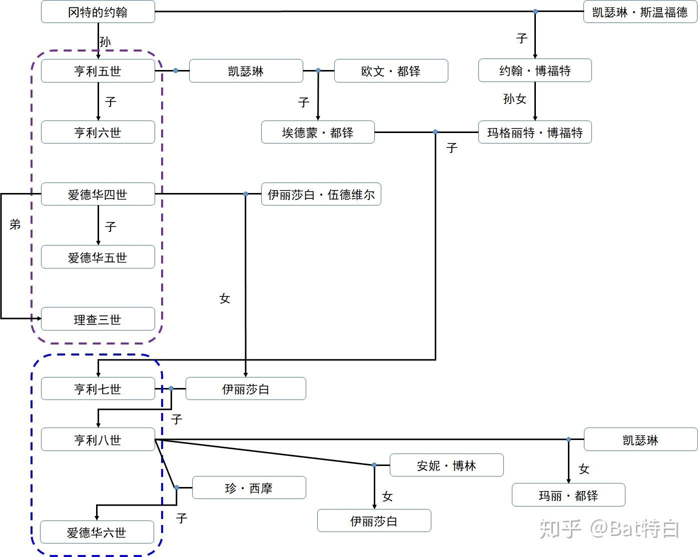

------

下一篇将出现四位“女王”，很长。

**简·格雷**（英文：Lady Jane Grey，1537年10月12日—1554年2月12日），都铎王朝的第四位英格兰国王及第三位爱尔兰国王（1553年7月6日—7月19日在位），本身只是一个喜欢读书的女子，称“十三日女王”、“九日女王”，英国历史上首位被废黜的女王。

简·格雷是萨福克公爵亨利·格雷的长女，其母弗朗西斯·布兰登是玛丽·都铎公主与查尔斯·布兰登公爵之女。玛丽·都铎公主与凯瑟琳相识多年，她反对亨利八世废除与凯瑟琳的婚事，而且她对安妮·博林深恶痛绝。

简·格雷与爱德华六世同日出生。其父将其命名为“Jane”，表示向爱德华六世之母、王后珍·西摩（Jane Seymour）致敬。

1546年，9岁的简被送到亨利八世的最后一任妻子凯瑟琳·帕尔的宫中受她监护，学习社交礼仪。

不久亨利八世驾崩，爱德华六世继位。

托马斯·西摩，珍·西摩王后的弟弟，爱德华六世继位后任护国主。1547年他与亨利八世的遗孀凯瑟琳·帕尔结婚。1548年9月凯瑟琳死后，他企图娶亨利八世的女儿伊丽莎白公主（后为女王伊丽莎白一世）为妻，并向简·格雷的父母买下了简·格雷的监护权，希望让爱德华六世和简·格雷结婚。1549年，他以谋反罪的罪名被处死，史称“西摩事件”。

西摩事件后，沃里克伯爵约翰·达德利得势，他即后来的诺森伯兰公爵。他让其子吉尔福德·达德利与简·格雷结婚，密谋让简·格雷成为爱德华六世的继承人。

1553年5月25日，简·格雷与吉尔福德·达德利举行婚礼。

诺森伯兰公爵试图说服爱德华六世指定简·格雷作为他的王位继承人，枢密院不甚同意但畏其威势。

1553年7月6日，爱德华六世去世，简·格雷声明她是女王。

1553年7月7日，简·格雷搬进伦敦塔，正式公布她为女王。

一般认为简是被迫接受的王位（受两家父母操控），并且遵从了议会的意见，在加冕礼上拒绝把她丈夫封为国王，而是封为克拉伦斯公爵。

诺森伯兰公爵之后立即搜捕监禁玛丽公主（后来的玛丽一世），以防她聚集她的支持者。玛丽公主在确认爱德华六世已死之后，马上从休斯敦的住所逃到了东盎格利亚，聚揽支持者。

诺森伯兰公爵率军前往镇压，在他离开期间，枢密院从支持简·格雷转向支持玛丽公主。

1553年7月19日，枢密院废黜了简·格雷的王位并宣布玛丽公主为合法的王位继承人。

1553年7月20日，诺森伯兰公爵被捕，简·格雷的父母丢下女儿和女婿出逃。简·格雷被监禁在伦敦塔中狱卒的房间，她丈夫被监禁在波尚塔。

1553年8月3号，新女王玛丽一世进入伦敦，诺森伯兰公爵为了活命而放弃新教的信仰，向玛丽一世求饶，但还是在1553年8月23日被砍头。

1553年9月，议会宣布玛丽一世为女王，公开指责简·格雷是篡位者。

玛丽一世在伦敦塔内与简·格雷共同进餐时劝说简·格雷放弃新教信仰，被简·格雷拒绝。此后不久，简·格雷的父亲萨福克公爵被发现参与一个以简·格雷之名反对玛丽一世的叛逆组织，简·格雷和丈夫被判死刑。

1554年2月12日，简·格雷的丈夫首先在伦敦塔外被处决，随后她在塔里被秘密处死，时年16岁。

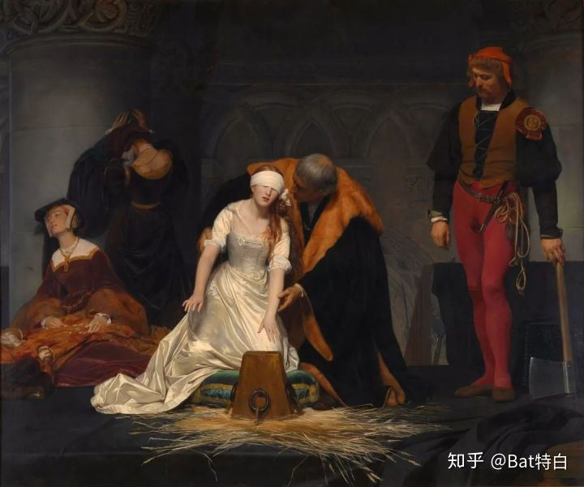《简·格雷的处刑》（The Execution of Lady Jane Grey），法国著名的学院派画家H·保罗·德拉罗什 （Hippolyte-Paul Delaroche）所创作的油画，现藏于英国国家美术馆。

------

简·格雷的继位存在争议。有人认为是爱德华六世尚未成年，其遗嘱不具备法律效力，因此还应该按照亨利八世定下的王位继承顺序，方是正统；而且作为王位继承人，不知名的简·格雷的出现过于突兀。因此，有人认为她不是英国历史上第一位女王，玛丽一世才是。

根据1544年3月23日的《第三次继承法》规定，继承顺位如下：

\1. 威尔士亲王爱德华（爱德华六世）。

\2. 玛丽一世，英格兰公主。

\3. 伊丽莎白一世，英格兰公主。

\4. 弗朗西丝·布兰登夫人，亨利八世的妹妹玛丽·都铎和查尔斯·布兰登的长女，简·格雷的母亲。

\5. 简·格雷夫人。

\6. 凯瑟琳·格雷夫人，简·格雷的妹妹。

\7. 玛丽·格雷夫人，简·格雷的幼妹。

\8. 埃莉诺·布兰登夫人，弗朗西丝·布兰登夫人的妹妹。

\9. 玛格丽特·克利福德，埃莉诺·布兰登的女儿。

简·格雷登基的日期在历史上也是有争议的；有人认为她是1553年7月6日英王爱德华六世逝世当日成为女王的，按这个说法她也被称为“十三日女王”；但根据英国皇室官方网页上显示，她是在7月10日正式成为女王的，在这一天她的继位被公布。按这种说法她是一位“九日女王”。

------

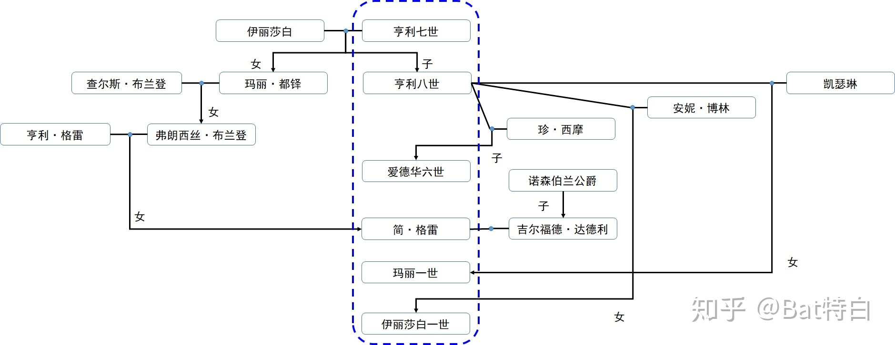

------

**玛丽一世**（英文：Mary I，1516年2月18日－1558年11月17日），亨利八世与凯瑟琳王后之女，都铎王朝的第五位英格兰国王及第四位爱尔兰国王（1553年7月－1558年11月17日在位）。

玛丽一世是亨利八世与凯瑟琳王后之女，也是凯瑟琳王后唯一幸存的孩子。

1533年，亨利八世与安妮·博林秘密结婚。

1533年，大主教克兰麦宣布亨利八世与凯瑟琳的婚姻无效，与安妮·博林的婚姻合法。

1533年6月1日，安妮·博林加冕为英格兰王后。凯瑟琳被褫夺王后的称号并被幽禁。玛丽·都铎也因此被贬为私生女，不被允许和母亲见面。

1533年12月，玛丽被命令成为同父异母妹妹伊丽莎白的女侍官。

玛丽与安妮·博林矛盾重重，与伊丽莎白关系也不甚好。

玛丽后被驱逐出宫并软禁，被剥夺了一切称号，她与父亲和亨利八世的关系也日益恶化。

1536年5月19日安妮·博林被斩首。亨利八世宣告自己和安妮·博林的婚姻无效。

1536年凯瑟琳病故之后，父亲亨利八世一直不批准玛丽出席葬礼。

1537年，王子爱德华（后来的爱德华六世）出生，其生母珍·西摩产后不久死去。由于玛丽答允当爱德华的教母，并出席及协助主持爱德华生母珍·西摩的丧礼，亨利八世便将玛丽召回皇宫内居住，并且重新赐给她仆人。

1544年，亨利八世在凯瑟琳·帕尔的劝解下通过了第三次继承法案，重新赋予玛丽和伊丽莎白王位继承权，位置在爱德华王子之后。

1547年1月28日，亨利八世病逝。

1553年7月6日，爱德华六世去世，简·格雷声明她是女王。诺森伯兰公爵搜捕监禁玛丽公主，玛丽公主逃亡。（至此为止，其实她的早年生活都是悲惨压抑的。）

1553年7月19日，枢密院废黜了简·格雷的王位并宣布玛丽公主为合法的王位继承人。

1553年9月，议会宣布玛丽一世为女王，公开指责简·格雷是篡位者。

1553年10月1日，玛丽一世正式加冕成为英格兰的女王。

1553年10月，玛丽一世在第一次议会中宣布亨利八世与凯瑟琳的婚姻是有效的，并且废止爱德华六世的宗教法案。教会教义恢复到1539年的状态，

玛丽加冕后，为了避免王位落入其信奉新教的妹妹伊丽莎白手中，她同意了与表侄、神圣罗马帝国国王查理五世的儿子西班牙王子腓力（后来的腓力二世）的婚事。

1554年7月23日，两人首次见面，两天后便举行婚礼。腓力二世与玛丽均为天主教徒，他们共同对各自国内的新教徒实行恐怖政策。

1558年1月，法国占领英国加来，英国失去在欧洲大陆最后一个城市，**百年战争**至此全部结束。

1558年11月17日，玛丽一世逝世，无嗣。她的同父异母妹妹伊丽莎白继位，是为伊丽莎白一世。

玛丽一世是极其虔诚的天主教徒，即位后在英格兰复辟罗马天主教（旧教），取代她父亲亨利八世和弟弟爱德华六世提倡的英国新教。

在她统治的5年内，曾烧死约300名新教人士，包括那个敢于宣布她父母的婚姻为无效、她为私生女的克兰麦大主教等。于是玛丽一世被称为“**血腥玛丽**”（Bloody Mary）。后来，Bloody Mary在英语中就成了女巫的同义词。

玛丽一世死后，她的宗教政策在很大程度上被她的继任者伊丽莎白一世所颠倒。

虽然玛丽一世早已表明希望下葬于其母亲凯瑟琳的墓旁，但是，1558年12月14日，她被埋于西敏寺的一个墓内，伊丽莎白一世死后亦同葬于此墓。

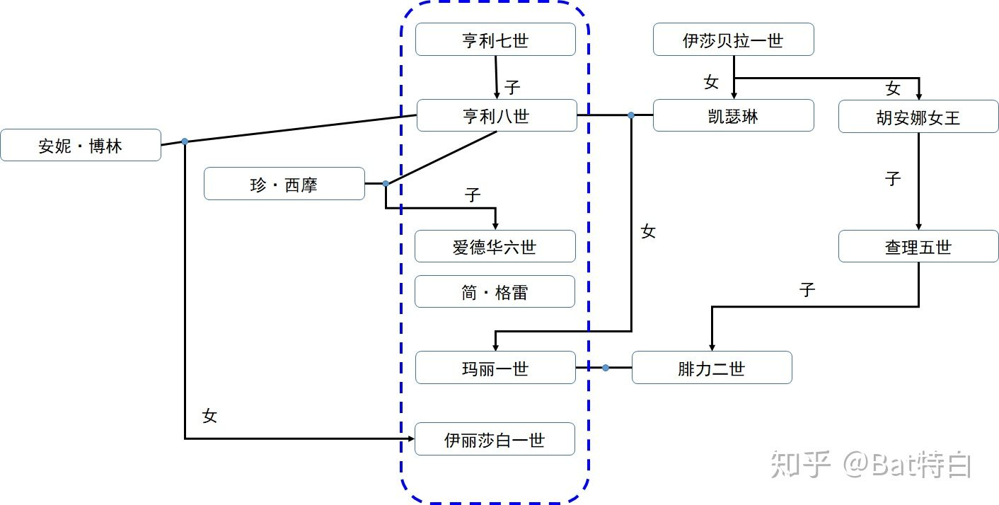

------

**伊丽莎白一世**（英文：Elizabeth I，1533年9月7日-1603年3月24日），亨利八世和他的第二任妻子安妮·博林之女，名叫伊丽莎白·都铎，是都铎王朝的最后一位英格兰及爱尔兰女王（1558年11月17日－1603年3月24日在位），也是名义上的法国女王，被称为“童贞女王”、“荣光女王”、“英明女王”、“海盗女王”。

伊丽莎白一世为人谨慎，她的座右铭是“我观看，而且我沉默”。

在伊丽莎白一世近半个世纪的统治期间，英格兰成为了欧洲最强大的国家之一。英格兰文化也在此期间达到了一个顶峰，涌现出了诸如莎士比亚、弗朗西斯·培根等著名人物。英国在北美的殖民地也在此期间开始确立。这段时期在英国历史上被称为“黄金时代”。

伊丽莎白一世统治时期，是英国历史上的重要矛盾转折期：君主专权开始向议会主权转化；在封建经济形态中已萌生出资本主义的幼芽。

------

1536年5月19日安妮·博林被斩首。亨利八世宣告自己和安妮·博林的婚姻无效。

1544年，亨利八世在王后凯瑟琳·帕尔的劝解下通过了第三次继承法案，重新赋予玛丽和伊丽莎白王位继承权，位置在爱德华王子之后。伊丽莎白在凯瑟琳·帕尔和其他教师的影响下成为了一个新教徒。

伊丽莎白的同父异母姐姐玛丽一世曾逼迫她改信天主教。伊丽莎白表面上虽然皈依，但内心仍然是一个新教徒。玛丽一世对此非常不满。

1553年年末，托马斯·怀逸以拥立伊丽莎白之名，发动叛变。虽然伊丽莎白坚持自己没有参与起义，但她仍然被监禁于伦敦塔两个月，随后伊丽莎白被释放，但被软禁在一处庄园中。

1555年4月，伊丽莎白被解除了监禁，奉诏入宫，陪伴自称怀孕的玛丽一世。

1558年3月，由于玛丽一世婚后长期无子，玛丽一世不得不接受伊丽莎白为自己的合法继承人，英国国会重申了亨利八世国王规定伊丽莎白作为继承人的安排。

1558年11月17日，玛丽一世病逝，伊丽莎白继承王位。

1559年1月15日，伊丽莎白正式加冕成为英格兰的女王。

------

伊丽莎白一世即位时，英格兰处于内部因宗教分裂的混乱状态，女王采取了对天主教和新教兼容的政策，成功地保持了英格兰的统一。然而她的宗教兼容政策并没有彻底解决宗教冲突问题，宗教改革极其不彻底。

1559年，伊丽莎白一世颁布新的《至尊法案》，重立英国国教，与罗马教廷决裂，重申英国国王为英国教会最高首领。

她并与争夺其王位的苏格兰女王玛丽·斯图亚特（这又是一个重要的玛丽）进行长期斗争。

**（我很激动，终于到这里了！！！本来其实我就是要写伊丽莎白一世和玛丽·斯图亚特和古典密码术的，结果前面啰里啰嗦写了这么多。）**

1563年，英国国会通过《三十九信条》（Thirty-Nine Articles），最终确立了英国国教。

1570年，伊丽莎白一世被罗马教皇开除教籍。

1587年，枢密院处死玛丽·斯图亚特，从而打击了内外天主教势力的颠覆活动，进一步巩固王权。

在她执政晚期，天主教的复辟势力在英国遭到了沉重的打击，而新教的激进派——代表资产阶级利益的清教徒也同样处于受压抑的状态。资产阶级要求继续深入宗教改革，掀起清教运动（Puritanism）。由于清教运动所倡导的改革破坏伊丽莎白所一直努力维持的和平局面，导致社会动荡，因此遭到伊丽莎白的反对。

1592年，英国国会颁布法令，规定凡是就女王对教会的统治权提出异议，或不上教堂，或参与采用非法崇拜仪式的“秘密集会”者，一律处以流刑法。

------

伊丽莎白一世初期采取使法国和西班牙互相牵制的政策。对法国基本上和解，而与西班牙的冲突来得较晚，却很激烈。

伊丽莎白一世纵容被她自豪地称为“我的海狗”的弗朗西斯·德雷克等英国海盗抢劫西班牙船只和殖民地，1585年又直接派兵援助尼德兰反抗西班牙的统治。

1588年，为了报复伊丽莎白一世对苏格兰女王玛丽·斯图亚特的处决，腓力二世（玛丽一世的丈夫）誓言要入侵英国，并将一名天主教君主取而代之。1588年英国在英吉利海峡击败西班牙无敌舰队并迫使无敌舰队向北航行。无敌舰队在苏格兰附近海域，遭到了使舰队和人员受到严重损害的暴风雨天气。该事件最重要的影响之一是，无敌舰队的失败被视为**上帝支持\*英国\*新教改革的一个标志**。

但在科伦纳·里斯本远征后英国失利连连，而之后西班牙的海上实力明显增强。战争一直延续到1604年，双方打成平手。

1594年，爱尔兰北部的蒂龙伯爵休·奥尼尔等人领导了反抗英国在爱尔兰统治的大起义，**九年战争**（1594-1603年）爆发，伊丽莎白一世调集重兵，进行镇压。最后英军不得不采用焦土政策，制造了一场空前的人为大饥荒。这场战争的残酷性使爱尔兰人对英国人的仇恨、敌对和不信任一直遗传至今。

------

在经济上伊丽莎白一世实行重商主义政策，保护和发展本国毛纺织业和其他新兴工场手工业，特别鼓励造船和航海业，鼓励建立各类海外贸易公司，扩大海外市场，继续鼓励圈地运动。

1585年，英国成立“摩洛哥公司”。1588年，英国成立“几内亚公司”。这些商业集团前往非洲从事不平等的贸易掠夺，乃至贩运黑奴。

1571年，西班牙和威尼斯的联合舰队战胜了奥斯曼土耳其海军，为英国向地中海地区扩张商业提供了有利条件。

1580年，奥斯曼土耳其苏丹穆拉德三世表示愿意与英国通商。1581年，伊丽莎白女王正式向“利凡特公司”颁发贸易专利证书，允许该公司垄断对奥斯曼土耳其的贸易，期限为7年。

1600年，伦敦商人在伊丽莎白女王的支持下成立了著名的“**东印度公司**”，该公司享有对好望角以东的国家特别是印度进行贸易的垄断权。

------

1603年3月24日，伊丽莎白一世去世。

伊丽莎白一世终身未婚，亦无子嗣。英国议会曾多次恳求女王尽早择婿，期望她为王室生养继承人。但是她说：如果她选择了外国王子，他会让英国无法保持中立的外交政策；而嫁给一个英国人会加剧宫廷内的宗派斗争。

本来简·格雷还有两个妹妹凯瑟琳·格雷和玛丽·格雷，她们的王位继承权都优于苏格兰女王玛丽，但也都因为秘密结婚触怒伊丽莎白一世（据说在当时，严格地讲，未经允许的情况下迎娶王室成员属于叛国罪）。

凯瑟琳被关进了伦敦塔，后又转移它处，1568年1月26日病逝，时27岁。由于凯瑟琳的婚姻被废除，她沦为私生子的儿子们不能合法继承王位。伊丽莎白二世女王的母亲是凯瑟琳长子的后裔，凯瑟琳是伊丽莎白二世的十世祖。

1578年4月20日，玛丽·格雷因瘟疫病逝，年33岁，无嗣。

她死后，根据亨利八世的《第三次继承法》，王位主要继承人为亨利八世幼妹玛丽·都铎次女埃莉诺·布兰登的唯一存活子女德比伯爵夫人玛格丽特·斯坦利。

1596年，玛格丽特·克利福德先于英格兰女王伊丽莎白一世去世。因此，她的后代对于英格兰王位继承权的顺位被顺延，而且她生前并没有充分主张对王位的继承权。

于是伊丽莎白一世的去世**结束了都铎王朝**。

------

在伊丽莎白一世的晚年，当她不得不确定她的继承人时，她越来越倾向她的侄孙、被她处死的苏格兰玛丽一世女王的儿子苏格兰王詹姆士（后来的詹姆士一世）。但她从未正式命名他为继承人。**都铎王朝为斯图亚特王朝取代**。

------

英国文艺复兴时期散文家、哲学家，英国唯物主义哲学家，实验科学的创始人，近代归纳法的创始人，“知识就是力量”（Ipsa Scientia Potestas Est）弗朗西斯·培根生于伊丽莎白一世时期，他发明了现在称作“**培根密码**”（Bacon's cipher）的隐写术方法。

------

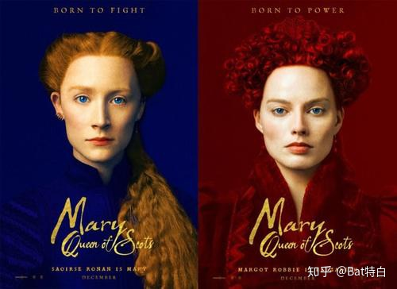2018年电影“Mary Queen of Scots ”的海报

**玛丽·斯图亚特**（1542年12月8日——1587年2月8日），又称**玛丽一世**。苏格兰女王，法国王后，以美貌著称。1567年王位遭废黜，次年起被英格兰女王伊丽莎白一世囚禁达十八年之久。最后以企图谋杀伊丽莎白一世的罪名被处死，时年45岁。

------

1502年，苏格兰斯图亚特王朝第六任国王詹姆斯四世和亨利七世之女玛格丽特·都铎公主结婚，生子詹姆斯五世。

1538年6月18日，苏格兰斯图亚特王朝第七任国王詹姆斯五世和玛丽·德·吉斯在圣安德鲁斯教堂结婚，她们共生了三个孩子，前两个儿子詹姆斯和罗伯特都未活到成年，只有1542年出生的女儿玛丽·斯图亚特继承了他的王位。

在玛丽·斯图亚特出生之后不久，詹姆斯五世去世。玛丽·斯图亚特出生后六天后即位为苏格兰女王。

1543年9月9日，玛丽·斯图亚特在斯特林城堡的王家小礼拜堂加冕为苏格兰女王。

1547年9月10日，苏格兰人在平克战役中惨败。

1548年8月，玛丽·斯图亚特在女王乘船前往法国，其母代为摄政。苏格兰女王在法国宫廷里度过了十年。

1558年4月24日，玛丽·斯图亚特在巴黎圣母院与法王亨利二世之子弗朗索瓦成婚。

1558年11月17日，英王玛丽一世病逝，伊丽莎白继承王位。但是伊丽莎白一世信仰新教，在当时被视为异端。作为将新教定为国教的英格兰来说，伊丽莎白一世是唯一正统王位的继承人。而由欧洲各国对于异教的恐惧以及罗马天主教对于异教徒的排斥，玛丽·斯图亚特对外宣布自己拥有英格兰王位合法继承权。拒绝承认伊丽莎白一世为英格兰女王，并将英格兰王室纹章用于自己的部队。

虽然玛丽·斯图亚特是伊丽莎白一世的表侄女，但是其实玛丽·斯图亚特只比伊丽莎白一世小9岁。

1559年7月10日，亨利二世病故，玛丽·斯图亚特成为了法国王后；她丈夫成为了弗朗索瓦二世。

1560年6月，在苏格兰代玛丽·斯图亚特摄政的母亲玛丽·德·吉斯去世。

1560年12月5日，弗朗索瓦二世去世，时玛丽·斯图亚特年18岁。

1561年8月19日，玛丽·斯图亚特回到苏格兰。博思韦尔伯爵四世詹姆斯·赫博恩出任枢密官。玛丽·斯图亚特之父詹姆斯五世与玛格丽特‧道格拉斯的私生子第一代莫里伯爵詹姆斯·斯图尔特是新教派系的首领。

1561年，玛丽·斯图亚特决定邀请伊丽莎白一世访问苏格兰。

1562年，博思韦尔伯爵因被指控阴谋绑架女王而关入爱丁堡城堡，翌年8月逃出。

1563年，伊丽莎白一世试图劝说玛丽·斯图亚特嫁给新教徒罗伯特·达德利，被玛丽·斯图亚特拒绝。

1565年7月29日，玛丽·斯图亚特与信仰天主教的英格兰人达恩利勋爵亨利·斯图亚特举行婚礼。他是英格兰亨利七世的长女玛格丽特·都铎（也就是玛丽·斯图亚特的祖母）与第二位丈夫的外孙，他是玛丽·斯图亚特的表弟。亨利·斯图亚特违抗伊丽莎白一世的诏令继续待在苏格兰，此后两位女王交恶。

1565年，莫里伯爵因玛丽·斯图亚特成婚而叛乱，后被击败。其间，1564年9月去法国的博思韦尔伯爵应召回国平叛，因忠心耿耿和足智多谋而赢得女王的垂青。

婚后不久，玛丽·斯图亚特怀孕，亨利·斯图亚特要求与她并称“国王”。

1566年3月9日，亨利·斯图亚特因对权力的贪欲而策划了谋杀玛丽女王秘书大卫·里吉奥的行动。这次行动加速了玛丽女王与他婚姻的破裂。

1566年6月19日，玛丽女王产下生命中唯一的孩子詹姆士·斯图亚特，这个孩子后来成为了英格兰和苏格兰共同的国王，也就是不列颠的詹姆士一世。

1566年11月，玛丽·斯图亚特与她的宫廷顾问开始讨论摆脱她的丈夫亨利·斯图亚特的方法，最终他们没有拿出好的方案，因为一旦宣布两人婚姻无效，就会造成对于儿子詹姆士·斯图亚特合法性的质疑。部分贵族希望她以叛国罪之名逮捕亨利·斯图亚特。

1567年2月，亨利·斯图亚特所在的爱丁堡一幢别墅里发生了一次爆炸，爆炸发生后，在花园里发现了已经咽气的亨利·斯图亚特，似乎是被掐死的。

1567年5月15日，玛丽·斯图亚特与枢密官博思韦尔伯爵在爱丁堡圣十字架宫以新教仪式完婚。许多人认为就是这对新婚夫妇联手害死了亨利·斯图亚特。

1567年6月15日，贵族们反对这对夫妇并起兵反叛，并将玛丽·斯图亚特带到爱丁堡囚禁在列文湖城堡，博思韦尔伯爵逃亡丹麦。

1567年7月初，伊丽莎白一世派遣使臣前往苏格兰，坚持由玛丽·斯图亚特复位，同时要求尽快找出杀害亨利·斯图亚特的凶手，且确定了詹姆士·斯图亚特的安全并提出将他带到英格兰进行抚养。事实上玛丽·斯图亚特最后一次见詹姆士·斯图亚特是他十个月大时。苏格兰国内对于英格兰的干预很是反感。

1567年7月24日，玛丽·斯图亚特被迫退位并将王位传给只有一岁大的詹姆士，莫里伯爵任摄政。

1568年5月2日，玛丽·斯图亚特从列文湖逃脱并再一次成功地招募了一支规模不大的军队。伊丽莎白一世听闻此事，亲手写了一封祝贺信给她，并表示愿意提供帮助与支持。

1568年5月13日，玛丽·斯图亚特的军队在兰塞德战役被击败。

1568年5月16日，玛丽·斯图亚特逃往英格兰。

1568年5月19日，玛丽·斯图亚特被伊丽莎白一世的军官囚禁在卡莱尔城堡，在囚禁期间，她说了那句名言：“In my end is my beginning”（我死即我生）。并将这句话镶嵌在她衣服的花边上，时年26岁。

------

虽然玛丽·斯图亚特在软禁过程中过着与她女王身份相符的生活，但她的存在本身对于英格兰伊丽莎白一世的政权而言就是危机，她被英格兰境内外一批狂热的罗马天主教徒视为比伊丽莎白一世更有资格统治英格兰的人，也被反对新教、希望英格兰恢复罗马天主教的反叛者视为灵魂人物。

------

1568年10月至1569年1月间，伊丽莎白一世决定在约克实行关于玛丽是否应该为谋杀亨利·斯图亚特而负责的质询。莫里伯爵詹姆士·斯图尔特最终负责对玛丽进行起诉，他同时也掌管玛丽缺位时的苏格兰。

审判的重心逐渐转移到**“首饰盒信件”（Casket letters）**一事上。

莫顿伯爵四世詹姆斯·道格拉斯在1568年12月作证说，他们抓住了博思韦尔伯爵的仆人乔治·达格利希，博思韦尔伯爵让这个仆人去爱丁顿城堡取信，以使得“事情的根源永远不会暴露”。在1567年6月20日，他们由仆人带领在爱丁堡波特（Potterrow）的一所房屋的床下发现了一个雕有F字样（可能是代表弗朗索瓦二世）的银盒，不足30公分长，在里面发现了据称是玛丽写给博思韦尔伯爵的八封未签名的信、玛丽和博思韦尔伯爵的结婚证明和许多其他文件。据说在信中玛丽督促博思韦尔伯爵尽快杀死亨利·斯图亚特。

玛丽否认写了这些信，并坚持认为它们是伪造的，因为她认为她的笔迹不难模仿。

出于压倒性的政治原因，伊丽莎白女王既不希望指控玛丽皇后谋杀罪，也不想宣布她无罪。因此尽管质询方通过验证笔迹认定首饰盒信件为真迹，但质询方最后得出结论是没有足够的证据证明玛丽是有罪的，审判不了了之。于是莫里伯爵返回苏格兰，玛丽·斯图亚特继续被软禁。

后世诸多历史学家质疑“首饰盒信件”的真实性，但原件已于1584年失传了。

之后玛丽·斯图亚特被伊丽莎白一世囚禁了18年。

1570年，莫里伯爵被暗杀。同时爆发了天主教徒伯爵率领的英格兰北部叛乱，这让伊丽莎白一世感到玛丽·斯图亚特是一个威胁。

1578年，被囚禁在丹麦的博思韦尔伯爵四世詹姆斯·赫博恩去世。

1584年，玛丽·斯图亚特的儿子詹姆士与伊丽莎白一世签订了一项同盟条约，抛弃了母亲。

1587年2月8日，玛丽·斯图亚特于在北安普敦郡佛斯里亨城堡被处极刑，罪名是被怀疑卷入阴谋、**巴宾顿阴谋**、企图刺杀伊丽莎白一世。据说伊丽莎白一世签署死刑令时出于种种原因犹豫再三。行刑当日，玛丽身着红色，表明她是一个天主教殉教者，时年45岁。

**（是的，其实我一开始只想写“巴宾顿阴谋”这么点儿事！）**

------

玛丽·斯图亚特死后被封为圣徒。玛丽最初被埋葬在彼得镇大教堂，1612年，詹姆士一世将其遗体迁葬到威斯敏斯特教堂，她的墓穴和她表姑伊丽莎白一世的只有30英尺（9米）之遥。

德国18世纪著名诗人、哲学家、历史学家和剧作家，德国启蒙文学的代表人物之一，狂飙运动的代表人，被公认为德国文学史上地位仅次于歌德的伟大作家约翰·克里斯托弗·弗里德里希·冯·席勒创作了剧作《玛丽·斯图亚特》（1801年）。

奥地利小说家、诗人、剧作家、传记作家斯蒂芬·茨威格创作了传记《玛丽·斯图亚特》（1935年）。

------

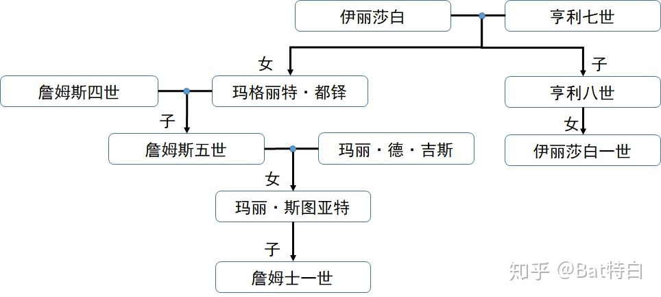

青年安东尼·巴宾顿（Sir Anthony Babington）曾任什鲁斯伯里伯爵（Lord Shrewsbury）的侍从。而什鲁斯伯里伯爵曾负责软禁玛丽。

大约在1580年，巴宾顿被什鲁斯伯里勋爵的秘书、玛丽的亲信托马斯·摩根（Thomas Morgan）说服，负责和玛丽进行秘密通信。

伊丽莎白一世于1584年7月*发布*了一项法令，该法令禁止与玛丽之间的所有来往。

伊丽莎白一世负责安全和情报的大臣弗朗西斯·沃尔辛厄姆（Sir Francis Walsingham）认为该法令有所不妥——这会使得他们找不到能处理掉玛丽的证据。因此，沃尔辛厄姆设法建立一条他能控制的通信渠道。

1585年10月，青年天主教牧师吉尔伯特·吉福德（Gilbert Gifford）在巴黎遇到托马斯·摩根。

1585年12月，吉福德被沃尔辛厄姆逮捕并带到伦敦进行讯问，吉福德同意成为双面间谍。

1586年，玛丽被转移到其他软禁处，并因此暂时中断了巴宾顿与她的联系。

吉福德拜访了法国驻英国大使Chateauneuf男爵，描绘了沃尔辛厄姆的安排。

之后吉福德和狱卒保雷（Paulet）联系了一个当地的酿酒商，将玛丽及其支持者的密信放入啤酒桶塞子内的防水盒中。（这也是一种**隐写术**）

吉福德给了Chateauneuf一个编码表（来自于沃尔辛厄姆），并让Chateauneuf设法将这个表给玛丽。这是一个简单替换密码，包括23个单个字母（j、v、w除外）的符号和35个替换单词或词组的符号，另外还有4个空字符和1个表示其后所接字符为双字母的怪异符号。

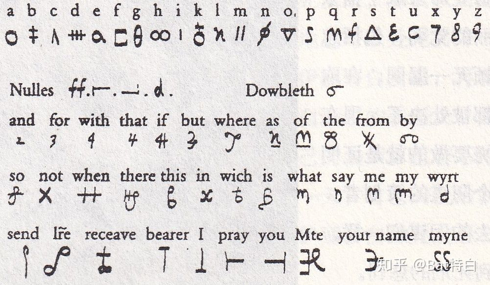来自《密码中的秘密》一书，174页

之后，所有发给玛丽的消息都会先以外交方式发给Chateauneuf，然后Chateauneuf会将它们交给吉福德。吉福德再把它们传给沃尔辛厄姆，后者会把它们交托给沃尔辛厄姆的密码和语言专家托马斯·菲利普斯（Thomas Phelippes）解码并复制。然后，这封信被重新密封并交还给吉福德，后者将其转交给酒商。酿酒商再通过酒桶塞子内的防水盒将这封信交给玛丽（仿佛是偷偷送进来的而没人知道）。

如果玛丽给她的支持者写一封信，那将经历相反的过程。很快，沃尔辛厄姆就截获了所有来往邮件。

巴宾顿和玛丽的秘密通信主要涉及：煽动西班牙入侵英格兰，解救玛丽，以及暗杀伊丽莎白女王。

最后，为了更确凿地“一网打尽”，沃尔辛厄姆指使菲利普斯在玛丽的回信上模仿她的笔迹以密文形式增加了一些内容，要求巴宾顿提供“义士”的名单。

（所以破坏了信件的**完整性**。福尔摩斯在“**跳舞的小人**”一案中也是这么干的——更准确地说，是没有进行**消息认证**。）

------

1586年9月20日，24岁的巴宾顿被绞死。

1587年2月7日，伊丽莎白一世签署了玛丽的死刑执行令。

1587年2月8日，玛丽被斩首处决。

------

以上主要内容来自**万维百科**。

而这其实可以解释我读一些中文书籍和资料中所产生的疑问：

1. 一般称玛丽及其支持者使用了替换密码，但是他们是如何协商好密钥（替换表）的？**第一次协商密钥的秘密通信过程**是如何进行的？
2. 在十六世纪晚期，密码分析学的进展是否已经达到可以让菲利普斯破解如此复杂（特别是里面还涉及空白字符和**单词、短语**）的替换密码？

## 斯图亚特王朝（1603—1649年）

[.svg.png)](https://zh.wikipedia.org/wiki/File:Coat_of_Arms_of_Great_Britain_(1707-1714).svg)

**詹姆斯一世**（英文：James I，1566年6月19日—1625年3月27日），又译詹姆士一世，名詹姆斯·斯图亚特（James Stuart），苏格兰的詹姆斯六世（James VI），斯图亚特王朝的第九位苏格兰国王（1567年—1625年3月27日在位），首位英格兰及爱尔兰国王（1603年3月24日—1625年3月27日在位）。

1603年英格兰女王伊丽莎白一世驾崩，死前将王位传给詹姆斯，他成为英格兰的詹姆斯一世。

1606年，詹姆斯一世下令将两国国旗进行了整合。

该图来自《一读就懂的世界史——英国》，侵删。

1607年，詹姆斯一世成功在北美殖民，完成了伊丽莎白一世的愿望。

1620年，“五月花号”抵达美洲。

当时欧洲正因尼德兰战争与三十年战争不可开交，而詹姆斯一世的外交走的是和平政策，保存了国力。

詹姆斯一世下令编纂英文版的圣经，英文随着这本真正渗透到英国各阶层的读物成为一种真正普遍性的读写文字，英语能成为当今世界最通用的语言亦是奠基于此；其贡献，可与莎士比亚的戏剧并称甚至更伟大。

詹姆斯一世在位期间鼓吹君权神授，与议会经常不愉快，同时也使英国国民非常不满，间接引发了此后1649年（查理一世被处决）与1688年（光荣革命）两次革命。

1625年，詹姆斯一世之子查理一世继位。

------

**查理一世**（英语：Charles I，1600年11月19日—1649年1月30日），又译查尔斯一世。斯图亚特王朝的第十位苏格兰国王、第二位英格兰及爱尔兰国王（1625年3月27日—1649年1月30日在位）。詹姆斯一世和丹麦公主安妮的次子，英国历史上唯一被公开处死的国王，欧洲史上第一个被公开处死的君主。

查理一世与父亲的宠臣白金汉公爵乔治·维利尔斯成为朋友。

（大仲马的小说《三剑客》中“前往英国，从白金汉公爵那里取回王后的钻石”一情节即指此人。）

1628年，白金汉公爵被刺杀身亡。

查理一世和议会有很大矛盾，甚至于在1629年开始关闭议会11年，进行独裁。

1642年，查理一世与议会的英国内战开始。

------

## 共和国时代（1649－1660年）

**奥利弗·克伦威尔**（Oliver Cromwell，1599年4月25日—1658年9月3日），英吉利共和国首位护国主（1649年5月—1658年9月3日在任），英国政治家、军事家、宗教领袖。17世纪英国资产阶级革命中，资产阶级新贵族集团的代表人物、独立派的首领。

1645年，英国议会授权清教徒克伦威尔改组军队，他以铁骑军为基础组成“新模范军”。

1649年1月30日，克伦威尔以议会和军队的名义处死国王查理一世。英国的君主体制随即土崩瓦解。

1649年3月5日，克伦威尔被任命为远征军总司令和爱尔兰总督。

1649年5月，克伦威尔宣布英国为共和国，成为实际军事独裁者。

1649年8月15日，克伦威尔率军登陆都柏林。

1650年7月，克伦威尔远征苏格兰。

1652年5月，爱尔兰全境基本被英军控制。

1653年，克伦威尔驱散议会，自任“护国主”，建立了护国公体制。

1654年，苏格兰被合并于英国。

1653年12月17日，克伦威尔依照政府组织法成为统治英格兰、苏格兰以及爱尔兰的护国主，进行军事独裁统治。

1658年9月3日，克伦威尔因患疟疾在伦敦去世。其长子继承父位，但很快被人民推翻，流亡法国。国会遂声明君主制复辟。

1652年至1654年，克伦威尔执政期间，发生了第一次英荷战争。双方各有胜负。

------

## 斯图亚特王朝复辟（1660－1688年）

**查理二世**（英语：Charles II，1630年5月29日－1685年2月6日），斯图亚特王朝第十一位苏格兰国王（1650年—1685年2月6日在位）、复辟后的首位英格兰及爱尔兰国王（1661年4月—1685年2月6日在位）。查理一世嫡长子，詹姆斯二世同母兄。

1660年查理二世返回英国复辟王位。克伦威尔的遗体被掘出来吊在绞刑架上，然后被斩首示众。

查理二世的弟弟詹姆斯（后来的詹姆斯二世）被查理二世任命为最高海军大臣，他曾在1644年被封为约克公爵。

1664年，荷兰殖民地新阿姆斯特丹被攻克后被改名为**纽约**（新约克），作为对詹姆斯的成果的纪念

由是爆发了1665年至1667年的第二次英荷战争。詹姆斯任皇家海军最高指挥官。英国战败。

1672年爆发法荷战争，英国渴望复仇，遂与法联合，出动海军进攻荷兰，第三次英荷战争开始（1672年至1674年）。法军陆军12万大军势如破竹直逼阿姆斯特丹，荷兰七省失其五。荷兰人终以决溃穆伊登大堤、海水倒灌淹没沃野良田阻止法军前进，并临危授命奥兰治亲王威廉三世（之后与其妻并任英王）为陆海军统帅与荷兰省兼西兰省执政。当时法王“太阳王”路易十四与英王查理二世派查理二世的宠臣白金汉公爵去劝降威廉。威廉三世坚定的答复：“**我的国家是很危险，但是我不会眼睁睁的看着他失败，因为我会战死在联合省的最后一条壕沟里！**”，这句话因此成为他的传世名言。1672年被称作荷兰历史上的“灾难年”（Rampjaar）。

1673年底，法国军队已全被赶出荷兰国土，威廉三世之威信达到顶点，被称为“护国英雄”。他又通过外交手段迫使查理二世中止英法联盟并与荷兰议和，英荷于1674年正式结束第三次英荷战争。

1685年2月6日，查理二世驾崩。他为顺应民心，长期保持英国公教的信仰；但他生前一向同情天主教，临死前就皈依了天主教。

因查理二世去世且没有合法子女，其弟詹姆斯二世继位。

------

**詹姆斯二世**（英语：James II，1633年10月14日—1701年9月16日），斯图亚特王朝第十二位苏格兰国王及复辟后的第二位英格兰及爱尔兰国王（1685年2月6日—1688年12月11日在位），苏格兰的詹姆斯七世。他是最后一位信奉天主教的苏格兰、英格兰及爱尔兰国王。他是查理一世的次子，查理二世的同母弟。

1644年，查理二世的弟弟詹姆斯（后来的詹姆斯二世）被封为约克公爵。英国内战时他被迫逃到荷兰海牙。后又逃亡法国，加入法国军队。

约翰·丘吉尔的姐姐是约克公爵的情妇。1672年，丘吉尔跟随约克公爵参加第三次英荷战争。1673年，丘吉尔参与了法荷战争中路易十四御驾亲征的围攻马斯特里赫特之战，并以个人的英勇博得路易十四的赞赏。

（大仲马笔下的英雄、《三剑客》三部曲的主人公达尔大尼央在三部曲第三部《布拉热洛纳子爵》的结尾殁于此役，他在提升为法兰西元帅的那一刻被城里的最后一炮炸伤身亡。）

后来的英国首相温斯顿·丘吉尔和戴安娜王妃都是约翰·丘吉尔的后裔。

查理二世复辟王位时，詹姆斯随同他一起回到英国。

他被查理二世任命为最高海军大臣，1664年，荷兰殖民地新阿姆斯特丹被攻克后被改名为纽约（新约克），作为对他的成果的纪念。

1668年或1669年詹姆斯转化为罗马天主教徒。查理二世反对詹姆斯皈依天主教，他下令詹姆斯的子女必须按新教培养大。

1673年，得到查理二世允许，詹姆斯娶一名天主教徒为第二任妻子。

詹姆斯和第一任妻子原本只有两个女儿——玛丽（后来的玛丽二世）和安妮（后来的安妮女王）。

1677年11月4日，玛丽嫁于表兄、信奉新教的尼德兰执政威廉（即后来的威廉三世）成婚。

1679年，当取消詹姆斯王位的法令几乎要通过国会时查理宣布解散国会。该法令英国开始形成两党。一个是代表新兴资产阶级和新贵族利益的辉格党（1832年改称自由党）；一个是代表地主阶级和封建贵族利益的托利党（1832年改称保守党）。辉格党是这个法令的党派，而托利党是反对这个法令的党派。

1685年，牛顿发现万有引力定律。

1685年，查理二世逝世，临死前还皈依了天主教，其弟詹姆斯二世继位。

1687年4月，詹姆斯二世*发布*第一号信教自由宣言，目的在于完全的宗教自由。

1688年，詹姆斯二世*发布*第二号信教自由宣言。

英国人对天主教不信任。因此一直寄希望于玛丽继位。

1688年6月10日，詹姆斯二世的王后生下一子，加大了建立一个天主教王朝的危险。

1688年6月30日，一群新教贵族要求玛丽的丈夫尼德兰执政威廉带军进入英国。

1688年11月5日，威廉登陆。

1688年12月11日，詹姆斯二世趁人不备溜出首都，将王国的大印扔进泰晤士河并企图逃往法国。

1689年3月，詹姆斯二世带领一支法国军队在爱尔兰登陆。爱尔兰议会没有随从英国议会而是宣布詹姆斯二世依然是国王。

1690年7月1日，詹姆斯二世在波尼战役中战败，逃亡法国。

1701年，詹姆斯二世因心肌梗死在法国圣日尔曼。

------

## 斯图亚特王朝（1688－1714年）

**威廉三世**（荷兰文：Willem III；英文：William III，1650年11月14日—1702年3月8日），名威廉·亨德里克·范·奥兰治（William Hendrick Van Orange），在苏格兰称作威廉二世（William II）。17世纪荷兰政治家、军事家，奥兰治亲王（终生担任）、尼德兰执政（1672年7月9日—1702年3月8日在任）、英格兰国王（1689年2月13日—1702年3月8日在位）。

**玛丽二世**（英语：Mary II，1662年4月30日—1694年12月28日），英格兰国王（1689年2月13日—1694年12月28日在位），17世纪时英国政治家，荷兰奥兰治王妃（1677年11月4日—1694年12月28日在任）。英国国王詹姆斯二世的长女，荷兰执政兼英国国王威廉三世的妻子和（英国）共治者。

1672荷兰人临危授命奥兰治亲王威廉三世为陆海军统帅与荷兰省兼西兰省执政。当时法王“太阳王”路易十四与英王查理二世派查理二世的宠臣白金汉公爵去劝降威廉。威廉三世坚定的答复：“**我的国家是很危险，但是我不会眼睁睁的看着他失败，因为我会战死在联合省的最后一条壕沟里！**”，这句话因此成为他的传世名言。

1673年底，法国军队已全被赶出荷兰国土，威廉三世之威信达到顶点，被称为“护国英雄”。他又通过外交手段迫使查理二世中止英法联盟并与荷兰议和，英荷于1674年正式结束第三次英荷战争。

1688年6月30日，一群新教贵族要求玛丽的丈夫尼德兰执政威廉带军进入英国。

此时法王路易十四彻底激怒荷兰商人。

1688年9月29日，荷兰商人通过秘密的省务和国务会议全力支援威廉的扩军与出兵英国。

1688年11月，威廉亲率大军渡过英吉利海峡。

本来在威廉的船舰登陆英国前，英国海军一直要出动阻截荷兰船队；但是迎面括来的强大逆风，把英国船舰困在港口中，只能眼睁睁看着威廉的船队顺风登陆。许多英国人认为是百年前伊丽莎白一世女王打败西班牙无敌舰队的神风再临，因此狂热地咏赞“新教神风”，相信威廉的到来是上帝降下的神迹。

1688年11月5日，威廉登陆。虽然詹姆斯二世任命约翰·丘吉尔率领英军在陆上迎击威廉；但约翰·丘吉尔倒戈。之后所有新教军官都叛变。

1688年12月11日，詹姆斯二世趁人不备溜出首都，将王国的大印扔进泰晤士河并企图逃往法国。

1688年12月，威廉兵不血刃进入伦敦。

这场英国资产阶级和新贵族发动的、防止天主教复辟革命没有发生流血冲突，因此史称“光荣革命”。

1689年2月12日，威廉组织召集召开“惯例议会”（惯例议会一般在王位空缺的时候召开，比如内战后将王位授予查理二世的就是一个惯例议会）。惯例议会申明詹姆斯二世于12月11日逃离伦敦时已自动放弃王位，因此目前王位空缺（会议没有将王位授予詹姆斯二世的儿子）。会议决定立詹姆斯二世的女儿玛丽为女王，她与她的丈夫威廉三世共同统治英国，称威廉三世和玛丽二世。威廉三世成为“尼德兰执政兼任英格兰国王”，这是英荷两国在历史上第一次被划到了同一人的名下，形成共主邦联。同年4月11日苏格兰的议会通过了同样的决议。同时议会向威廉提出《权利宣言》，其主要内容是国王未经议会同意不能停止任何法律的效力，不经议会同意不能征收赋税等。

1689年10月，经议会正式批准通过了《权利法案》，确立了议会所拥有的权力高于王权的原则，标志着君主立宪制开始在英国建立。

威廉三世一生主要精力，都在同当时欧洲权势最大的人物“太阳王”法王路易十四做斗争。他争取英国王位的主要目的，也是为了动用英国的人物力去打击法国。

1689年，威廉三世与神圣罗马帝国签订《维也纳条约》并对法宣战。

原本英国议会仍对参加反法战争持有疑虑，但是当法王路易十四决定武力支援被废的詹姆斯二世，助其重夺王冠的消息于1689年中传来之后，英格兰议会了解已无法置身事外，于是批准英国加入反法同盟，称为欧洲“大同盟”。

1689年，身为威廉重要秘书的英国哲学家约翰·洛克发表修改后的《政府论》，破除民众对君权神授的迷思，并大力为光荣革命辩护，提出人民有权推翻政府的社会契约论，最终在思想舆论上确立了威廉的王位。

1689年，威廉颁布了宗教和解的《宽容法案》，保障了非国教徒的合法权利，以及天主教徒的部分权利，大大消解了1660年查理二世复辟以来，主流民众对清教徒和天主教徒的仇恨打压。

许多苏格兰人与爱尔兰人却基于封建法规、效忠詹姆斯二世而反抗威廉三世。于是两地发生许多武装反抗，使威廉三世必须在1689-1690年间征讨两地，发生了许多流血事件。虽然威廉成功平定反抗，但他在北苏格兰与南爱尔兰（都信仰天主教）却留下极为负面的名声。

1689年3月，詹姆斯二世带领一支法国军队在爱尔兰登陆。爱尔兰议会没有随从英国议会而是宣布詹姆斯二世依然是国王。

1690年，威廉被迫在亲自解决爱尔兰战争。

1690年7月，威廉在博因河战役大胜詹姆斯二世。北爱尔兰的新教徒从此确立优势地位，促成延续至今的北爱尔兰问题。，

1692年，在苏格兰高地发生伦科大屠杀。当地的麦当劳氏族因为来不及向威廉和玛丽宣誓效忠，在毫无防备之下被威廉的军队屠杀。

1694年玛丽二世感染天花骤然离世，威廉三世痛不欲生。此后他拒绝续弦，孑然一身地统领英国。他死后，身边的人才发现，国王随身带着玛丽的一绺头发和结婚戒指。

1697年，英国以《莱斯威克条约》与法停战。

1701年，英国加入西班牙王位继承战争。战争实质上是为遏制法国吞并西班牙而再次独霸欧洲的局面，因而引发半个欧洲组成新大联盟对抗法国。约翰·丘吉尔在西班牙王位继承战争中成为路易十四的克星。

1701年英国议会又通过了一部《王位继承法》，被看作是《权利法案》的补充，共同标志着英国资产阶级革命的结束。

在1689年2月12日惯例议会法令中已经写明王位的继承人顺序：首先是威廉和玛丽的孩子（假如他们有孩子的话），然后是公主安妮和她的孩子，最后是威廉假如再娶的话的孩子。

在1701年公布的法令中申明：假如在1689年的法令中所规定的继承人全部无子死亡后，王位由一个德国的远亲汉诺威女选帝侯苏菲亚和她的新教后代继承。因此1714年安妮女王死后王位由苏菲亚的儿子乔治一世继承。这个法令将一些信奉罗马天主教的安妮女王亲戚排除在继承名单以外，因此乔治一世的继位资格存有一定争议。

1702年3月8日，威廉三世因摔伤引起的并发症驾崩。威廉三世与玛丽二世终生无嗣。其妻妹安妮继承王位。

威廉三世在英国进行了财政和军事的改革，为”日不落帝国“的强大奠定了基础。他是历史上为数不多的对宪政有贡献的国王之一。

------

**安妮女王**（Anne of Great Britain，Anne Stuart,1665年2月6日—1714年8月1日），又译为安女王，詹姆斯二世的嫡次女，玛丽二世的妹妹，英国国王、荷兰执政威廉三世的小姨子，斯图亚特王朝的英国及爱尔兰女王（1702年—1714年8月1日在位）。

1702年，她的姐夫威廉三世去世，安妮以斯图亚特家族的身份继承王位。

1704年，英国占领了法国盟国西班牙的直布罗陀，控制了地中海到大西洋的贸易。

1707年，英格兰、苏格兰议会合并，实现两个国家真正的合并，形成“大不列颠王国”。奠定了乔治三世时的大不列颠及爱尔兰联合王国和维多利亚女王时的大英帝国的基础。

1714年，安妮女王驾崩，无嗣。英国议会为了防止天主教教徒继位，选出詹姆斯二世之祖父詹姆斯一世的外孙女索菲亚的儿子汉诺威选帝侯路德维希继位，称乔治一世。英国的**汉诺威王朝开始，斯图亚特王朝结束**。

## 汉诺威王朝 (1714年－1901年)

[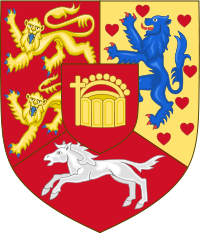](https://zh.wikipedia.org/wiki/File:Royal_Hanover_Inescutcheon.svg)

**乔治一世**（英语：George I，1660年5月28日—1727年6月11日），名乔治·路德维格。德意志汉诺威选帝侯（1698年—1727年6月11日在位），汉诺威王朝的首位英国及爱尔兰国王（1714年8月1日—1727年6月11日在位）。

1714年，54岁的乔治一世继位，成为汉诺威王朝的第一位国王。由于乔治一世的继位资格存有一定争议，因此，乔治一世曾认为托利党反对他继位的权利，故他并不信任托利党。他的正式登基除标志着汉诺威王朝的开始以外，亦标志着辉格党主导政坛长达50年的开始。

乔治一世是德意志人，母语为德语，不会说英语，也不想去学。而他的大臣又不懂德语。内阁开会只能用拉丁语或法语。因此，乔治一世经常缺席。大多数情况下，他不了解需要他签署的那些文件的内容，他只签名，不管事。

1720年，“南海泡沫事件”爆发。南海公司股票价格狂飙，从1月的每股128英镑上升到7月份的每股1000英镑以上，6个月涨幅高达700%。1720年6月，为了制止各类“泡沫公司”的膨胀，英国国会通过了《泡沫法案》。从7月份开始，南海股价很快一落千丈，9月份直跌至每股175英镑，12月份跌到124英镑。“南海气泡”由此破灭。1720年底，政府对南海公司的资产进行清理，发现其实际资本已所剩无几，那些高价买进南海股票的投资者遭受巨大损失。伟大的艾萨克·牛顿爵士也是此事件受害者之一，他曾说“我可以计算天体的运行轨迹，却无法估量人类的疯狂”（I can calculate the motion of heavenly bodies but not the madness of people.）。

南海泡沫事件与1720年的法国密西西比公司及1637年的荷兰郁金香狂热，是西方历史早期爆发的三大的泡沫经济事件。其中南海泡沫事件中的南海股价如泡沫快上快落的情况，更被后人发展出“泡沫经济”一词，用来形容经济过热而收缩的现象。

罗伯特·沃波尔是当时辉格党中少有的反对南海公司投机的人物之一。他接受国王的委托，着手整顿南海公司，尽力挽救。

1721年4月，罗伯特·沃波尔被委任为第一财政大臣、财政大臣、以及下议院领袖三职。

罗伯特·沃波尔深受乔治一世信任，经常代替国王主持会议。主导政局约20年之久。有人称他为首相，当时这是一个污蔑讽刺之词，沃波尔也反对称自己为首相。后人更普遍认为他是英国历史上第一位首相。

自此，英王不参加内阁会议及首相领导内阁此后便成为惯例，内阁首相制由此形成。

1727年6月，乔治一世去汉诺威避暑途中中风。

1727年6月11日，乔治一世病逝于汉诺威。

从生到死，他始终没有被他的臣民们认同为英国人，甚至他本人也很少意识到自己是他们的同胞、他们的国君。当时英国人感叹地问道：“此乃吾君也，何其声之不似我也？”

乔治一世的外孙子即是著名的普鲁士国王腓特烈大帝。

**乔治二世**（英语：George II，1683年—1760年），乔治一世与王后的独生子，德意志汉诺威选帝侯及大不列颠、爱尔兰汉诺威王朝第二位国王（1727年—1760年在位）。

1727年，乔治二世继位。他一生热爱军事，是冒着生命危险与士卒并肩作战的最后一位英国国王。

1733年，机械师凯伊发明了“飞梭”，大大提高了织布的速度。

1745年，詹姆斯二世的孙子查尔斯王子在苏格兰登陆，并控制了苏格兰大部分地区。乔治二世派其子坎伯兰公爵讨伐并取得胜利，查尔斯王子被迫逃亡。

1756年5月17日，英国-普鲁士联盟与法国-奥地利联盟之间爆发七年战争（Seven Years War）。

1760年9月，英国从法国手中夺取了加拿大。

1760年10月25日清晨，乔治二世大便时用力太猛，引起夹层动脉瘤破裂猝死。

**乔治三世**（英语：George III，1738年6月4日－1820年1月29日），全名乔治·威廉·弗雷德里克（George William Frederick），英国国王兼汉诺威国王（神圣罗马帝国灭亡前为汉诺威选帝侯）、不伦瑞克-吕讷堡公爵。

1760年，乔治三世继位。乔治三世是在英国出生并接受教育的，从未去过祖籍德国汉诺威。他是安妮女王去世以来，首位能说一口纯正英语的国王。

1761年1月，英国击败法国独霸印度。

1762年，乔治三世购入白金汉府（今白金汉宫）作为家庭成员静养之用。

十八世纪六十年代，第一次工业革命兴起。

1763年2月10日，英、法两国签订《巴黎条约》，七年战争结束。法国被迫将整个加拿大割让给英国，并从整个印度撤出，只保留5个市镇，还将西印度群岛和非洲的大片属地割归英国。英国成为了海外殖民地霸主，首次自称“日不落帝国”。

英国政府因长期的战争而导致财政困难。于是，英国政府不断地向北美各殖民增加税收，并实行高压政策，对殖民地进行蛮横的压榨和残酷的剥削。

1765年，织工哈格里夫斯发明了“珍妮纺织机”。

1770年3月，发生波士顿惨案。

1773年12月16日，发生波士顿倾茶事件。

1775年，美国独立战争爆发。

1776年7月4日，北美大陆会议通过《独立宣言》，正式宣布北美13个殖民地独立。

1778年2月法美签订军事同盟条约，法国正式承认美国。法国、西班牙、荷兰相继参战。

1782年11月30日，美国与英国的代表在巴黎签订初步停战条约。

1783年9月3日，英王代表与殖民地代表于凡尔赛宫签订1783年巴黎条约，英国正式承认美利坚合众国成立。

1780年至1784年，爆发第四次英荷战争，英国大胜，荷兰出现严重的经济危机，英国成为世界海洋霸主。

1785年，瓦特制成的改良型蒸汽机投入使用，人类社会由此进入了“蒸汽时代”。

1789年7月14日，法国大革命爆发。

1792年4月，法国与普奥间正式爆发了战争，欧洲国家持续22年之久的拿破仑战争（又称法国革命战争）就此拉开了帷幕。

1792年8月4日，雪莱出生。

1793年，乔治三世遣使团到达北京，并谒见了清朝的乾隆帝，还参加了在承德避暑山庄举办的乾隆帝八十大寿庆典。

1793年，法国对大不列颠宣战。神圣罗马帝国与大英帝国、普鲁士王国、西班牙帝国、荷兰和撒丁王国组成第一次反法同盟。

1797年，第一次反法同盟联军被拿破仑所率领的法国意大利方面军打败，被迫议和而土崩瓦解。

1799年，大不列颠、奥地利、俄国及奥斯曼帝国组成了第二次反法同盟。

1800年，第二次反法同盟被击溃而解体，只剩下大不列颠继续与法兰西第一共和国的第一执政拿破仑作战。

1801年，通过《英爱联合法案》，两个王国正式合并，英国的正式名称成为“大不列颠及爱尔兰联合王国”，形成现代英国国旗。

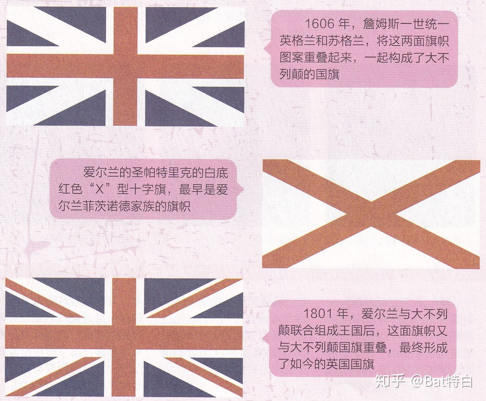该图来自《一读就懂的世界史——英国》，侵删。

------

1805年8月9日，奥地利帝国、大英帝国、俄罗斯帝国、瑞典等国结成第三次反法同盟，向拿破仑宣战。

1805年12月27日，拿破仑与战败方奥地利皇帝签订《普雷斯堡和约》，第三次反法同盟瓦解，神圣罗马帝国的历史也正式宣告终结。

1806年秋，大英帝国、俄罗斯帝国、普鲁士王国等国组成第四次反法同盟。

1807年7月7日，法国先后与战败方俄、普签订了《提尔西特和约》，第四次反法同盟瓦解。

1809年，大英帝国、奥地利帝国联合组成第五次反法同盟，事实上只有奥地利出兵作战。

1809年10月14日，奥地利被迫再一次割地求和，与法国签订《维也纳和约》，第五次反法同盟宣告失败。此后，拿破仑几乎占领和控制了除英国、俄国以外的整个欧洲。

1811年，俄皇亚历山大一世拒绝继续与法国合作封锁英国。

1812年，拿破仑率使用12种语言的57万大军远征俄罗斯。但最终只剩下3万人左右的残破军队回到法国，法军元气大伤。

1812年6月，美国对英宣战。

1812年8月，英军攻陷华盛顿，发生“华盛顿大火”。

1813年，俄罗斯帝国、普鲁士王国、大英帝国、奥地利帝国等国结成第六次反法同盟。

1813年10月，发生了拿破仑战争中最激烈的战役——莱比锡战役。拿破仑以十八万人与俄罗斯帝国、奥地利帝国、普鲁士王国及其他各国三十万联军苦战，最后败阵，意味着法兰西第一帝国的崩溃。因参战国家和民族众多，莱比锡战役亦被称为“民族会战”。

德国著名思想家、德国最伟大的作家之一、席勒的好友、“狂飙运动”的代表人、伟大作品《浮士德》的作者约翰·沃尔夫冈·冯·歌德为此役失败的拿破仑特作诗一首（出处及译者未确定）。

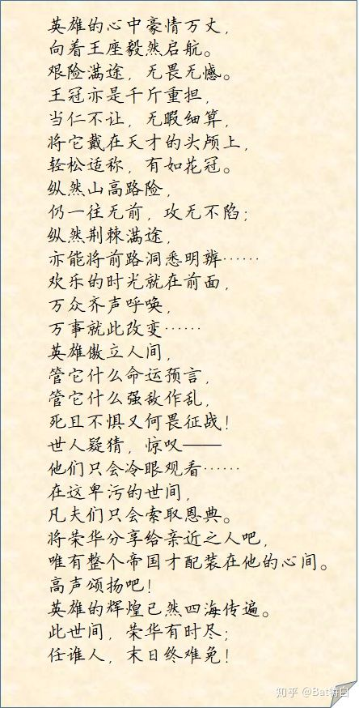

1814年3月30日，巴黎沦陷。

1814年4月4日，拿破仑退位。

1814年4月11日，法国与联军各国签署《枫丹白露条约》，拿破仑放弃皇帝称号，并被放逐到意大利的厄尔巴岛。

1814年，英美签订《根特条约》，第二次英美战争结束。

1814年9月18日到1815年6月9日间，英国参加了近代史上一次规模最大、时间最长的会议——维也纳会议，会议目标是处理拿破仑战败后的欧洲政治地图。除奥斯曼帝国外，所有欧洲国家都派了代表。

1815年3月20日，从戒备森严的厄尔巴岛上逃出来的拿破仑进占巴黎，重新登上皇位，建立了“百日王朝”。

1815年，维也纳会议与会国家对“百日王朝”感到震惊和不安。大英帝国、俄罗斯帝国、奥地利帝国、普鲁士王国、撒丁王国五国，及被英俄奥普四国所控制的荷兰、比利时、德意志的一些小国组成了第七次反法联盟。

1815年6月18日，英普联军与法军在滑铁卢会战。英军的指挥官是威灵顿公爵。法军在滑铁卢战役中覆没。拿破仑兵败后，法国人民以及他的大臣强烈要求他专政，推翻逼迫他退位的议会。拿破仑自知大势已去，资产阶级已经抛弃了他，因此拒绝发动人民抗战。

1815年6月22日，拿破仑第二次宣布退位，法国国王复辟，“百日王朝”结束。

1815年10月，拿破仑被流放到南大西洋中隶属于英国的圣赫勒拿岛，从此再也没有返回法国。第七次反法联盟胜利，欧洲又暂时回到封建君主制，一场代表着法国资产阶级利益的革命被彻底镇压。

1819年，雪莱作《西风颂》。

1820年1月29日，乔治三世驾崩。

1821年5月5日，拿破仑在岛上去世，死因成谜。

------

**乔治四世**（英文：George IV，1762年8月12日－1830年6月26日），大不列颠及爱尔兰联合王国及汉诺威国王（1820年1月29日—1830年6月26日在位）。乔治三世长子，威廉四世的同母兄。

1820年，乔治四世继位。

1822年7月8日，雪莱在海上因风暴覆舟而死。

1825年，英国人史蒂芬孙亲自驾驶着一列托有34节小车厢的、他本人在1814年发明的“蒸汽机车”试车成功。

爱尔兰天主教徒的公民权问题一直是一项重大而敏感的政治议题。

1829年，《天主教解放法案》通过，标志着英国放弃了三百年来试图改变爱尔兰天主教信仰的努力。

1830年6月26日，乔治四世驾崩。

------

**威廉四世**（英语：William IV，1765年—1837年），大不列颠及爱尔兰联合王国和汉诺威国王（1830年—1837年在位）。乔治三世第三子，乔治四世之弟。

1830年，威廉四世继位。

1831年，迈克尔·法拉第发现电磁感应。

他是维多利亚女王（Victoria）的伯父。威廉四世极其讨厌维多利亚之母，因此作为国王，他的野心之一就是活到维多利亚度过18岁生日，可以让维多利亚就可以不需要母亲的摄政而独自执政。

威廉四世实现了自己的愿望。维多利亚于1837年5月24日成年，威廉四世于6月20日驾崩。

**维多利亚女王**（英语：Alexandrina Victoria，1819年5月24日—1901年1月22日）是大不列颠及爱尔兰联合王国女王（1837年—1901年在位），印度女皇（1876年—1901年在位）。

维多利亚是英国历史上在位时间第二长的君主，仅次于伊丽莎白二世女王。维多利亚的在位时间长达64年。她也是第一个以“大不列颠及爱尔兰联合王国女王和印度女皇”名号称呼的英国女王。

维多利亚女王在位时期正值英国自由资本主义由方兴未艾到顶尖、进而过渡到垄断资本主义的转变时期，经济、文化空前繁荣（查尔斯·狄更斯活跃于此时期），君主立宪制得到充分发展，英国加大殖民扩张，在一定范围内建立和占领了很多殖民地。英国处于最强的“日不落帝国”时期，史称“维多利亚时代”。维多利亚女王成了英国“和平与繁荣”（实则更多不过是因为侵略和扩张）的象征。

“日不落”即指帝国版图之大（其实绝大部分都是侵略来的殖民地），无论何时何刻，都有一片土地在太阳之下，太阳无论何时都不会在其领土上落下，妄图使侵略事业久久远远。

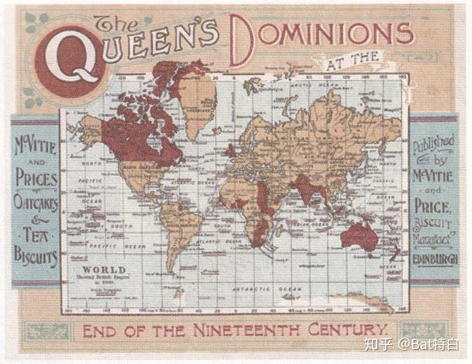19世纪末，维多利亚时期的英国地图

------

1837年6月20日，维多利亚继位。同时，英国和汉诺威的共主邦联中止。这是因为威廉四世在英国的继承人是女性，而汉诺威则只能由男性继承。汉诺威爵位由威廉四世五弟坎伯兰公爵（汉诺威国王恩斯特·奥古斯特一世）继承，从此英国失去了汉诺威领地。而后，汉诺威王国一直延续到1866年被普鲁士吞并。

1838年6月28日，维多利亚在威斯敏斯特教堂加冕。

1840年前后，英国的大机器生产基本上取代了传统的工厂手工业，工业革命基本完成，英国成为世界上第一个工业国家。伴随着工业革命的完成，19世纪时的英国被称为“世界工厂”，出现了大量工人阶级。

1836—1848年，英国工人们为得到自己应有的权利而掀起了工人运动，称作“宪章运动”。

1837年，伦敦工人协会向国会提出了一份请愿书，提出：年满21岁且精神正常的男子都有普选权，选举投票应秘密进行，废除议会候选人的财产资格限制，国会每年举行一次改选，平均分配选区。

1838年5月，这份请愿书公布后，被称为《人民宪章》。1839年在请愿书上签名的有125万人。

1840年7月，各地宪章派的代表在曼彻斯特召开了大会，宣告成立全国宪章派协会。它是近代第一个工人政党的萌芽。

1842年5月2日，浩浩荡荡的工人队伍来到国会下院，宪章派全国协会的负责人向下院递交了全国宪章派第二次请愿书。这份有300万人（约占英国成年男子的一半）签名的请愿书再次要求把《人民宪章》定为法律。

1848年，第三次全国请愿书上签名的有197万人。伦敦、曼彻斯特、伯明翰、利物浦、格拉斯哥等城市的工人举行了声势浩大的示威游行。

1848年4月10日，全国宪章派第3次代表大会的代表把请愿书装在四套华丽的马车上向国会驶去，途中遭到宪兵的镇压。国会拒绝接受请愿书。接着，政府下令解散全国宪章派协会。

英国宪章运动和德国西里西亚纺织工人起义、法国里昂丝织工人起义称为欧洲三大工人运动，表明无产阶级登上历史舞台，为马克思主义的诞生奠定了阶级基础。

1839年，林则徐在虎门销烟。

1840年初，维多利亚女王在议会上发表了著名的演说，呼吁“为了大英帝国的利益”，向中国发动战争。

1840年6月，第一次鸦片战争遂始。

**（从这里开始后，其实我可以说是几乎完全没有兴趣了。）**

1842年8月29日，在英军旗舰”汗华“（亦译康华丽）号上，中国清政府全部接受了英国提出的议和条款，签订了中国近代史上第一个不平等条约——中英《南京条约》。

1856年10月，英、法两国在美、俄支持下联合（这时候居然它们联合起来了）发动了侵华战争，史称“第二次鸦片战争”，迫使清政府先后签订《天津条约》、《北京条约》、中俄《瑷珲条约》等一系列不平等和约。

1859年，查尔斯·罗伯特·达尔文发表《物种起源》。

1864年，在创始人之一、实际上的领袖马克思领导下，英国工人联合会召开群众大会，决定建立一个国际性的工人协会，即国际工人联合会（International Workingmen's Association）。由于会名太长，人们取它的第一个单词“International（国际）”，第二国际成立后，始称“第一国际”。1871年，第一国际法国支部参加并领导了巴黎公社运动，但是随着巴黎公社的失败，组织也日渐衰弱，1876年正式宣布解散。

1876年5月1日，维多利亚加冕为印度女皇。

1882年，英国占领埃及。

1899年，英国占领苏丹。

1900～1901年英国参与侵华联军“八国联军”，前期统帅为英国海军将领西摩尔。

1901年1月22日，维多利亚女王在怀特岛去世。

## 萨克森王朝（1901-1917）

**爱德华七世**（英语：Edward VII，1841年11月9日—1910年5月6日），大不列颠及爱尔兰联合王国国王及印度皇帝（1901年—1910年在位），维多利亚女王之子。

------

## 温莎王朝（1917至今）

[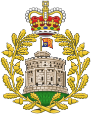](https://zh.wikipedia.org/wiki/File:Badge_of_the_House_of_Windsor.svg)

### 乔治五世

（英语：George V，1865年6月3日—1936年1月20日），全名乔治·弗雷德里克·恩斯特·阿尔伯特（George Frederick Ernest Albert），爱德华七世之子。大不列颠及爱尔兰联合王国国王及印度皇帝（1910年—1936年在位），温莎王朝的开创者。现时在位的英女王伊丽莎白二世的祖父。第一次世界大战期间，乔治五世为了安抚民心，舍弃了自己的德国姓氏，决定以皇家城堡温莎堡为名，将王室改称“温莎”，这一举动深受民众支持。

1914年7月28日，第一次世界大战爆发。

1918年11月11日，第一次世界大战结束。

1919年，爱尔兰独立战争爆发。

1921年7月11日，爱尔兰独立战争以停火协议结束。

1921年12月6日，双方签订《英爱条约》，英被迫允许爱南部26郡成立爱尔兰自由邦，但北部6郡仍属英国，成为现在的北爱尔兰。

在英国统治爱尔兰岛的时期，英国在爱尔兰岛北方有大量的新教徒移民，新教徒后来占人口的多数。爱尔兰人信天主教，属于凯尔特人。爱尔兰独立，但以新教为主的北部6郡拒绝独立，选择继续留在英国，以地区的地位加入英国。

第一次世界大战后，英国势力遭到削弱，各殖民地人民纷纷要求独立，兴起民族解放运动，殖民体系渐趋瓦解。

1926年，英国被迫承认自治领在内政外交方面获得独立。自治领与宗主国以“共同忠于（英国）国王”而组成英联邦，双方权利平等，互不隶属。

1931年，英国议会通过《威斯敏斯特法案》，批准上述决议，大英帝国名存实亡，英联邦正式形成。英联邦不是一个国家，也没有中央政府。

------

### 爱德华八世

（1894年6月23日—1972年5月28日），原名爱德华·阿尔伯特·克里斯蒂安·乔治·安德鲁·帕特里克·大卫（Edward Albert Christian George Andrew Patrick David），大不列颠及北爱尔兰联合王国国王（1936年1月20日—1936年12月11日在位），乔治五世嫡长子，乔治六世同母兄。自1936年1月20日其父乔治五世去世到1936年12月11日退位，为英国和英联邦各自治领国王，印度皇帝，共在位326天。温莎王朝的第二位国王。逊位后，其弟乔治六世为其创建了一个名衔——温莎公爵（Duke of Windsor）。

“不爱江山爱美人”——爱德华执意迎娶辛普森夫人（当时还有丈夫），遭到政府、自治领政府、人民和教会的一致反对，所以，他选择了退位，成为了英国和英联邦历史上唯一自主退位的国王。

二战爆发前，联邦*调查*局从德国王室成员维尔兹堡爵士处得到情报：英国王室和政府遗弃了温莎公爵夫妇是因为怀疑他们是纳粹德国的支持者。联邦*调查*局这份秘密档案长达227页，揭露了英国王爱德华八世退位的真相。但这一观点一直没有得到英国人的认同。

------

### 乔治六世

（George VI，1895年12月14日－1952年2月6日），原名阿尔伯特·弗雷德里克·亚瑟·乔治（Albert Frederick Arthur George），大英帝国各自治领国王，印度皇帝，1936年12月12日至1952年2月6日在位，末任印度皇帝及首任英联邦元首。

1937年，爱尔兰宣布成立共和国并独立，但仍留在英联邦内。

1948年12月21日，爱尔兰宣布脱离英联邦，并通过宪法成为永久中立国。

1949年4月18日，英国承认爱尔兰独立。

英国长期以来遵行“欧洲均势原则”，主要就是指让法、德、俄三个主要国家相互之间处于一种相对平衡的状态，几个大国并处而且实力相差不大，这样英国才能保持自己的地位，并对欧洲发挥影响力。

因此一战之后，同法国一起偏向德国，希望让德国对抗苏联。

1939年9月1日，德军对波兰发动了突然袭击，英、法对德国宣战。第二次世界大战全面爆发。

1942年1月1日，中国、苏联、美国、英国、澳大利亚、比利时、加拿大、哥斯达黎加、古巴、捷克斯洛伐克等26国在华盛顿发表《联合国家共同宣言》，表示决心共同打败德、日、意法西斯的侵略，不到侵略国无条件投降，决不和敌国单独议和。《联合国家宣言》标志着反法西斯阵线的最终形成。

1945年9月，第二次世界大战结束。

------

**温斯顿·丘吉尔**，1940年至1945年和1951年至1955年两度出任英国首相，获1953年诺贝尔文学奖、诺贝尔和平奖提名。2002年，BBC举行了一个名为“最伟大的100名英国人”的*调查*，结果丘吉尔获选为有史以来最伟大的英国人。

1946年，丘吉尔访问美国，在这次访问中他发表了著名的**铁幕演说**，被认为是冷战开始的标志，也是“欧洲均势原则”的一种延续。

------

### 伊丽莎白二世

（全称：Her Majesty Queen Elizabeth II，1926年4月21日—），已故英王乔治六世的长女，现任英国女王，英联邦元首、国会最高首领。全称为“托上帝洪恩，大不列颠及北爱尔兰联合王国以及其他领土和属地的女王、英联邦元首、基督教的保护者伊丽莎白二世”，是目前英国在位时间最长的君主。

1952年2月6日，女王伊丽莎白二世即位。

1953年6月2日，女王伊丽莎白二世加冕。

1979年英国大选，英国第一位女首相铁娘子撒切尔夫人上台。

#### 菲利普亲王

##### 家谱

##### 身世

由于希土战争中希腊惨败，菲利普亲王的父亲，希腊的安德烈亚斯王子与5名政府大臣和军队总司令作为战败的替罪羊而被<u>希腊革命军</u>政府收押，被关押在雅典监狱中等待枪决，

1922年12月，英国海军1艘轻巡洋舰前往雅典举行交涉，最后希腊革命领袖潘格洛斯慑于英国的武力威胁，被迫同意释放安德烈亚斯王子一家。

*英国*舰长用装橘子的木头箱子把一岁大的菲利普及其父母和4个姐姐从希腊带了出来，送到法国。

##### 爱情故事

菲利普亲王与伊丽莎白二世两人的爱情故事始于1939年。

英王乔治六世携家人到<u>达特茅斯皇家海军学校</u>参观，18岁的菲利普正在那所学校就读。年轻的<u>菲利普把表妹们带到花园里玩槌球和网球</u>，这是未来的*英国*女王和她的王夫首次会面。在游戏中，13岁伊丽莎白注意到了菲利普矫健的身手。

当乔治国王的游艇“维多利亚和阿尔伯特”号驶离达特茅斯时，<u>菲利普“征用”了一条小划艇</u>，全力划动伴随在皇家游艇旁，并且对“维多利亚和阿尔伯特”号愈发严厉的警告信号视而不见，未来的伊丽莎白二世饶有兴趣地看着这位头发淡黄色的英俊少年如何用力划艇，而他的父亲乔治国王如何高声大叫“这该死的笨蛋”以及站在边上的南斯拉夫王后听到国王的咒骂时候如何窘迫，最后在“迪基舅舅”（<u>蒙巴顿勋爵</u>）洪亮带有命令口吻的声音下才让菲利普离开。

女王对这段“一见钟情”很坦率，她很愿意让别人知道，她自从13岁那年见到菲利普亲王的第一眼开始，就已经从心眼里爱上了他。

1953年

（长期以来蒙巴顿勋爵一直是菲利普亲王的导师，蒙巴顿是菲利普亲王之母爱丽丝公主的弟弟，<u>就是菲利普的叔叔</u>, 昵称是“迪 基”，由于菲利普亲王的父亲，希腊的安德烈亚斯王子长期和妻子分居，扔下他们在法国花天酒地，因此蒙<u>巴顿在精神上扮演着菲利普父亲的角色</u>，而其子<u>查尔斯王子也把蒙巴顿勋爵尊称为“我的名誉祖父”。</u>）

1947年7月9日，菲利普亲王与伊丽莎白公主<u>订婚</u>，为此他<u>宣布放弃希腊王位继承权</u>，<u>改东正教信仰为英国圣公会</u>，改名为<u>菲利普·蒙巴顿</u>。

菲利普亲王

1947年11月20日和第三代表妹<u>伊丽莎白公主结婚</u>(2代近亲)，两人都是维多利亚女王的玄孙。岳父英王乔治六世授于他<u>爱丁堡公爵</u>、梅里奥尼思伯爵(Earl of Merioneth)和格林威奇男爵(Baron Greenwich)等爵位。1953年他被授于<u>英国皇家海军元帅、陆军元帅和空军元帅等职</u>。1957年获得<u>亲王头衔</u>；

1986年陪同伊丽莎白二世来华访问。

2009年4月18日，菲利普亲王超过历史上*英国*国王乔治三世的妻子夏洛特作为君主配偶的时间，成为*英国*保持君主配偶身份时间最长的人。

2017年5月4日10时（北京时间17时），*英国*王室宣布，菲利普亲王2017年秋天将退休，不再参与公共事务；8月2日，菲利普亲王正式退休。

伊丽莎白、菲利普两人的婚礼在1947年11月举行，离他俩第一次见面隔了8年。据传记作家布兰德雷思的介绍，菲利普在婚姻这点上非常固执谨慎。虽然二战期间，在军中服役的菲利普与伊丽莎白一直有书信来往，但是他是在战后第二年才开始真正慎重考虑自己的终身大事。

婚礼照片

为了能与心上人结婚，按照英国《<u>王位继承法</u>》的规定，菲利普放弃了希腊王位继承权，并<u>进行入籍归化手续</u>，但后来查阅王室档案时发现这一程序其实并不需要，因为根据1701年英国国会制订的王位继承法，作为<u>汉诺威选帝侯遗孀索菲娅（*英国*汉诺威王朝始祖乔治一世之母）的后代</u>，其自降生的那一刻起便自动拥有英国国籍和王族身份。

1953年

1947年11月的冬天，*英国*笼罩在一片阴霾中：缺少煤炭的严冬，定量配给制的实行，印度和缅甸的丧失，冷战的发展，所有一切都给人一种阴沉沉的气氛。好在菲利普和伊丽莎白二世（当时还未登基，仍为公主）的婚礼为郁郁寡欢的*英国*人带来了几分喜气洋洋的情绪。 这对新人收到了大量礼品，其中包括了美国妇女寄来的几百双尼龙丝袜和成打的火鸡（美国妇女们称“因为她住在英格兰，而那里没什么可吃的东西”），期间他的舅父蒙巴顿勋爵夫妇从印度回到*英国*，还为他们带来了大量印度前各土邦王公赠送的礼品，其中还有印度伟人圣雄甘地的礼品，圣雄甘地曾经找过蒙巴顿询问一个放弃了尘世影响的人应该送给这对新人什么样的礼物，在蒙巴顿的建议下，<u>甘地送了一块他亲手纺织棉线编织的台布</u>。但是<u>玛丽王太后不喜欢这位葬送了印度帝国的人</u>(47年8月15日, 印度独立日)，对他和他的礼品耿耿于怀，<u>她坚持说甘地送的礼物是一种侮辱，是一块缠腰布</u>。只有年轻的<u>菲利普上尉表示了异议，他说：“甘地是一个伟人。”</u>玛丽王太后也没再说话便走开了。

##### 夫妻关系

菲利普亲王在英国女王的身后, 只是以女王丈夫的身份被人熟知. 我们不知道他是否是主动退居, 但事实是无论伊丽莎白的角色如何变换, 他似乎都默默的在妻子身后. 

英国女王和菲利普亲王性格大不相同，但两人在生活中总是默契十足，女王矜持严肃，而亲王幽默爽朗。在女王紧张的时候，菲利普亲王会讲一些幽默话让女王放松，在日常生活中，伊丽莎白就成了依人的小鸟，一切听丈夫的。

女王说过：**“试图改变一个男人的性格是浪费时间，你必须接受他的现状，男人就是男人。”**

而菲利普在结婚五十周年也说过：**“维持婚姻的秘诀之一就是女王的宽容。”**

##### 人物特点

菲利普亲王常常被描述成刚硬的保守派。

##### 罗曼史

菲利普亲王在英国女王的身后, 只是以女王丈夫的身份被人熟知. 我们不知道他是否是主动退居, 但事实是无论伊丽莎白的角色如何变换, 他似乎都默默的在妻子身后. 

英国女王和菲利普亲王性格大不相同，但两人在生活中总是默契十足，女王矜持严肃，而亲王幽默爽朗。在女王紧张的时候，菲利普亲王会讲一些幽默话让女王放松，在日常生活中，伊丽莎白就成了依人的小鸟，一切听丈夫的。

女王说过：**“试图改变一个男人的性格是浪费时间，你必须接受他的现状，男人就是男人。”**

而菲利普在结婚五十周年也说过：**“维持婚姻的秘诀之一就是女王的宽容。”**

但看似美满的婚姻下，暗潮涌动着。正如张爱玲所言：**“生命是一袭华美的袍，上面爬满了蚤子。”**

2020年6月，英国《太阳报》发表名为《[你不知道的菲利普亲王99件事，包括他的罗曼史秘密和赤裸真相](https://www.thesun.co.uk/fabulous/11826192/prince-philip-99-things-secret-romantic-married-queen/)》的报道，其中第73项引述1995年一篇德国报道，指菲利普亲王有24名私生子女（illegitimate children）。

据英国八卦媒体统计，菲利普亲王的情妇多达30位，私生子遍布世界各地。

在2016年的2月份，英国电视台Channel 5就播出了一部号称是记录英国皇室百年来各种八卦的“纪录片”《[Inside Buckingham Palace](https://www.channel5.com/show/inside-buckingham-palace/)》（白金汉宫里的那些事儿）[quote](https://www.independent.co.uk/arts-entertainment/tv/reviews/inside-buckingham-palace-tv-review-it-seems-prince-philip-had-an-ingenious-way-of-getting-rid-of-his-motherinlaw-a6894206.html)，这部“纪录片”揭露了英国皇室很多不为人知的八卦，菲利普亲王很不幸成为第一个炮灰。

1. 帕克·柯克伍德：性感密友

根据《每日邮报》的说法，最早的绯闻出现在1948年，绯闻对象是**帕克·柯克伍德（Pat Kirkwood）**。

她是当时赫赫有名的音乐剧女星，颜值爆表，更有着一双修长性感的美腿，被人称为**“世界第八大奇迹”**。

据说1948年的一个晚上，菲利普亲王在伦敦第一次见到柯克伍德。当时他在演出前不顾一切地闯入了柯克伍德的更衣室，就此一见钟情，他还立即邀请她共进晚餐，提议去俱乐部跳舞。

柯克伍德回忆道，菲利普一直坚持和她跳舞，不让她坐下，两人一直共舞至天明，还去了柯克伍德的住所吃饭。此时是菲利普与女王婚后的第二年，伊丽莎白女王还怀上了菲利普的第一个孩子查尔斯王子。

[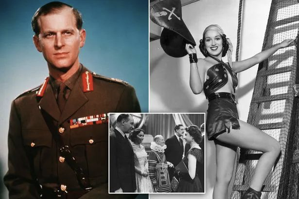](https://nimg.ws.126.net/?url=http%3A%2F%2Fcms-bucket.ws.126.net%2F2021%2F0411%2F4bdc90a9p00qrdpf900c4c000h300bdc.png&thumbnail=750x2147483647&quality=85&type=jpg)

柯克伍德一生都在被传她是菲利普的情人，这让她非常苦恼，甚至多次将媒体告上法庭。她还曾抱怨过女王因为吃醋而没有颁发给她过任何一枚奖章，尽管她的演艺事业和慈善事业都做得尽善尽美。

其实暧昧从两人一直互通书信就可以看出来。柯克伍德还在死前把他们来往的信件交给了她的朋友迈克尔·桑顿，要求他别给任何人看，等菲利普亲王去世，再由他把信件转交给他选定的作家。

[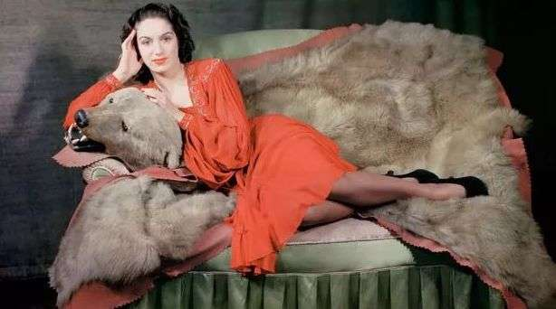](https://nimg.ws.126.net/?url=http%3A%2F%2Fcms-bucket.ws.126.net%2F2021%2F0411%2F98542201j00qrdpfa000pc000h2009ic.jpg&thumbnail=750x2147483647&quality=85&type=jpg)

2. 海伦·科黛特：青梅竹马

另一个被媒体怀疑与菲利普有不正当关系的是**海伦·科黛特（Hélène Cordet）**。

俩人小时候就认识了，两人童年时就一起玩耍，算是青梅竹马。长大后，科黛特成为了BBC的著名主持人，同时养了两个孩子，她老公一直以为科黛特行为不端，婚内“出轨”，导致俩人离了婚。

[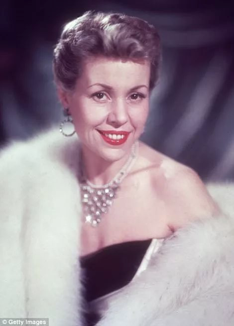](https://nimg.ws.126.net/?url=http%3A%2F%2Fcms-bucket.ws.126.net%2F2021%2F0411%2Fac942a17p00qrdpfa008cc000d200i7c.png&thumbnail=750x2147483647&quality=85&type=jpg)

离婚后，两个孩子归为科黛特所抚养，菲利普就顺势成了两个孩子的教父（干爹）。科黛特在当时对外并未公布孩子的生父是谁，因为关系的亲密，导致大家猜测两个孩子是不是菲利普的。

《人物》杂志曾报道，说菲利普亲王实为科黛特两名子女的生父，而非只是教父，不过她坚决否认。事实上这两个孩子的亲生父亲也不是科尔德的第一任丈夫，科黛特到死还是没有公开这个秘密。

有人猜测两个孩子其实是菲利普的私生子，但其中一个孩子否认了菲利普是他爹，这个疑惑至今未解决。

[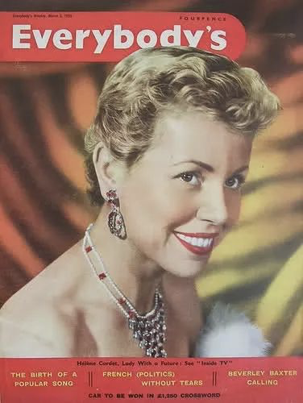](https://nimg.ws.126.net/?url=http%3A%2F%2Fcms-bucket.ws.126.net%2F2021%2F0411%2F463da13ep00qrdpfa008lc000ag00dwc.png&thumbnail=750x2147483647&quality=85&type=jpg)

3. 彭妮·罗姆塞：红颜知己

早前，很多媒体还曾曝光过菲利普和一个名叫**彭妮‧罗姆塞（Penny Romsey）**的美女传过绯闻。

罗姆塞出身富贵家庭，是一个典型的白富美，她经常参加英国上流贵族们的聚会。1975年她在伦敦认识了菲利普，并结下了不解之缘，还成了菲利普最有名的红颜知己。

[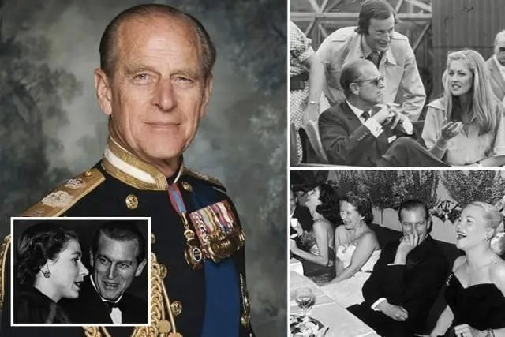](https://nimg.ws.126.net/?url=http%3A%2F%2Fcms-bucket.ws.126.net%2F2021%2F0411%2F1ad6cc6dp00qrdpfa00dbc000hs00bvc.png&thumbnail=750x2147483647&quality=85&type=jpg)

据说罗姆塞结婚后俩人还保持着亲密关系，每周都要见面两次，一起参加赛马等活动。

罗姆塞是菲利普绯闻女友中被拍到与亲王同框最多的一位，特别是她和55岁的菲利普一起骑着摩托车，而彭妮在他背后搂着他，俩人都开怀大笑。

[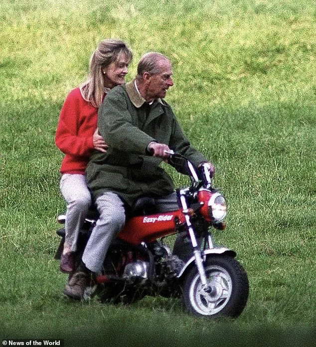](https://nimg.ws.126.net/?url=http%3A%2F%2Fcms-bucket.ws.126.net%2F2021%2F0411%2F322195bep00qrdpfb00z2c000hm00jdc.png&thumbnail=750x2147483647&quality=85&type=jpg)

他们的这种关系维持了二十多年，在任何场合都毫不掩饰，即便女王在场也不影响。直到1996年俩人的录音的曝光，录音中他们谈论了英国皇室的种种私事，可见关系并不一般，引起了一阵轰动。

有人打趣的问女王如何看待罗姆塞和菲利普的关系，女王回答：**“菲利普喜欢她在身边。”**

[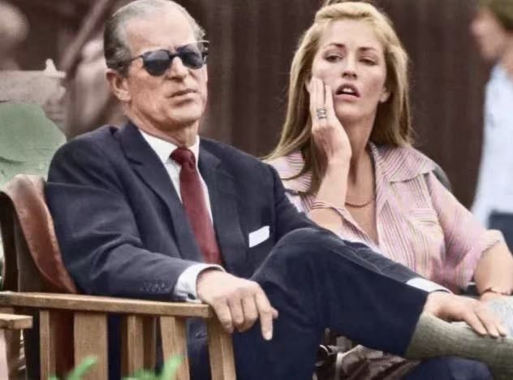](https://nimg.ws.126.net/?url=http%3A%2F%2Fcms-bucket.ws.126.net%2F2021%2F0411%2Fa891b83ep00qrdpfb00ccc000hk00d0c.png&thumbnail=750x2147483647&quality=85&type=jpg)

4. 其他女性

不仅如此，英国著名的历史学家Piers Brendan还曾经表示，**“菲利普亲王年轻的时候爱泡夜店，去夜店看到脱衣舞女就嗨的不行。”**

曾经为菲利普写过传记的作家Sarah Bradford也一直对外声称菲利普年轻的时候有过外遇，**“他从来没有追过女演员，他的兴趣是完全不同的，他喜欢的女人总是比他年轻，通常是美丽而高贵的。”**

所以除了以上三位女性，他还与**梅尔·奥伯伦（Merle Oberon）**、**安娜·梅西（Anna Massey）**有过绯闻，还与其他的小说家、女演员、电视主播、皇室主管的妻子等有过关系，英国媒体戏称她们为**“菲利普公爵俱乐部成员”**。

[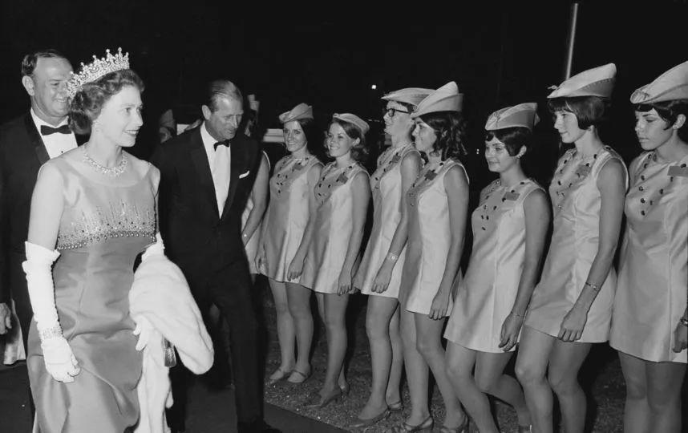](https://nimg.ws.126.net/?url=http%3A%2F%2Fcms-bucket.ws.126.net%2F2021%2F0411%2F04fee665p00qrdpfc00fuc000nu00f0c.png&thumbnail=750x2147483647&quality=85&type=jpg)

菲利普在很多人的笔下不仅情人众多，而且还有不少私生子。

但是菲利普的“花花公子”形象没有得到任何女方的承认，媒体也没有拿到任何证据，而王室官方对此从来都保持沉默，导致外界不断地揣摩猜测。

2006年，85岁的亲王就在电视上自嘲地说：**“每次我和一个女人说话时，他们都说我已经和她睡过了，就好像她没有同意过一样。”**

---

亲王的绯闻非常多，本以为他和女王是恩爱典范，没想到竟有这么多“风流史”。

目前，还不清楚这些婚外情传闻是如何影响菲利普亲王与伊丽莎白女王的关系的。

无论如何，以上绯闻的都是外界猜测且未曾证实。**如果有一件事是皇室粉丝可以肯定的，那就是这些女性从未真正撼动过王室。英国女王伊丽莎白二世和菲利普亲王的婚姻已经维持了70多年，他们正享受着在一起的黄金岁月。

---

##### 这是关于菲利普亲王的99件事

1. 菲利普亲王（Prince Philip）于1921年6月10日在科孚岛（Corfu）希腊王室的避暑胜地“蒙·雷波斯（Mon Repos）”别墅的厨房餐桌上出生。

2. 尽管他有“希腊人菲尔”的绰号，但他身上没有希腊血统。他的祖父是被“进口”成为希腊国王的丹麦王子。菲利普的贵族身份有点复杂。
   - 祖父 丹麦国王

3. 像他的表亲女王一样，他是维多利亚女王的曾曾孙。

4. 1922年，他的父亲安德鲁王子（Prince Andrew）因未能对土耳其人发起骑兵指控而被希腊革命委员会判处死刑。

[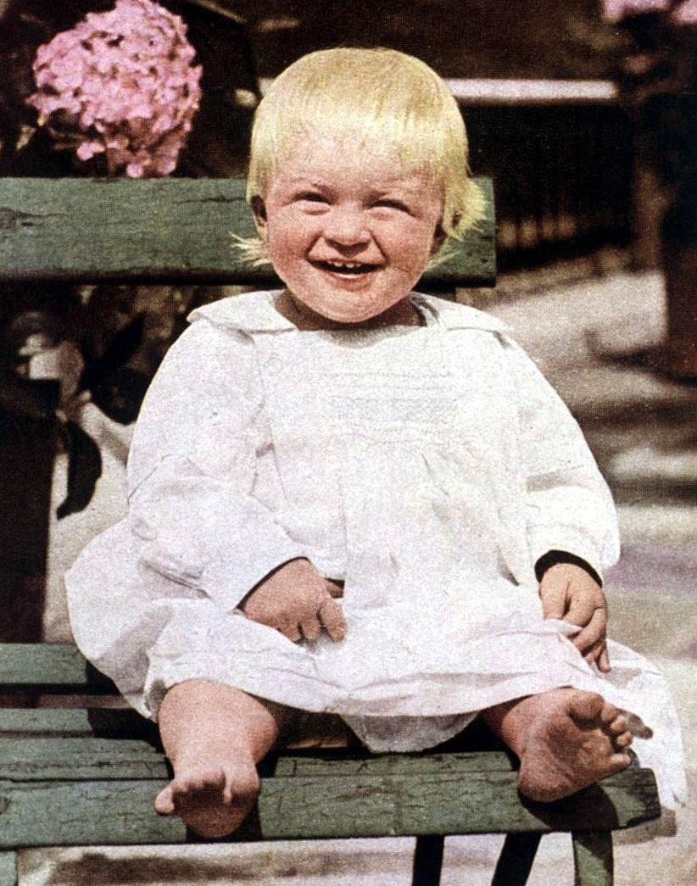](https://www.thesun.co.uk/fabulous/11826192/prince-philip-99-things-secret-romantic-married-queen/#)

1922年，科孚岛的菲利普亲王年仅十四个月大

5.他的父母巴登伯格公主爱丽丝与四个女儿和独子菲利普一起逃亡，并被一艘英国军舰营救。

6.菲利普在接下来的七年里和叔叔一起在法国居住在巴黎附近。在2008年的国事访问中，法国第一夫人卡拉·布鲁尼·萨科齐（Carla Bruni-Sarkozy）惊叹于他的“无懈可击的法国人”。

7.他八岁时就读萨里郡的奇姆学校，在那里他为足球队效力。

8.他的父母在他十岁的时候就分手了，当母亲崩溃后进入疗养院时，他已经八年没见母亲了。

[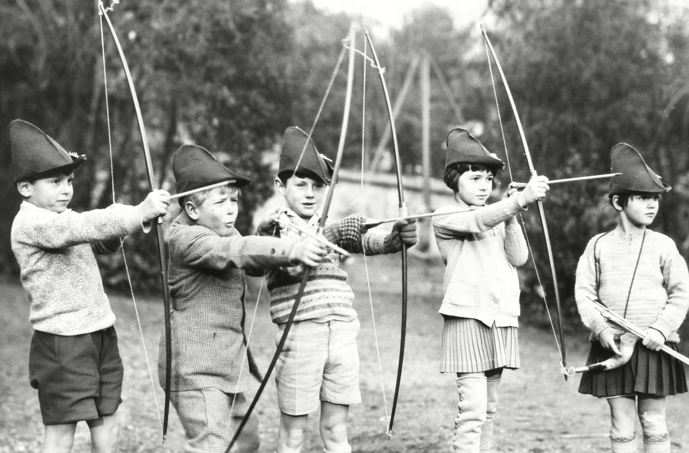](https://www.thesun.co.uk/fabulous/11826192/prince-philip-99-things-secret-romantic-married-queen/#)

菲利普亲王（左二）在法国圣克劳德的美国学校参加射箭课

9.他的父亲搬到了蒙特卡洛，在那里他以喝酒和赌博过多而闻名。他去世于1944年，享年62岁。

10.菲利普在德国上学一年后，于1934年前往苏格兰的戈登斯托恩，成为板球队和曲棍球队的队长，也是他的最后一个男生。

11.在1934年希腊玛丽娜公主和肯特公爵的婚礼上，他首先遇到了女王，然后是伊丽莎白公主。对于她只有八岁的她，几乎是一见钟情。

\12. 1939年，他加入了达特茅斯皇家海军学院的海军，在那里他是最好的学员。

13.在那里，在与父母乔治六世国王和伊丽莎白女王的访问中，他被重新介绍给他的第三任堂兄伊丽莎白。 

[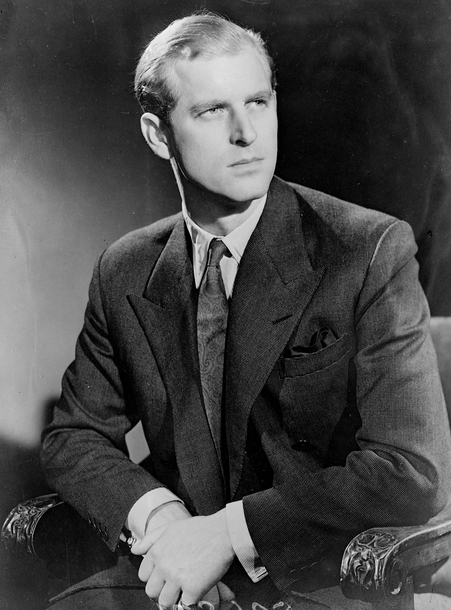](https://www.thesun.co.uk/fabulous/11826192/prince-philip-99-things-secret-romantic-married-queen/#)

菲利普亲王于1939年加入海军

[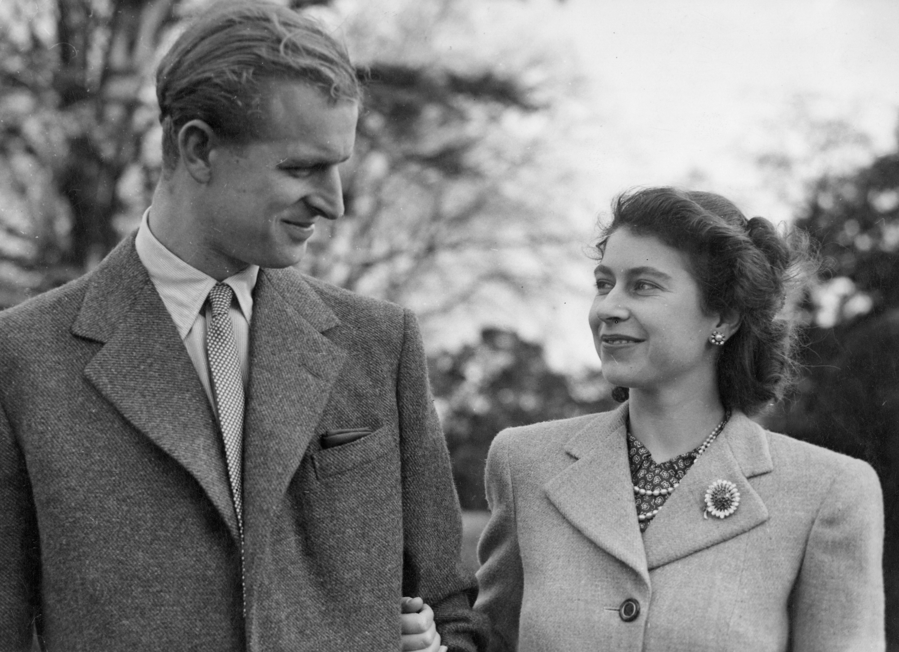](https://www.thesun.co.uk/fabulous/11826192/prince-philip-99-things-secret-romantic-married-queen/#)

菲利普亲王和女王在希腊玛丽娜公主和肯特公爵的婚礼上首次会面

14.战争中，菲利普曾因勇敢而被提及。在1941年的马塔潘（Matapan）与意大利舰队的战斗中，他为HMS Valiant配备了探照灯，尽管有大火也照亮了敌方巡洋舰。

\15. 1943年，他可能在英国东海岸外“炸弹胡同”中的护卫舰HMS华莱士号上救下了163条生命。在晴朗的夜晚，菲利普（Philip）制定了计划，将一艘炽热的筏子放到了水中，这艘船是一只坐着的鸭子。敌机看到烟雾，用筏子炸了一下，以为是船，他们没有受到伤害就逃脱了。

\16. 1943年，他在温莎城堡与皇室成员度过圣诞节，并且与伊丽莎白的恋情得以发展。

\17. 1945年，在澳大利亚悉尼，菲利普因休假在街上小便而被捕并被罚款。

[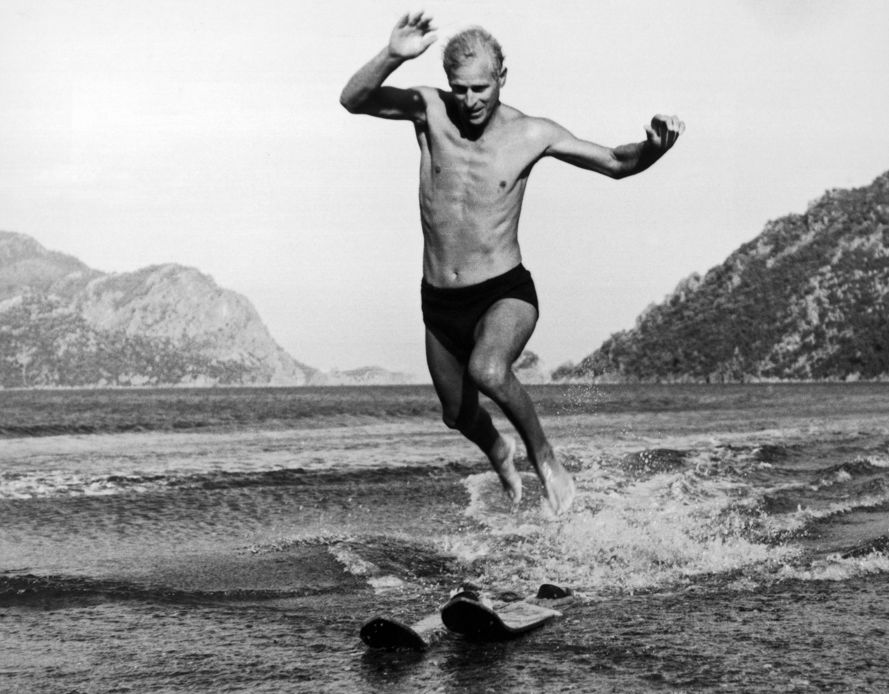](https://www.thesun.co.uk/fabulous/11826192/prince-philip-99-things-secret-romantic-married-queen/#)

菲利普亲王（Prince Philip）在前往土耳其马尔马里斯（Marmarice）的海滩时，从滑水橇上跳下，1951年8月5日

[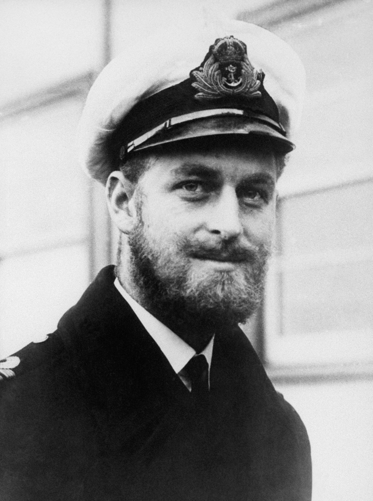](https://www.thesun.co.uk/fabulous/11826192/prince-philip-99-things-secret-romantic-married-queen/#)

菲利普亲王在1945年访问澳大利亚时合照

18.他求婚的地点和时间是秘密，但于1947年7月10日宣布结婚。

19.菲利普（Philip）放弃了其希腊头衔，取名蒙巴顿（Mountbatten），成为英国公民。

\20. 1947年11月20日，在威斯敏斯特大教堂举行婚礼之前，他被创建为爱丁堡公爵，梅里安尼斯伯爵和格林威治男爵。

21.他被赋予了殿下风格，但这并没有使他成为英国王子，这是女王在1957年纠正的疏忽。

这对夫妻于1947年宣布订婚

[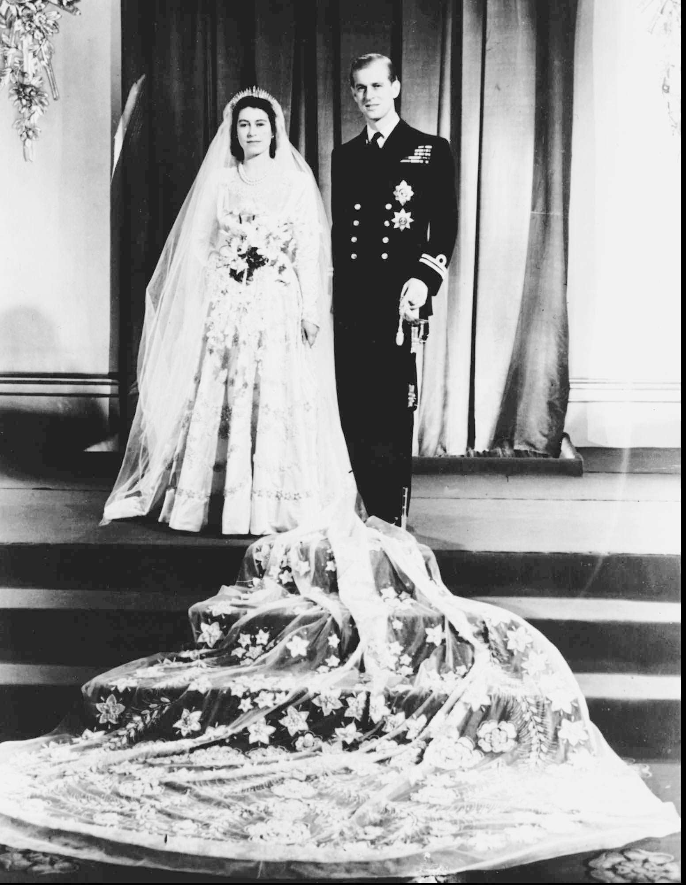](https://www.thesun.co.uk/fabulous/11826192/prince-philip-99-things-secret-romantic-married-queen/#)

菲利普亲王1947年嫁给女王后，银行存款相当于12便士

22.他设计了一条手镯作为他送给女王的结婚礼物。这些石头来自他母亲所拥有的头饰。

23.当他结婚时，他在银行里存了相当于12便士的现金。

24.菲利普每天都要进行加拿大空军演习，包括仰卧起坐和仰卧起坐。

25.他在结婚前一天放弃了吸烟。

26.他的四个姐姐都嫁给了德国王子，其中两个是纳粹分子。没有人被邀请参加他的婚礼。

1948年伊丽莎白公主和菲利普亲王与小查尔斯

1951年的王室合照

\27. Philip在加冕典礼上没有被加冕或受膏。

28.查尔斯王子（Charles Prince）1948年出生时，他整晚都在打壁球。他谈到自己的第一个孩子：“他看上去像一个李子布丁！”

29.当女王根据朝臣和总理温斯顿·丘吉尔的建议决定，她的孩子应该取她的温莎全名时，菲利普感到愤怒。他抗议说：“我不过是流血的变形虫。”

30.他想成为第一海勋爵，但是当伊丽莎白于1952年成为女王后，他的海军生涯就结束了。

[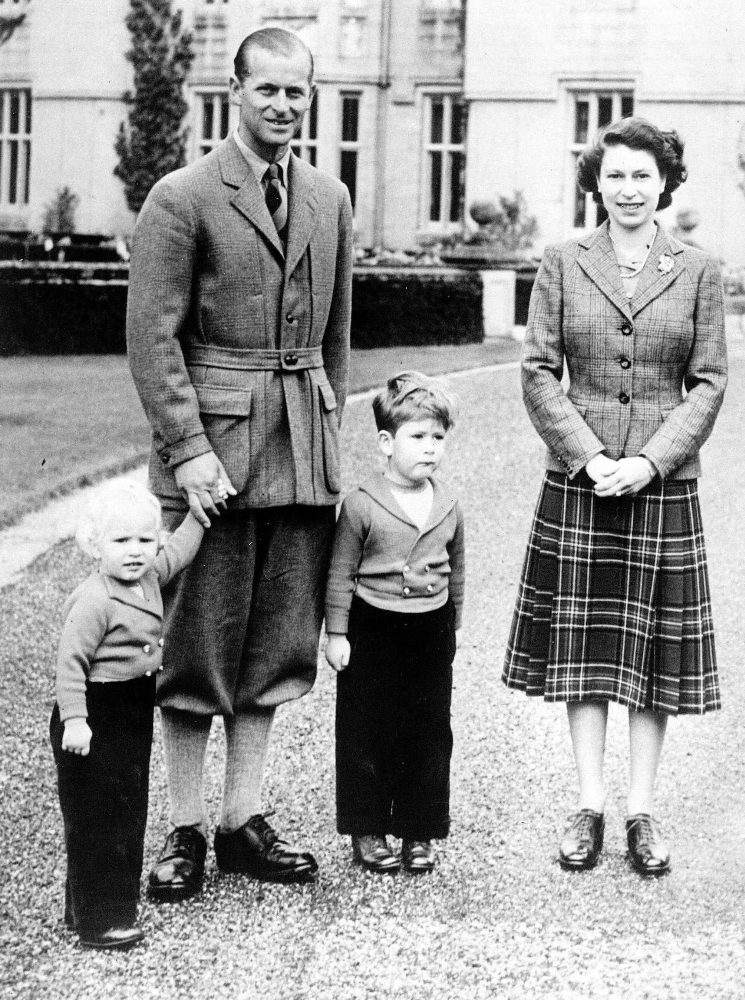](https://www.thesun.co.uk/fabulous/11826192/prince-philip-99-things-secret-romantic-married-queen/#)

菲利普亲王说他的儿子查尔斯王子出生时看起来像“李子布丁”

[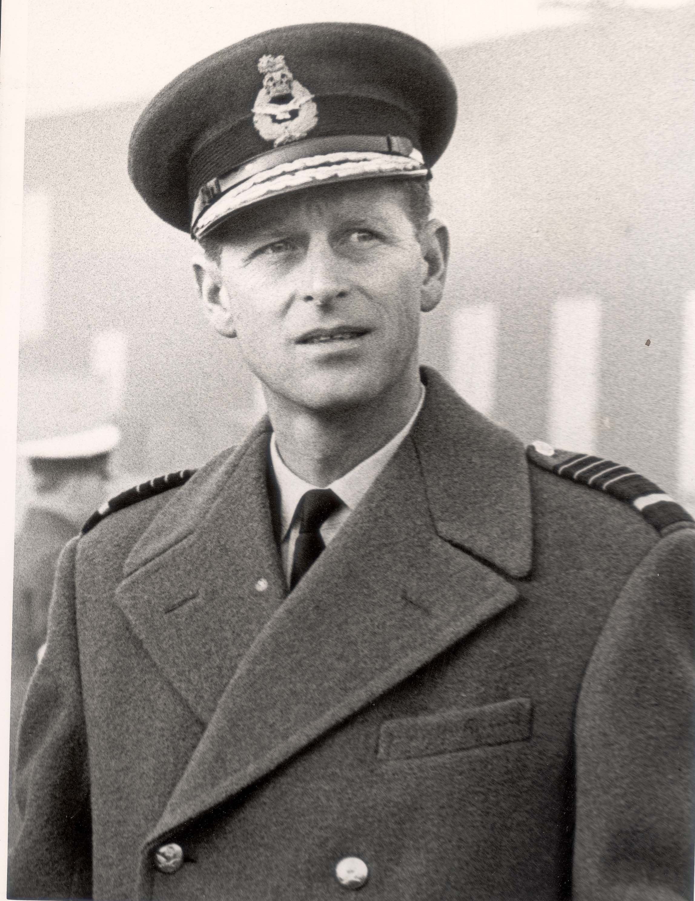](https://www.thesun.co.uk/fabulous/11826192/prince-philip-99-things-secret-romantic-married-queen/#)

菲利普亲王在1958年穿着制服合照

\31. 1952年，在肯尼亚，他向伊丽莎白传出了她的父亲乔治六世去世的消息，她现在是女王。

32.在1951年的加拿大巡回演出中，他追着伊丽莎白（Elizabeth）戴着一副笑话假牙在火车走廊上追逐。

33.他的抽烟的母亲爱丽丝（Alice）在白金汉宫（Buckingham Palace）生活了最后两年，并于1969年12月去世，享年84岁。

34.他一直否认婚外情，说婚外情总是不可能的，因为他总是在警察的陪同下。但他一直与亚历山德拉公主，电影明星梅尔·奥伯隆，女演员帕特·柯克伍德，电视名人凯蒂·博伊尔和长期朋友海伦妮·科尔迪（Helene Cordet）之间保持着浪漫的联系。

[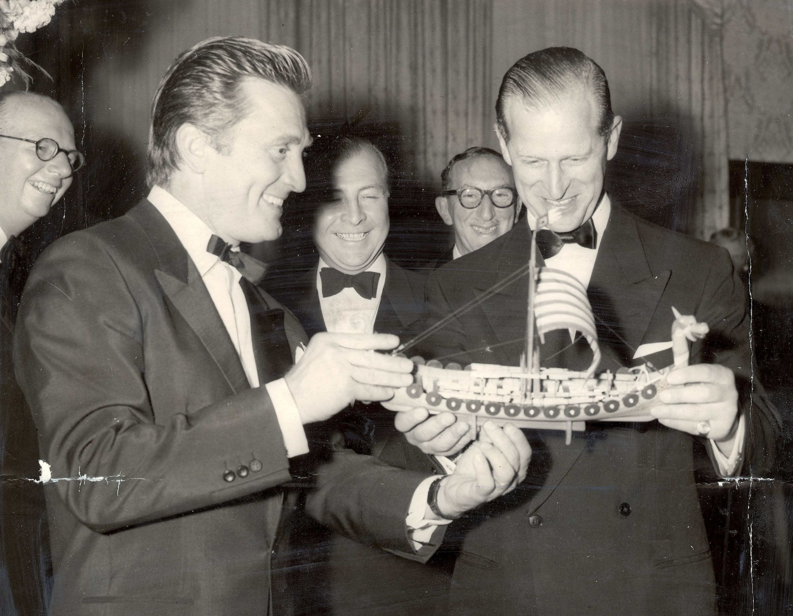](https://www.thesun.co.uk/fabulous/11826192/prince-philip-99-things-secret-romantic-married-queen/#)

演员柯克·道格拉斯（Kirk Douglas）在1958年的电影《海盗（The Viking）》的首映礼上向菲利普亲王（Prince Philip）赠送了海盗船模型-这艘船是查尔斯王子（Charles Prince）的礼物

[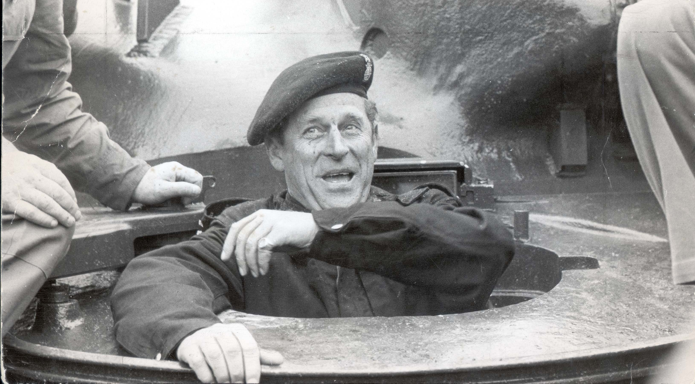](https://www.thesun.co.uk/fabulous/11826192/prince-philip-99-things-secret-romantic-married-queen/#)

菲利普亲王（Philip Philip）于1969年在多芬特郡（Bovington）营地参观了女王的皇家骑兵军团

35.今天，他最亲密的女性朋友是缅甸的马车搭档Countess Mountbatten，俗称“潘妮·罗姆西夫人”。

36.他有四个孩子，八个孙子和八个曾孙。

37.他分别于1949年和1975年担任Marylebone板球俱乐部的主席。

38.王母经常开玩笑地称他为“匈奴”。

菲利普亲王分别于1949年和1975年担任MCC（Marylebone板球俱乐部）主席

[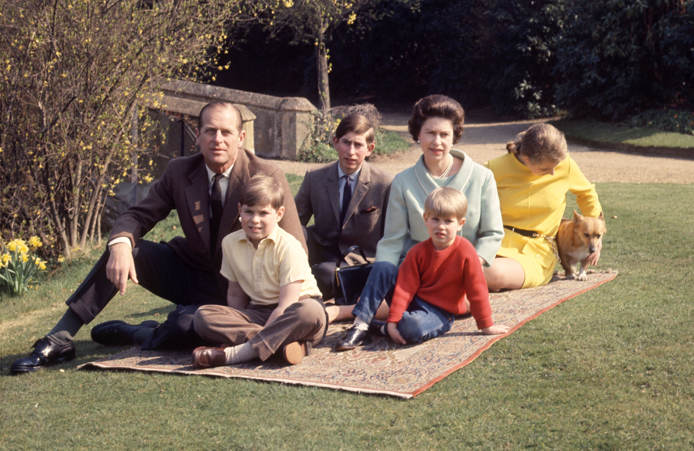](https://www.thesun.co.uk/fabulous/11826192/prince-philip-99-things-secret-romantic-married-queen/#)

菲利普亲王，安德鲁亲王，查尔斯王子，爱德华王子，伊丽莎白二世女王和温莎·弗罗格莫尔的安妮公主

[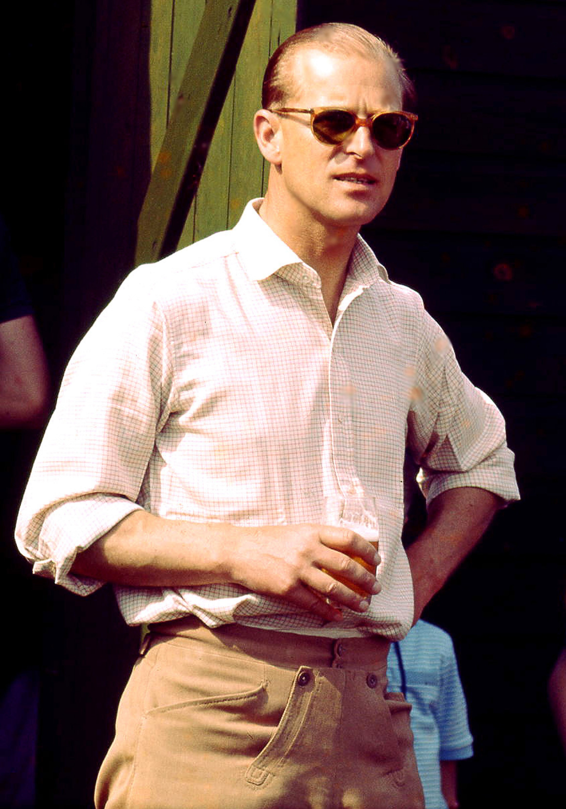](https://www.thesun.co.uk/fabulous/11826192/prince-philip-99-things-secret-romantic-married-queen/#)

女王母亲称菲利普亲王为“匈奴(the hun)”

39.他没有穿睡衣。

40.他的星座是双子座。

41.菲利普帮助设计了1953年推出的皇家不列颠尼亚号游艇的内部。他乘坐这条游艇总共旅行了72,430英里，包括两次环球航行。

42.船上他的骄傲和喜悦是一件浮木收藏。

43.他为女王做的宠物名字包括“香肠”和“白菜”。

44.他很少喝酒，但是更喜欢啤酒而不是葡萄酒或烈酒。

\45. 1961年5月，他成为第一位接受电视采访的王室成员。

菲利普亲王是一位才华横溢的画家

[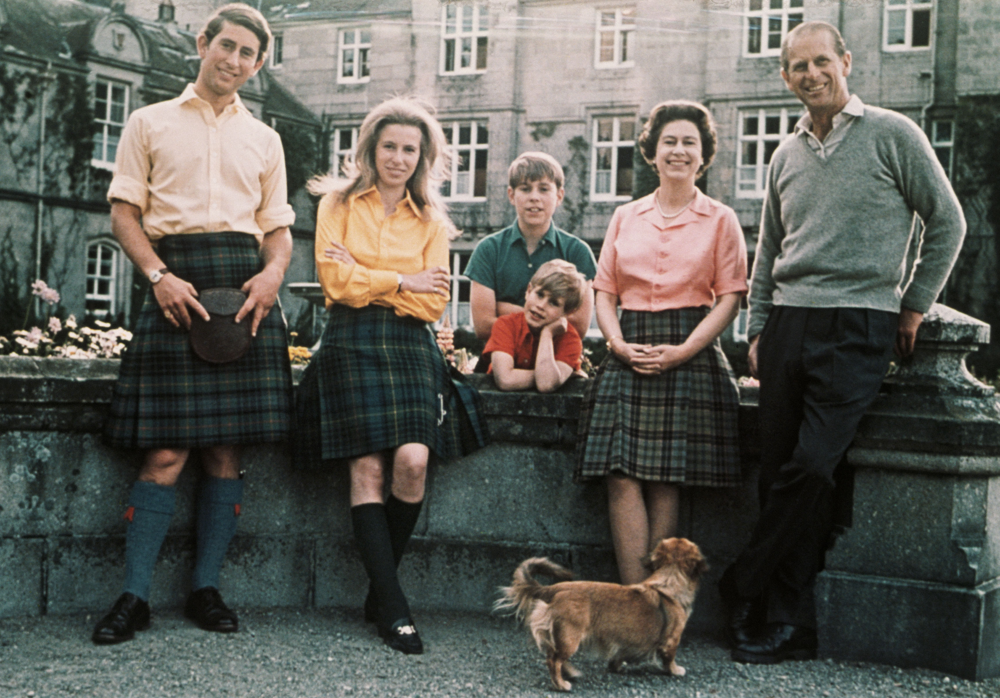](https://www.thesun.co.uk/fabulous/11826192/prince-philip-99-things-secret-romantic-married-queen/#)

查尔斯王子，安妮公主，爱德华王子，安德鲁王子和菲利普亲王在巴尔莫勒尔

46.在2017年8月退休之前的65年中，他发表了5,496篇演讲。

47.他去过170多个国家。

48.戴安娜（Diana）于1997年去世时，她的儿子威廉（William）和哈里（Harry）不想在棺材后面走，但菲利普（Philip）认为他们以后会后悔并告诉他们：“如果您愿意，我会和您一起走。”

49.他西装上衣口袋里的手帕总是成一直线。

50.他仍然是大约750个慈善机构和组织的赞助人或总裁。

51.多年来，他一直使用液化石油气驱动的伦敦出租车来回首都。

1972年8月22日，在皇家家族的年度暑假期间，爱丁堡公爵和安妮公主在苏格兰巴尔莫勒尔城堡的庄园准备烧烤。

菲利普亲王是首位接受电视采访的王室成员

52.西南太平洋瓦努阿图的Tanna岛民（前身为新赫布里底群岛）崇拜他为神。

53.他写了14本书，涉及各种主题，包括观鸟，马车驾驶和环境。

54.他在1953年获得了皇家空军的机翼，在1956年获得了直升机的机翼，并在1959年获得了私人飞行员的执照。在6,000个小时的飞行中，他驾驶过59架飞机。他于1997年停止飞行。

55.他的私人财富估计为3000万英镑，其中包括300万英镑的艺术品收藏。

56.他每年从主权补助中获得359,000英镑，主要用于支出。

[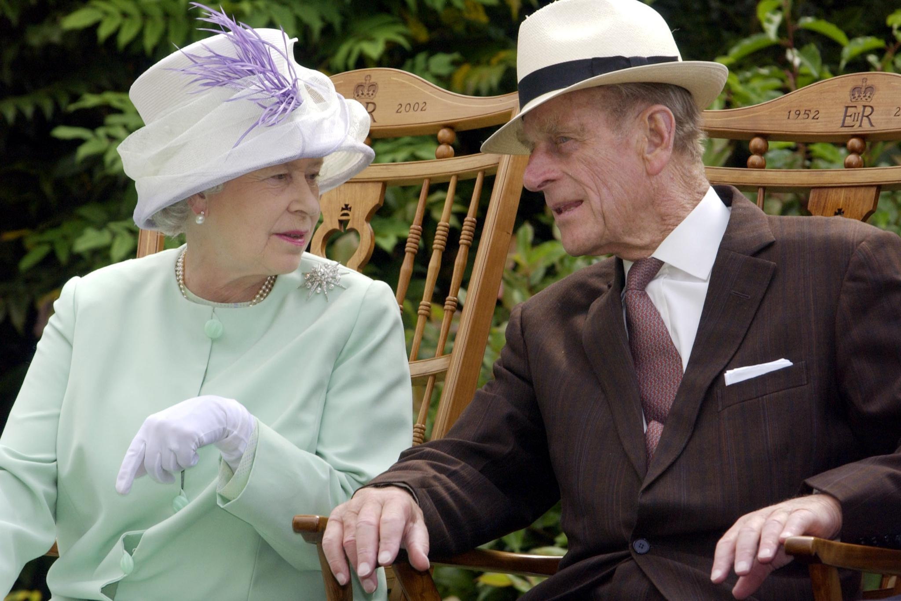](https://www.thesun.co.uk/fabulous/11826192/prince-philip-99-things-secret-romantic-married-queen/#)

女王和菲利普亲王在黄金禧年访问萨福克期间，在Bury St Edmunds的修道院花园里的一场音乐表演中合照

[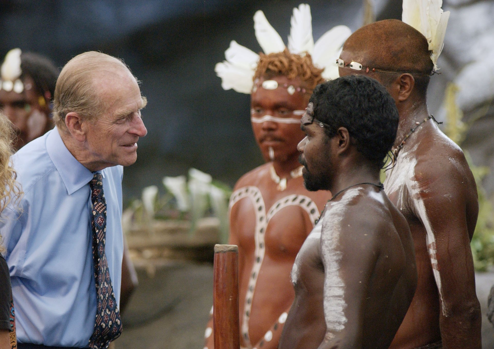](https://www.thesun.co.uk/fabulous/11826192/prince-philip-99-things-secret-romantic-married-queen/#)

2002年3月，爱丁堡公爵在昆士兰州凯恩斯Tjapukai土著文化公园观看文化表演后，与土著表演者进行了交谈。

\57. 2001年*发布*的解密的白厅记录显示，1971年，他命令不列颠尼亚号将他带往南太平洋进行了为期两个月的计划外航行，费用为50,000英镑（今天为500,000英镑）。

58.他是几个城市的自由人，包括阿卡普尔科，洛杉矶，墨尔本，内罗毕和瓜达拉哈拉。

59.在1958年，剑桥大学的学生挑战他参加一场整齐的眨眼比赛后，他将年度“银眨眼”奖授予了大学冠军。

\60. 1963年，他为巴基斯坦军队建立了一个管道奖杯。

61.在他的皇室职业生涯中，他进行了20,219场正式活动。

[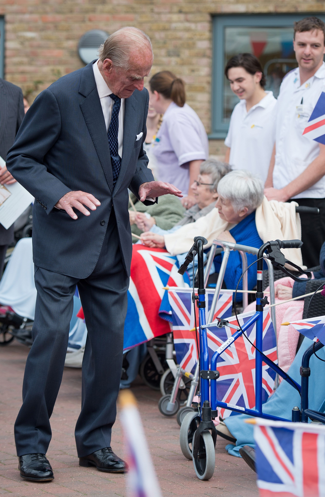](https://www.thesun.co.uk/fabulous/11826192/prince-philip-99-things-secret-romantic-married-queen/#)

菲利普亲王一生中完成了超过20,000项皇家婚约

62.他一生中的大部分时间都在午夜上床睡觉，并在早上6点起床。

63.自从他于1956年创立爱丁堡公爵奖励计划以来，来自90多个国家的400万年轻人参加了该运动，测试他们的身体健康状况并应对社区挑战。

64.他的最后一个幸存姐姐汉诺威公主乔治（George of Hanover）于2001年去世，享年87岁。

\65. 2000年，菲利普在桑德林厄姆（Sandringham）展出了他收集的数十幅漫画，这些漫画在过去50多年里给他取笑。小时候，他收集小刀。

66.多年来，他重新设计了巴尔莫勒尔（Balmoral）的花园，包括形成了水上花园，然后他用推土机挖了自己。

[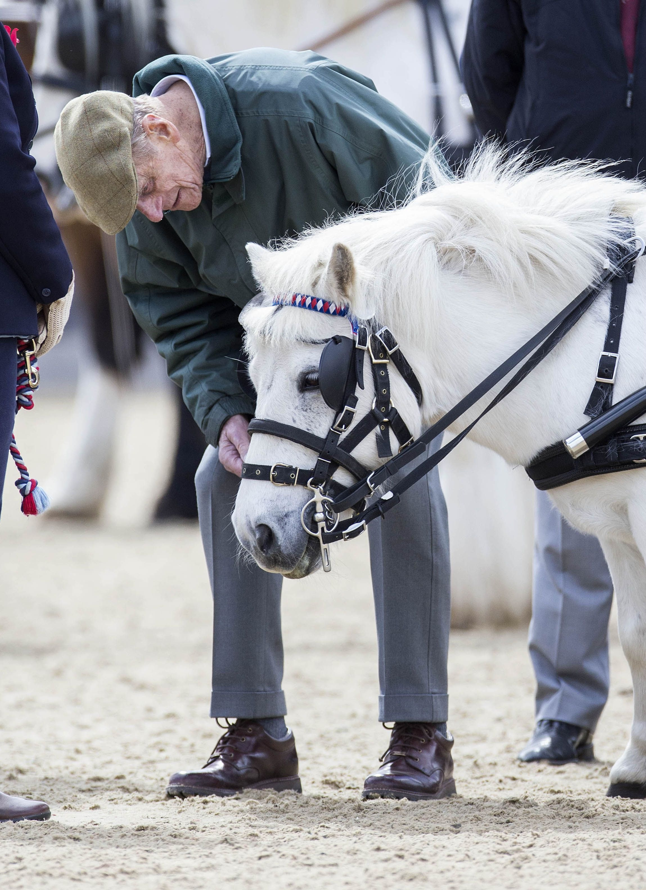](https://www.thesun.co.uk/fabulous/11826192/prince-philip-99-things-secret-romantic-married-queen/#)

菲利普亲王在2013年5月的温莎马展上

[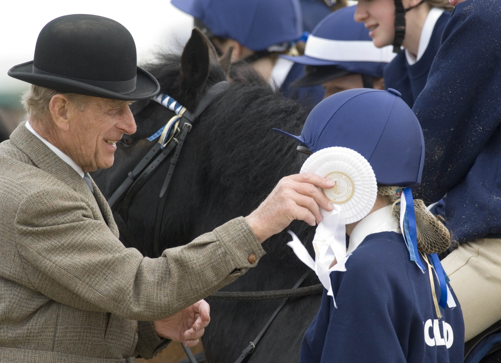](https://www.thesun.co.uk/fabulous/11826192/prince-philip-99-things-secret-romantic-married-queen/#)

菲利普亲王（Prince Philip）在2013年5月的温莎马展（Windsor Horse Show）上颁发奖项

67.他从来没有去过猎狐。

68.他的个人图书馆有11,000本书。

69.作为维多利亚女王的曾曾孙子，他 在王位前排在第570位。

\70. 1971年，他50岁时就放弃了马球。

71.然后他开始坐马车，一年花了20,000英镑。

72.他最小的儿子爱德华王子（Prince Edward）死后将获得爱丁堡公爵的头衔。

73. 1995年，一家德国报纸报道说，在他误导了一篇文章说他有24个教子之后，他有24个私生子！

[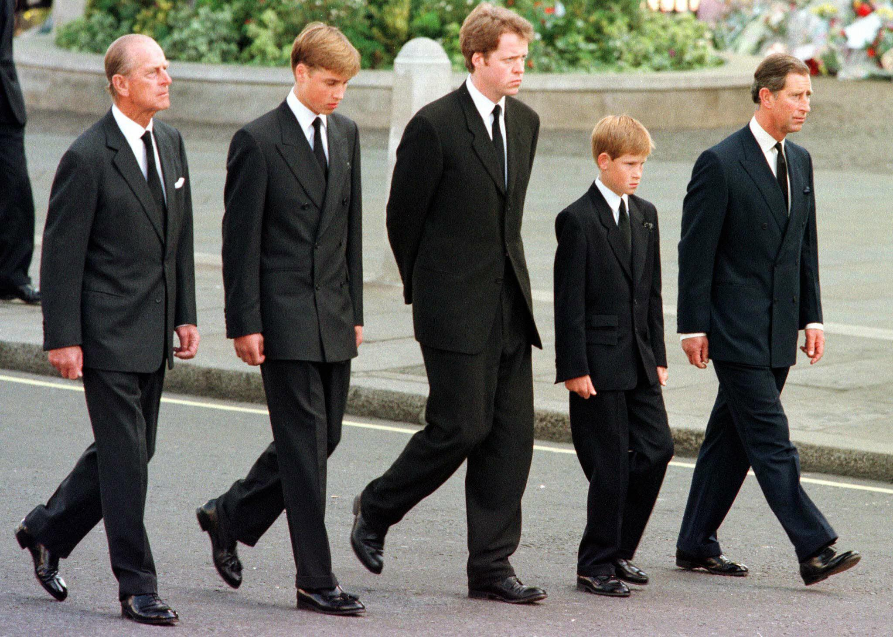](https://www.thesun.co.uk/fabulous/11826192/prince-philip-99-things-secret-romantic-married-queen/#)

菲利普亲王提议与威廉王子和哈里王子在他们母亲的葬礼上散步以寻求支持

74.他以单调的讽刺而闻名。1994年，在访问开曼群岛时，他问博物馆馆长威廉·滕南特（William Tennent）：“你们中的大多数人不是海盗吗？”

75.他是一位精通油画的画家。

76.女王一度抱怨他在皇室里开车太快时，他告诉她：“如果再这样做，我将把你从车里带出来。” Ma下保持沉默。

77.他是英国最早进行太阳能板试验的人之一，在1970年代将其安装在桑德灵厄姆小屋的屋顶上。

78.他私下里戴着高街眼镜商Dollond和Aitchison的眼镜。

\79. 2008年，他请萨维尔街（Savile Row）的裁缝师改办他52年前第一次穿的裤子。

[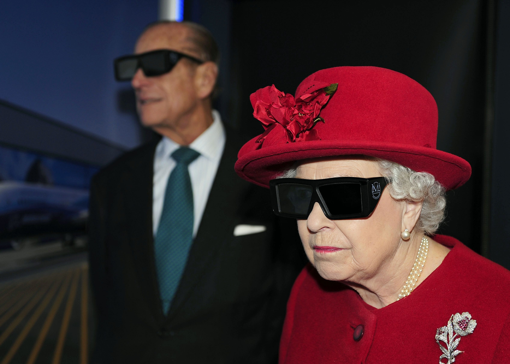](https://www.thesun.co.uk/fabulous/11826192/prince-philip-99-things-secret-romantic-married-queen/#)

菲利普亲王和女王在2010年访问谢菲尔德大学时尝试3D眼镜

菲利普亲王（图为2011年与格温妮丝·帕特洛（Gwyneth Paltrow）的讲话）被评为英国第33穿得最好的男人

80. GQ杂志将他评为33届 英国最佳穿着。

81.他最喜欢的笑话是关于一位美国游客的，他问：“为什么他们在离希思罗机场这么近的地方建造温莎城堡？”

82.他曾经招待过50名员工在赫斯顿·布卢曼塔尔（Hston Blumenthal）在布雷的获奖餐厅Fat Duck的圣诞节午餐。

83. 2008年4月，他在伦敦爱德华七世国王医院呆了三天，患了感冒和胸部感染。他的家人没有去拜访他，因为他“不想大惊小怪”，但是女演员乔安娜·拉姆利（Joanna Lumley）送了一些花。

84. 2009年2月，他因背部马车受伤而被迫休息。人们认为女王因为担心自己的健康而取消了对中东的国事访问。

85.他在桑德灵厄姆建立了一个松露农场。

86：直到1999年，他还是上议院议员，但从未在那儿讲话，因为女王在政治上是中立的。

菲利普亲王于2017年退役皇家公职.

87.他接受了六次外科手术– 1967年从右手腕去除了一个囊肿，1987年进行了疝气修复，并在1996年去除了鼻子上的良性生长。 

在2011年圣诞节，他插入了一个支架，以打开心脏的阻塞动脉。2013年6月，他进行了一次腹部探查手术.2018年4月，他进行了髋关节置换手术。

88：2012年，他两次因膀胱感染住院。

89：在2002年女王金禧年之初，他被问到他期待什么，并回答：“八月” –一切都结束了！

90.他曾经大声地笑着，当时一个仆人举起桌子，一块奶油奶油蛋糕掉在女王的乳沟上。

91. Harrods的老板Mohamed Al Fayed于2000年禁止他进入商店。

92. 2009年4月18日，他成为英国历史上服役时间最长的配偶，超过了乔治三世的妻子夏洛特皇后设定的57年零70天。

93.他是英国历史上第三大皇室成员，仅次于享年102岁的格洛斯特公爵夫人爱丽丝公主和享年101岁的女王母亲。

94.他的上一次公众参与是2017年8月2日，他在白金汉宫视察了皇家海军陆战队。

95：皇家作家吉尔斯·布兰德雷斯（Gyles Brandreth）说，菲利普曾经告诉他他不想活到100岁，但他现在认为他改变了主意。

96. 2019年1月，菲利普在桑德灵厄姆附近的路虎上与一辆起亚汽车相撞，称他在转向繁忙的马路时被低矮的太阳眩晕。另一辆车上的一位乘客的手腕骨折，不久之后，公爵交出了驾照，放弃了在公共道路上行驶。

97.如果他明年达到100岁，他将收到他妻子*发*来的祝贺**电报**！

98.他葬礼的代号是“ Forth Bridge”。

99.如果他在女王后去世，他的遗体将被保存在温莎城堡圣乔治教堂的皇家穹顶中。然后，他们将被埋葬在乔治六世国王纪念教堂中，女王的父母被安葬。

**菲尔•丹皮尔（Phil Dampier）是[菲利普王子（Philip Wise Words）和戈登加菲斯（Golden Gaffes）的作者](https://www.amazon.co.uk/Prince-Philip-Words-Golden-Gaffes/dp/0957379226#:~:text=Prince Philip%3A Wise Words and Golden Gaffes is a collection,as his more thoughtful opinions.)**。

---

##### 去世

4月9日下午，白金汉宫官方宣布：英国女王伊丽莎白二世的王夫**菲利普亲王（Prince Philip）**去世，享年99岁。再过两个月(6月10日, 双字座)将迎来他100岁的生日(而女王将迎来95岁生日(4月21日, 白羊金牛座)，愿她一切都好！), 今年也是他与女王结婚的74周年。

英国各大标志性建筑已降半旗致哀

英国首相约翰逊当日发表讲话称，菲利普亲王塑造并激励了无数年轻人的生活，**“我们对菲利普亲王的一生表示感谢”**。

菲利普亲王是英国历史上保持君王配偶身份最长的人，无论**个人经历**，还是与伊丽莎白女王的白**金婚姻都充满了传奇色彩**。俩人相守超过一甲子，感情甚笃，被认为是王室的模范夫妻。

------

马尔维纳斯群岛战争，简称**马岛战争**，是1982年4月到6月间，英国和阿根廷为争夺马岛（阿根廷称“马尔维纳斯群岛”）的主权而爆发的一场战争，被视为冷战期间规模最大、战况最激烈的一次海陆空联合作战。最终，英军夺回了马岛的控制权，但是阿根廷仍未放弃对马岛的主权要求。

战争对双方的政治影响都是巨大的。阿根廷的战败导致了更大规模的反政府运动，最后导致军政府倒台。对于英国来说，强烈的爱国主义情绪横扫全国，加强了以首相撒切尔夫人为首的政府的权威，同时帮助英国保守党赢得了1983年的普选。

----

[希腊还有王室吗](https://zhidao.baidu.com/question/559690673.html )
