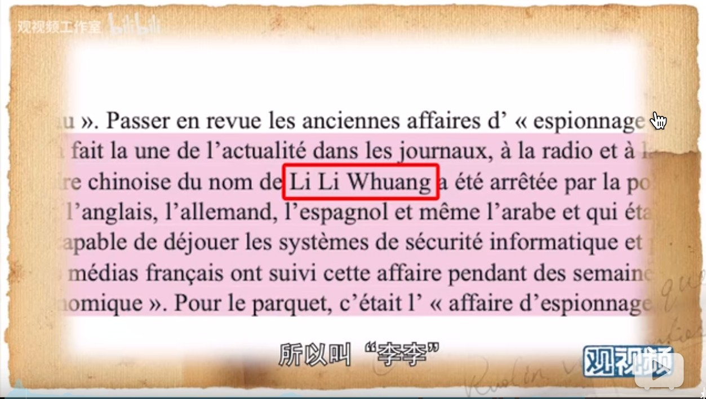
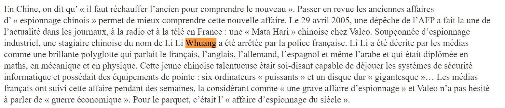

观视频在油管上有频道, 我看过一阵子, 感到他们是典型的用点带面, 逻辑穿越的"导师".

拆解一下这个视频"郑若麟"的观点:

# lili谍案

首先, 概要一下郑老对此事的描述:

- 他的结论: lili写论文下载了公司的文件, 被法新社报导为间谍.
- 事后此事被证明是假新闻
- 但法新社拒不对此道歉, 也没有人收到处罚
- 郑老说这是法国人的新闻自由.

但是其中疑点重重

- 郑老说lili法语都说不清楚, 但是她是怎么在"法国"汽车公司实习, 还着谈"法国"男朋友, 还在学校要写论文?
- 下载材料是因为语言不好, 这没有基本的知识产权常识. 但郑老的意思是好像这不算什么.
- 而且公司内部权限分明, 怎么会让一个实习生获得能下载机密文件的权限?
- 警察抓lili被他一嘴带过, 警察抓她的理由和法新社说的一样吗?

我试图找这个报导的出处, 根据视频中的截图:

发现其实是郑老在党媒法文版"今日中国"自己写的文章: [Halte aux affaires d’« espionnage chinois »](http://www.chinatoday.com.cn/ctfrench/2018/gc/201807/t20180702_800134192.html)

为什么谈论自己的文章, 却刻意要给一个法语版的截图? 这样不是自证吗?

于是找当年的报导, 根据当事者名字和法新社的名字, 找到了这个: [Chinese Li-Li Whuang addresses the press as she arrives at... News Photo - Getty Images](https://www.gettyimages.co.uk/detail/news-photo/chinese-li-li-whuang-addresses-the-press-as-she-arrives-at-news-photo/78010913), 

> 中国人黄丽丽（Li-Li Whuang）于2007年11月20日到达凡尔赛宫法庭时向新闻界致辞. 因**涉嫌**于2005年窃取其雇主法国汽车零部件制造商法雷奥（Valeo）而参加了审判。法雷奥（Valeo）投诉她“滥用信任”和“非法数据库入侵”。 PIERRE VERDY 法新社.

注意, 上面的图片就是**法新社**的图源, 从描述里面没有看到任何有假新闻的意思. 

而法广2005年的的报导: [RFI - Justice - Li-Li, 22 ans, étudiante ou espionne ?](http://www1.rfi.fr/actufr/articles/066/article_36991.asp) 中的关键点:

> 是以"违反信任"和"欺辱自动数据系统"起诉, 
> 在贡比涅（瓦兹）科技大学学习了三年。是学习数学和应用物理学专业的毕业生.
> 她拷贝的公司的计算机文件*“与他的实习无关”。*
> 从她的"功率巨大"的硬盘中获得了"机密数据", 而这些数据被认为和lili故乡武汉制造商的相关项目有关.
> 警察从她的邮件中记录了来自中国的加密信息.
>
> lili自辩:
> 从公司内部拷贝的"最大数量的文件", 并在家里"整理"论文.
> lili之后接受中国"解放日报"采访时说, 是这个法国公司选择我, 因为我来自武汉, 现在又说我很危险, 也是因为我来自武汉.
> 法国的情报部门已经认定, 中国的情报部门在法国的高科技领域展开了打量的活动.
>
> lili最终于两月后假释. 

而另外的法国媒体报导: [Suspected of industrial espionage, a Chinese student is finally sentenced for "breach of trust"](https://www.lemonde.fr/societe/article/2007/12/18/soupconnee-d-espionnage-industriel-une-etudiante-chinoise-est-finalement-condamnee-pour-abus-de-confiance_991249_3224.html)

> 她的雇主批评她复制了尚未上市的不同品牌概念车的元件。警察因其涉嫌“侵入自动数据系统”和“违反信任”而受到起诉.

而这个报导似乎是最终判决[Espionnage chez Valeo: 2 mois de prison ferme requis contre l'étudiante chinoise - ladepeche.fr](https://www.ladepeche.fr/article/2007/11/20/322329-espionnage-chez-valeo-2-mois-prison-ferme-requis-contre-etudiante.html)

> lili成功证明了自己不是间谍, 但是却无法说服刑事法庭, 她没有损害她实习的制造商的机密利益.
> 最终她被判处1年徒刑, 缓刑10个月.
> 李于 2005 年 6 月 被控犯有 ”背信罪” 、 ”盗用计算机系统罪” 和 ”修改或删除数据罪”.

这篇报导里面有很多lili的自证, 新闻报导全部引用, 未做是非判断.

查到这里就明白郑老的基本思路, 他只说结论, 完全忽略完整的事实. 法新社报导起诉缘由, 被郑老和法庭审判结果混为一谈. 

就好像新闻机构要为被告的最终定罪负责似的. 一开始法新社报导了lili被**怀疑**是间谍, 这个是抓她的时候的事实. 重点是怀疑是间谍. 而且硬证据是: 

- 下载了和论文无关的大量数据
- 下载了众多概念车的远见数据
- 邮件内有加密数据
- 她下载的数据和武汉制造公司的相关项目有关.

而非直接证据是:

- 6台电脑
- 2只硬盘

而郑老却强调花边性的非直接证据, 而忽略了硬证据, 这是典型的片面新闻框选, 俗称带风向.

# 新闻自由

郑老总结了很多西方新闻自由的弊症:

- *新闻自由让假新闻泛滥* 郑老似乎分不清楚言论自由和新闻自由. 言论自由产生了假新闻, 而相反新闻自由则会减少假新闻. 新闻自由强调减少暗箱操作, 揭露弊端. 这种自由针对的是新闻管制, 统一口径而言.
- *新闻需要事实的约束,* 这是没错. 而郑老用了"国际政治杂志"弊案一例, 推导出整个法国, 甚至西方媒体都是不尊重事实的. 郑老就犯了片面新闻框选的错误, 他忽略了
  - 报导美国枪击案深层原因的报导, 
  - 调查18个月调查川普偷税行为的报导, 
  - 报导路易斯安娜州政府操弄陪审团弊案的报导, 
  - 报导好莱坞大亨如何诱骗女演员的报导, 
  - 持续跟踪一年报导也门战争的残酷的报导, 
  - 报导缅甸佛教徒对穆斯林的屠杀的报导, 
  - 密苏里穷困人口如何受到不公正待遇的报导, 
  - 对美国种族断层的分析评论, 
  - 对中美和南美人移民美国的绝望和无助.
  - 等等...
  - 所有这些重量级的新闻报导都是西方新闻的典范.  也是西方新闻界主流推崇的新闻标准. 
  - 可是这些统统都入不了郑老的法眼. 可见这不是视力的问题, 而是脑袋里面的问题.
- *法国新闻业者说新闻自由可以容忍一部分假新闻.* 呵呵, 如果郑老自诩和新闻界进行过交谈, 而交谈后的接过居然是这样, 那我也无话可说, 但是难道一向所谓注意政治正确的西方媒体, 对于郑老, 就都开始不顾及政治正确了?
- *法国什么都能报吗? 政治正确才行.* 对于政治正确在国内似乎成了反面教材, 政治正确主要只言论, 本来言论是自由的, 说什么都可以, 但是法律这个特殊行业语言是做是非判断的, 如果律师不能严谨的阐述问题, 就会造成本对手针对攻击, 所以律师行业最开始使用所谓的语言规则. 也是就是郑老提到的司法中的政治正确. 而这个后来影响到了政治层面. 因为西方的政治都是民选, 如果说错话, 法律上是没事的, 但是民意会有问题, 进而影响选票, 也就是影响自己, 或者政治集团的政治生命. 这是为什么叫"政治正确"的原因. 当然, 并不是所有的政客都遵从政治正确的, 比如特朗普. 所以政治正确往往是民众力量的体现, 越是政治正确规矩多的地方, 民众力量越强. 媒体由于也是面对民众, 所以政治正确的影响力也延伸到了传媒, 这同时说明民众对于媒体也有很强的监督作用. 郑老以为政治正确和我过言论管制一样, 其实是本末倒置. 相反的, 政治正确是人民逼迫上层不可以逾越的语言红线. 谁触发, 谁下台. 
- 以下拆解一下郑老鄙视的几个政治正确:
  - *不能否定德国谋杀犹太人.* 这是事实, 不是什么政治正确的问题. 郑老莫非憋着"德国没有谋杀犹太人"的警示观点?
  - *对共产党中国不能正面肯定, 逢中国就不好.* 欧洲是共产党的摇篮, 也深受其害, 从巴黎公社到苏俄, 欧洲已有共识, 共产主义是没有自由和发展的. 至于批评中国, 是的, 媒体就是监督政府的, 批评是主流. 如果一个媒体整天说政府这好那好, 就失去了新闻的基本立意. 对中国是这样, 对自己国家更是这样. 
  - *控制媒体的资本不能说.* 这个郑老说对了一半. 资本对于媒体是有侵蚀作用的. 事实上是如此的. 西方虽然有新闻中立, 而且资方老板不干预新闻也是一种政治正确. 但是或多或少都会让人产生不信任感. 所以西方三大通讯社, 都是国家自助的. 路透, 美联, **法新**都是国家税收供给. 这是世界上重要的中立新闻源. 郑老三番五次的说法新, 他不会连这个都不知道吧?
  - *黑人的问题不能说. 改说郊区青年.* 没错, 这也是民众的力量. 虽然黑人和中东青年犯罪率高, 但是如果强调他们的血统, 会对那些努力融入社会的同族年轻人有很不好的影响. 所以纵然是事实, 但是为了保护后者, 说血统是不被允许的. 郑老不会不明白这么简单的道理吧?

综上, 郑老说的都是糊涂话, 有时候我不禁的怀疑: 他是真糊涂还是假糊涂? 但无论那种, 他都挺让我恶心的.