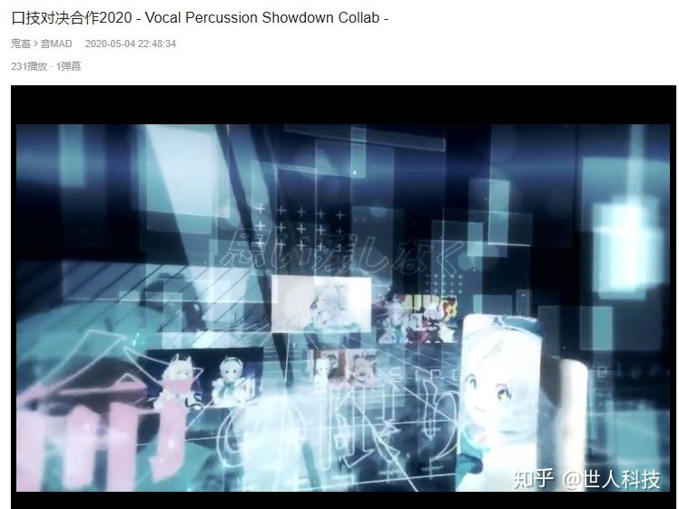

# 什么是鬼畜

> 如何做鬼畜视频，需要什么软件？ - 知乎
> https://www.zhihu.com/question/265110800

鬼畜, 或者鬼畜调教：主要对画面进行剪辑，需要学习非编
音MAD：主要对音频素材进行处理，目的是还原 原曲，需要学习编曲

> 鬼畜针对画面, 音MAD是针对音频

## 鬼畜主要三种：

### 1.剧情

目标是搞笑，以PS和乱入的台词达到吸引人观看的效果，可以没有原曲的存在
制作步骤：
视频：找素材，PS处理素材（主要是剪个头出来），将PS后的素材用PR与VEGAS的动态追踪去追踪。AE加点特效。
音频：找素材，对素材分门别类的进行整理，根据剧情放置音频。

例如

王司徒对决系列

[【大制作！！】王vs猪——死神天降的对决_哔哩哔哩 (゜-゜)つロ 干杯~-bilibiliwww.bilibili.com](https://www.bilibili.com/video/BV1w4411U7kD)

 火力种田王

[电视剧 《火力种田王》——悠悠球圣地亚哥锦标赛_哔哩哔哩 (゜-゜)つロ 干杯~-bilibili](https://www.bilibili.com/video/av2808237)

### 2.唱歌（人力）

目标是还原人声的旋律（VOC的谱子），让人说出原本不属于他的“台词”，可以没有原曲的存在
人声处理为主，有伴奏的一般不做处理
制作步骤：
视频：同上
音频：找/做声源，用UTAU生成你想要的人声部分，

> VOCALOID5 - Walkthrough - YouTube 这是个有趣的工具, 不知道是否支持中文
> https://www.youtube.com/watch?v=UAtVGHl1AFM
>
> 现在有多少中文VOCALOID的P主使用的是VOCALOID5编辑器？V5编辑器会得到广泛使用吗？ - 知乎
> https://www.zhihu.com/question/425007287

> 【UTAU tutorial # 2】 Basics of UTAU - YouTube
> https://www.youtube.com/watch?v=wrs3miwSLXA
>
> UTAU软件操作入门 - Home
> https://utaujc.jimdofree.com/blog/utau%E8%BD%AF%E4%BB%B6%E6%93%8D%E4%BD%9C%E5%85%A5%E9%97%A8/

也可以先用VEGAS将单字组合为句子后再用MELODY调音高

例如 核爆神曲aDIAOz
[【庞麦郎】我的核爆神曲aDIAOz_哔哩哔哩 (゜-゜)つロ 干杯~-bilibili](https://www.bilibili.com/video/av2129302)

### 3.rap

目标是合拍，通过剪辑使人物的台词与歌的节奏一致，必须有原曲的存在，并且原曲的声音一定很大
制作步骤：合理放置视频音频即可，需要学习的东西最少。不需要调音，但需要拉伸缩短

例如 最带劲的nico
[【矢泽妮可】妮可酱，给我撸一发最带感的Niconiconi！_哔哩哔哩 (゜-゜)つロ 干杯~-bilibili](https://www.bilibili.com/video/av3771373/)

------

## 音MAD主要有三种：

### 1.还原，

目标是还原bgm，还原度越高，做得越好。必须有原曲的存在，但只是作为参考，技术好可以原曲不使用而做出原曲的感觉。请看 这经典的音mad调音，没有使用原曲，然而给人感觉用了原曲呢。dacyo的龙王的Bad *Apple*!! [龙王的Bad *Apple*!!_哔哩哔哩 (゜-゜)つロ 干杯~-bilibili](https://www.bilibili.com/video/av19494590)

这种做法相当于人声的“翻唱”，但还原的不仅仅是人声，还有各个乐器。当然，还原人声是基本的一种，常用一主观听着舒服，又可以在hormor拉直音高的某个字作为乐器。不过与鬼畜唱歌的区别是极其侧重伴奏，甚至说，目的就是用我自己喜欢的素材复刻出一首我想复刻的歌。

制作步骤：第一种是乐器要调音（音高）的：找素材，音频乐器化处理（拉直音高、Harmor延长），制作各个音轨的乐谱（有MIDI文件可以快速完成这一步），然后把处理好的素材套进去，修改音效和各个音效细节。之后找个静止画都可以*发布*了，也可以做一个精美的PV。

### 2 是乐器不调音的，

找不同音高的素材，按照乐谱的音高进行填充。典型的是枪声音乐 ，但这一类技术含量就比前面低很多了，当然也有极少的枪声素材但调音的作品，当然效果显然不太好。 [消音98K神曲_哔哩哔哩 (゜-゜)つロ 干杯~-bilibili](https://www.bilibili.com/video/av24879688/)

### 3 任意创作

极大地发挥作者的想象力，看完后你会发现，喔！原来还能这样做！

[心爱的热蛋糕啦](https://www.bilibili.com/video/BV19J411q781/?spm_id_from=333.788.videocard.1)

他们彼此往往你中有我我中有你，例如搞笑向鬼畜可以有音MAD部分，音MAD本质是复杂的RAP，而分类为音MAD的口技对决系列，又有一部分为人力。

## 软件

我们制作鬼畜所需要的功能：

- 画面剪辑
- 画面特效
- 音频剪辑
- 调音，修音，混响

ADOBE系列：PR（用来视频剪辑） AE（用来做视频特效） AU（用来音频处理） PS（用来做视频的前期素材处理）

ADOBE很强，很专业，但是有ADOBE全家桶只能做剧情向，我们还需要其他方面的专业软件

其他软件：vegas（全能） FL（编曲软件） Melody（修音软件） UTAU（人力）

剪辑：建议新手使用vegas，是一款起源音频处理软件的全能非编软件，音频特效多，视频特效多，剪辑速度快，键位界面人性化。而且对配置宽容度高，低配置能用，高配置能高效用。有了它我们能做剧情 rap 甚至是音MAD。熟悉剪辑后建议和**配置**一起换成PR。

视频特效：没有比AE更推荐的，vegas有些视频特效插件也可以下载试试。（12版自带特效没有动态追踪的痛）

音频剪辑：推荐在vegas中完成粗剪，即将要用的素材分别剪出来，在一个新工程里面合并再导出一个总音频素材文件。这样方便以后做画面。然后在FL的音频剪辑器中完成精剪：去除两端噪音与规格化处理。之后保存为单个素材文件，utau也可用。

调音：一般指修改音调为主的处理，可以直接在VEGAS中完成，也可以使用FL完成

修音：一般指美化音调的处理，在调音前应该先对素材修音：**将单个素材的音调拉直**。！在完成调音后，可以再次修音，加颤音，震音，滑音，和声，滤波EQ等各种特效，可以在FL也可以在Melody中完成。

混响：简单的说就是给整个音频加个回音效果，可以FL里面直接加，也可以使用AU的卷积混响，甚至可以使用VEGAS 混响。

## 圈子

关于播放量：除了播放量榜单的作品，不要拿播放量衡量一个作品的质量，**一个作品的好坏是主观的体验**。而这又和其他艺术不一样，只有在自己动手做过足够的作品，知道怎么处理要花多久， 才有能力去鉴赏质量的好歹。

顶级调音供新人参考：[口技对决2018](https://www.bilibili.com/video/BV1uW411G7Xo) [口技対決合作2019](https://www.bilibili.com/video/BV1Kb411r7Z4?from=search&seid=16001606098436588875) [口技対決合作2020](https://www.bilibili.com/video/BV1He411p7tt?from=search&seid=16001606098436588875)

技术是顶级的，但几乎无人欣赏，看呐！可怜的播放量，几十个神触做了几个月，最后就几百播放呢。

PV画面是这样的 

画面异常精美，每段声音和画面由四人共同完成。

关于我：遇到三邑牛粪社后，觉得一产和人气都没意义了，已经退圈几年了

学习是孤独的，除了搜索和私聊几乎找不到可以交流技术性问题的场所（group），所以，在回答的最后分享一些群（group），

- 515911030 (额外的有一些音源之类的，但群差不多满了）
- 1093751981（有基础的vegas adobe fl等软件和常用素材）
- 531835477（有基础的vegas adobe fl等软件和常用素材）
- 734990581（有基础的vegas adobe fl等软件和常用素材，同时有万花镜5，是个二次元/hentai交流场所）

群文件有常用鬼畜素材，也有本文提到的一切软件和汉化（除了reaper），但比起这些，更重要的是，你可以在群讨论本文谈到的一切

## 日本鬼畜?

最后说个音mad的有意思的事情 中国人和日本人的制作音mad思路是不一样的，日本佬一般用20M大小的正版REAPER做，国人一般用400M左右的大型盗版软件fl制作，论软件装备的精良程度，中国人比日本人好那么多，但质量上却被日本人完败，原因是什么，（原因是日本人质量低了一样没人搬运  ，幸存者偏差 ）